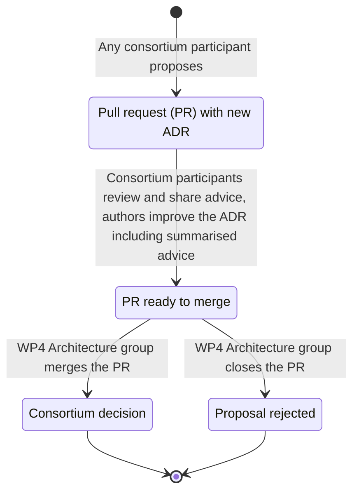

# Architecture decision records

[WE BUILD](https://www.webuildconsortium.eu/) maintains a lightweight architecture decision record (ADR) for each software-related decision affecting interoperability.

Propose new ADRs using the [template](_template.md). Announce them to the [Architecture group](https://portal.webuildconsortium.eu/group/architecture) in the Portal to get feedback to understand the consortium’s opinion. 

## ADR overview

<!--BEGIN INDEX-->
1. [Publish consortium trusted lists](trusted-lists.md)
2. [Baseline protocols](base-protocols.md)
3. [Specify PID and eAA formats](document-formats.md)
4. [Provide EBWOID as a stable minimal basis](basic-lpid.md)
5. [Wallet Unit Attestation and Lifecycle Management (For European Business Wallet)](wallet-unit-lifecycle-management.md)
6. [Deliver business wallet data using QERDS](build-qerds.md)

<!--END INDEX-->

## ADR process for WE BUILD

