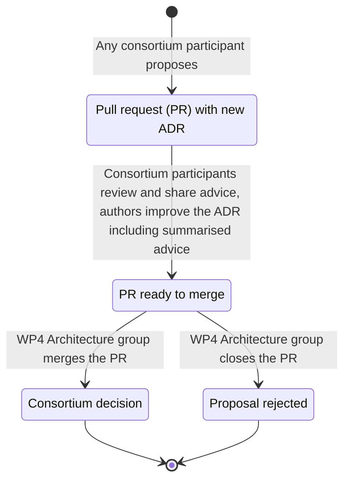

# Architecture decision records

[WE BUILD](https://www.webuildconsortium.eu/) maintains a lightweight architecture decision record (ADR) for each software-related decision affecting interoperability.

Propose new ADRs using the [template](_template.md). Announce them to the [Architecture group](https://portal.webuildconsortium.eu/group/architecture) in the Portal to get feedback to understand the consortium’s opinion. 

## ADR overview

<!--BEGIN INDEX-->
1. [Publish consortium trusted lists](trusted-lists.md)
2. [Baseline protocols](base-protocols.md)
3. [Specify PID and eAA formats](document-formats.md)
4. [Provide EBWOID as a stable minimal basis](basic-lpid.md)
5. [Wallet Unit Attestation and Lifecycle Management (For European Business Wallet)](wallet-unit-lifecycle-management.md)
6. [Replace LPID with EBWOID](001-replace-lpid-with-ebwoid.md)
7. [Deliver business wallet data using QERDS](build-qerds.md)
8. [Attestation Revocation Mechanism](attestation-revocation-mechanism.md)
9. [Separate QERDS registry from relay](qerds-registry-relay.md)
10. [Structure the European Digital Directory as identification, discovery, and connection](build-edd-identification-discovery-connection.md)
11. [Separate attestations, documents, and data in EBW](build-document-vs-attestation.md)
12. [Acceptance of Self-Issued Attributes](Acceptance-of-Self-Issued-Attributes.md)
13. [Atomic Granularity for Mandate-Related Attestations](Atomic-Granularity-for-Mandate-Related-Attestations.md)
14. [EAA Extension for the EDD](EAA-extension-for-the-EDD.md)
15. [EBW EAA Exchange Automation](EBW-EAA-exchange-automation.md)
16. [Role-Based vs Service-Based Authorization](Role-Based-vs-Service-Based-Authorization.md)
17. [Support for Sole Trader Representation](Support-for-Sole-Trader-Representation.md)
18. [QEAA Attestations and QERDS Documents](adr-qeaa-attestations-qerds-documents.md)
19. [Credential Offer Endpoint Registry and Lookup Service](ebw-endpoint-lookup-service.md)
20. [Business Wallet Unit Attestation based on TS3](bwua-ts3-attestation.md)
<!--END INDEX-->

## Supporting analysis

- [Attestations, Documents and Data Analysis](build-document-vs-attestation-analysis.md)
- [EDD Identification, Discovery and Connection Analysis](build-edd-identification-discovery-connection-analysis.md)

## ADR process for WE BUILD

```mermaid
stateDiagram-v2
    state "Pull request (PR) with new ADR" as pr
    state "PR ready to merge" as ready
    state "Consortium decision" as merged
    state "Proposal rejected" as rejected

    [*] --> pr: Any consortium participant proposes
    pr --> ready: Consortium participants review and share advice, authors improve the ADR including summarised advice

    ready --> merged: WP4 Architecture group merges the PR
    merged --> [*]

    ready --> rejected: WP4 Architecture group closes the PR
    rejected --> [*]
```
