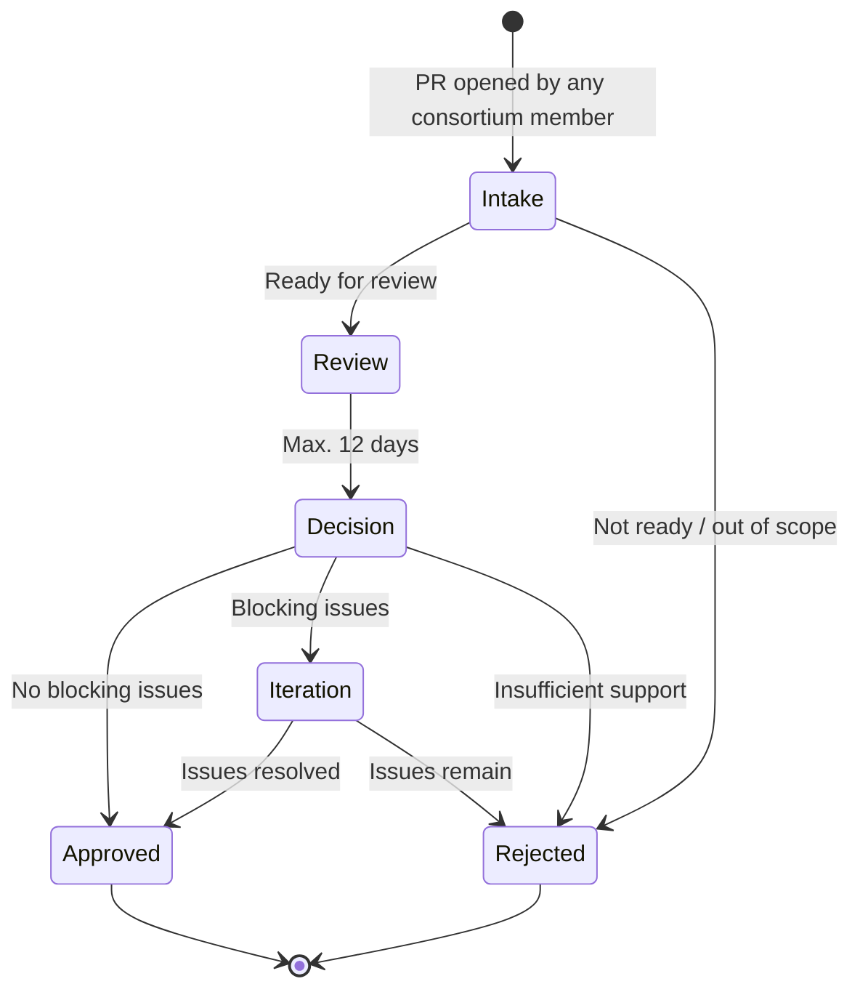

# Architecture decision records

[WE BUILD](https://www.webuildconsortium.eu/) maintains a lightweight architecture decision record (ADR) for each software-related decision affecting interoperability.

Propose new ADRs using the [template](_template.md). Announce them to the [Architecture group](https://portal.webuildconsortium.eu/group/architecture) in the Portal to get feedback to understand the consortium’s opinion. 

## ADR overview

<!--BEGIN INDEX-->
1. [Publish consortium trusted lists](trusted-lists.md)
2. [Baseline protocols](base-protocols.md)
3. [Specify PID and eAA formats](document-formats.md)
4. [Provide EBWOID as a stable minimal basis](basic-lpid.md)
5. [Wallet Unit Attestation and Lifecycle Management (For European Business Wallet)](wallet-unit-lifecycle-management.md)
6. [Replace LPID with EBWOID](001-replace-lpid-with-ebwoid.md)
7. [Deliver business wallet data using QERDS](build-qerds.md)
8. [Attestation Revocation Mechanism](attestation-revocation-mechanism.md)
9. [Separate QERDS registry from relay](qerds-registry-relay.md)
10. [Structure the European Digital Directory as identification, discovery, and connection](build-edd-identification-discovery-connection.md)
11. [Separate attestations, documents, and data in EBW](build-document-vs-attestation.md)
12. [Acceptance of Self-Issued Attributes](Acceptance-of-Self-Issued-Attributes.md)
13. [Atomic Granularity for Mandate-Related Attestations](Atomic-Granularity-for-Mandate-Related-Attestations.md)
14. [EAA Extension for the EDD](EAA-extension-for-the-EDD.md)
15. [EBW EAA Exchange Automation](EBW-EAA-exchange-automation.md)
16. [Role-Based vs Service-Based Authorization](Role-Based-vs-Service-Based-Authorization.md)
17. [Support for Sole Trader Representation](Support-for-Sole-Trader-Representation.md)
18. [QEAA Attestations and QERDS Documents](adr-qeaa-attestations-qerds-documents.md)
19. [Credential Offer Endpoint Registry and Lookup Service](ebw-endpoint-lookup-service.md)
20. [Business Wallet Unit Attestation based on TS3](bwua-ts3-attestation.md)
21. [Pre-flight CS](pre-flight-CS.md)
<!--END INDEX-->

## Supporting analysis

- [Attestations, Documents and Data Analysis](build-document-vs-attestation-analysis.md)
- [EDD Identification, Discovery and Connection Analysis](build-edd-identification-discovery-connection-analysis.md)

## ADR process for WE BUILD

ADRs are handled through a timeboxed process to avoid proposals remaining open indefinitely.

### 1. Intake – next Architecture Group (AG) meeting (max. 14 days)

* checks that the ADR is ready for review;
* identifies required stakeholders/reviewers; and
* identifies whether additional approval is required for high-risk decisions.

### 2. Review – max. 12 days

Required stakeholders are requested as reviewers in GitHub.

Feedback should identify any **blocking issues**. No response by the deadline is treated as no blocking objection.

### 3. Decision – next AG meeting

The AG decides to:

* **Approve** – no unresolved blocking issues → merge.
* **Iterate** – blocking issues remain → one iteration allowed.
* **Reject** – insufficient support, maturity or relevance → close.

Additional stakeholder engagement may exceptionally be requested if a required stakeholder has not had a reasonable opportunity to respond.

After one iteration, the ADR is **approved or rejected**.

```mermaid
stateDiagram-v2
    [*] --> Intake: PR opened by any consortium member
    Intake --> Review: Ready for review
    Intake --> Rejected: Not ready / out of scope

    Review --> Decision: Max. 12 days

    Decision --> Approved: No blocking issues
    Decision --> Iteration: Blocking issues
    Decision --> Rejected: Insufficient support

    Iteration --> Approved: Issues resolved
    Iteration --> Rejected: Issues remain

    Approved --> [*]
    Rejected --> [*]
```
