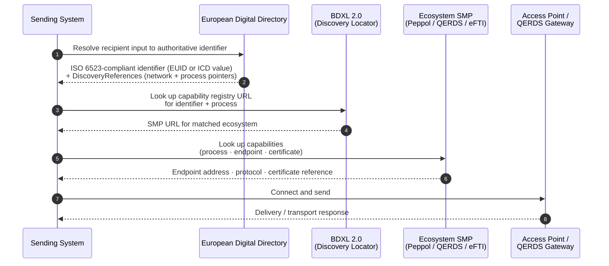
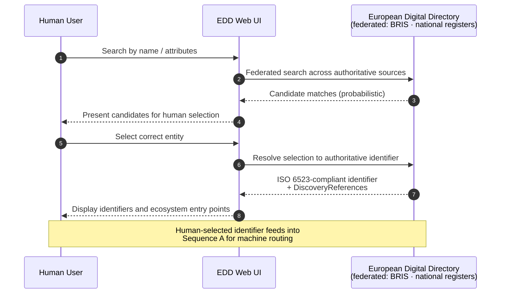

# Supporting analysis: European Digital Directory — identification, discovery, and connection

*This document supports the  [Architecture Decision Record](./build-edd-identification-discovery-connection.md) for EDD. It records the detailed architectural analysis, sequence diagrams, open issues, and risks that informed the decision.*

---

## Identifier framework

Commission Implementing Regulation (EU) 2021/1042 (the BRIS implementing regulation) specifies in its Annex that *"the structure of the EUID shall be compliant with ISO 6523"*. EUID is therefore not a parallel identifier layer alongside ISO 6523 — it is an ISO 6523-compliant identifier within that framework. EN 16931, the European standard for electronic invoicing, requires that all organisation identifiers used for invoicing be registered in the ISO 6523 ICD list. Together, these create a unified regulatory basis for ISO 6523 as the cross-network identifier encoding layer across BRIS, Peppol, and the EDD.

The EUID is, however, limited to limited liability companies and commercial partnerships under EU company law (Directive (EU) 2017/1132). The EBW proposal's own explanatory memorandum acknowledges that sole traders, self-employed persons, and public institutions are not covered by EUID or BRIS. These are frequent parties in SC1 transport scenarios (self-employed drivers, small carriers) and SC5 SME invoicing. Registration paths for these actor types are an open issue (see below).

---

## Three-step architecture — detailed description

| Step | Function | Protocol / Standard |
|---|---|---|
| 1. Identification | Resolve actor → ISO 6523-compliant identifier | BRIS/BORIS (EUID); national ICD schemes |
| 2. Discovery | Resolve identifier → ecosystem discovery locator (network + process) | eDelivery BDXL 2.0, WE BUILD profile |
| 3. Connection | Retrieve endpoint, certificate, protocol | eDelivery SMP 2.0 (ecosystem-specific) |
| Transport | Message delivery | AS4 / eDelivery, QERDS |

**Step 2 — BDXL 2.0 WE BUILD profile.** BDXL 2.0 uses DNS-based U-NAPTR records to resolve a participant identifier to the URL of a capability metadata publisher. The WE BUILD profile maps:
- BDXL *Service* → network (e.g. "Peppol", "QERDS", "eFTI")
- BDXL *Process* → process within that network (e.g. invoice delivery, freight document retrieval)

Document type granularity is intentionally excluded from Step 2. Process-level registration is sufficient to route a sender to the correct ecosystem capability registry; document type detail adds governance overhead without delivering interoperability value, and belongs in the ecosystem SMP (Step 3).

**Step 3 — ecosystem SMP.** Capability detail (endpoint address, protocol version, certificate references) is registered and maintained by each ecosystem's own SMP. For Peppol-connected participants this is the Peppol Discovery building block (SMP 2.0). For QERDS this is the QERDS provider registry. This delegation means the EDD does not need to know which document types a participant supports, and capability updates require no change to the EDD.

---

## Sequence diagrams

**A. Deterministic routing (machine-to-machine)**

**B. Human search (non-normative — not for machine routing)**

---

## Open issues

**BDXL 2.0 WE BUILD profile**

The mapping of BDXL 2.0 Service to ecosystem and Process to process is not yet specified. This is a prerequisite for the discovery locator layer to function and for any end-to-end testing involving cross-network routing. WP4 Architecture and WP4 Trust Registry Infrastructure should develop the profile as a first deliverable.

**Sole trader and self-employed identifier scheme**

Sole traders accessing QERDS via their EUDIW will have a wallet-derived identifier that may not map to an existing ICD. WP4 Trust Registry Infrastructure must define the registration path for this category before use cases involving sole trader counterparties can proceed to full end-to-end testing. Norway's enkeltpersonforetak (ENK) scheme is an example of a national identifier type not currently in BRIS.

**Public sector body registration**

Public sector bodies must accept EBW submissions but are not covered by EUID/BRIS. Their identifier schemes vary by Member State. The WE BUILD Digital Directory must define how they are registered and discoverable, at minimum for government-facing scenarios in SC1.3bis, SC5 Scenario 3, and PA4.

**Multi-network process resolution**

When a participant is reachable via both Peppol and QERDS for the same process, the BDXL response may return multiple discovery references. Selection logic between network options when multiple matches are returned is not yet specified. A preference-ordering mechanism in the BDXL profile may be needed, particularly for SC5 Scenario 5.

**Long-term network segmentation**

An alternative architectural direction worth further investigation is whether QERDS and eFTI should eventually be modelled as *segments within* the Peppol network rather than as separate networks at the discovery layer. This would unify the discovery locator layer under a single Peppol SML, reducing the proliferation of separate ecosystem registries, but would require governance changes within OpenPeppol. This ADR does not foreclose this direction but defers it pending further discussion with OpenPeppol governance.

**EDD implementing act timeline**

No draft implementing act for the EDD API is yet available. The WE BUILD Digital Directory operates as a pilot ahead of the formal specification. Design decisions should be documented explicitly to support the Commission's implementing act process.

**OpenID4VC/VP wallet endpoint discovery**

This ADR covers infrastructure-mediated document exchange (QERDS, AS4/Peppol, eFTI). It does not specify how wallet metadata endpoints are registered and located for direct wallet-to-wallet flows using OpenID4VCI (credential issuance) or OpenID4VP (credential presentation). These flows have different discovery requirements: a wallet needs to locate a counterparty's `/.well-known/openid-credential-issuer` or equivalent metadata endpoint, which is not naturally modelled by BDXL 2.0 / SMP 2.0. Whether the EDD should store or point to such endpoints, or whether direct wallet-to-wallet discovery should bypass the EDD entirely, needs to be specified separately. Privacy-by-design must be a first-order requirement for this specification: centralised discovery intermediaries for OpenID4VP flows can observe which wallets communicate, what credentials are requested, and over time reconstruct relationship graphs — a concern that is more acute for natural persons than for legal entities, but which applies to both (see risk below). This is a prerequisite for any WE BUILD use case relying on direct wallet-native flows rather than QERDS or Peppol delivery.

---

## Risks

**Pilot directory diverges from eventual EDD standard**

If the Commission's EDD implementing act specifies a different protocol than BDXL 2.0 / SMP 2.0, WE BUILD implementations will require migration. WP4 Trust Registry Infrastructure should engage proactively with the Commission's specification process and document design decisions so that divergences are traceable.

**Identification gap blocks use case testing**

If sole traders and public sector bodies cannot be registered in the WE BUILD Digital Directory, use cases involving these actor types cannot proceed to full end-to-end testing. Interim registration paths — including national ICD scheme mappings — should be defined in the specification phase.

**Scope expansion risk for existing Peppol infrastructure**

Routing non-Peppol ecosystems (QERDS, eFTI) through the existing Peppol SML/SMP would expand the operational scope and cost of Peppol infrastructure without a corresponding governance mandate. The recommended architecture avoids this by placing ecosystem-specific capability registration in each ecosystem's own SMP. This boundary must be maintained explicitly in the WE BUILD profile.

**Privacy proportionality in discovery — B2B vs natural person flows**

The privacy concern raised in connection with centralised discovery intermediaries for OpenID4VP is technically sound in general but needs proportionality analysis when applied to B2B contexts. For natural persons presenting credentials (health data, identity documents, licences), centralised intermediaries observing who presents what to whom is a serious privacy risk that the SSI community has extensively documented. For legal entities engaged in commercial exchange, the metadata exposed by capability registration — "this company can receive invoices via this network" — is commercial capability information that the entity has already chosen to register. GDPR and the broader EU proportionality principle both apply: the appropriate safeguard depends on the sensitivity of the actors and data involved. WE BUILD should distinguish these contexts explicitly in its privacy analysis rather than applying a uniform maximum-privacy posture. That said, for use cases where natural persons are participants (e.g. sole traders presenting mDL credentials at a checkpoint), the more stringent OpenID4VP privacy-by-design requirements apply, and discovery should be designed accordingly.

**DNS dependency for BDXL**

BDXL 2.0 uses DNS-based U-NAPTR records. The abstraction layer between the wallet and the QERDS (per the QERDS ADR) should shield wallet users from DNS-level operations; only QERDS providers and SMP operators interact with the DNS layer directly.

---

## Responsibilities

| Action | Owner |
|---|---|
| Develop BDXL 2.0 WE BUILD profile (Service → network, Process → process) | WP4 Architecture + WP4 Trust Registry Infrastructure |
| Define registration procedure for sole traders and public sector bodies | WP4 Trust Registry Infrastructure |
| Register QERDS provider capabilities in SMP 2.0 | WP4 QTSP |
| Engage Commission EDD implementing act process; document pilot design decisions | WP4 Architecture |
| Define multi-network selection logic when participant reachable via multiple ecosystems | WP4 Architecture |
| Specify OpenID4VC/VP wallet endpoint discovery model and privacy-by-design requirements | WP4 Architecture (with input from WP4 QTSP and use case leads for wallet-native flows) |