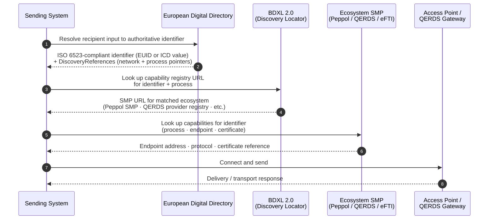
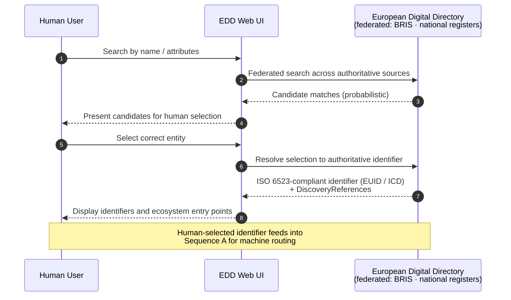

# Structure the European Digital Directory as identification, discovery, and connection

**Authors:**

- Rune Kjørlaug, OpenPeppol, Belgium

## Context

The European Business Wallet (EBW) proposal [COM(2025) 838 final](https://eur-lex.europa.eu/legal-content/EN/TXT/?uri=CELEX:52025PC0838) establishes the **European Digital Directory (EDD)** in Article 10 as the trusted source of information for EBW owners, enabling them to be easily contacted and promoting legal certainty in dealings between businesses and public sector bodies (Recital 38). The EDD is operated by the Commission, accessible to authorised wallet users and providers, and relies on information from authentic sources including business registers via BRIS (Article 10(1)–(4)).

In the WP4 Architecture group's review of the [QERDS ADR](./build-qerds.md), the directory function was identified as an oversimplification requiring decomposition. A sender wishing to initiate a QERDS exchange — or to retrieve a document via authenticated reference — needs to complete three logically distinct steps before any message can be sent:

1. **Identification.** Resolve the intended recipient to a canonical, stable legal identifier. The EUID is the primary legal identifier for companies under the EBW framework, mandated for limited liability companies and commercial partnerships under EU company law (Directive (EU) 2017/1132). Critically, Commission Implementing Regulation (EU) 2021/1042 (the BRIS implementing regulation) specifies in its Annex that **"the structure of the EUID shall be compliant with ISO 6523"** — meaning EUID is not a parallel identifier layer alongside ISO 6523, but an ISO 6523-compliant identifier within that framework. This establishes a coherent identifier model: EUID and national business register identifiers are, or should be, ISO 6523-compliant. EN 16931, the European standard for electronic invoicing, further reinforces this by requiring that all organisation identifiers used for invoicing be registered in the ISO 6523 ICD list, creating a unified regulatory basis for ISO 6523 as the cross-network identifier encoding layer.

   However, the EBW proposal's own explanatory memorandum explicitly acknowledges that EUID and BRIS **do not cover all economic operators or public sector bodies** — specifically, sole traders, self-employed persons, and public institutions are not currently included. While new ICD codes continue to be registered across Europe, registration gaps remain for these actor categories.

2. **Discovery.** Having identified the recipient, determine which networks and ecosystems they are registered in, and what communication *processes* they support within those networks — for example, receiving invoices via the Peppol network, receiving formal correspondence via QERDS, or receiving transport documents via an eFTI gateway. Discovery maps an identifier to a set of reachable ecosystems and their supported processes. Document type granularity at this layer adds governance overhead without delivering interoperability value; process-level registration is sufficient to route a sender to the correct ecosystem capability registry.

3. **Connection.** Within the identified ecosystem, retrieve the technical endpoint information needed to initiate the exchange: access point address, protocol version, and certificate references. This step is handled by the ecosystem's own capability registry — for example, the Peppol Discovery building block (SMP 2.0) for Peppol-connected flows — and is not the responsibility of the EDD.

The regulation text implicitly combines these three functions into a single "directory". Without architectural separation, the EDD risks becoming a duplicated service metadata registry and a central point of failure, re-implementing what existing, operational EU infrastructure already provides.

A critical architectural distinction also applies within the EDD itself: **machine routing requires deterministic, identifier-based lookups**, whereas **human-facing search is probabilistic by nature**. Conflating these two access patterns in a single normative API creates interoperability risk. Routing requires referential integrity; search produces probabilistic matches. These must be specified separately.

The following alternatives were considered for the discovery and connection layers:

- **Proprietary EDD API specified by Commission implementing act.** A new, EBW-specific REST API would risk fragmentation: the EDD would become a parallel, incompatible discovery infrastructure alongside existing eDelivery networks, requiring senders to query multiple directories depending on recipient type.
- **Decentralised identifier resolution (DID Documents, distributed ledger approaches).** W3C DID resolution and blockchain-based alternatives are conceptually interesting but have limited adoption in EU regulatory infrastructure. They do not integrate naturally with AS4 networks, which register capabilities against ISO 6523 identifiers. These approaches are unlikely to achieve the required interoperability with existing eDelivery networks within the WE BUILD timeframe.
- **eDelivery BDXL 2.0 for Step 2 + ecosystem SMP 2.0 for Step 3 (recommended).** BDXL 2.0 uses DNS-based U-NAPTR records to resolve a participant identifier to the URL of a capability metadata publisher. A WE BUILD profile of BDXL 2.0 would map *Service* to network (e.g. "Peppol", "QERDS", "eFTI") and *Process* to supported process within that network. The capability registry step (Step 3) is then handled by the ecosystem's own SMP — for example, the Peppol Discovery building block for Peppol-registered participants. This reuses proven, EU-mandated infrastructure; supports federated operation; and keeps the EDD focused on identity resolution and discovery references rather than capability management.

This architecture implies a clean handoff: **the EDD answers steps 1 and the discovery-locator portion of step 2; ecosystem-specific registries (Peppol SMP, QERDS registry) answer capability detail and step 3**. The EDD does not need to know which document types a participant supports — only which networks and processes they are reachable through.

## Decision

The European Digital Directory SHALL be defined as a **federated legal identity resolver and discovery entry point**. Its role is to resolve economic actors to stable ISO 6523-compliant identifiers and to return references to ecosystem-specific capability registries. Capability registration, document type management, endpoint storage, and protocol routing are delegated to those ecosystems.

The EDD SHALL:
- resolve economic actors to authoritative ISO 6523-compliant identifiers (EUID for registered companies and branches; national ICD scheme values for actor types not covered by EUID)
- return references to ecosystem discovery locators (e.g. BDXL-based service pointers) for the resolved identifier, at the level of network and process
- support registration of entities not covered by EUID (sole traders, public sector bodies) using appropriate national identifier schemes from the ISO 6523 ICD catalog

The EDD SHALL NOT:
- store communication capabilities, document types, endpoints, or certificates
- perform routing or protocol negotiation
- replace ecosystem-specific capability registries (Peppol SMP, QERDS provider registries, eFTI platform registries)
- serve as a universal company search engine or replace legal business registries
- function as a messaging hub

Discovery and connection SHALL be delegated to ecosystem-specific infrastructures. The recommended stack for WE BUILD is [eDelivery BDXL 2.0](https://ec.europa.eu/digital-building-blocks/sites/spaces/DIGITAL/pages/843612547/eDelivery+BDXL+-+2.0) for the discovery locator layer and [eDelivery SMP 2.0](https://ec.europa.eu/digital-building-blocks/sites/spaces/DIGITAL/pages/467118022/eDelivery+SMP+-+2.0+working+draft) for ecosystem-specific capability metadata, with a WE BUILD profile to be developed defining the mapping of Services to networks and Processes to processes.

### Layered architecture

| Layer | Function | Relevant standards |
|---|---|---|
| Identification | Legal actor resolution | BRIS/BORIS (EUID — ISO 6523-compliant per Reg. (EU) 2021/1042); ISO/IEC 6523 ICD catalog |
| Discovery locator | Which ecosystem and process | eDelivery BDXL 2.0 (WE BUILD profile; Service → network, Process → process) |
| Capability registry | Endpoint, certificate, protocol | eDelivery SMP 2.0 (ecosystem-specific) |
| Connection | Message transport | AS4 / eDelivery, QERDS |

### Directory API

The EDD API SHALL be **deterministic and identifier-based** for machine-to-machine routing. Given a stable identifier, the API returns the resolved identifier set and references to applicable discovery locators.

Search capabilities (lookup by name, partial identifier, attributes) MAY exist for human-facing interfaces but SHALL NOT be normative for machine routing or interoperability.

### Sequence diagrams

**A. Deterministic routing: identifier → discovery → connection**

**B. Human search (non-normative — not for machine routing)**

### Non-goals

The European Digital Directory is explicitly NOT intended to:

- act as a service metadata publisher or routing registry
- store endpoints, certificates, or document type capabilities
- replace ecosystem discovery infrastructures (Peppol SMP, QERDS provider registries, eFTI gateways)
- provide protocol negotiation or act as a messaging hub
- serve as a universal company search engine or replace legal business registries
- provide authoritative business existence validation outside legal registries

Responsibilities:

- WP4 Trust Registry Infrastructure group pilots the WE BUILD Digital Directory implementing the identification and discovery-locator layers, aligned with EDD standards as they emerge from the EBW implementing acts.
- WP4 Trust Registry Infrastructure group, in coordination with WP4 Architecture, develops the BDXL 2.0 WE BUILD profile defining the Service-to-network and Process-to-process mapping, and defines the registration procedure for EUID-registered entities, sole traders, and public sector bodies.
- WP4 QTSP group ensures that QERDS provider capability registration follows the SMP 2.0 model of the relevant ecosystem registry, so that a sender who has completed Steps 1 and 2 can retrieve QERDS endpoint information from Step 3.
- WP4 Architecture group contributes WE BUILD pilot experience to the Commission's EDD implementing act process, particularly on the identification gap and the BDXL/SMP protocol profile.

## Consequences

Structuring the EDD as three separated steps makes it easier:

- To reuse proven, EU-mandated eDelivery infrastructure rather than specifying a new directory protocol from scratch.
- To support federated operation: multiple QTSPs, Peppol service providers, national digital postbox operators, and eFTI platform operators can each register capabilities for participants they serve, within their own ecosystem SMP, without requiring a single central capability registry.
- To keep the EDD focused and lean: it resolves identity and returns discovery pointers; it does not grow into a universal capability registry.
- To avoid a single point of failure: the EDD delegates; ecosystem registries handle capability and routing independently.
- To future-proof against protocol evolution: when a transport protocol changes, only the SMP capability records for affected participants need updating; the EDD identity and discovery-locator layers are unaffected.
- To align with the existing legal identifier framework: since Regulation (EU) 2021/1042 mandates that EUID structure is ISO 6523-compliant, the EDD and the broader Peppol/eDelivery ecosystem share a single identifier model. This reduces the risk of identifier translation layers and simplifies cross-network identity resolution.

Open issues:

- **BDXL 2.0 WE BUILD profile.** The mapping of BDXL 2.0 Service fields to EBW ecosystems (Peppol, QERDS, eFTI) and Process fields to supported processes needs to be specified. This is a prerequisite for the discovery locator layer to function. WP4 Architecture and WP4 Trust Registry Infrastructure should develop this profile as an early deliverable.
- **Sole trader and self-employed identifier scheme.** Sole traders accessing QERDS via their EUDIW will have a wallet-derived identifier that may not map to an existing ICD. WP4 Trust Registry Infrastructure must define the registration path for this category before use cases involving sole trader counterparties can proceed to full end-to-end testing.
- **Public sector body registration.** Public sector bodies must accept EBW submissions but are not covered by EUID/BRIS. Their identifier schemes vary by Member State. The WE BUILD Digital Directory must define how they are registered and discoverable, at minimum for government-facing scenarios in SC1.3bis, SC5 Scenario 3, and PA4.
- **Multi-network process resolution.** When a participant is reachable via both Peppol and QERDS for the same process, the BDXL response may return multiple discovery references. Selection logic between network options is not yet specified. This is relevant to SC5 Scenario 5 and may require a preference-ordering mechanism in the BDXL profile.
- **Long-term network segmentation.** An alternative architectural direction worth further investigation is whether QERDS and eFTI should eventually be modelled as *segments within* the Peppol network rather than as separate networks at the discovery layer. If Peppol network segmentation were adopted, the discovery locator layer would be unified under a single Peppol SML, with segment identifiers distinguishing QERDS, eFTI, and classic Peppol flows. This would reduce the proliferation of separate ecosystem registries but would require governance changes within OpenPeppol. This ADR does not foreclose this direction but defers it pending further discussion.
- **EDD implementing act timeline.** No draft implementing act for the EDD API is yet available. The WE BUILD Digital Directory operates as a pilot ahead of the formal specification.

The following risks need to be addressed:

- **Pilot directory diverges from eventual EDD standard.** If the Commission's EDD implementing act specifies a different protocol than BDXL 2.0 / SMP 2.0, WE BUILD implementations will require migration. WP4 Trust Registry Infrastructure should engage proactively with the Commission's specification process and document design decisions so that divergences are traceable.
- **Identification gap blocks use case testing.** If sole traders and public sector bodies cannot be registered in the WE BUILD Digital Directory, use cases involving these actor types cannot proceed to full end-to-end testing. WP4 Trust Registry Infrastructure should define interim registration paths — including national ICD scheme mappings — in the specification phase.
- **Scope expansion risk for existing Peppol infrastructure.** Routing non-Peppol ecosystems (QERDS, eFTI) through the existing Peppol SML/SMP would expand the operational scope and cost of Peppol infrastructure without a corresponding governance mandate. The recommended architecture avoids this by placing ecosystem-specific capability registration in each ecosystem's own SMP, with the EDD providing only identity resolution and discovery pointers. This boundary must be maintained explicitly in the WE BUILD profile and communicated to use case leads.
- **DNS dependency for BDXL.** BDXL 2.0 uses DNS-based U-NAPTR records. The abstraction layer between the wallet and the QERDS (per the QERDS ADR) should shield wallet users from DNS-level operations; only QERDS providers and SMP operators interact with the DNS layer directly.

## Advice

Once merged, this is our consortium's decision. This does not mean all
participants agree it is the best possible decision. In the decision
making process, we have heard the following advice.

- [2026-02-11, Rune Kjørlaug, OpenPeppol, Belgium](https://github.com/webuild-consortium/wp4-architecture/pull/61#pullrequestreview-3785222841): Contributed the original comment identifying the three-step model (identification, discovery, connection) and proposing BDXL 2.0 as the directory query protocol, noting gaps in EUID coverage for sole traders and public sector bodies. This ADR is the result of that comment.
- [2026-03-13, Erlend Klakegg Bergheim, Emning AS, Norway]: Corrections on ebCore Party Id (not used in Peppol; Peppol uses its own variant), DIDComm viability, SMP 2.0 profiling approach (Service → network, Process → process), recommendation to limit step 2 to process level only, EN 16931 regulatory basis for ISO 6523 ICD coverage. 
