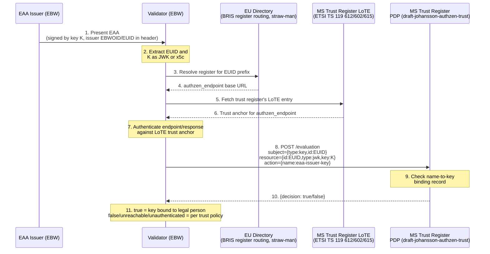

# Verify EAA issuer key binding via an AuthZEN API call

**Authors:**

- Leif Johansson, SIROS, Sweden
- Malin Norlander, Bolagsverket, Sweden

## Context

[#168](https://github.com/webuild-consortium/wp4-architecture/pull/168) asks how a validator can confirm that the key which signed an EAA is bound to the legal person identified by the issuer's EBWOID, without requiring every EAA Provider to be registered in a national Trusted List (TLoL). Both options it proposes solve this by making the binding statically verifiable offline:

- Option 1 puts the EBW owner's public key inside the EBWOID itself and chains the EBWOID into every EAA header.
- Option 2 has the EBWOID provider issue a parallel x.509 "issuing/sealing" certificate, chained into every EAA header instead.

Both options require changes to the EBWOID's ETSI-based format, to SD-JWT VC and to HAIP (or an equivalent business-wallet document) so that every attestation format can carry the chained data, and both re-raise the TLoL scaling threat #168 itself names: a copy of the TLoL, or the header data it protects, may be too large to hold reliably on constrained wallets in embedded devices. Revocation is also harder this way: #168 asks EBWOID providers to support revocation requests carrying a past timestamp, precisely because the binding is asserted once, statically, and consumed long after.

A validator is not always offline when it checks this binding. [flo0x/wp4-architecture#1](https://github.com/flo0x/wp4-architecture/pull/1) proposes that two EBWs identify each other by reciprocally presenting their own EBWOIDs during a request. A validator built this way already holds the counterparty's EBWOID and already has a live network path open to it at the moment it needs to check a signing key. The EBWOID itself is issued by each Member State's company registration office (e.g. Bolagsverket in Sweden), which is the authority best placed to answer, in real time, "is this key currently bound to this legal person?" — because it is the same authority that would otherwise be asked to chain that fact statically into the EBWOID.

[AuthZEN Authorization API 1.0](https://openid.net/specs/authorization-api-1_0.html) — a Final Specification of the OpenID Foundation's [AuthZEN Working Group](https://openid.net/wg/authzen/), approved 11 January 2026 — standardises exactly this shape of question: a validator (the AuthZEN Policy Enforcement Point) POSTs a `{subject, resource, action, context}` access evaluation request to a Policy Decision Point and gets back a `{decision, context}` response.

Rather than use that generic subject/resource shape directly, this ADR profiles it via [draft-johansson-authzen-trust](https://datatracker.ietf.org/doc/draft-johansson-authzen-trust/), "An AuthZEN profile for trust registries". That draft already defines the exact question this ADR needs answered — whether a *name* is bound to a *public key* — as a uniform local interface over whatever kind of trust registry (ETSI trust status lists, OpenID Federation, ledgers, or here, a registration office's own records) sits behind it. Using it means this ADR does not need to define its own subject/resource shape, only the specific name space (EBWOID EUIDs) and role (`action`) it plugs into that profile.

## Decision

An EAA issuer's key binding to its EBWOID MAY be verified by the validator calling a trust registry endpoint conforming to draft-johansson-authzen-trust, operated by or on behalf of the member state that issued that EBWOID, instead of by chaining a public key or certificate into the EAA header.

1. From the presented EAA, the validator extracts the issuer's EBWOID unique identifier (EUID) and the key that signed the EAA, as a JWK or an x.509 certificate (chain).
2. The validator resolves the trust registry's Policy Decision Point endpoint for the issuing Member State's trust register through an EU directory service (see the straw-man below), and authenticates that endpoint against a Trusted List or List of Trusted Entities (LoTE) for Member State trust registers, per ETSI TS 119 615 (see "Authenticating the endpoint" below) — not on TLS/WebPKI alone. The directory lookup is distinct from the [Digital Directory Lookup Service](ebw-endpoint-lookup-service.md), which resolves a Wallet Unit's credential offer endpoint; here it is keyed by issuing authority (e.g. by EUID country and register prefix), not by Wallet Unit.
3. The validator POSTs an access evaluation request to that endpoint's `/evaluation` path, shaped per draft-johansson-authzen-trust §4:
   - `subject`: `{"type": "key", "id": "<EUID>"}` — the *name* whose binding is being asked about is the legal person's EUID, per the draft's requirement that `subject.id` be "the name bound to the public key to be validated".
   - `resource`: `{"id": "<EUID>", "type": "jwk"|"x5c", "key": <the EAA's signing key or certificate chain>}` — `resource.id` MUST equal `subject.id` per §4.2; `resource.key` carries the material being checked.
   - `action`: `{"name": "<role URI>"}`, e.g. `https://webuild-consortium.eu/ns/eaa-issuer-key` (illustrative, to be assigned) — analogous to the draft's own `http://ec.europa.eu/NS/wallet-provider` example, scoping the binding to the EAA-issuing role rather than any other use a registration office's registry might serve.
   - `context`: MAY be present but, per §4.4, MUST NOT carry anything critical to the decision — which rules out putting a point-in-time query parameter here (see "Point-in-time queries and archival" below).
4. No public key or certificate needs to be chained into the EAA, the EBWOID or its provider's header, and no change to the EBWOID's ETSI format, to SD-JWT VC or to HAIP is required for this purpose.
5. Validators MAY cache a `true` decision for a bounded time-to-live to avoid a live call per EAA. A `false` decision or an unreachable endpoint MUST be handled per the validator's own trust policy; fail-closed is RECOMMENDED wherever the EAA is being relied on at the same assurance level as a QEAA.
6. This is independent of, and does not replace, Wallet Unit Attestation validation under CS-02 §7.2 item 6; it answers a different question — whether the *signing key* is bound to the *legal person* — that #168 raises and this ADR proposes to answer live rather than by chaining.

### Straw-man: endpoint lookup

For discussion, not as a final design:

Every EUID already encodes, per (EU) 2017/1132 and the Commission Implementing Regulation governing BRIS, a country code and a business register identifier — BRIS uses exactly this structure today to route a lookup to the one national business register that holds the master record for a given EUID.

A validator resolves the register for an EUID's country/register prefix exactly as BRIS already does, reads that register's `authzen_endpoint` if present, and appends `/evaluation`. If the field is absent, this ADR's mechanism simply isn't available for that register yet, and the validator falls back to whatever #168 lands on.

### Authenticating the endpoint

Resolving an `authzen_endpoint` URL only tells the validator where to send the request; it says nothing about whether the endpoint answering there is really operated by that EUID's Member State trust register. This is the same bootstrapping problem this consortium already solves elsewhere by anchoring an entity's endpoint in a Trusted List or List of Trusted Entities (LoTE) per ETSI TS 119 612 / TS 119 602, validated per ETSI TS 119 615 — the same mechanism a Wallet Unit already uses to validate an Access CA or a PID Provider (see [Publish consortium trusted lists](trusted-lists.md)).

This ADR proposes the same pattern here rather than plain TLS/WebPKI: each trust register's `authzen_endpoint` (TLS server certificate, or a dedicated key used to sign decision responses) is published as a service entry in a Member State trust register LoTE — either a new LoTE profile analogous to the existing Access CA and PID Provider ones, or a `serviceInformationExtensions` addition to a national trusted list the trust register is already listed on, following the same pattern TS 119 602 Annex H already uses to publish which attestation types a Pub-EAA/EAA Provider is authorised to issue. A validator authenticates the endpoint (or its signed response) against that LoTE entry before trusting a `true` decision, exactly as it already does for a WRPAC or a PID Provider credential — and MUST refuse the decision if the endpoint does not authenticate this way, rather than trusting it on TLS/WebPKI alone.

Folding the `authzen_endpoint` URL into that same LoTE entry's `serviceInformationExtensions`, instead of a separate BRIS-based directory, would answer discovery and authentication with a single lookup; that is left as an open choice alongside the straw-man above. Either way, a validator only ever needs the one LoTE entry for the trust register it is querying — not the bulk national TLoL of individual EBWOIDs that #168's options require.

### Point-in-time queries and archival

A trust register is a far more durable institution than an individual EAA Provider: it does not "cease to exist" the way a company can. If it retains a history of which keys were bound to which legal person and when — not just the current binding — then a validator could ask "was this key bound to this legal person at time T", and get a useful answer long after the EAA Provider itself is gone. This would address #168's own long-lived/archival example (e.g. a diploma verified decades later) more directly than this ADR first assumed.

draft-johansson-authzen-trust-01 as written does not yet let a validator ask that question: §4.4 is explicit that `context` "MUST NOT contain information that is critical for the correct processing of the request", and a point-in-time parameter is by definition critical — it changes which record the PDP must consult. This ADR therefore proposes, as a concrete extension for a future revision of that draft, either an optional decision-affecting request field for the query time (outside `context`), or a distinct action naming a "historical" variant of the binding check. Until that extension exists, this mechanism as specified only answers "is this key bound *now*", and the archival case remains open — tracked here rather than silently assumed solved.

## Consequences

What becomes easier?

- No changes are needed to the EBWOID's ETSI format, to SD-JWT VC or to HAIP to carry chained key or certificate data — the entire multi-standard change surface #168 requires for both of its options is avoided.
- No new x.509 "issuing/sealing" certificate type is introduced, and no trust anchor is needed beyond the registration office that already issues the EBWOID.
- Constrained wallets no longer need to fetch, store or verify a TLoL, or a chain rooted in it, to check this one binding — removing the "TLoL too big for embedded/mobile devices" threat #168 names.
- Key rotation and revocation of a *current* binding are answered live, from the registration office's current record, at the moment of verification — removing the need to design a retroactive-timestamp revocation mechanism, or to re-issue the EBWOID on every key rotation.
- Because a trust register is far more durable than an individual EAA Provider, and could retain binding history rather than only current state, the same mechanism is positioned to eventually answer #168's own long-lived/archival example (a diploma verified after its issuer is gone) too — once the point-in-time extension noted above exists — something the static chaining options can only do by keeping the whole chain valid and reachable forever.
- The mechanism reuses an already-drafted, purpose-built profile (draft-johansson-authzen-trust) of an existing OpenID standard for name-to-key binding decisions, rather than a bespoke chaining scheme invented per attestation format, and only needs to define the role name and the directory lookup, not the request/response shape.
- The endpoint itself is authenticated the same way Wallet Units already authenticate an Access CA or a PID Provider — against a Trusted List/LoTE per ETSI TS 119 615 — so this ADR does not introduce a new, unaccountable trust bootstrap alongside the consortium's existing one.

What becomes more difficult?

- This breaks pure offline, holder-to-holder verification: the validator needs live reachability to the issuing registration office (or its delegate) at the moment it verifies.
- As specified today, draft-johansson-authzen-trust-01's `context` field cannot carry anything decision-critical, so it cannot yet express a point-in-time query. Until the draft is extended, this ADR only answers "is this key bound now" — the archival case is not solved, only positioned to be solved.
- The EU directory mapping a MS trust register (or EUID prefix) to its trust registry endpoint does not exist yet in this form. It is a different lookup from the Wallet Unit-keyed Digital Directory Lookup Service, and needs its own design or an explicit extension of that one — see the endpoint-lookup straw-man above.
- No LoTE profile for these trust registries' endpoints exists yet either; this is new scope for the WP4 Trust Registry Infrastructure group, on top of maintaining it once it does.
- Every Member State's trust register(s) would need to expose and operate a conforming Policy Decision Point, and — once the point-in-time extension exists — commit to a retention period for historical bindings long enough to serve long-lived EAAs. Rolling this out consistently across roughly thirty registers of varying technical maturity is its own scaling problem, not obviously smaller than the standards changes #168 requires.
- The `action` role name for this check must mean the same thing everywhere it is deployed; if registration offices diverge in how they interpret it, validators cannot rely on a `true` decision meaning the same thing across Member States.

How do we address the risks introduced by this change?

- Raise the point-in-time query gap as a concrete extension proposal against draft-johansson-authzen-trust, rather than working around it with a non-conformant use of `context`.
- Once that extension lands, specify a minimum retention period for historical key-binding records as part of adopting this ADR, so the archival case is a defined guarantee rather than an incidental capability of whichever registration office happens to keep good records.
- Bound the cache TTL for `true` decisions to the issuing registration office's stated revocation SLA, to reduce round-trip cost on repeat or warm relationships.
- Treat the trust registry endpoint directory as an extension of the BRIS business-register routing table (see the straw-man above), rather than inventing a second, unrelated directory.
- Require the endpoint to be authenticated against a Trusted List/LoTE before any decision from it is trusted (see "Authenticating the endpoint" above), so an unauthenticated or spoofed `authzen_endpoint` cannot be used to forge a `true` decision.
- Pilot with a small number of registration offices (starting with Bolagsverket) and a fixed `action` role definition before asking all Member States to adopt it.

## Advice

Once merged, this is our consortium's decision. This does not mean all
participants agree it is the best possible decision. In the decision
making process, we have heard the following advice.

- [2026-09-22, Malin Norlander, Bolagsverket, Sweden](https://github.com/webuild-consortium/wp4-architecture/pull/336#issuecomment-5773739078): the archival case is solvable, since history can be stored as an archive function. On review against draft-johansson-authzen-trust-01, this is achievable but not yet expressible in that draft as written (its `context` field cannot carry anything decision-critical); recorded above as a proposed extension rather than a solved problem.
- yyyy-mm-dd, Name, Affiliation, Country: OK or summary of advice
