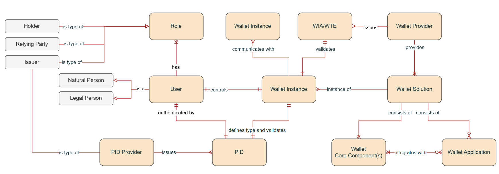

# Architecture Overview

## The Ecosystem at a Glance
Description of wallet, issuer, verifier, registry, QTSP.

## System Landscape
High-level diagram and responsibilities.

## Common Rules for Everyone
Security, error handling, auditability, portability.

## Wallet Implementation Models 
To be authored by Wallet Group. Describes the techn stacks, such as cloud-based vs. device-based solutions, and the differences between EUDIW for Natural Person and European Business Wallets for  economic operators.
### The EUDI Wallet for Natural Person

### The Business Wallet for Economic Operators

