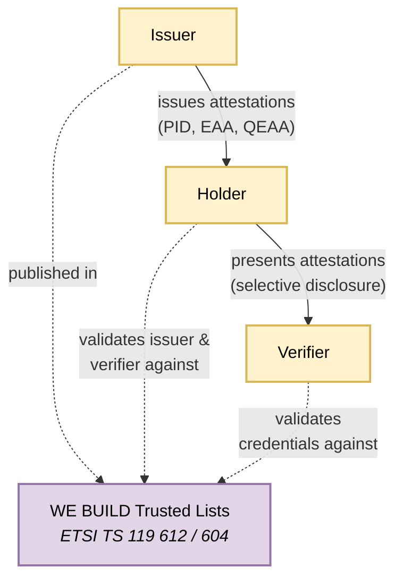
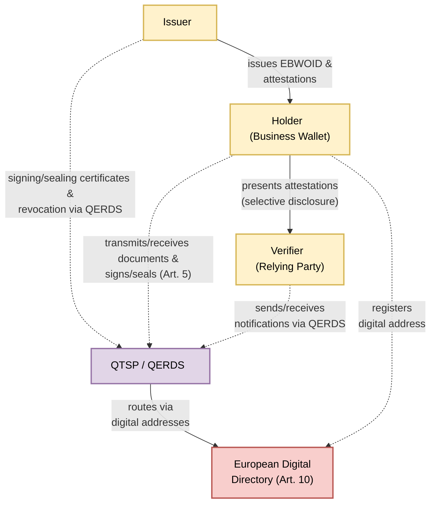

# Architecture Overview

## The Ecosystem at a Glance
The EU digital identity and EU business wallet ecosystem is an instance of the 3-party model for attestations. The core actors are:

1. **Holder** — the identity wallet controlled by either a natural or legal person. For natural persons this is the European Digital Identity Wallet (EUDIW) defined in Regulation (EU) No 910/2014 as amended; for economic operators and public sector bodies this is the European Business Wallet (EBW) established by Regulation (EU) 2025/2747.
2. **Issuer** — an entity that relies on authentic sources of information to issue electronic attestations of attributes to the holder's wallet. Issuer types include PID Providers, EBWOID Providers, QEAA Providers, PuB-EAA Providers, and non-qualified EAA Providers.
3. **Verifier** — a relying party (natural person, economic operator, or public sector body) that requests and receives attestations based on information present in the wallet.

The EU ecosystem for the natural person wallet is described in more detail in [ARF]. The European Business Wallet framework for legal persons is established by Regulation (EU) 2025/2747.

Several sources exist for describing the more general 3rd-party model, including ongoing work in the IETF eg [https://datatracker.ietf.org/doc/draft-ietf-spice-vdcarch/]

## System Landscape

The diagram below illustrates the baseline trust topology of the EU wallet ecosystem. Issuers provide attestations to holders, holders present them to verifiers, and all parties anchor trust decisions against the EU trusted lists defined under ETSI TS 119 612 and ETSI TS 119 604 within the framework of the eIDAS Regulation.

---

In the WE BUILD project the focus is primarily on wallets for legal entities. In this case the regulation (Regulation (EU) 2025/2747) includes the use of qualified electronic registered delivery services to enable messaging services between entities in the ecosystem. Accordingly, the generic trust anchor is replaced by a Qualified Trust Service Provider operating a Qualified Electronic Registered Delivery Service (QTSP/QERDS), through which issuers, holders, and verifiers route their trust and messaging interactions. The European Digital Directory (Article 10) provides digital addressing for secure routing of documents and notifications. The diagram changes to this:

## Common Rules for Everyone
Security, error handling, auditability, portability.

## Wallet Implementation Models 
To be authored by Wallet Group. Describes the techn stacks, such as cloud-based vs. device-based solutions, and the differences between EUDIW for Natural Person and European Business Wallets for  economic operators.
### The EUDI Wallet for Natural Person
To come: [Issue 63](https://github.com/webuild-consortium/wp4-architecture/issues/63) will produce concept model in collaboration with Wallet Group.
### The Business Wallet for Economic Operators
To come: [Issue 63](https://github.com/webuild-consortium/wp4-architecture/issues/63) will produce concept model in collaboration with Wallet Group.
