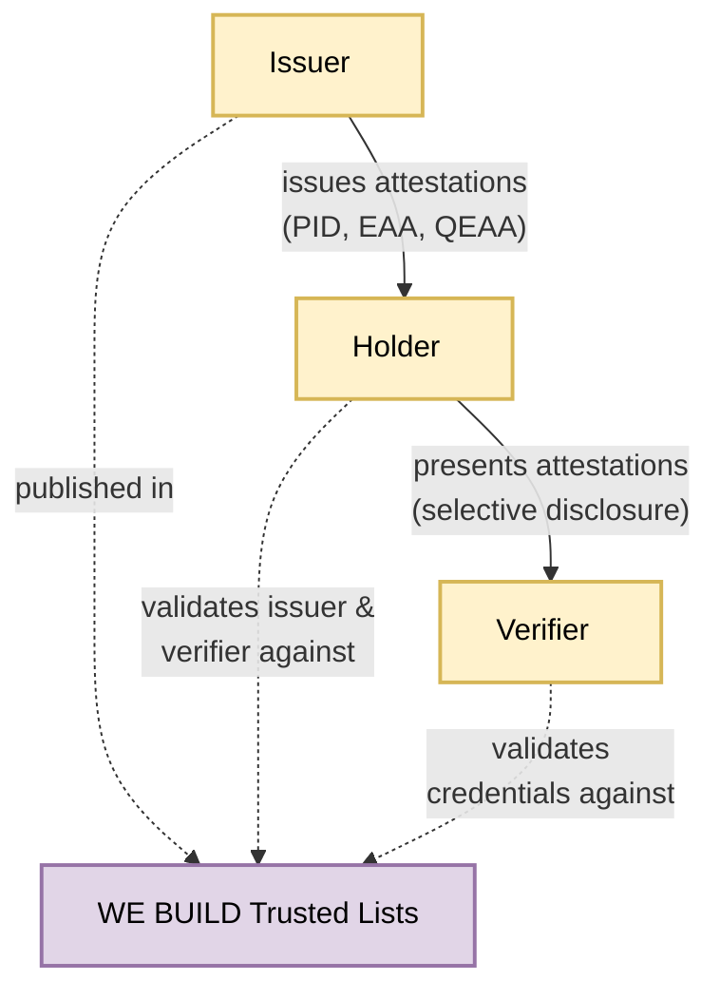
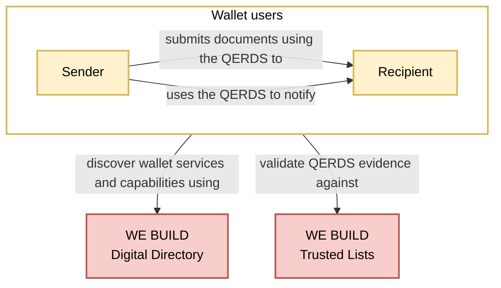

# Architecture Overview

## Architectural Principles
While the previous chapter describes the regulatory and architectural frameworks that WE BUILD aligns with, this chapter introduces the architectural principles guiding the design of the WE BUILD ecosystem.

- **Interoperability:** Wallet providers, issuers and verifiers interact across organisational and national boundaries.
- **Reusability:** The architecture builds on existing EU digital infrastructure and results from previous Large Scale Pilots.
- **Security by design:**Security controls are integrated into the architecture from the start.
- **Privacy by design:** Users retain control over personal and organisational data through selective disclosure and explicit consent.

## The Ecosystem at a Glance
The EUDI Wallet and EBW ecosystem follows the common three-party attestation model. In this model, three primary actors interact: issuer, holder and verifier. A trust framework supports these actors by providing the trust anchors used for validation.
1. **Holder** – the wallet controlled by a natural or legal person.
2. **Issuer** – an entity that issues attestations to the Holder.
3. **Verifier** – a relying party that receives and validates attestations presented by the Holder.
4. **Trust framework** – the infrastructure used to validate trust relationships between ecosystem participants (described in Chapter 6).

## System Landscape
The diagram below illustrates the baseline trust topology of the EU wallet ecosystem. Issuers provide attestations to holders, holders present them to verifiers, and all actors validate trust relationships using the trusted lists.
The trusted lists specify the recognised participants in schemes for electronic identification and trust services.

```mermaid
%% Baseline trust topology of the EU wallet ecosystem
flowchart TB
    issuer["Issuer&nbsp;&nbsp;"]
    holder["Holder&nbsp;&nbsp;"]
    verifier["Verifier&nbsp;&nbsp;"]
    trust["WE BUILD Trusted Lists"]

    issuer -->|"issues attestations<br/>(PID, EAA, QEAA)"| holder
    holder -->|"presents attestations<br/>(selective disclosure)"| verifier
    issuer -.->|"published in"| trust
    holder -.->|"validates issuer &<br/>verifier against"| trust
    verifier -.->|"validates<br/>credentials against"| trust

    %% Styling
    classDef primaryRole fill:#fff2cc,stroke:#d6b656,stroke-width:2px,color:#000;
    classDef component fill:#e1d5e7,stroke:#9673a6,stroke-width:2px,color:#000;

    class issuer,holder,verifier primaryRole;
    class trust component;
```

WE BUILD focuses primarily on wallets for economic operators and public sector bodies. 
In these scenarios, qualified electronic registered delivery services (QERDS) support trusted messaging between recognised participants. 
Accordingly, interactions between data senders and receipients may be routed through a Qualified Trust Service Provider (QTSP) providing a QERDS. 
The QTSP is recognised in a scheme for trust services, just like in the previous diagram, enabling other participants to verify QERDS evidence issued by the QTSP.
The WE BUILD Digital Directory (simulating the European Digital Directory) provides economic and public sector bodies with digital addressing for secure routing of documents and notifications.

While this model can apply to any data transmission, the senders, recipients and their QERDS providers can take the issuer-holder-verifier roles as illustrated as above.
The QERDS provides an additional layer in the WE BUILD ecosystem:

```mermaid
%% WE BUILD additional trust topology with the QERDS and the European Digital Directory
graph TB
    Directory["WE BUILD<br>Digital Directory"]
    TL["WE BUILD<br>Trusted Lists"]
    subgraph Users[Wallet users]
      direction LR
      Sender
      Recipient
    end
    Sender-->|"submits documents using the QERDS to"|Recipient
    Sender-->|"uses the QERDS to notify"|Recipient
    Users-->|"discover wallet services and capabilities using"|Directory
    Users-->|"validate QERDS evidence against"|TL

    classDef group fill:#ffffff,stroke:#d6b656,stroke-width:2px,color:#000;
    classDef primaryRole fill:#fff2cc,stroke:#d6b656,stroke-width:2px,color:#000;
    classDef component fill:#e1d5e7,stroke:#9673a6,stroke-width:2px,color:#000;
    classDef governance fill:#f8cecc,stroke:#b85450,stroke-width:2px,color:#000;

    class Users group
    class Sender,Recipient primaryRole
    class Directory,TL governance
```

## Wallet Types in WE BUILD 

WE BUILD supports wallet solutions for both natural persons and economic operators.

Natural persons interact through EUDI Wallets, which enable individuals to authenticate and present personal identity attributes. Economic operators interact through EBW, which enable organisations to manage and present business-related attestations such as representation rights or organisational attributes.

From a deployment perspective, wallet solutions can be implemented in several ways depending on the target users, operational requirements, and cryptographic architecture. In practice, three main implementation approaches are relevant within the WE BUILD ecosystem.

| Wallet type | Typical context | Characteristics |
|---|---|---|
| **Mobile wallets (on-device)** | Natural persons | Wallet application running on a user’s smartphone, with credentials stored and used locally on the device. |
| **Server or Web-based wallets** | Economic operators | Wallet services operated in backend infrastructure and accessed through Web interfaces or enterprise systems. |
| **Hybrid wallets** | Both contexts | Combine device-based interaction with backend cryptographic infrastructure. |

The underlying cryptographic architecture of wallets is defined in the ARF and related standards. This Blueprint therefore focuses on the interactions and interoperability patterns relevant for WE BUILD rather than repeating the detailed wallet architecture definitions.

In practice, most deployments follow a mobile-first approach for natural persons and a server-based or enterprise-integrated approach for economic operators. Hybrid architectures may also be used to combine device-based user interaction with backend cryptographic services.
