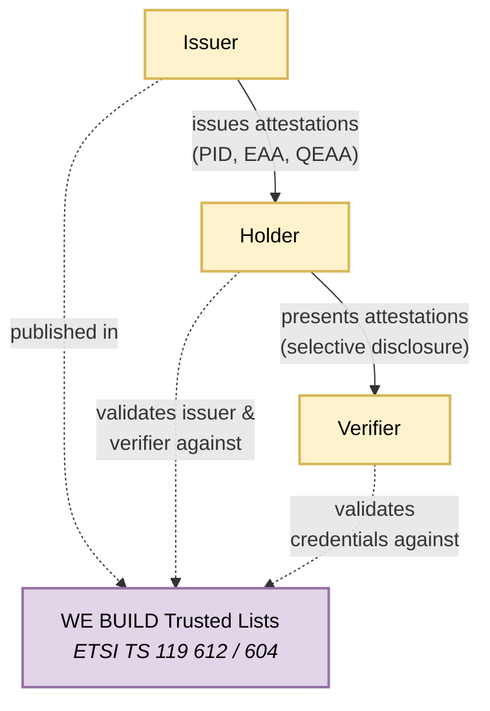
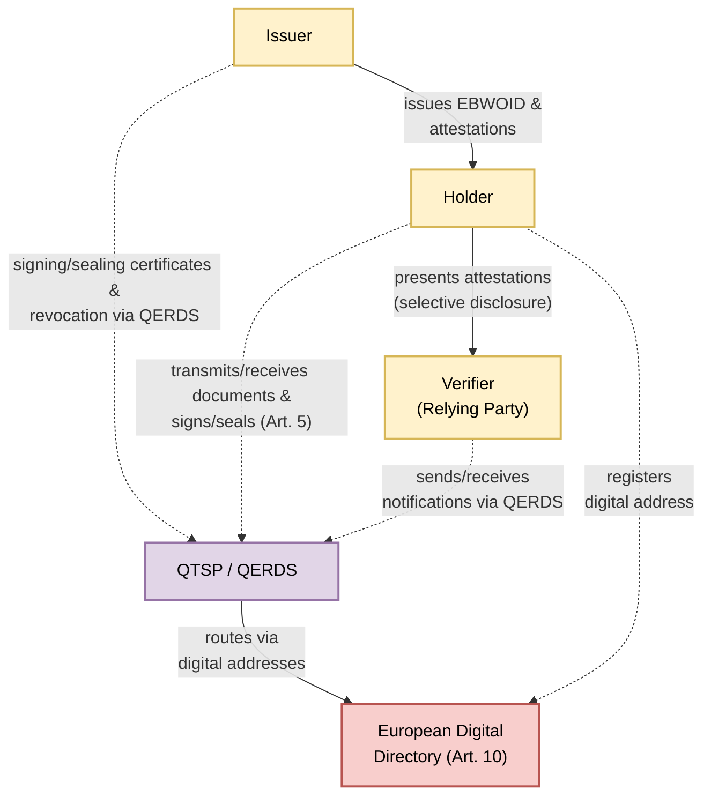

# Architecture Overview

## The Ecosystem at a Glance
The EU digital identity and EU business wallet ecosystem is an instance of the 3 party model for attestations. In this model there are 4 main actors:

1. The holder, aka the identity wallet that is controlled by either a natural or legal person
2. The issuer that relies on authentic sources of information to issue attestations to the holder/wallet
3. The verifier receives an attestation based on information present in the wallet.
4. The trust framework that in the EU ecosystems is based on ETSI TS 119604/119612 aka trust status lists populated by trust status providers that for some use cases are QTSPs

The EU ecosystem for the natural person wallet is described in more detail in [ARF]. The corresponding document for the EU legal person wallet is in progress.

Several sources exist for describing the more general 3rd-party model, including ongoing work in the IETF eg [https://datatracker.ietf.org/doc/draft-ietf-spice-vdcarch/]

## System Landscape

The diagram below illustrates the baseline trust topology of the EU wallet ecosystem. Issuers provide attestations to holders, holders present them to verifiers, and all parties anchor trust decisions against the EU trusted lists defined under ETSI TS 119 612 and ETSI TS 119 604 within the framework of the eIDAS Regulation.

```mermaid
%% Baseline trust topology of the EU wallet ecosystem
flowchart TB
    issuer["Issuer&nbsp;&nbsp;"]
    holder["Holder&nbsp;&nbsp;"]
    verifier["Verifier&nbsp;&nbsp;"]
    trust["WE BUILD Trusted Lists&nbsp;&nbsp;<br/><i>ETSI TS 119 612 / 604</i>"]

    issuer -->|"issues attestations<br/>(PID, EAA, QEAA)"| holder
    holder -->|"presents attestations<br/>(selective disclosure)"| verifier
    issuer -.->|"published in"| trust
    holder -.->|"validates issuer &<br/>verifier against"| trust
    verifier -.->|"validates<br/>credentials against"| trust

    %% Styling
    classDef primaryRole fill:#fff2cc,stroke:#d6b656,stroke-width:2px,color:#000;
    classDef component fill:#e1d5e7,stroke:#9673a6,stroke-width:2px,color:#000;

    class issuer,holder,verifier primaryRole;
    class trust component;
```

---

In the WE BUILD project the focus is primarily on wallets for legal entities. In this case the regulation includes the use of qualified electronic registered delivery services to enable messaging services between entities in the ecosystem. Accordingly, the generic trust anchor is replaced by a Qualified Trust Service Provider operating a Qualified Electronic Registered Delivery Service (QTSP/QERDS), through which issuers, holders, and verifiers route their trust and messaging interactions. The European Digital Directory provides digital addressing for secure routing of documents and notifications. The diagram changes to this:

```mermaid
%% WE BUILD trust topology with QTSP/QERDS and European Digital Directory
flowchart TB
    issuer["Issuer&nbsp;&nbsp;"]
    holder["Holder&nbsp;&nbsp;"]
    verifier["Verifier&nbsp;&nbsp;<br/>(Relying Party)"]
    qtsp["QTSP / QERDS&nbsp;&nbsp;"]
    directory["European Digital<br/>Directory (Art. 10)"]

    issuer -->|"issues EBWOID &<br/>attestations"| holder
    holder -->|"presents attestations<br/>(selective disclosure)"| verifier
    issuer -.->|"signing/sealing certificates &<br/>revocation via QERDS"| qtsp
    holder -.->|"transmits/receives documents &<br/>signs/seals (Art. 5)"| qtsp
    verifier -.->|"sends/receives<br/>notifications via QERDS"| qtsp
    qtsp -->|"routes via<br/>digital addresses"| directory
    holder -.->|"registers<br/>digital address"| directory

    %% Styling
    classDef primaryRole fill:#fff2cc,stroke:#d6b656,stroke-width:2px,color:#000;
    classDef component fill:#e1d5e7,stroke:#9673a6,stroke-width:2px,color:#000;
    classDef governance fill:#f8cecc,stroke:#b85450,stroke-width:2px,color:#000;

    class issuer,holder,verifier primaryRole;
    class qtsp component;
    class directory governance;
```

## Common Rules for Everyone
Security, error handling, auditability, portability.

## Wallet Implementation Models 

The ARF classifies wallet architectures primarily by **where the
cryptographic device (WSCD) is located** and **how keys are managed**
--- not by whether the interface is mobile or web. However, from a
practical deployment perspective, four main wallet types are relevant:

| **Wallet Type** | **Where Keys Live** | **Best For** | **Key Limitation** |
| --- | --- | --- | --- |
| **Mobile (on-device)** | On the user's smartphone hardware | Citizens, offline/proximity use | Device hardware fragmentation |
| **Web/Browser-based** | Remote cloud, accessed via browser | Desktop services, legal persons, B2B/B2G | Requires connectivity; LoA High needs backend HSM |
| **Cloud/HSM-anchored** | Remote certified HSM in a data centre | Managed services, enterprise, legal persons | No offline capability; network-dependent |
| **Hybrid** | Both local device + remote HSM | Broad deployment, best of both worlds | Complexity in certification and key lifecycle |

## Web / Browser-Based Wallets

Wallets accessed entirely through a web browser, without requiring a
dedicated mobile app installation. The user interface runs in the
browser; cryptographic operations are handled either by the browser\'s
native security or by a remote cloud HSM backend.

**Architecture pattern:**

- For **natural persons**: a device-resident mobile Wallet Instance is
  invoked from the browser via the W3C Digital Credentials API, URL
  schemes, or WebAuthn. The browser is the relying party\'s UX surface;
  the wallet handles credential presentation.

- For **legal persons**: a server-hosted Wallet Unit is fronted by a web
  UI. Cryptographic operations are performed by an HSM backend. This is
  the standard architecture for the **European Business Wallet (EUBW)**
  and B2B/B2G scenarios.

**Key characteristics:**

- **Trust anchor**: Platform authenticators (WebAuthn/Passkeys on the
  browser) or remote HSM for backend operations.

- **Offline capability**: None. All operations require network
  connectivity.

- **LoA High**: Achievable when backed by a certified remote HSM or
  qualified platform authenticator. Pure browser-based cryptography
  (JavaScript crypto) does not meet the tamper-resistance requirement.

- **Interoperability**: Uses standard OpenID4VP/4VCI flows, making it
  fully interoperable with the EUDI ecosystem from the issuer and
  verifier perspective.

- **Use cases**: eGovernment desktop services, corporate signing
  workflows (QES), automated B2B credential exchange, Digital Product
  Passports, supply chain traceability.

**Strengths and limitations:**

 | **Strengths** | **Limitations** |
| --- | --- |
| No app installation required | Requires always-on connectivity |
| Broad reach across devices | Cannot support offline proximity presentations (e.g., border control) |
| Natural fit for enterprise/legal person workflows | Phishing resistance requires careful WebAuthn/DC API implementation |
| Easy integration with existing corporate systems (ERPs, IAM) | Pure software browser crypto cannot meet LoA High |

## Mobile Wallets (On-Device)

Based on native apps installed on the user\'s smartphone (iOS or
Android), where cryptographic keys are stored and used directly on the
device\'s secure hardware.

**Architecture pattern:**

- The Wallet Instance is a native mobile app integrating with the
  device\'s secure hardware via OS-level APIs.

- Credential storage and cryptographic operations occur inside a **local
  WSCD** (for which there can be various hardware variants).

- Communicates with issuers via OpenID4VCI and with verifiers via
  OpenID4VP (remote) or ISO/IEC 18013-5 (proximity via NFC/BLE/QR).

**Key characteristics:**

- **Trust anchor**: Device-bound cryptographic keys, protected by
  certified on-device secure hardware and device-unlock factors
  (biometrics, PIN).

- **Offline capability**: Full. The wallet can present credentials to a
  verifier with no internet connection (e.g., mobile driving licence
  presented to law enforcement via NFC).

- **LoA High**: Achievable with the right device hardware --- but a key
  challenge is that **only approximately 11% of consumer smartphones**
  currently meet the strict LoA High requirements for fully on-device
  cryptographic operations (Ansaroudi et al., EURASIP 2025). This is why
  hybrid architectures are gaining ground.

- **Use cases**: Personal identification, age verification, mobile
  driving licence, travel credentials, healthcare access, everyday
  authentication.

**Strengths and limitations:**

| **Strengths** | **Limitations** |
| --- | --- |
| Full offline and proximity support | Only ~11% of devices meet LoA High natively |
| Strong device binding and user sovereignty | Complex recovery if device is lost |
| Best UX for high-frequency citizen use cases | OS/platform dependencies (Apple, Google) limit Wallet Provider control |
| No backend infrastructure needed for presentations | Requires ongoing app store distribution and updates |

## Technical Wallet Architecture Types (WSCD-Based)

This section provides a deeper architectural perspective, based on the
five WSCD patterns defined in the ARF.

The **Wallet Secure Cryptographic Device (WSCD)** is the
tamper-resistant hardware element that stores and uses cryptographic
keys. Where the WSCD is located is the most consequential architectural
decision, as it determines security certification path, offline
capability, and device requirements. The **Wallet Secure Cryptographic
Application (WSCA)** is the software layer that manages per-user wallet
keys on the WSCD.

### Local Native WSCD

The WSCD is the **operating system\'s built-in secure processor** on the
smartphone:

- **Apple Secure Enclave** (iOS)

- **Android StrongBox** (Titan M chip)

- **Samsung Knox**

Keys are generated and stored inside these platform-managed
coprocessors, accessed through OS-level APIs. This is the simplest and
most seamless architecture from a UX perspective.

**Regulatory concern:** A local native WSCD cannot reliably meet LoA
High, because Wallet Providers lack sovereignty over the cryptographic
environment controlled by device OEMs. Certification depends on
manufacturer attestations rather than independent Common Criteria
evaluation of the wallet-specific security domain.

### Local Internal WSCD (eSIM / eSE)

The WSCD is an **embedded Secure Element (eSE) or eSIM/eUICC** within
the phone, certified to **EAL5+ or EAL6+** under Common Criteria. The
WSCA typically runs as a Java Card applet provisioned via a Trusted
Service Manager.

This provides the strongest on-device security assurance but currently
has an access problem: Member States and Wallet Providers cannot
independently deploy applets to Secure Elements controlled by device
OEMs or mobile network operators[^1].

### Local External WSCD (Smart Card / NFC Token)

The WSCD is a **physically separate hardware token** --- a national ID
card, smart card, or USB security key --- connected to the device via
NFC or USB.

- Strongest physical isolation; works with any NFC-capable device
  regardless of its internal hardware.

- Requires physical distribution logistics and introduces user friction.

- This approach can be considered as a fallback for devices lacking
  sufficiently secure internal hardware.

### Remote WSCD (Cloud HSM)

The WSCD is an HSM located in a data centre, certified to Common
Criteria EAL4+ with AVA_VAN.5. The Wallet Instance communicates with the
remote WSCA over a secure network channel. One HSM can serve large
numbers of wallet units, potentially millions when clustered

This is the most scalable and most inclusive architecture --- it works
with any internet-connected device. Key recovery is straightforward
(rebind user identity to a new device; keys remain in the HSM).

**Critical limitation:** Purely remote WSCD cannot support offline or
unconnected proximity presentation flows, because every signature or
selective‑disclosure operation must be executed within the remote HSM.
Tokenisation techniques might, in future, provide limited offline
capabilities, but this is not yet standardised; consequently, many
Member States may need to rely and adopt hybrid architectures that
combine remote HSMs with local WSCDs for offline use cases.

### Hybrid WSCD

Combines two or more WSCD types within the same Wallet Unit:

- **Most common pattern:** Remote HSM for scalability and recovery +
  local WSCD for offline presentations.

- Endorsed by the ARF (section 4.5)

- Introduces certification complexity --- each WSCD component and their
  combination must be independently evaluated.

### Architecture Comparison Matrix

| **Dimension** | **Local Native** | **Local Internal (eSIM/eSE)** | **Local External (Smart Card)** | **Remote (HSM)** | **Hybrid** |
| --- | --- | --- | --- | --- | --- |
| **Trust anchor** | OS secure coprocessor | CC EAL5+/6+ SE | CC certified token | FIPS 140-3 L3 / CC EAL4+ HSM | Split across components |
| **Offline capability** | ✅ Full | ✅ Full | ✅ Full | ❌ None | ✅ Partial |
| **LoA High path** | ⚠️ Contested | ✅ Strongest | ✅ Strong | ✅ With sole-control design | ✅ Per-component evaluation |
| **Device accessibility** | Mid/high-end phones only | Phones with accessible eSE/eSIM | Any NFC device | **Any internet device** | Varies |
| **Scalability** | Low | Low-Medium | Low (logistics) | **Highest** | Medium-High |
| **Key recovery** | Complex | Complex | Requires replacement | **Simple** | Varies |
| **Wallet Provider sovereignty** | Low (OEM-controlled) | Medium (TSM cooperation) | High | Highest | Medium-High |
| **User experience** | Seamless | Seamless | Friction (tap device) | Seamless (online) | Depends on primary WSCD |

## Deployment Models

The choice of WSCD architecture determines the deployment model. Four
primary deployment models exist:

### On-Device Deployment

Most wallet logic and all cryptographic operations execute on the
user\'s device. Minimal server support is needed (trust list updates,
revocation status, attestation metadata).

**Best for:** Natural person wallets, mobile-first deployments,
offline/proximity use cases.

**Implications:**

- **Privacy:** Strongest --- personal data and keys never leave user\'s
  physical control (data minimisation by design).

- **Scalability:** Scales with app distribution and backend read
  traffic, not per-transaction cryptography.

- **Compliance:** Favourable for GDPR data minimisation. Wallet Provider
  still responsible for WSCD and Wallet Solution certification.

- **Integration:** Standard OpenID4VCI/4VP clients; works with any
  compliant issuer or verifier.

### Cloud-Hosted / Remote HSM Deployment

Key management and cryptographic operations run in a provider\'s data
centre with HSM-based WSCDs. The user device acts as a thin-client
Wallet Instance.

**Best for:** Legal person wallets, managed services, enterprise-scale
deployments, qualified electronic signatures.

**Implications:**

- **Scalability:** Excellent --- crypto and policy engines scale
  horizontally in the data centre.

- **Recovery:** Simple --- rebind user to new device without re-issuing
  keys.

- **Compliance:** Subject to CIR 2024/2981 (certification), remote QSCD
  management rules, and strict evidence of user sole control. Cannot
  support offline presentations.

- **Integration:** Natural fit with enterprise IAM (e.g., Microsoft
  Entra, Okta), existing QTSP infrastructure, and B2B API workflows.

### Managed Service / Wallet-as-a-Service (WaaS)

A specialised Wallet Provider operates the full stack --- application,
WSCA, WSCD, trust infrastructure --- as a multi-tenant service for
organisations or governments.

**Best for:** Banks, QTSPs, government agencies, organisations without
cryptographic infrastructure of their own.

**Implications:**

- **Scalability:** Economies of scale across tenants; centralised
  revocation, compliance patching.

- **Compliance:** Tenant isolation, strict WSCD controls, and certified
  Wallet Solution per Member State or scheme. Compliance responsibility
  stays with the Wallet Provider.

- **Integration:** Seamless for relying parties via standardised
  endpoints and onboarding; integrates with existing OpenID Connect/SAML
  identity providers.

### Enterprise / Edge / IoT Deployment

Wallets deployed into corporate networks, API-accessible backends, or
edge/IoT systems to support machine-to-machine credential exchange.

**Best for:** European Business Wallet (EUBW), supply chain credentials
(Digital Product Passports), automated B2B identity, M2M scenarios.

**Implications:**

- **Zero Trust Architecture** principles apply --- continuous
  verification of entities before granting access.

- Relying parties on edge devices consume attestation presentations via
  ISO 18013-5 or OID4VP; verification and trust list lookups may occur
  in local edge nodes or in the cloud.

- The second wave of EU Large Scale Pilots (WE BUILD, APTITUDE) actively
  explores this model for business credentials and travel documents.

### Deployment Model Summary

| **Deployment Model** | **Primary WSCD Type** | **Offline Capable** | **Best User Segment** | **Scalability** |
| --- | --- | --- | --- | --- |
| On-Device | Local (native, internal, external) | ✅ Yes | Natural persons | Medium |
| Cloud-Hosted | Remote HSM | ❌ No | Legal persons, enterprise | High |
| Managed Service (WaaS) | Remote HSM | ❌ No | Organisations, banks, QTSPs | Very High |
| Edge / IoT | Remote HSM (usually) | ❌ Limited | Machines, B2B, supply chain | High |
| Hybrid | Local + Remote HSM | ✅ Partial | Both | High |

## WeBuild Wallet Arsenal

This section presents the WeBuild Wallets arsenal based on the WeBuild
stocktaking questionnaire conducted by the Wallet Provider Group, which
captured self-declared responses from **31 Wallet Providers**. Providers
described the wallet types they offer, their primary deployment models,
and specific technical or architectural details where applicable.

**Important Disclaimers** :

- The data presented in this section are based entirely on
  **self-declarations by Wallet Providers** collected via a stocktaking
  questionnaire. Responses were gathered during the **first month of the
  WeBuild project**. The information may not be fully accurate,
  complete, or up to date. Architectural approaches, deployment options,
  and conformance claims should be verified through direct engagement
  with providers as the project progresses.

- The questionnaire responses were gathered at a point in time when no
  official European Business Wallet (EBW) regulation or specification
  existed. As a result, Wallet Providers who indicated support for Legal
  Persons (LP) did so without reference to any formal regulatory
  framework. At that time, the prevailing approach in the industry was
  to treat Legal Person wallets as ad-hoc implementations --- typically
  using custom attestations, Powers of Attorney, or Powers of
  Representation issued in non-standardised formats, often specific to
  individual deployments or previous LSP's legacy (EWC). Providers were
  not aware of, and could not have anticipated, the specific
  architectural, trust, and interoperability requirements that have
  since been proposed under the emerging Business Wallet regulatory
  provisions. This means that the LP wallet solutions described in the
  stocktaking data do not adhere --- and were never designed to adhere
  --- to the proposed provisions of the Business Wallet regulation. A
  structured process and a concrete high-level architectural proposal
  will be required for providers to review, adapt, and realign their
  solutions against the new regulatory baseline.

### Who Does the Wallet Serve?

The majority of WeBuild providers aim to serve both citizen and
enterprise use cases. However, this dual scope requires fundamentally
different architectures --- mobile-first for NP, server-based for LP ---
meaning most dual-scope providers are implicitly building or planning
hybrid solutions.

| **Target User** | **Count** | **Share** |
| --- | --- | --- |
| Both Natural Persons (NP) and Legal Persons (LP) | 17 | 55% |
| Natural Persons only | 8 | 26% |
| Legal Persons only | 6 | 19% |

### Deployment Models

Mobile is the dominant deployment choice, reinforcing the mobile-first
nature of natural person EUDI wallets. Over half of providers also
support cloud-hosted deployment, confirming the trend towards hybrid or
dual-mode architectures. A significant share (42%) offer on-premise
server options, reflecting enterprise demand for data sovereignty and
private cloud deployment.

| **Deployment Option** | **Count** | **Share of Providers** |
| --- | --- | --- |
| Mobile wallet (iOS/Android app) | 24 | 77% |
| Server wallet on cloud | 17 | 55% |
| Server wallet on-premise | 13 | 42% |
| Multi-device edge / white-label wallet | 2 | 6% |
| Wallet functionality via API & SDK | 2 | 6% |
| Machine/IoT components (Issuers/Verifiers) | 1 | 3% |

**Single vs. multiple deployment options:**

- Providers offering only one deployment mode: **15 (48%)** --- almost
  all of these are mobile-only providers for natural persons.

- Providers offering two or more deployment modes: **16 (52%)** ---
  these tend to serve both NP and LP segments and often explicitly
  describe a mobile NP wallet paired with a cloud/server LP wallet.

### Architectural Patterns and Notable Approaches

Several distinctive architectural patterns emerge from the qualitative
responses:

**Pattern 1 --- Mobile NP + Cloud LP (most common dual-scope model)**
Multiple providers explicitly describe a mobile application for natural
persons paired with a separate cloud-hosted or on-premise server wallet
for legal persons:

This is the most pragmatic response to the NP/LP split: different trust
models, different use cases, different deployment patterns.

**Pattern 2 --- HSM-anchored cloud wallet** One provider explicitly
declares an HSM-only architecture for a natural person wallet:

**Pattern 3 --- Web-based wallet using WebAuthn (wwWallet approach)**
The wwWallet provider offers a Progressive Web App backed by
WebAuthn/passkeys, with multi-device support and a business wallet for
legal persons via WebAuthn with multiple associated passkeys. This
represents the most browser-centric architecture in the dataset.

**Pattern 4 --- Containerised / Kubernetes-based deployment** Some
providers support deployment-agnosticism through Docker/Kubernetes
packaging. This reflects strong DevOps maturity and supports the
on-premise demand in European regulated sectors.

**Pattern 5 --- SDK / API-first approach** One provider offers primarily
open-source tooling (SDKs built on Kotlin Multiplatform for native
mobile, plus a Progressive Web App) rather than a hosted product. This
enables customers to deploy and manage their own instances across any
environment.

### Trends and Architectural Implications for WeBuild

**1. Convergence on mobile + cloud duality.** The dominant pattern in
WeBuild mirrors the wider EU ecosystem: a mobile app for citizens, a
server wallet for enterprises. The project's architectural, testing and
piloting approach should anticipate and plan for interoperability
testing across these two architectural tiers.

**2. WSCD transparency gap.** The questionnaire responses largely
describe the *application layer* (mobile app, server, cloud), not the
*WSCD architecture* (local native, remote HSM, eSIM). Only two providers
explicitly mention HSM; most mobile-app providers do not specify whether
they use StrongBox, Secure Enclave, eSIM, or a hybrid.

**3. Legal person wallet architectures are less mature.** Several
providers note that their legal person wallet is still being defined or
will be developed in collaboration with the consortium.

As established in the disclaimer above, the WeBuild stocktaking
responses describing Legal Person wallet support were made in the
absence of any formal European Business Wallet (EBW) specification. The
approaches used by providers at that time --- custom attestations,
ad-hoc Power of Attorney or Power of Representation credentials,
proprietary organisational identity schemes, previous LSPs proposals ---
represent reasonable pragmatic responses to a regulatory vacuum.
However, the subsequent emergence of Business Wallet regulatory
proposals changes the landscape fundamentally.

Before any WeBuild Wallet Provider can modify, extend, or certify its
solution to support Business Wallet requirements, the consortium must
first establish a shared architectural baseline: a common understanding
of the required trust model, ecosystem roles, interoperability
interfaces, and governance components that the Business Wallet
regulation introduces. Without this baseline, providers cannot make
informed architectural decisions and risk building solutions that will
require redesign as the regulation evolves.

[^1]: In the sense that they cannot do so without OEM/MNO cooperation or
    an agreed framework

### The EUDI Wallet for Natural Person
To come: [Issue 63](https://github.com/webuild-consortium/wp4-architecture/issues/63) will produce concept model in collaboration with Wallet Group.
### The Business Wallet for Economic Operators
To come: [Issue 63](https://github.com/webuild-consortium/wp4-architecture/issues/63) will produce concept model in collaboration with Wallet Group.
