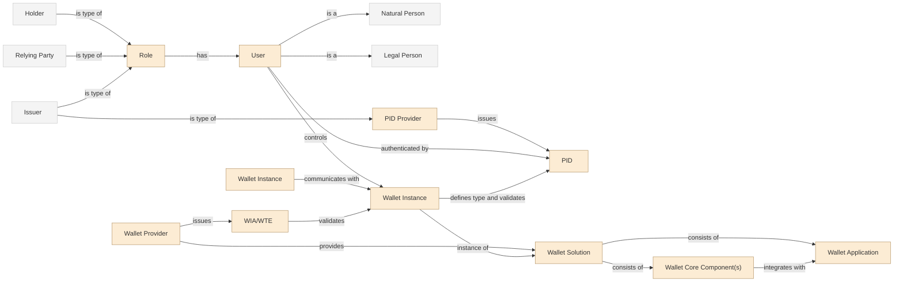

# Architecture Overview

## The Ecosystem at a Glance
The EU digital identity and EU business wallet ecosystem is an instance of the 3 party model for attestations. In this model there are 4 main actors:
1. The holder, aka the identity wallet that is controlled by either a natural or legal person
2. The issuer that relies on authentic sources of information to issue attestations to the holder/wallet
3. The verifier receives an attestation based on information present in the wallet.
4. The trust framework that in the EU ecosystems is based on ETSI TS 119604/119612 aka trust status lists populated by trust status providers that for some use cases are QTSPs

The EU ecosystem for the natural person wallet is described in more detail in [ARF]. The corresponding document for the EU legal person wallet is in progress.

Several sources exist for describing the more general 3rd party model, including ongoing work in the IETF eg [https://datatracker.ietf.org/doc/draft-ietf-spice-vdcarch/]

## System Landscape

The diagram below illustrates the baseline trust topology of the EU wallet ecosystem. Issuers provide attestations to holders, holders present them to verifiers, and all parties anchor trust decisions against the EU trusted lists defined under ETSI TS 119 612 and ETSI TS 119 604 within the framework of the eIDAS Regulation.

In the WE BUILD project the focus is primarily on wallets for legal entities. In this case the regulation includes the use of qualified electronic registered delivery services to enable messaging services between entities in the ecosystem. Accordingly, the generic trust anchor is replaced by a Qualified Trust Service Provider operating a Qualified Electronic Registered Delivery Service (QTSP/QERDS), through which issuers, holders, and verifiers route their trust and messaging interactions. The diagram changes to this:

## Common Rules for Everyone
Security, error handling, auditability, portability.

## Wallet Implementation Models 
To be authored by Wallet Group. Describes the techn stacks, such as cloud-based vs. device-based solutions, and the differences between EUDIW for Natural Person and European Business Wallets for  economic operators.

### The EUDI Wallet for Natural Person

The diagram below provides a concept-level view of the EUDI Wallet ecosystem for natural persons (informative, non-normative).

_Concept diagram for discussion and alignment. Terminology and role labels should be interpreted in line with the EUDIW ARF and the corresponding WE BUILD architecture artefacts._

### The Business Wallet for Economic Operators and Public Sector Bodies
The Business Wallet is described in further detail in [Appendix D](https://github.com/webuild-consortium/wp4-architecture/blob/main/blueprint/appendix-ebw-definition.md)

The diagram below provides a concept-level view of the European Business Wallet ecosystem for economic operators (informative, non-normative).

_Concept diagram for discussion and alignment. It illustrates a WE BUILD-style business wallet landscape_
