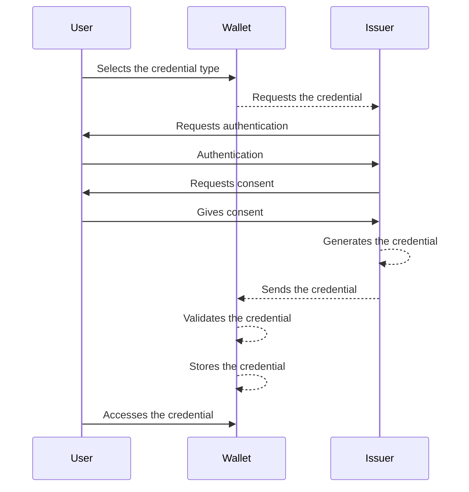
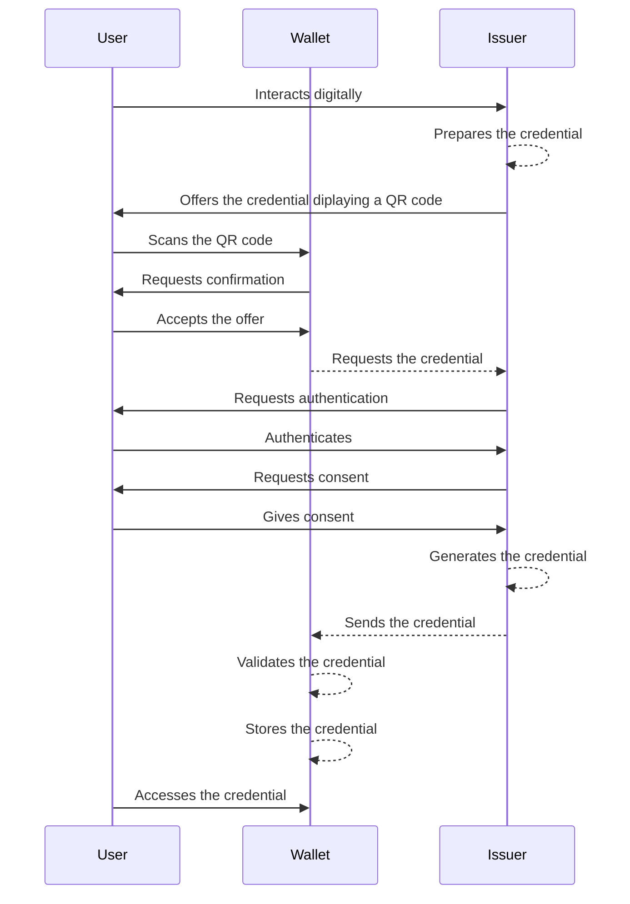

# How the Wallet Interacts with Services
Todo:
 - EBW: the issuing we do
 - This chapter describes the general **WE BUILD PID/EBWOID issuing process** in a sequence diagram.
 - Mention ETSI standardization: ETSI TS 119 472-3 for (Q)EAA and PID issuance. ETSI TS 119 476-3 will standardize WUA and WIA.
 - Design principle text: Modularity, standardization, versioning.
 - High-Level Flows - Revocation and status checking
 - PID issuing
 - The Technical Languages We Use: List of integration points that will be formalized in Conformance Specifications.
 - Signature and Seal Integration: To be authored by Group 6 (QTSP). Explains the technical flows for wallet-centric and QTSP-centric (remote) signing/sealing, allowing individuals to sign on behalf of a company with full legal effect
 - Secure communication channel: To be authored by the QTSP group in consultation with the Architecture and Wallets groups. Explains the technical flows for usage of the qualified electronic registered delivery service (QERDS).

##  The Technical Languages We Use 
List of integration points that will be formalized in Conformance Specifications.

## Interaction Pattern: Attestation Issuance
To be authored by Group 6 (QTSP) and Group 7 (Wallets). Focuses on how use cases get data into the wallet (e.g., PID or QEAA) using protocols like OpenID4VCI (but no need to mention that part, stuff like that should be mainly in CS). 

The [WE BUILD Consortium Conformance Specification (CS)](https://github.com/webuild-consortium/wp4-architecture/blob/blueprint/updates-jan/conformance-specs/cs-01-credential-issuance.md) for high-assurance credential issuance defines the requirements that will be applied within the WE BUILD project to ensure that Wallet Units and Credential Issuers across the WE BUILD ecosystem interoperate reliably and consistently when issuing verifiable digital credentials, with strong security guarantees and privacy protections.

The WE BUILD ecosystem mainly supports two credential issuance models, which differ in which actor inititates the process: wallet-initiated issuance and issuer-initiated-issuance In both cases, if the credential cannot be issued immediately, a deferred issuance mechanism is applied. In such case, the wallet will automatically make periodic retries until the credential is successfully issued or until it receives an unrecoverable error.

### Wallet-initiated issuance

This issuance flow is initiated by the wallet user:

1. The user opens their wallet and selects the credential type to be issued (for example, a PID or a QEAA).
2. The wallet connects with the corresponding issuer and requests the credential.
3. The wallet user authenticates with the issuer, following the procedure specified by the issuer itself.
4. The issuer requests the user's consent from the user to issue the credential and send it to their wallet.
5. The issuer generates the credential and delivers it to the wallet.
6. The wallet verifies the authenticity of the credential and stores it. From this point, the wallet user becomes responsible for managing the issued credential.

### Issuer-initiated issuance

This issuance flow is initiated by the issuer:

1. The user interacts with the issuer (for example, during a digital onboarding process).
2. The issuer prepares one or more credentials.
3. The issuer offers these credentials to the wallet user. This can be done in several ways, both same-device and cross-device:
- By displaying a QR code that the user shall scan with their wallet.
- By sending a link to the wallet.
4. The wallet displays the offer and requess confirmation from the user.
5. The wallet user authenticates with the issuer, following the procedure specified by the issuer itself.
6. The issuer requests the user's consent from the user to issue the credential and send it to their wallet.
7. The issuer generates the credential and delivers it to the wallet.
8. The wallet verifies the authenticity of the credential and stores it. From this point, the wallet user becomes responsible for managing the issued credential.

## Interaction Pattern: Attestation Presentation (Receiving) 
To be authored by Architecture and Wallets. This is the "Receiving" flow for Relying Parties, detailing how they request and receive verified attributes under the user's sole control using OpenID4VP. 

The [WE BUILD Conformance Specification for Credential Presentation](https://github.com/webuild-consortium/wp4-architecture/blob/main/conformance-specs/cs-02-credential-presentation.md) describes how Wallet Units (WU) and Verifiers interoperate within the WE BUILD ecosystem. It covers presentation (request and response flows), interfaces between wallets and verifiers as well as security, privacy and interoperability requirements and same‑device and cross‑device invocation patterns

## Secure communication channel
In WE BUILD, the secure communication channel will be implemented through Qualified Electronic Registered Delivery Services (QERDS) operated by QTSPs. The core idea will be that whenever a message will need legal-grade delivery assurance (who sent what, to whom, and when it was received), it will be routed through QERDS so that delivery will be registered and can later be proven to a relying party. The QERDS providers also ensure mutual authentication, end-to-end integrity and confidentiality, and interoperability across access points. This “registered delivery” pattern will be positioned as an enabler for interactions between and across public sector bodies and economic operators.

Whereas the QERDS and the EU Digital Directory designated for the production European Business Wallet are not yet ready, WE BUILD designates the pre-production QERDS specified by WP4 for use in WE BUILD business wallets.

### From “registered delivery” to “digital identity wallets”
As a baseline a classic B2G/B2B situation will be used: an authority will notify an economic operator, the economic operator will respond, and the relying party will require evidence. With QERDS, both sides will use their QERDS providers to register sending and receiving, so that delivery will not be just transport, but will be a process that will produce trustworthy evidence.

WE BUILD will take the next step: wallets will become the user-facing endpoints (“wallet-centric delivery”). The sender wallet and recipient wallet will remain the places where users will read, will approve, and will manage messages, or where they will configure connections to backend systems to perform these actions. QERDS providers will form the delivery layer underneath, handling routing, inter-provider exchange, and evidence creation, while wallets will provide identity/authentication and user control.

### Technical flow (WE BUILD high-level)
WE BUILD will follow the QERDS architecture decomposition and the 4-corner delivery pattern:
1) Sender identification and authentication will be performed at the sender’s QTSP (wallet-driven).
2) Message submission will be performed from the sender’s wallet or connected backend system to the sender QERDS (QTSP A).
3) Discovery of the recipient’s QERDS endpoint and capabilities will be performed via common services (e.g., the WE BUILD Digital Directory, simulating the EU Digital Directory from the European Business Wallet proposal).
4) Handshake and relay will be performed between QTSP A and QTSP B (QERDS-to-QERDS interoperability) and will be based on ETSI EN 319 522.
5) Recipient notification will be issued, followed by recipient authentication being performed at QTSP B.
6) Consignment and handover of the message and its metadata will be performed to the recipient’s wallet or connected backend system.
7) Evidence will be made accessible to sender and recipient wallets (submission/dispatch and receipt/consignment or non-delivery). Evidence will be protected by qualified sealing and, where required, qualified timestamping. Where applicable, the evidence can be pushed to the sender’s and the recipient’s backend systems as well.

## Signature and Seal Integration 
