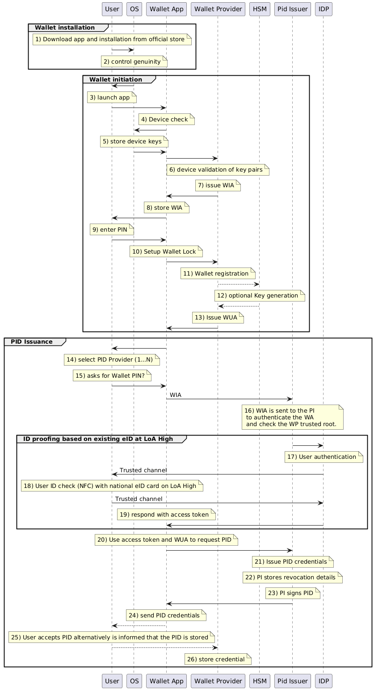

# How the Wallet Interacts with Services

## Our Shared Design Principles
Modularity, standardization, versioning.

## High-Level Flows
- Credential issuance
- Presentation & verification
- Revocation and status checking

### General PID issuing process
This chapter describes the general PID issuing process in a sequence diagram.
 
<!--TODO - how do we make texts like this look nice?-->
<strong>Description</strong>
1) The user installs the app from a trusted and official app store
2) During installation, the OS checks the integrity of the app by comparing hash and signature of the app to the one provided by the store
3) The user launches the app (opens it)
4) Do device check to prove that the device environment is secure and untampered and collect evidence. 
5) Generate and store hardware protected device keys (possession factor).
6) Validate device integrity evidence in order to issue Wallet Instance Attestation. 
7) After the app genuinity and device security has been validated, the Wallet Instance attestation is sent to the Wallet App by the Wallet provider. It is a short-lived token attestation that proves that the Wallet App is genuine and the Wallet Provider is trusted.
8) The WIA is stored in the app. 
9) The user is prompted to enter a PIN (knowledge factor).
10) The Wallet app sets up a secure user private key storage (f.ex.in a HSM or locally). 
11) Wallet registration means that a user profile is created at the Wallet provider, linked to the device, user and wallet instance. 
12) Optional: In some processes, a user protected signing key is generated in a HSM and a reference is associated with the user-profile. 
13) With the assurance of hardware protected keys and user control over a device and Wallet App, the Wallet Provider generates the Wallet Unit Attestation (WUA). The WUA is a key-attestation and proof that the users keys for a certain Wallet App are managed securely. 
14) User is prompted to choose a PID Provider
15) User unlocks the secure storage with the PIN in order to be able to use the WUA and WIA. 
16) WIA is sent to the PID Issuer to authenticate the WA and check the Wallet Provider trusted root.
17) The user is authenticated. How authentication works depends on the PID issuer and methods used. 
18) The user is prompted to prove his/hers identity by using the national eID card on LoA High. The card is usually read by NFC.
19) The data is sent to the IDP and the IDP answers with an access token to the Wallet Adapter. 
20) The Wallet App sends the access token and WUA to the PID Issuer
21) PID Issuer verifies access token and validates WUA. PID Issuer obtains data for PID (f.ex. in trusted channel from IDP)
22) PID Issuer stores revocation details inside the PID attestation and its own register and reserves an index (if status lists are used).
23) PID Issuer seals the PID
24) PID Issuer sends PID to Wallet App via OpenID4VCI
25) Optional: User accepts the PID in the Wallet App
26) In some cases the PID can be stored server-side (Wallet Provider)

PlantUML macro [here](04-files/plantuml_export.puml).

### Examples for Wallet and PID Lifecycle in Germany
This chapter shows examples from the German EUDI Wallet in sequence diagrams for

1) [Wallet Activation](https://gitlab.opencode.de/bmi/eudi-wallet/wallet-development-documentation-public/-/blob/main/doc/architecture-concept/flows/00-wallet-activation.md)
2) [Wallet Registration](https://gitlab.opencode.de/bmi/eudi-wallet/wallet-development-documentation-public/-/blob/main/doc/architecture-concept/flows/01-wallet-registration.md)
3) [PID Issuance](https://gitlab.opencode.de/bmi/eudi-wallet/wallet-development-documentation-public/-/blob/main/doc/architecture-concept/flows/21-pid-issuance.md)

There are more diagrams on [Wallet Development Documentation](https://gitlab.opencode.de/bmi/eudi-wallet/wallet-development-documentation-public/-/blob/main/doc/architecture-concept/04-data-flows.md?ref_type=heads)
##  The Technical Languages We Use 
List of integration points that will be formalized in Conformance Specifications.

## Interaction Pattern: Attestation Issuance
To be authored by Group 6 (QTSP) and Group 7 (Wallets). Focuses on how use cases get data into the wallet (e.g., PID or QEAA) using protocols like OpenID4VCI (but no need to mention that part, stuff like that should be mainly in CS). 

## Interaction Pattern: Attestation Presentation (Receiving) 
To be authored by Architecture and Wallets. This is the "Receiving" flow for Relying Parties, detailing how they request and receive verified attributes under the user's sole control using OpenID4VP. 

## Signature and Seal Integration 
To be authored by Group 6 (QTSP). Explains the technical flows for wallet-centric and QTSP-centric (remote) signing/sealing, allowing individuals to sign on behalf of a company with full legal effect

## Secure communication channel
To be authored by the QTSP group in consultation with the Architecture and Wallets groups. Explains the technical flows for usage of the qualified electronic registered delivery service (QERDS).
