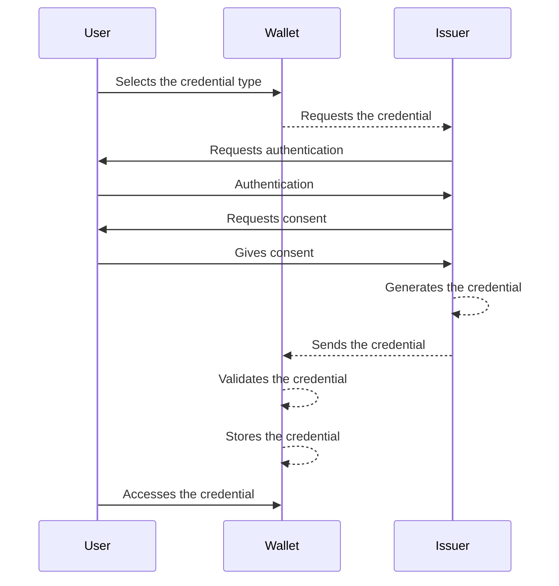
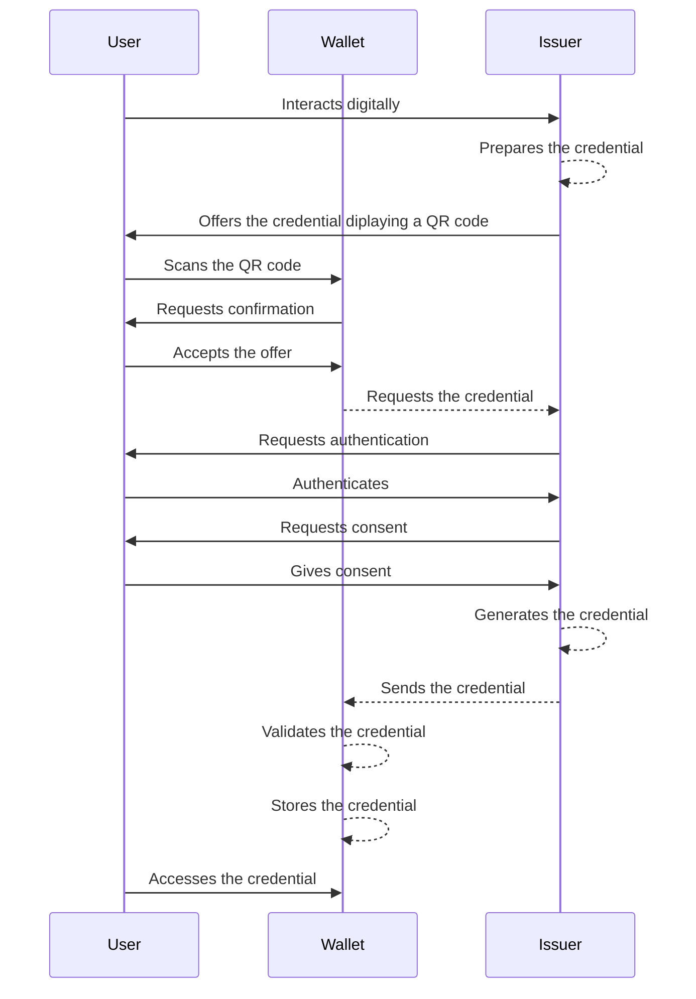

# How the Wallet Interacts with Services
Todo:
 - EBW: the issuing we do
 - This chapter describes the general **WE BUILD PID/EBWOID issuing process** in a sequence diagram.
 - Mention ETSI standardization: ETSI TS 119 472-3 for (Q)EAA and PID issuance. ETSI TS 119 476-3 will standardize WUA and WIA.
 - Design principle text: Modularity, standardization, versioning.
 - High-Level Flows - Revocation and status checking
 - PID issuing
 - The Technical Languages We Use: List of integration points that will be formalized in Conformance Specifications.
 - Signature and Seal Integration: To be authored by Group 6 (QTSP). Explains the technical flows for wallet-centric and QTSP-centric (remote) signing/sealing, allowing individuals to sign on behalf of a company with full legal effect
 - Secure communication channel: To be authored by the QTSP group in consultation with the Architecture and Wallets groups. Explains the technical flows for usage of the qualified electronic registered delivery service (QERDS).

##  The Technical Languages We Use 
List of integration points that will be formalized in Conformance Specifications.

## Interaction Pattern: Attestation Issuance
To be authored by Group 6 (QTSP) and Group 7 (Wallets). Focuses on how use cases get data into the wallet (e.g., PID or QEAA) using protocols like OpenID4VCI (but no need to mention that part, stuff like that should be mainly in CS). 

The [WE BUILD Consortium Conformance Specification (CS)](https://github.com/webuild-consortium/wp4-architecture/blob/blueprint/updates-jan/conformance-specs/cs-01-credential-issuance.md) for high-assurance credential issuance defines the requirements that will be applied within the WE BUILD project to ensure that Wallet Units and Credential Issuers across the WE BUILD ecosystem interoperate reliably and consistently when issuing verifiable digital credentials, with strong security guarantees and privacy protections.

The WE BUILD ecosystem mainly supports two credential issuance models, which differ in which actor inititates the process: wallet-initiated issuance and issuer-initiated-issuance In both cases, if the credential cannot be issued immediately, a deferred issuance mechanism is applied. In such case, the wallet will automatically make periodic retries until the credential is successfully issued or until it receives an unrecoverable error.

### Wallet-initiated issuance

This issuance flow is initiated by the wallet user:

1. The user opens their wallet and selects the credential type to be issued (for example, a PID or a QEAA).
2. The wallet connects with the corresponding issuer and requests the credential.
3. The wallet user authenticates with the issuer, following the procedure specified by the issuer itself.
4. The issuer requests the user's consent from the user to issue the credential and send it to their wallet.
5. The issuer generates the credential and delivers it to the wallet.
6. The wallet verifies the authenticity of the credential and stores it. From this point, the wallet user becomes responsible for managing the issued credential.

### Issuer-initiated issuance

This issuance flow is initiated by the issuer:

1. The user interacts with the issuer (for example, during a digital onboarding process).
2. The issuer prepares one or more credentials.
3. The issuer offers these credentials to the wallet user. This can be done in several ways, both same-device and cross-device:
- By displaying a QR code that the user shall scan with their wallet.
- By sending a link to the wallet.
4. The wallet displays the offer and requess confirmation from the user.
5. The wallet user authenticates with the issuer, following the procedure specified by the issuer itself.
6. The issuer requests the user's consent from the user to issue the credential and send it to their wallet.
7. The issuer generates the credential and delivers it to the wallet.
8. The wallet verifies the authenticity of the credential and stores it. From this point, the wallet user becomes responsible for managing the issued credential.

## Interaction Pattern: Attestation Presentation (Receiving) 

The [WE BUILD Conformance Specification for Credential Presentation](https://github.com/webuild-consortium/wp4-architecture/blob/blueprint/updates-jan/conformance-specs/cs-02-credential-presentation.md) describes how Wallet Units (WU) and Verifiers interoperate within the WE BUILD ecosystem. It covers presentation (request and response flows), interfaces between wallets and verifiers as well as security, privacy and interoperability requirements and same‑device and cross‑device invocation patterns

## Signature and Seal Integration
In WE BUILD, signature and seal integration will combine wallet-centric signing with QTSP-centric (remote) signing/sealing. The architecture distinguishes where the private key and the signature/seal creation device will reside and how documents will be presented and processed within the Signature Creation Application (SCA). This enables the wallet to orchestrate the user experience while remote signing and sealing operations remain anchored in QTSP-governed environments and follow standards-aligned processes intended to support qualified signatures and seals in certified deployments.

As permitted by the ARF, qualified signing and sealing can be implemented using a local signature or seal creation device controlled by the wallet. It can also be implemented using a remote signature or seal creation device operated by a QTSP. During the pilot phase, not every wallet provider and QTSP will implement every model. For interoperability, WE BUILD therefore treats remote signing and sealing through a QTSP-managed service with standardized interfaces as the common baseline. This section is aligned with the publicly documented WP4 interoperability baselines for issuance and presentation and with the current pilot scoping towards remote transaction flows, while proximity is out of scope in the baseline protocol direction.

### Wallet-centric signing model
In the wallet-centric model, the EUDI Wallet is the central component of the electronic signature process. Three distinct signing processes are considered, depending on where the SCA runs and where signature creation takes place. In the remote cases, the private key and SCD/QSCD will be remote (QTSP-governed), while in local cases, they will be under the user’s control (e.g., on-device or locally accessible token).

During the pilot, the remote options below are expected to be the primary interoperability path. Some wallet implementations may also support local signing, but local signing is not assumed as a uniform baseline across all scenarios.

#### 1) Remote signing with external SCA  
The user will initiate signing in the wallet, but the SCA is external. The document (or a derived signature request) will be transmitted to the external SCA, where the content is displayed for review. The external SCA captures the user’s approval and then triggers the signing operation. The document/signature request will be forwarded to a remote signature creation device, which creates the signature and returns the result to the calling flow.

#### 2) Remote signing with local SCA (wallet as SCA)  
The user will initiate signing in the wallet and the wallet acts as the SCA. The document is displayed in the wallet so review and explicit consent take place inside the wallet experience. After consent, the wallet will submit the document/signature request to a remote signature creation device for signature creation. The result will be returned to the wallet for delivery to the relying party as part of the business transaction.

#### 3) Local signing  
The wallet will initiate signing and the full SCA experience remains on-device. The document is displayed in the wallet and the user provides explicit consent there. Signature creation is performed locally using a signature creation device integrated into the user’s smartphone, without invoking a remote signature creation device.

### QTSP-centric signing and sealing model
In the QTSP-centric model, the trust service provider remains the central authority responsible for execution and governance of the signing or sealing process. The cryptographic key material used for signature or seal creation will be generated, stored, and operated within infrastructure controlled by or on behalf of the QTSP, typically within secure hardware environments. From the perspective of the user or calling application, signing and sealing are remote: external components interact with the trust service through defined service interfaces, while the cryptographic operation is performed within the QTSP-controlled environment.

Within this architecture, the EUDI Wallet may act as the client-side orchestration component, primarily for user authentication, collecting user intent, and triggering a signing operation. However, it does not operate the signature creation environment, does not manage signing credentials, and does not assume the regulatory obligations of a trust service provider.

From a regulatory perspective, established trust boundaries are preserved. The QTSP remains responsible for identity binding, credential issuance, and compliance with applicable ETSI standards. Signature or seal creation data remains under controlled conditions consistent with the required assurance level. Activation mechanisms enforce the conditions required for advanced or qualified signatures, including sole control where applicable.

In the pilot and testbed environment, eIDAS-qualified status cannot be achieved because the testbed operates outside the formal eIDAS certification and trust framework. Any reference to “qualified” in WE BUILD is therefore a technical demonstration concept only and does not represent a legally binding qualified electronic signature. The prerequisites for eIDAS-qualified status remain unchanged, including use of a qualified signature creation device and a qualified certificate issued by a QTSP that is listed on an official national Trusted List.

The pilot implementation aims to be technically aligned with qualified signing requirements. Pilot trust validation is described below and relies on consortium trusted lists referenced in ADRs and based on ETSI TS 119 612.

### CSC interoperability profile for remote signing/sealing
In line with Section 2.1.1 (Standardization and Technical Specifications), for all remote signing and sealing flows, CSC interoperability will be implemented using CSC API 2.2.0.0, CSC data model (DM) 1.0.0, and CSC data-model-bindings 1.0.0. This interoperability profile will expose remote signing/sealing via a standardized interface, while the underlying trust model and QTSP responsibilities remain unchanged.

The detailed WE BUILD CSC profile is expected to be specified in a WE BUILD Conformance Specification (WBCS/CS). It will define the authorization mode, the endpoints that are used, SAD handling, supported formats and algorithms, error handling, and ITB constraints. Until this WE BUILD CSC profile is published, CSC v2.2.0.0 is the authoritative base specification for CSC behaviour.

Pilot trust validation uses reference trusted lists and mock registrars. In the pilot, the SCA and/or verifier components it relies on (whether they run in the wallet or externally) validate participating QTSPs and trust anchors against consortium reference trust mechanisms such as consortium trusted lists aligned with ETSI TS 119 612, as recorded in WE BUILD ADRs. The reference trusted list may include participating QTSP entries and their registered issuing certificate authorities for pilot purposes. When a signature creation request is initiated, the SCA validates the signer’s certificate chain to an issuing CA registered in the WE BUILD trusted list. It then checks the QTSP status in the pilot trust framework, with the understanding that any “qualified” status is simulated and has no legal effect. The SCA validates revocation status using pilot OCSP responders or CRL distribution points operated by participating QTSPs. Where required, the SCA also validates additional attributes and roles through relevant attestations, such as organisational affiliation or professional credentials. Where registration status checks are needed, registrar processes are simulated through mock registrar services and endpoints.

### Organisational signing: individuals signing on behalf of a company
To support individuals signing on behalf of a company, the planned approach will reuse the wallet-centric and QTSP-centric models above. The wallet remains the user-facing control point for review and approval, while the QTSP will execute the signing/sealing operation within its controlled environment. The relying party workflow will verify, bind, and validate the transaction and the resulting signature/seal according to its policy and evidence model. WE BUILD will pilot this organisational signing pattern while preserving the QTSP trust boundary and reusing the same CSC-based interoperability profile for remote QSCD usage.

WE BUILD organisational signing builds on the EBWOID concept as the cross-border minimum organisation identifier. Additional organisation attributes can be provided through additional attestations when needed. At signing time, the natural person context from the PID and the organisation context from the EBWOID must be cryptographically bound to the transaction. This requires including the identifiers, or unambiguous references to them, in the transaction data that is shown to the user and then signed or authorized. This can be achieved through ARF transactional data in remote presentation flows and through CSC hash-based signing where the SAD is bound to the same content. The exact representation is use-case specific. It should define the fields, canonicalization rules, and what is displayed versus what is hashed and signed. These choices should be profiled in rulebooks and in a WBCS/CS to ensure interoperability in the ITB.

## Secure communication channel
In WE BUILD, the secure communication channel will be implemented through Qualified Electronic Registered Delivery Services (QERDS) operated by QTSPs. The core idea will be that whenever a message will need legal-grade delivery assurance (who sent what, to whom, and when it was received), it will be routed through QERDS so that delivery will be registered and can later be proven to a relying party. The QERDS providers also ensure mutual authentication, end-to-end integrity and confidentiality, and interoperability across access points. This “registered delivery” pattern will be positioned as an enabler for interactions between and across public sector bodies and economic operators.

Whereas the QERDS and the EU Digital Directory designated for the production European Business Wallet are not yet ready, WE BUILD designates the pre-production QERDS specified by WP4 for use in WE BUILD business wallets.

### From “registered delivery” to “digital identity wallets”
As a baseline a classic B2G/B2B situation will be used: an authority will notify an economic operator, the economic operator will respond, and the relying party will require evidence. With QERDS, both sides will use their QERDS providers to register sending and receiving, so that delivery will not be just transport, but will be a process that will produce trustworthy evidence.

WE BUILD will take the next step: wallets will become the user-facing endpoints (“wallet-centric delivery”). The sender wallet and recipient wallet will remain the places where users will read, will approve, and will manage messages, or where they will configure connections to backend systems to perform these actions. QERDS providers will form the delivery layer underneath, handling routing, inter-provider exchange, and evidence creation, while wallets will provide identity/authentication and user control.

### Technical flow (WE BUILD high-level)
WE BUILD will follow the QERDS architecture decomposition and the 4-corner delivery pattern:
1) Sender identification and authentication will be performed at the sender’s QTSP (wallet-driven).
2) Message submission will be performed from the sender’s wallet or connected backend system to the sender QERDS (QTSP A).
3) Discovery of the recipient’s QERDS endpoint and capabilities will be performed via common services (e.g., the WE BUILD Digital Directory, simulating the EU Digital Directory from the European Business Wallet proposal).
4) Handshake and relay will be performed between QTSP A and QTSP B (QERDS-to-QERDS interoperability) and will be based on ETSI EN 319 522.
5) Recipient notification will be issued, followed by recipient authentication being performed at QTSP B.
6) Consignment and handover of the message and its metadata will be performed to the recipient’s wallet or connected backend system.
7) Evidence will be made accessible to sender and recipient wallets (submission/dispatch and receipt/consignment or non-delivery). Evidence will be protected by qualified sealing and, where required, qualified timestamping. Where applicable, the evidence can be pushed to the sender’s and the recipient’s backend systems as well.
