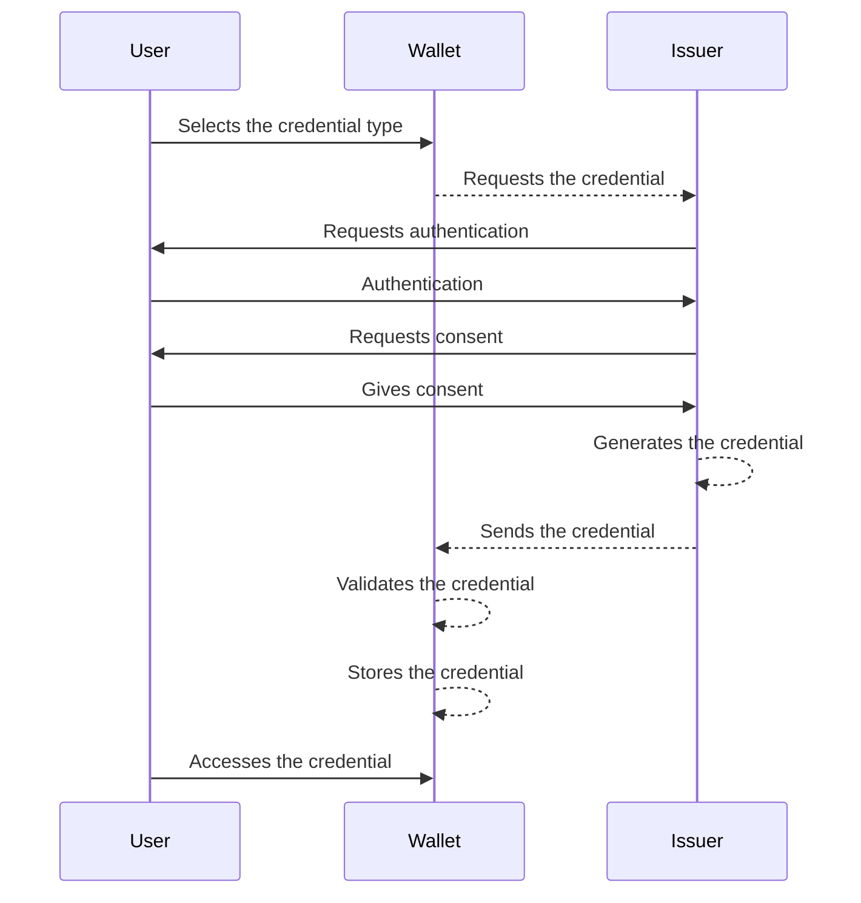
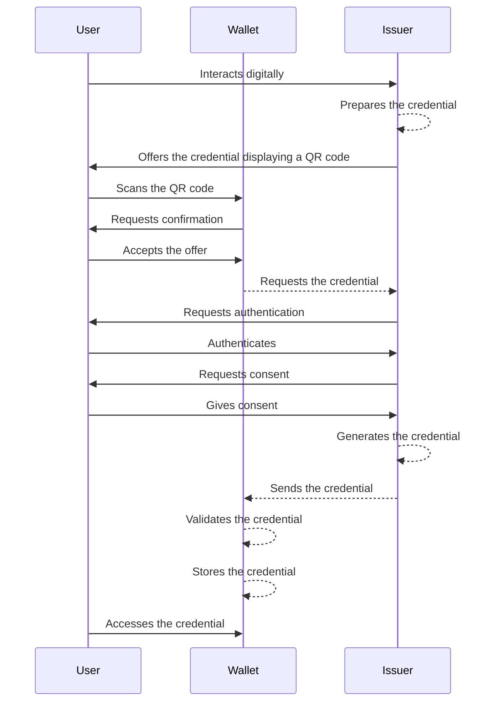
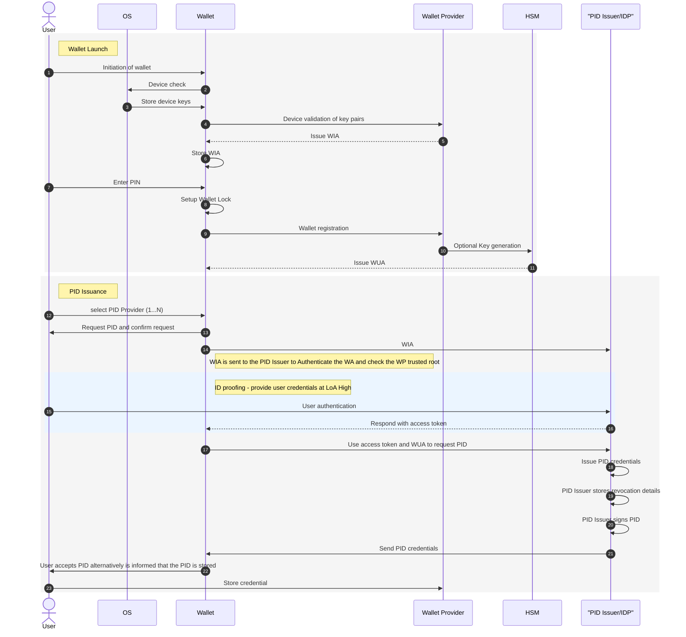
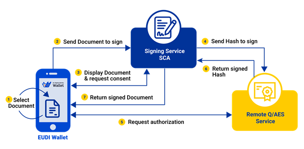
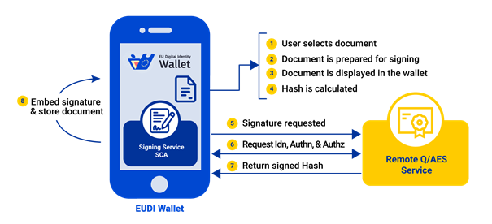
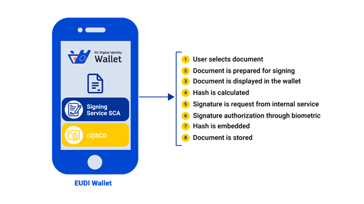

# How the Wallet Interacts with Services
Chapter 3 introduced the main actors in the WE BUILD ecosystem. This chapter describes how these actors interact through wallet-based service flows.

## Interaction Pattern: Attestation Issuance

The [WBCS](https://github.com/webuild-consortium/wp4-architecture/blob/blueprint/updates-jan/conformance-specs/cs-01-credential-issuance.md) for high-assurance credential issuance defines the requirements used in the project to ensure interoperable issuance of verifiable digital credentials between wallets and issuers. For reference on qualified electronic attestation of attributes, see the [QEAA documentation](#qeaa-documentation).

The WE BUILD ecosystem mainly supports two credential issuance models, which differ in which actor initiates the process: wallet-initiated issuance and issuer-initiated issuance. If the credential cannot be issued immediately, deferred issuance is used. The wallet retries periodically until the credential is issued or an unrecoverable error occurs.

### Wallet-initiated Issuance

This issuance flow is initiated by the user:

1. The user opens their wallet and selects the credential type to be issued (for example, a PID or a QEAA).
2. The wallet connects with the corresponding issuer and requests the credential.
3. The user authenticates with the issuer, following the procedure specified by the issuer itself.
4. The issuer requests the user's consent to issue the credential and send it to their wallet.
5. The issuer generates the credential and delivers it to the wallet.
6. The wallet verifies the authenticity of the credential and stores it. From this point, the user becomes responsible for managing the issued credential.

```mermaid
sequenceDiagram
participant User
participant Wallet
participant Issuer

User->>Wallet: Selects the credential type
Wallet-->>Issuer: Requests the credential
Issuer->>User: Requests authentication
User->>Issuer: Authentication
Issuer->>User: Requests consent
User->>Issuer: Gives consent
Issuer-->>Issuer: Generates the credential
Issuer-->>Wallet: Sends the credential
Wallet-->>Wallet: Validates the credential
Wallet-->>Wallet: Stores the credential 
User->>Wallet: Accesses the credential
```

### Issuer-initiated Issuance

This issuance flow is initiated by the issuer:

1. The user interacts with the issuer (for example, during a digital onboarding process).
2. The issuer prepares one or more credentials.
3. The issuer offers these credentials to the user. This can be done in several ways, both same-device and cross-device:
- By displaying a QR code that the user shall scan with their wallet.
- By sending a link to the wallet.
4. The wallet displays the offer and requests confirmation from the user.
5. The user authenticates with the issuer, following the procedure specified by the issuer itself.
6. The issuer requests the user's consent to issue the credential and send it to their wallet.
7. The issuer generates the credential and delivers it to the wallet.
8. The wallet verifies the authenticity of the credential and stores it. From this point, the user becomes responsible for managing the issued credential.

```mermaid
sequenceDiagram
participant User
participant Wallet
participant Issuer

User->>Issuer: Interacts digitally
Issuer-->>Issuer: Prepares the credential
Issuer->>User: Offers the credential displaying a QR code
User->>Wallet: Scans the QR code
Wallet->>User: Requests confirmation
User->>Wallet: Accepts the offer
Wallet-->>Issuer: Requests the credential
Issuer->>User: Requests authentication
User->>Issuer: Authenticates
Issuer->>User: Requests consent
User->>Issuer: Gives consent
Issuer-->>Issuer: Generates the credential
Issuer-->>Wallet: Sends the credential
Wallet-->>Wallet: Validates the credential
Wallet-->>Wallet: Stores the credential
User->>Wallet: Accesses the credential
```
### PID Issuing Process
The following sequence diagram illustrates a generic transactions for Personal Identity Data (PID) issuance during the initial onboarding process.

The sequence diagram applies specifically to solutions involving mobile-based wallets (including hybrid cloud or on-prem models). The interaction sequence may therefore not fully align with the architectural constraints or interaction patterns of an entirely web-based wallet environment.

It illustrates the 'Happy Path' for PID issuance. For the sake of readability, exception handling and error states are not depicted.

This diagram shows a wallet-initiated flow; however, the interactions could alternatively be triggered by the PID Provider/Issuer. Regardless of the starting point, the transactions should remain largely the same, though the sequence in which they occur may differ. The decision to model the diagram starting within the wallet reflects the impressions of the current implementation landscape. Based on demonstrations and published documentation, many member states and service providers seem to favor a user-initiated onboarding journeys starting within their mobile wallet application.

```mermaid
sequenceDiagram
    autonumber
    actor User as User
    participant OS as OS
    participant Wallet as Wallet
    participant WalletProvider as Wallet Provider
    participant HSM as HSM
    participant PIDIssuer as "PID Issuer/IDP"

rect rgb(245,245,245)
  Note right of User: Wallet Launch
    User->>Wallet: Initiation of wallet
    Wallet->>OS: Device check
    OS->>Wallet: Store device keys
    Wallet->>WalletProvider: Device validation of key pairs
    WalletProvider-->>Wallet: Issue WIA
    Wallet->>Wallet: Store WIA
    User->>Wallet: Enter PIN
    Wallet->>Wallet: Setup Wallet Lock
    Wallet->>WalletProvider: Wallet registration
    WalletProvider->>HSM: Optional Key generation
    HSM-->>Wallet: Issue WUA
end

rect rgb(245,245,245)
    Note right of User: PID Issuance
    User->>Wallet: select PID Provider (1...N)
    Wallet->>User: Request PID and confirm request
    Wallet->>PIDIssuer: WIA
    Note right of Wallet: WIA is sent to the PID Issuer to Authenticate the WA and check the WP trusted root

    rect rgb(235,245,255)
        Note right of Wallet: ID proofing - provide user credentials at LoA High
        User->>PIDIssuer: User authentication
        PIDIssuer-->>Wallet: Respond with access token
    end

    Wallet->>PIDIssuer: Use access token and WUA to request PID
    PIDIssuer->>PIDIssuer: Issue PID credentials
    PIDIssuer->>PIDIssuer: PID Issuer stores revocation details
    PIDIssuer->>PIDIssuer: PID Issuer signs PID
    PIDIssuer->>Wallet: Send PID credentials
    Wallet->>User: User accepts PID alternatively is informed that the PID is stored
    User->>WalletProvider: Store credential
end
```
**Description of PID Issuing Process steps**
1. The user launches the Wallet
2. Do device check to prove that the device environment is secure and untampered and collect evidence. 
3. Generate and store hardware protected device keys (possession factor).
4. Validate device integrity evidence in order to issue Wallet Instance Attestation (WIA). 
5. The Wallet Instance attestation is sent to the Wallet by the Wallet provider. It is a short-lived token attestation that proves that the Wallet is genuine and the Wallet Provider is trusted.
6. The WIA is stored in the Wallet.
7. The user is prompted to enter a Walet PIN (knowledge factor).
8. The Wallet sets up a secure user private key storage (f.ex.in a HSM or locally). 
9. A user profile is created at the Wallet provider, linked to the device, user and wallet instance.
10. Optional: In some processes, a user protected signing key is generated in a HSM and a reference is associated with the user-profile.
11. With the assurance of hardware protected keys and user control over a device and Wallet, the Wallet Provider generates the Wallet Unit Attestation (WUA). The WUA is a key-attestation and proof that the users keys for a certain Wallet are managed securely. 
12. User is prompted to choose a PID Provider.
13. User unlocks the secure storage with the PIN in order to be able to use the WUA and WIA. 
14. WIA is sent to the PID Issuer to authenticate the wallet attestation and check the Wallet Provider trusted root.
15. The user is authenticated. How authentication works depends on the PID issuer and methods used.
16. Optional: The PID Issuer response the authentication with the access token.
17. The Wallet sends the access token and WUA to the PID Issuer
18. PID Issuer verifies access token and validates WUA. PID Issuer obtains data for PID (f.ex. in trusted channel from IDP)
19. PID Issuer stores revocation details inside the PID attestation and its own register and reserves an index (if status lists are used).
20. PID Issuer signs the PID
21. PID Issuer sends PID credentials to the Wallet
22. User accepts the PID in the Wallet
23. In some cases the PID can be stored server-side (Wallet Provider)

## Interaction Pattern: Attestation Presentation (Receiving) 

In this pattern, a verifier requests specific attestations from the wallet. The wallet presents the requested information, typically using selective disclosure mechanisms, and the verifier validates the received data.

The [WE BUILD Conformance Specification for Credential Presentation](https://github.com/webuild-consortium/wp4-architecture/blob/blueprint/updates-jan/conformance-specs/cs-02-credential-presentation.md) describes how wallets and relying parties interoperate within the WE BUILD ecosystem. It covers presentation (request and response flows), interfaces between wallets and relying parties as well as security, privacy and interoperability requirements and same‑device and cross‑device invocation patterns.

## Signature and Seal Integration

Wallets in WE BUILD provide the ability to create qualified electronic signatures and seals. This section describes the various integration models. For reference, see the [QES documentation](#qes-documentation).

WE BUILD supports both wallet-centric and QTSP-operated approaches for electronic signatures and seals. In both models, the wallet provides the user interaction layer, while cryptographic operations may take place either locally or in remote infrastructure operated by a QTSP.

Both approaches are compatible with the architectural patterns described in the ARF. However, during the WE BUILD pilot phase not every wallet provider or QTSP is expected to implement every possible model. For interoperability across the consortium, WE BUILD therefore treats remote signing and sealing through QTSP-managed services with standardised interfaces as the common baseline. Local signing models may still be supported by individual wallet implementations, but they are not assumed as a uniform baseline for interoperability within the project.

This section aligns with the WP4 interoperability baselines defined for issuance and presentation flows. Proximity-based signing scenarios are currently outside the baseline protocol scope of the WE BUILD pilots.

In the WE BUILD pilot and ITB environment, eIDAS-qualified status cannot be achieved because the ITB operates outside the formal eIDAS certification framework. Any reference to “qualified” in WE BUILD therefore represents a technical demonstration only and does not constitute a legally valid qualified electronic signature. The prerequisites for eIDAS-qualified status remain unchanged, including use of a Qualified Signature Creation Device (QSCD) and a qualified certificate issued by a QTSP that is listed on an official national Trusted List.

### Wallet-centric Signing Model
In the wallet-centric model, the EUDI Wallet is the central component of the electronic signature process. Three distinct signing processes are considered, depending on where the Signature Creation Application (SCA) runs and where the Signature Creation Device (SCD) is hosted. 

#### 1) Remote Signing with External SCA  
The user initiates signing from the wallet, while the SCA is external. The document is sent to the external SCA for review and consent, after which the signing request is forwarded to a remote SCD that creates the signature and returns the result.

#### Remote Signing with Local SCA (Wallet as SCA)
The user initiates signing from the wallet, which also acts as the SCA. The document is presented to the user within the wallet for review and consent. After approval, the wallet forwards the signing request to a remote SCD that produces the signature and returns the result.

#### 3) Local Signing  
The user initiates signing from the wallet, which also acts as the SCA. The document is presented to the user within the wallet for review and consent. After approval, the signature is created locally using a SCD integrated in the user’s device.

### QTSP-centric Signing and Sealing Model
In the QTSP-centric model, the trust service provider operates the signing or sealing process. The cryptographic key material used for signature or seal creation is generated, stored, and used within infrastructure controlled by or on behalf of the QTSP, typically in secure hardware environments. From the perspective of the user, signing and sealing are therefore remote operations. External components interact with the trust service through defined interfaces, while the cryptographic operation itself is performed within the QTSP-controlled environment.

Within this architecture, the EUDI Wallet may act as a client-side orchestration component. It can authenticate the user, capture user intent, and trigger a signing operation. However, it does not operate the signature creation environment, does not manage signing credentials, and does not assume the responsibilities of a trust service provider.

In this model, the QTSP remains responsible for identity binding, credential issuance, and compliance with applicable ETSI standards. Signature or seal creation data remains under controlled conditions consistent with the required assurance level, and activation mechanisms enforce the conditions required for advanced or qualified signatures, including sole control where applicable.

The pilot implementation aims to remain technically aligned with qualified signing requirements. Pilot trust validation is described below and relies on consortium trusted lists.

### CSC Interoperability Profile for Remote Signing and Sealing
For remote signing and sealing flows, WE BUILD uses the Cloud Signature Consortium (CSC) interoperability framework. CSC APIs expose standardised interfaces that allow wallets and client applications to interact with QTSP-operated signing services.
The detailed WE BUILD CSC interoperability profile will be defined in a WBCS. That specification will describe the concrete integration details, including authorisation mechanisms, endpoints, supported formats and algorithms, and interoperability constraints used in the ITB. Until such a profile is published, CSC API v2.2.0.0 serves as the base reference specification for CSC-based interactions.

During the pilot phase, trust validation relies on consortium reference trust mechanisms. Wallet components or external SCAs validate participating QTSPs and trust anchors using WE BUILD trusted lists. The reference trusted list may include participating QTSP entries and their registered issuing certificate authorities for pilot purposes.

When a signing request is processed, the SCA validates the signer’s certificate chain against issuing certificate authorities listed in the WE BUILD trusted list and checks the QTSP status within the pilot trust framework. Revocation status is validated using OCSP responders or CRL distribution points operated by participating QTSPs. Where registration status checks are required, registrar processes are simulated through mock registrar services and endpoints.

### Organisational Signing: Individuals Signing on Behalf of a Company
WE BUILD supports signing scenarios where an individual signs on behalf of an organisation. This model reuses the wallet-centric and QTSP-operated signing approaches described above. The wallet provides the user interface for document review and approval, while the QTSP performs the signature or seal creation within its controlled environment. 

In these scenarios, the transaction must bind both the natural person and the organisation represented. The natural person identity is represented by the PID, while the organisation context is represented through the EBWOID, which acts as the cross-border minimum organisation identifier.

At signing time, identifiers or references to both the PID and the EBWOID are included in the transaction data presented to the user and subsequently authorised or signed. This ensures that the resulting signature or seal can be unambiguously linked to both the individual and the organisation.

The exact representation of these bindings is use-case specific and will be defined in rulebooks and WBCS (see Chapter 5 for the semantic and schema model).

## Secure Communication Channel
This section describes how secure message exchange is integrated into the WE BUILD wallet ecosystem.

In WE BUILD, the secure communication channel is implemented through Qualified Electronic Registered Delivery Services (QERDS) operated by QTSPs. Whenever legal-grade delivery assurance is required, messages are routed through QERDS. QERDS providers ensure mutual authentication, end-to-end integrity and confidentiality, and interoperability across access points. This “registered delivery” pattern is positioned as an enabler for interactions between and across public sector bodies and economic operators.

Because the QERDS and the EU Digital Directory designated for the production European Business Wallet are not yet available, WE BUILD designates the pre-production QERDS specified by WP4 for use in WE BUILD business wallets.
For reference, see the [QERDS documentation](#qerds-documentation).

### From “Registered Delivery” to “Digital Identity Wallets”
As a baseline, a classic B2G/B2B situation is used: an authority notifies an economic operator, the economic operator responds, and the relying party requires evidence. With QERDS, both sides use their QERDS providers to register sending and receiving, so that delivery is not just transport, but is a process that produces trustworthy evidence.

In this model, WE BUILD takes the next step: wallets become the user-facing endpoints (“wallet-centric delivery”). The sender wallet and recipient wallet remain the places where users read, approve, and manage messages, or where they configure connections to backend systems to perform these actions. QERDS providers form the delivery layer underneath, handling routing, inter-provider exchange, and evidence creation, while wallets provide identity/authentication and user control.

### Technical Flow (WE BUILD High-Level)
WE BUILD follows the QERDS architecture decomposition and the four-corner delivery pattern:

1. Sender identification and authentication is performed at the sender’s QTSP (wallet-driven).
2. Message submission is performed from the sender’s wallet or connected backend system to the sender QERDS (QTSP A).
3. Discovery of the recipient’s QERDS endpoint and capabilities is performed via common services (e.g., the WE BUILD Digital Directory, simulating the EU Digital Directory from the EBW proposal).
4. Handshake and relay is performed between QTSP A and QTSP B (QERDS-to-QERDS interoperability).
5. Recipient notification is issued, followed by recipient authentication at QTSP B.
6. Consignment and handover of the message and its metadata is performed to the recipient’s wallet or connected backend system.
7. Evidence is made available to sender and recipient wallets (submission/dispatch and receipt/consignment or non-delivery). Evidence is protected by qualified sealing and, where required, qualified timestamping. Where applicable, the evidence can be pushed to the sender’s and the recipient’s backend systems as well.

## Enterprise and System-to-System Wallet Interactions
Some WE BUILD scenarios involve interactions between backend systems rather than direct end-user actions. In these cases, wallet functionality may be integrated into enterprise platforms, APIs, or automated services.

This is particularly relevant for EBW scenarios such as supply chain credentials, Digital Product Passports, and automated B2B or B2G data exchange. In such cases, credential issuance and presentation may be initiated by backend systems while still following the interoperability patterns defined in this blueprint.

Although the interaction is system-driven, the same trust framework, credential formats, and verification mechanisms apply as in user-driven wallet interactions.
