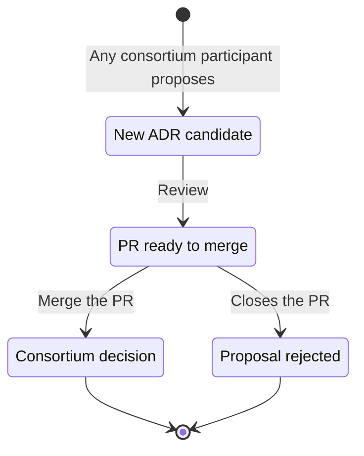
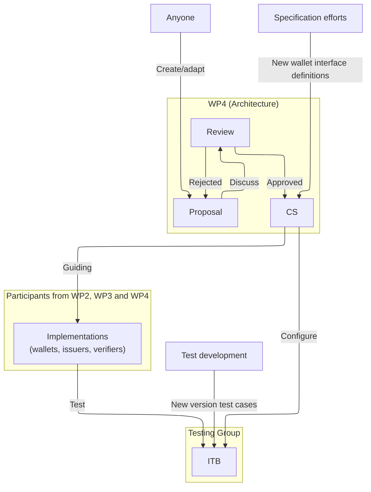

# ADR & Conformance Governance Model
<!-- Information mainly from "ADR and CS aligment.pdf" in the portal and texts in repo -->
In a project as large as WE BUILD, we face a constant challenge: how do we ensure that a wallet built by one organization can actually "talk" to a service in another without every developer having to attend every single meeting?
To stay synchronized, we use a technical governance model that relies on consensus, commitment, and clear documentation. We don not make technical choices in a vacuum; we base them on what the 13 use cases actually need to function.

## The Architectureal Decision Record (ADR)
[The Architectural Decision Record (ADR)](https://github.com/webuild-consortium/wp4-architecture/tree/main/adr) is essentially our project’s "logbook" for major decisions.
- Purpose: The ADR process is where we formally capture and justify significant technical choices - like which specific protocols and formats to use. Instead of having these decisions buried in a slide deck or a long email chain, we document the rationale and context so that everyone can understand the "Why" behind a choice.
- Classification: We maintain a lightweight ADR for any software-related decision that affects how different systems work together (interoperability). This ensures we stay aligned with external rules like the eIDAS Regulation and the EUDI Architecture Reference Framework (ARF).
- Lifecycle: ADRs are managed on GitHub ([webuild-consortium/wp4-architecture](https://github.com/webuild-consortium/wp4-architecture/)). They move from a "Proposed" state to "Accepted" once the Architecture Group and relevant stakeholders reach a consensus.

## WE BUILD Conformance Specifications (WBCS)
If the ADR is the "Why," the [WE BUILD Conformance Specifications (WBCS)](https://github.com/webuild-consortium/wp4-architecture/tree/main/conformance-specs) are the "How".
- Operationalizing Intent: We use the WBCS to turn high-level architectural goals into detailed technical rules. These specifications define the exact interfaces for wallets, issuers, and verifiers.
- A Commitment to Implement: This is the most important part: An approved WBCS is **not just a suggestion**. When a specification is approved, it signifies a commitment from the participating organizations to actually build that interface into their services.
- Dictating Implementation: Because the WBCS "dictate" how the code is written, they allow us to achieve interoperability across the whole consortium. If you follow the WBCS, you avoid building an "interoperable island" where your service only works with a few specific partners.
- The Link to Testing: Our Interoperability Testbed (ITB) uses these specifications as its primary rulebook. If your implementation doesn't follow the WBCS, it won't pass the tests, and you won't be ready for the pilot phase.

## Document Lifecycle
WE BUILD moves fast, and our documentation needs to keep up. We don't wait for "perfect" documents; we iterate as the use cases mature.
- The Blueprint as a Living Framework: This Blueprint (D4.1) sets the high-level structure, but it is supported by the more agile ADRs and WBCS that live on GitHub. As we learn, we update these records and specifications.
- The Hybrid Working Flow: To keep things moving, we use a "hybrid" approach to our document lifecycle:
    - GitHub: This is our "Source of Truth" for all accepted specifications and decision records.
    - Slack: The ITB use a dedicated channel for practical support, where developers can ask questions and help each other in real-time.
    - Meetings: We hold interface-alignment meetings to discuss progress, resolve gaps, and gain final agreement on new specifications.
- Maturing Together: As the project moves forward, we will add more detailed definitions to the documentation stack. This ensures that the Blueprint evolves from a strategic vision into a practical, near-production guide for the WE BUILD ecosystem.
