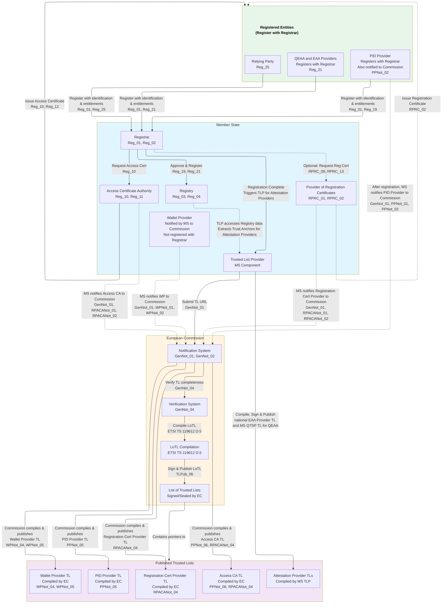
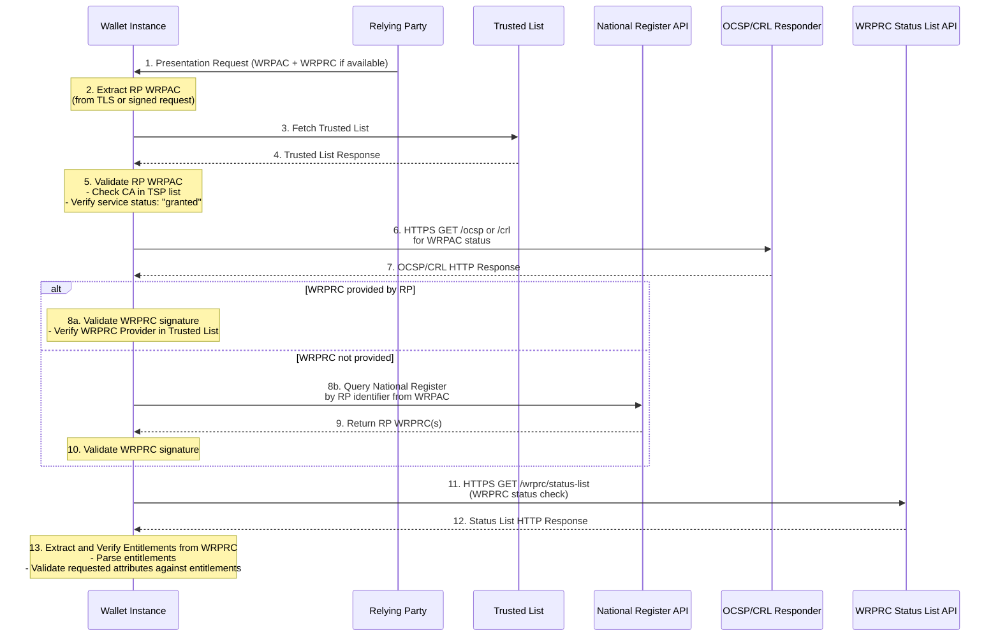
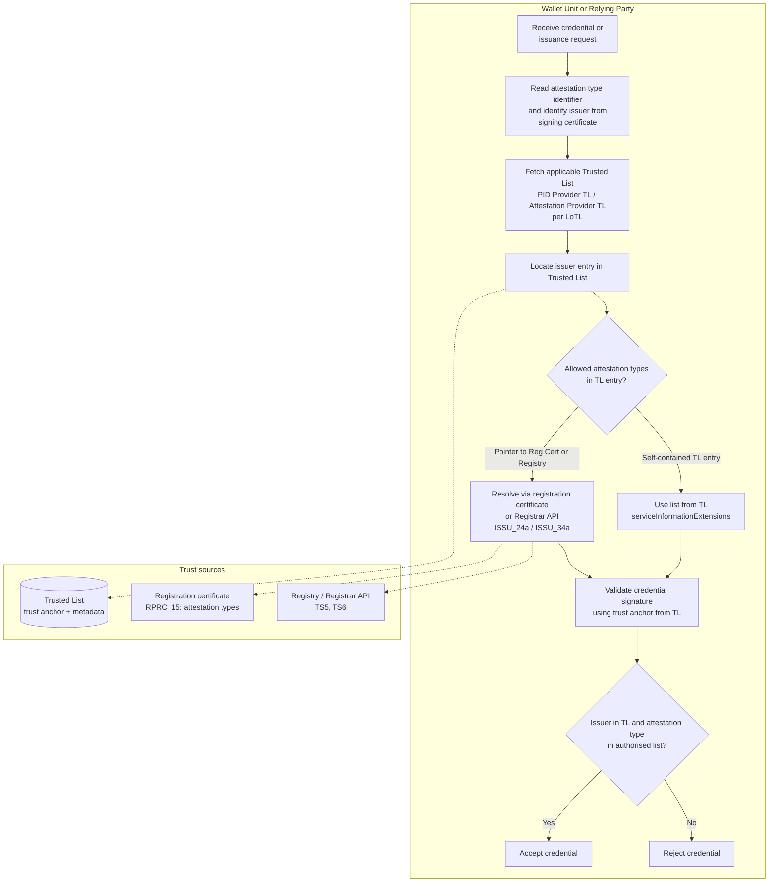
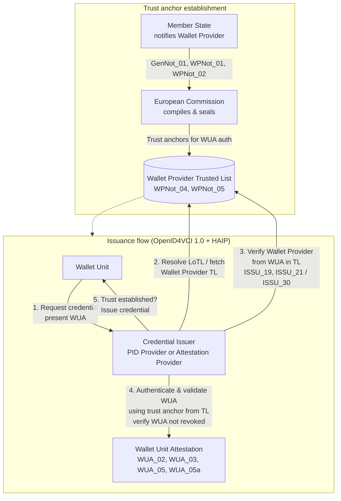

# Appendix A - Trust Ecosystem

The trust infrastructure for the EU Digital Identity and European Business Wallet ecosystem rests on three distinct but complementary processes: **registration/onboarding** of participants, **notification** of certain entities to the European Commission, and **publication of Trusted Lists** (or Lists of Trusted Entities) that provide cryptographic trust anchors for validation. WE BUILD aligns with the [EUDI Wallet Architecture and Reference Framework (ARF)](https://eudi.dev/) and the trust-infrastructure model described in the WP4 Trust Group deliverables.

## Trust infrastructure authorities and registries

- **Member State Registrar:** Manages registration and operational authorization of **PID Providers**, **Attestation Providers**, and **Relying Parties**. Registration yields registry entries (used for entitlement verification and online lookup via common APIs such as TS5/TS6) and triggers access certificate issuance.
- **European Commission:** Compiles, signs/seals, and publishes Trusted Lists for Wallet Providers, PID Providers, Access Certificate Authorities (Access CAs), and Providers of Registration Certificates. It maintains the **List of Trusted Lists (LoTL)** and publishes LoTL location and trust anchors in the Official Journal of the European Union (OJEU).
- **Member State Trusted List Provider (MS TLP):** Compiles, signs, and publishes national Trusted Lists for **non-qualified EAA Providers** and **Member State QTSP Trusted Lists** for **QEAA Providers** (per Article 22 eIDAS), and submits the Trusted List URLs to the Commission for inclusion in the LoTL.
- **Access Certificate Authority:** Issues access certificates to registered entities (PID Providers, Attestation Providers, Relying Parties). Notified by Member States to the Commission; does not register with Registrars.
- **Provider of Registration Certificates:** Optionally issues registration certificates that detail entitlements; notified by Member States to the Commission.

**Registration vs Trusted List publication:** Registration defines *who is allowed to do what* (entitlements, attributes, intended use) and is consumed via registries and optional registration certificates. Trusted List publication establishes *cryptographic trust anchors* (keys, certificates) and, via profile-specific extensions defined in **ETSI TS 119 602** (for example the Pub-EAA and national non-qualified EAA Provider LoTE profile in Annex H, including its additionalInfo structures), can also publish **which attestation types an Attestation Provider is authorised to issue**. Trusted Lists follow ETSI TS 119 612 and TS 119 602 (Lists of Trusted Entities) and are consumed per ETSI TS 119 615. Wallet Providers, Access CAs, and Providers of Registration Certificates are **not** registered with Registrars; these entities are notified by Member States to the Commission.

### Responsibilities matrix

The Task 2 trust-infrastructure schema defines the following responsibilities matrix for registration and Trusted List compilation:

| Entity Type | Registration Process | Trusted List Compilation (EC / MS TLP) | Member State TLP Role |
| :--- | :--- | :--- | :--- |
| **PID Provider** | Register with MS Registrar | European Commission (EU-level TL for PID Providers) | None (no national TL for PID Providers) |
| **Attestation Provider** | Register with MS Registrar | Member State / MS TLP (national QTSP TL for QEAA Providers; national TL for non-qualified EAA Providers) | Compiles, signs, and publishes national Trusted Lists (QTSP TL for QEAA Providers per Article 22; EAA Provider TL for non-qualified EAA Providers) |
| **Relying Party (RP)** | Register with MS Registrar | N/A (uses Access Certificates and Registry) | None (not listed in Trusted Lists) |
| **Wallet Provider** | Notification only (by MS to EC) | European Commission (EU-level TL for Wallet Providers) | Not applicable in [MVP](#working-group-scope-mvp-and-mvp) (notification from MS to EC only) |
| **Access CA** | Notification only (by MS to EC) | European Commission (EU-level TL for Access CAs) | Not applicable in [MVP](#working-group-scope-mvp-and-mvp) (notification from MS to EC only) |
| **Reg. Cert. Provider** | Notification only (by MS to EC) | European Commission (EU-level TL for Reg. Cert. Providers) | Not applicable in [MVP](#working-group-scope-mvp-and-mvp) (notification from MS to EC only) |

This blueprint section mirrors the Task 2 responsibilities matrix so that architectural roles are consistent across WP4.

## Working group scope: [MVP] and [MVP+]

In line with the EUDI Wallet ARF, the WP4 Trust Group focuses on defining **architectural patterns and profiles**, not on specifying Member State-specific policies or operating production infrastructure. To make this concrete, the trust and security work is scoped in two steps:

- **[MVP] (Minimum Viable Prototype)**:  
  - Implements the **core onboarding scenarios** from Task 1 (Subtask 1.1) for PID Providers, Attestation Providers, Wallet Providers, Relying Parties, and Certificate Authorities.  
  - Implements the **basic trust‑registry scenarios** from Task 1 (Subtask 1.2) needed to create, publish and consume Trusted Lists / Lists of Trusted Entities and registry entries for these actors.  
  - Demonstrates end‑to‑end flows for **registration, access‑certificate issuance, trust‑anchor publication and consumption**, reusing the ARF and ETSI TS 119 602/119 612/119 615 patterns without introducing new normative profiles.

- **[MVP+] (Extended prototype)**:  
  - Completes the remaining Task 1 onboarding and trust‑registry scenarios, including more advanced **evaluation, maintenance, revocation and discovery** cases.  
  - Covers **richer combinations of participants and roles** (e.g. multiple types of Attestation Providers and more complex Relying Party ecosystems) while staying within the Task 2 trust framework and trust‑infrastructure schema.  
  - May introduce **pilot‑specific configurations or conventions** (e.g. additional metadata, policy examples, or Trusted List extensions) as long as these remain compatible with the underlying ARF and ETSI models and are clearly marked as non‑normative.

The **boundary of the working group** is therefore to: (a) define the trust‑infrastructure architecture, profiles, and flows needed for [MVP] and [MVP+]; (b) document how to apply ETSI TS 119 602/119 612/119 615 and the ARF in these scenarios; and (c) leave Member State policy choices (approval criteria, national extensions, operational SLAs) and long‑term production operation out of scope.

## Trust infrastructure architecture (overview)

The following diagram summarises the roles of Member State and European Commission, the split between registration and notification, and how Trusted Lists and the LoTL are produced and consumed. Source: WP4 Trust Group Task 2, [trust-infrastructure schema](https://github.com/webuild-consortium/wp4-trust-group/blob/main/task2-trust-framework/trust-infrastructure-schema.md).

> Note: WP4 is going to expose trust infrastructure depicted on this diagram, mimicking the infrastructure of at least one Member State. In the case of mimicking more than a single Member State, WE BUILD participants willing to register are going to be able to select a registry in which they are going to be registered, or the WP4 registrar, if single, is going to place them in one of the registries. For the sake of simplicity, in such a case, not all the technical components depicted on a diagram within a Member State will have to be multiplied; e.g. there may be multiple registries but a single trusted list across the countries to which all wallet-reliant parties are provisioned.

## Security Measures

 From an architectural perspective, security in the wallet ecosystem is structured in four dimensions. (1) **Trust anchor layer**: cryptographic validation and key lifecycle management, including revocation of keys, certificates, and services. Trust Anchors are published by Trusted Lists and related mechanisms (ETSI TS 119 602/119 612/119 615), applying to the entities and roles described in the [Trust Ecosystem](#trust-ecosystem) (PID Providers, Attestation Providers, Wallet Providers, Access CAs, etc.). (2) **Identity assurance**: the level of assurance (LoA) of the identities involved is maintained across the full lifecycle of those identities. (3) **Device and execution environment**: the security of the devices and execution environments that host Wallet Instances and cryptographic material (WSCA/WSCD) is addressed by the wallet secure cryptographic application/device (WSCA/WSCD) architecture for wallet-side components, to be specified by the Architecture and Wallets groups (and, for remote WSCA/WSCD, together with the QTSP group). Secure environments operated by PID Providers, Pub-EAA and QEAA Providers, and Trust Service Providers (TSPs) are addressed by applicable eIDAS and ETSI requirements for TSP and provider infrastructure. (4) **Protocol and policy layer**: authentication (verifying who or what is acting) and authorization (what the subject is allowed to do, driven by policies) are realised in conformance with the ARF and related technical specifications, per application-specific flow and per attestation data format.

### Authentication

Authentication in the WE BUILD architecture closely follows the standards and flows of the underlying protocols (**OpenID for Verifiable Credentials**, **ISO 18013-5**, and other application-specific communication protocols).

For **organizational entities** that register with the Registrar (PID Providers, Attestation Providers, Relying Parties), authentication is primarily established using **access certificates** issued by the Access Certificate Authority, validated against up-to-date Trusted Lists or Lists of Trusted Entities (ARF and ETSI TS 119 602 / 119 612 / 119 615). **Wallet Providers** are notified by Member States to the European Commission (they do not register with the Registrar); their authenticity is established via the Wallet Provider Trusted List and related attestations (e.g. Wallet Unit Attestation). Mutual trust is strictly required in application-specific protocol flow specifications, and consolidated through OpenID HAIP and ARF HLRs, with certificate-bound tokens and protocol-level message signatures along with endpoint authentication and message integrity.

According to the ARF, the Relying Party **cannot request the Wallet Unit Attestation (WUA) during the presentation flow**. Presentation requests address **PID and attestations** only (ARF Topic 1, **OIA_01**); the WUA is presented to the PID Provider or Attestation Provider **during issuance** of a PID or device-bound attestation, not to the Relying Party (ARF Topic 9, **WUA_03**, **WUA_05**, **WUA_05a**). The ARF explicitly states that there is no separate mechanism for the Relying Party to verify the revocation status of a Wallet Unit directly with the Wallet Provider (ARF Section 6.6.3.12). Trust in the Wallet Unit is therefore **mediated by a trusted third party**: the PID Provider or Attestation Provider that belongs to a Trust Anchor (Trusted List) and that received the WUA at issuance. That trust is **indirect** from the Relying Party’s perspective. The PID Provider or EAA Provider **periodically checks the revocation status** of the Wallet Unit to which it has issued credentials (using the revocation information in the WUA received at issuance; ARF Topic 9 **WUA_02**, ARF Section 6.6.2.4). If the Wallet Unit is revoked, the PID Provider or Attestation Provider **SHALL revoke** the credentials it issued to that Wallet Unit (Article 5, 4.(b), European Digital Identity Regulation; ARF Section 6.6.2.4). By verifying the revocation status of the PID or attestation, the Relying Party implicitly relies on the issuer’s verification of the Wallet Unit.

For **attestation holders** (individual end-users and the corresponding wallets), authentication requirements leverage possession-based proofs and, where applicable, **identity schemes notified to the European Commission** that attest **Level of Assurance High** according to the eIDAS Framework. Local user authentication (e.g., via PIN, password, device biometrics) must fulfill the minimum Level of Assurance required by the credential or attestation type and is enforced by policy prior to any issuance or presentation flow.

Wallet Units are expected to combine protocol-specific authentication mechanisms (as per OpenID4VC and ISO 18013-5) with validation of trust anchors and up-to-date Trusted Lists, covering both participant and credential authenticity.

### Authorization and policies

Authorization determines what actions a subject is permitted to perform after authentication. In line with the Task 2 trust framework and the EUDI Wallet ARF, WE BUILD **assumes** that **the default is “allow all”** at the ecosystem level, and that **policies (expressed via Trusted List extensions, registration/entitlement data, and optional registration certificates) can tighten this to an effective “deny all except explicitly allowed”** model for specific contexts and participants. When such policies apply, only the actions and attribute uses listed in the applicable allow‑lists are permitted; all others are denied. Trust marks (for Credential Issuers, Wallet Solutions, and Relying Parties), together with Trusted List extensions and registration certificates, carry authorization semantics (e.g. authorised credential types, attribute groups, purposes, scope restrictions) and are used in policy evaluation and collision prevention as specified in the Task 2 trust framework and the trust‑infrastructure schema. 

According to the [EUDI Wallet ARF v2.8](https://eudi.dev/), when present and applicable, policies and default authorisations may be overridden by **user will**: the Wallet Unit SHALL ensure the User approved the presentation of any attribute(s) prior to presenting those attributes and SHALL always allow the User to refuse presenting an attribute requested by the Relying Party or Verifier Wallet Unit (ARF Topic 6, **RPA_07**); if Relying Party authentication fails, the Wallet Unit SHALL either not present the requested attributes or give the User the choice to present or not (**RPA_06a**).

### Certificates and cryptographic anchors

- **Trusted Lists / Lists of Trusted Entities (LoTE)** (ETSI TS 119 612, TS 119 602) are pivotal trust anchors in the ecosystem. LoTE entries publish the keys and related metadata for the entity types described in the [Trust Ecosystem](#trust-ecosystem) (Wallet Providers, PID Providers, Attestation Providers, Access CAs, Registration Cert Providers). Validation of trust service outputs against these lists SHALL follow **ETSI TS 119 615** (procedures for using and interpreting EUMS national trusted lists).
- **Access certificates** are issued by the Access Certificate Authority to registered PID Providers, Attestation Providers, and Relying Parties. Issuance SHALL comply with **ETSI TS 119 411-8**; the Authority SHALL comply with at least **ETSI EN 319 411-1** Normalised Certificate Policy (NCP) requirements. Each Relying Party receives a **separate access certificate per Relying Party Instance**. Access certificates authenticate entities in protocol exchanges and are validated by Wallet Units using the trust anchors in the Access CA LoTE entries.
- **Registration certificates** (optional) may be issued by the Provider of Registration Certificates to detail registration status and entitlements. When the User opts to verify RP (or issuer) registration, Wallet Units use the registration certificate when provided and/or registry lookup, as specified in ARF RPRC_16 to RPRC_21.

### Key lifecycle and Trusted Lists

Key lifecycle for trust anchors and for services listed in Trusted Lists is reflected in list content and status (e.g. service status, status determination approach, and history where required by the profile). Updates and revocation of listed services follow the applicable ETSI trusted list profiles (TS 119 612 / TS 119 602) and are consumed per ETSI TS 119 615. Certificate policies and Certificate Transparency (SCT) where applicable are specified in the referenced ETSI standards.

## Relying Party Registration & Access Certificates

Relying Parties (verifiers) **register with the Member State Registrar** before being able to securely identify themselves to Wallet Units. Registration includes identification data, the **attributes** the RP intends to request from Wallet Units, the **intended use** (purpose), and, if applicable, use of intermediaries. The Registrar approves the RP (per ARF Reg_25) and publishes the entry in the **Registry**. The **Access Certificate Authority** then issues access certificates to the RP as described under [Certificates and cryptographic anchors](#certificates-and-cryptographic-anchors), with a **separate access certificate per Relying Party Instance** (Reg_10a). Optionally, the Registrar may request a **registration certificate** from the Provider of Registration Certificates (RPRC_09) that summarises registration status and entitlements. Wallet Units authenticate RPs by validating RP access certificates against the Access CA trust anchors and by verifying registration and requested attributes in the Registry (RPA_04, RPRC_16, RPRC_21). The common API for RP registration information (e.g. TS5) and the common set of RP information (e.g. TS6) are specified in the EUDI Wallet technical specifications. Detailed flows and diagrams are in the WP4 Trust Group trust-infrastructure schema. Certificate issuance aspects are coordinated with the QTSP group.

The following sequence illustrates how a Wallet Instance discovers and validates Relying Party policy during presentation (WRPAC = Relying Party Access Certificate; WRPRC = Relying Party Registration Certificate). Source: WP4 Trust Group, [wallet-policy-discovery](https://github.com/webuild-consortium/wp4-trust-group/blob/pol-disc/task2-trust-framework/wallet-policy-discovery.md).

## Validation Functions for Relying Parties

Relying Parties need to **authenticate and validate** the Person Identification Data (PID) and attestations (e.g. LPID/EBWOID, EAA) received from Wallet Units. Validation relies on the trust infrastructure as follows:

- **PID and LPID/EBWOID:** Relying Parties validate the PID (or equivalent) signature using the **List of Trusted Entities (LoTE)** for PID Providers, i.e. the PID Provider Trusted List compiled by the European Commission and referenced from the LoTL. Procedures for authenticating the LoTL and national/EU trusted lists and for obtaining listed services are given in **ETSI TS 119 615**.
- **Attestations (EAA):** Relying Parties validate **qualified EAA (QEAA)** signatures using the **Member State QTSP Trusted Lists** (per Article 22 eIDAS) and **PuB-EAA** (and, where applicable, national non-qualified EAA) using the relevant Attestation Provider Trusted Lists. Trust anchors and service types are defined in ETSI TS 119 602 profiles (e.g. Annex H for Pub-EAA and national EAA provider lists).
- **Wallet and RP side:** Wallet Units verify RPs via the Registry and Access CA Trusted Lists (see [Relying Party Registration & Access Certificates](#relying-party-registration--access-certificates)). PID Providers and Attestation Providers verify Wallet Providers against the Wallet Provider Trusted List before issuing credentials.

The PID Providers group defines validation semantics for PID/LPID/EBWOID; the QTSP group covers EAA and certificate aspects. Exact validation requirements (e.g. OIA_12, OIA_13, OIA_14) and consumption procedures are documented in the WP4 Trust Group trust-infrastructure schema and ETSI trusted lists implementation profile.

### Establishing trust with a Credential Issuer

Wallet Units and Relying Parties establish trust in a Credential Issuer (PID Provider or Attestation Provider) and in the credentials they issue by combining **Trusted List** entries (trust anchors and, where applicable, authorised attestation types) with **registration** data (Registry or registration certificate). The catalogue of attestation schemes defines *what* credential types exist; Trusted Lists and registration define *who* is allowed to issue which types. The flow below is aligned with the WP4 Trust Group [credential catalogue and issuer constraints](https://github.com/webuild-consortium/wp4-trust-group/blob/main/task2-trust-framework/credential-catalog-and-issuer-constraints.md): the verifier accepts a credential only if the issuer is present in the applicable Trusted List and the credential’s attestation type is among the issuer’s authorised types (ISSU_24, ISSU_24a, ISSU_34, ISSU_34a for Wallet Units; OIA_12, OIA_13, OIA_14, OIA_15 for Relying Parties).

### Establishing trust with a Wallet Solution

Trust in a **Wallet Solution** (Wallet Provider and Wallet Unit) is established by **Credential Issuers** (PID Providers and Attestation Providers) before issuing a PID or attestation. The flow is mandated by the ARF (Topic 9 Wallet Unit Attestation, Topic 31 notification and Trusted Lists), uses **OpenID4VCI 1.0** for the issuance protocol and issuer metadata (ISSU_22, ISSU_22a, ISSU_22b), and is reinforced by **OpenID4VC High Assurance Interoperability Profile (HAIP) 1.0** for authenticity, holder authentication, and certificate-bound tokens. The Wallet Unit presents a **Wallet Unit Attestation (WUA)** to the Issuer during the issuance request; the Issuer verifies the Wallet Provider against the **Wallet Provider Trusted List** and validates the WUA (ARF **ISSU_19**, **ISSU_21** for PID; **ISSU_28**, **ISSU_30** for Attestation Providers; **WUA_02**, **WUA_03**, **WUA_05**, **WUA_05a**). The Wallet Provider Trusted List is compiled by the European Commission from Member State notifications (**WPNot_01**–**WPNot_05**).

## Governance Responsibilities

Trust and security responsibilities are split between **Member States**, the **European Commission**, and **participating entities** as follows:

| Responsibility | Owner (normative) | [MVP] | [MVP+] |
|----------------|-------------------|-------|--------|
| Registration of PID Providers, Attestation Providers, Relying Parties | Member State Registrar | WE BUILD (mock Registrar) | MS Registrar or WE BUILD |
| Registry publication and common API (e.g. TS5, TS6) | Member State | WE BUILD (the WP4 reference registry or an other WP4 registry listed in LoTL) | Member State or WE BUILD |
| Access certificate issuance | Access Certificate Authority (notified by MS to Commission) | WE BUILD (Access CAs listed in LoTL) | Access CA (notified) or WE BUILD (Access CAs listed in LoTL) |
| Optional registration certificates | Provider of Registration Certificates (notified by MS to Commission) | WE BUILD (WP4 RegCert Providers listed in LoTL) | RegCert Provider (notified) or WE BUILD (WP4 RegCert Providers listed in LoTL)|
| Compilation and publication of Wallet Provider, PID Provider, Access CA, RegCert Provider Trusted Lists | European Commission | WE BUILD (reference TLs) | European Commission or WE BUILD |
| Compilation and publication of national EAA Provider TLs and MS QTSP Trusted Lists for QEAA | Member State Trusted List Provider | WE BUILD (mock MS TLP) | MS TLP or WE BUILD |
| List of Trusted Lists (LoTL), OJEU publication | European Commission | WE BUILD (reference LoTL) | European Commission or WE BUILD |
| Trust evaluation in Wallet Units and RPs (use of TL/LoTE and Registry per ARF) | Wallet / PID / Attestation / RP implementations | Wallet / PID / Attestation / RP implementations | Wallet / PID / Attestation / RP implementations |

Within WE BUILD, the consortium clarifies **which roles are assumed by [MVP](#working-group-scope-mvp-and-mvp) infrastructure** (e.g. mock or real Registrars, TLPs, Access CAs) and which are assumed to be provided by Member State or EU infrastructure. **Policy and conflicts** (e.g. credential-type or authorization collisions) are handled according to the dispute resolution and collision-prevention mechanisms described in the WP4 Trust Group authentication-authorization and policy framework.
