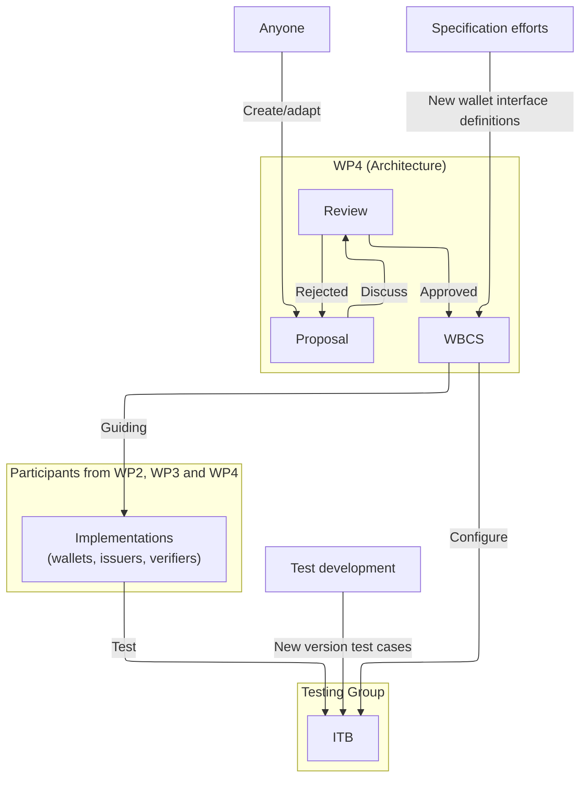

# WE BUILD Conformance Specifications (WBCS)

## About
The WE BUILD Conformance Specifications (WBCS) define how WE BUILD participants implement wallet interfaces and communication protocols between issuers, wallets, and relying parties. 
They ensure interoperability and conformance by translating ADR decisions into precise implementation requirements.

The ITB will be based on the WBCS as a starting point. The test suites in the ITB are relying predominantly on the WBCS. 

## Contributing

The Architecture group define the WBCS, with help from all implementing participants. Propose new WBCSs using the [template](_template.md).

## CS Process Summary for WE BUILD Large Scale Pilots (LSPs)

### Approved WBCSs

| **WBCS #** | **WBCS Title**                                                                         |
| -------- | ------------------------------------------------------------------------------------ |
| CS-001   | [Credential Issuance - v1.0](cs-01-credential-issuance.md)         |
| CS-002   | [Credential Presentation - v1.0](cs-02-credential-presentation.md) |
|          |

### WBCSs Under Development

| **WBCS #** | **WBCS Title** |
| -------- | ------------ |
|          |              |

