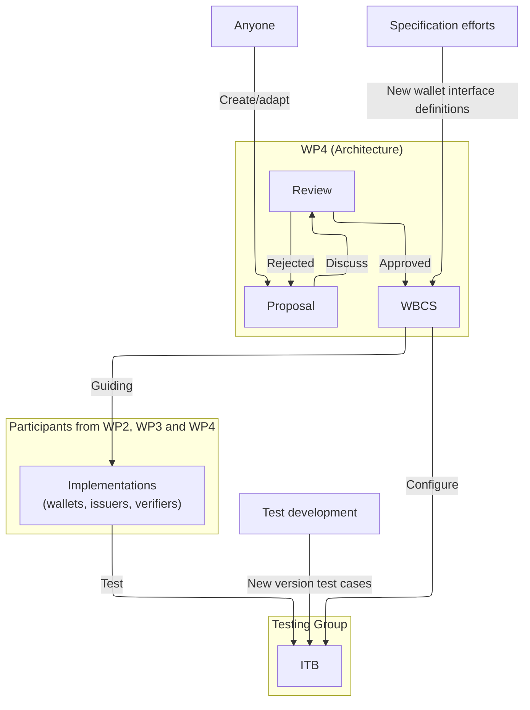

# WE BUILD Conformance Specifications (WBCS)

## About
The WE BUILD Conformance Specifications (WBCS) define how WE BUILD participants implement wallet interfaces and communication protocols between issuers, wallets, and relying parties. 
They ensure interoperability and conformance by translating ADR decisions into precise implementation requirements.

The ITB will be based on the WBCS as a starting point. The test suites in the ITB are relying predominantly on the WBCS. 

## Contributing

The Architecture group define the WBCS, with help from all implementing participants. Propose new WBCSs using the [template](_template.md).

## CS Process Summary for WE BUILD Large Scale Pilots (LSPs)

```mermaid
---
config:
  flowchart:
    defaultRenderer: 'elk'
    subGraphTitleMargin:
      bottom: 25
---

graph TB
%% flowchart

    subgraph "WP4 (Architecture)"
        Proposal -- Discuss --> Review
        Review -- Rejected --> Proposal
        Review -- Approved --> WBCS
    end

    subgraph "Participants from WP2, WP3 and WP4"
        Implementations["Implementations
        (wallets, issuers, verifiers)"]
    end

    subgraph "Testing Group"
        ITB["ITB"]
    end

    WBCS -- "Guiding" --> Implementations
    WBCS -- "Configure" --> ITB
    Implementations -- "Test" --> ITB

    Anyone -- "Create/adapt" --> Proposal
    SpecEfforts["Specification efforts"] -- "New wallet interface definitions" --> WBCS
    TestDev["Test development"] -- "New version test cases" --> ITB
```

### Approved WBCS

<!--BEGIN INDEX-->
| **WBCS #** | **WBCS Title**                                                                         |
| -------- | ------------------------------------------------------------------------------------ |
| CS-001   | [Credential Issuance - v1.1](cs-01-credential-issuance.md)         |
| CS-002   | [Credential Presentation - v1.0](cs-02-credential-presentation.md) |
| CS-003   | [Remote Qualified Signing with Wallet Units - v1.0](cs-03-remote-signing-with-wallet-units.md) |
| CS-004   | [Individual Wallet Unit Attestation (WUA) Lifecycle - v1.0](cs-04-wua-lifecycle.md) |
| CS-005   | [Business Wallet Unit Attestation (BWUA) Lifecycle - v1.0](cs-05-bwua-lifecycle.md) |
| CS-007   | [Credential Presentation and Issuance via the Digital Credentials API](cs-07-credential-presentation-dc-api.md) |
<!--END INDEX-->

### WBCS Under Development

<!--BEGIN INDEX-->
| **WBCS #** | **WBCS Title**                                                                                                                      | **Status**         | **Priority** | **Target Date** |
| ---------- | ----------------------------------------------------------------------------------------------------------------------------------- | ------------------ | ------------ | --------------- |
| CS-006     | [Issuance of Relying Party Access and Registration Certificates](https://github.com/webuild-consortium/wp4-architecture/issues/190) | 🟢 *In review*     | Must-have    | Aug 2026        |
| CS-008     | [Identity Matching](https://github.com/webuild-consortium/wp4-architecture/issues/248)                                              | 🔵 *Investigating* | Must-have    | Aug 2026        |
| CS-009     | [PID / EBWOID Issuance](https://github.com/webuild-consortium/wp4-architecture/issues/206)                                          | 🟡 *Drafting*      | Should-have  | Aug 2026        |
| CS-010     | [Revocation mechanism](https://github.com/webuild-consortium/wp4-architecture/issues/188)                                           | 🟢 *In review*     | Should-have  | Aug 2026        |
| CS-011     | [Remote QESeal creation](https://github.com/webuild-consortium/wp4-architecture/issues/167)                                         | 🟢 *In review*     | Must-have    | Sep 2026        |
| CS-012     | [TS12 (SCA)](https://github.com/webuild-consortium/wp4-architecture/issues/210)                                                     | 🟡 *Drafting*      | Must-have    | Aug 2026        |
| CS-013     | [Intermediary services pre-flight](https://github.com/webuild-consortium/wp4-architecture/issues/185)                               | ⚪ *Not started*   | Must-have    | Sep 2026        |
| CS-014     | [Proximity / Offline profile](https://github.com/webuild-consortium/wp4-architecture/issues/251)                                    | 🔵 *Investigating* | Should-have  | Sep 2026        |
| CS-015     | [QERDS - EBW Interface](https://github.com/webuild-consortium/wp4-architecture/issues/252)                                          | 🟢 *In review*     | Must-have    | Aug 2026        |
| CS-016     | [Inter-QTSP Message Relay (QeRDS AS4)](https://github.com/webuild-consortium/wp4-architecture/issues/159)                           | 🟢 *In review*     | Low          | Aug 2026        |
| CS-017     | [Directory & Discovery (EDD)](https://github.com/webuild-consortium/wp4-architecture/issues/253)                                    | ⚪ *Not started*   | Must-have    | Sep 2026        |
|            | [RP-QERDS interface](https://github.com/webuild-consortium/wp4-architecture/issues/254)                                             | 🟣 *Candidate*     | Low          | Jan 2027        |
<!--END INDEX-->

### Status Definitions 
<!--BEGIN INDEX-->
| Status | Description |
|---|---|
| **Not started** | No active work has started yet. |
| **Investigating** | The topic is being investigated and potential approaches are being evaluated. |
| **Drafting** | The specification is being drafted. |
| **In review** | A concrete draft exists and is under review. |
| **On hold** | Work has been temporarily paused. |
| **Dropped** | The specification will not be taken forward. |
<!--END INDEX-->

