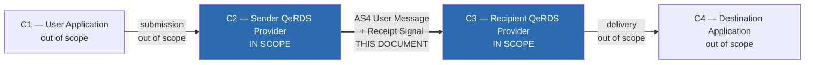
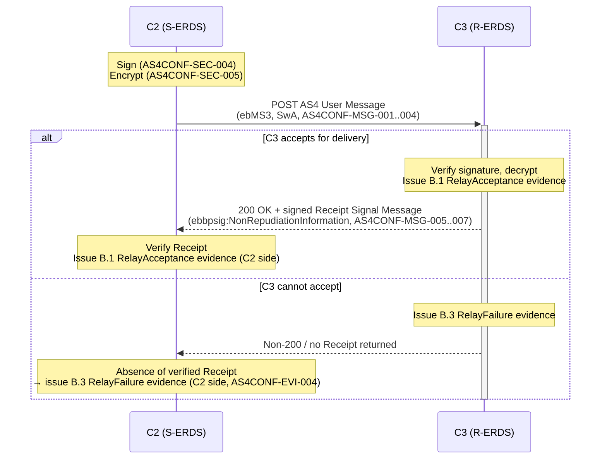
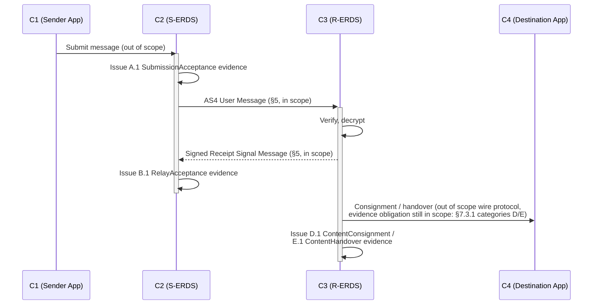
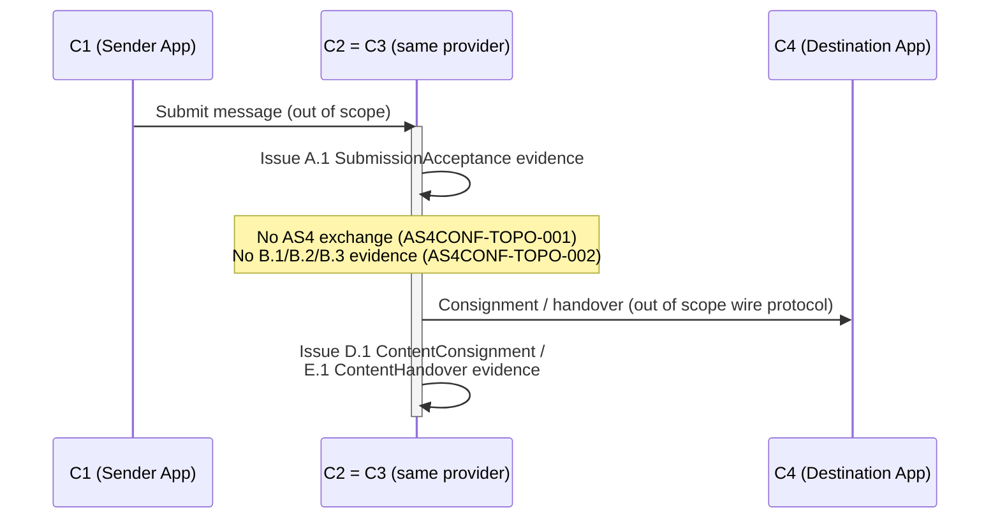

# QeRDS Four-Corner AS4 Conformance Specification

**Status**: Draft v0.5 (revised: §7.3 EVI area no longer assigns `AS4CONF-EVI-*` IDs to requirements that merely restate [ETSI-319-522]'s own event definitions, schema fields, or cardinality notes — those are redirected to direct ETSI citation and their former IDs retired per the Annex; only genuine profiling additions on top of ETSI keep an ID. All repo-relative file-path references replaced with document titles/citation tags.)
**Scope**: C2 (Sender QeRDS Provider) ↔ C3 (Recipient QeRDS Provider) inter-provider channel, and the QeRDS evidence artifacts obligation
**Profiles**: CEF eDelivery AS4 Profile 2.0 (profiling OASIS AS4 Profile of ebMS 3.0 v1.0); ETSI EN 319 522 (Parts 1–4)
**Context**: This work sits within the WE BUILD consortium's QERDS-for-European-Business-Wallets architecture ([WEBUILD-ARCH]) — see §2 and §4 for how this document's C1–C4 scope maps onto that wallet/QTSP model
**Citation scheme**: See `AS4CONF-<AREA>-<seq>` IDs throughout — see §3 and this feature's Clause Citation Scheme contract for the stability contract
**Author**: Alejandro Nieto Gallego — DigitelTS
**Contributors**: 

---

## §1 Introduction

This document specifies the normative requirements for the AS4/ebMS3 message exchange between a Sender QeRDS Provider (Corner 2, "C2") and a Recipient QeRDS Provider (Corner 3, "C3") in the ETSI EN 319 522 four-corner Qualified Electronic Registered Delivery Service (QeRDS) model, and the QeRDS evidence artifacts each corner MUST produce. It profiles source standards — CEF eDelivery AS4 Profile 2.0 (itself a profile of the OASIS AS4 Profile of ebMS 3.0 v1.0) and ETSI EN 319 522 — into a single, implementable and auditable conformance target.

This document does not itself define a new protocol. Every normative requirement here traces to a specific clause in one of the source standards (§References), or is explicitly marked as a QeRDS-specific addition where the base standards leave a choice open.

## §2 Scope

**In scope**: the C2→C3 AS4 User Message exchange and the C3→C2 AS4 Receipt Signal Message response; the WS-Security signing and encryption applied to that exchange; the full set of QeRDS evidence artifacts corresponding to the 22 ERDS events defined in ETSI EN 319 522-1 Table 1 (§7.3) and their JSON representation; the same-provider (C2 = C3) topology variant.

**Out of scope**: the C1↔C2 (user-to-provider submission) interface and the C3↔C4 (provider-to-recipient-application delivery) interface — both are left to local implementation choice by the source standards and are not profiled here (note: the *evidence obligations* C3 carries toward events that occur at the C3–C4 boundary, e.g. consignment/handover, ARE in scope per §7.3 categories D/E, even though the C3–C4 wire protocol itself is not). Also out of scope: the identity-proofing, service/identifier discovery, and trusted-list registration interfaces that [WEBUILD-ARCH] places around the QERDS core (its interfaces 1–5, 7–9, 12, 15) — these govern the wallet/QTSP ecosystem this channel operates within, but not the C2–C3 wire exchange itself. Automated conformance test tooling is likewise out of scope; §9 defines *what* to check, not a test harness.

**Evidence event taxonomy**: ETSI EN 319 522-1 Table 1 ("ERDS Events") defines 22 named events across 6 categories (submission, inter-ERDS relay, recipient acceptance/rejection, consignment, handover, non-ERDS interop) — see [ETSI-319-522] §6.2. §7.3 below intentionally does not restate the semantics of each event; see [ETSI-319-522] directly for the normative definition of what each event means, and treat §7.3 as a citation-ID mapping plus this project's own profiling decisions (which categories are mandatory for this deployment, and what additional evidence-artifact requirements apply on top of the base standard).

## §3 Normative Language

The key words **MUST**, **MUST NOT**, **SHOULD**, **SHOULD NOT**, and **MAY** in this document are to be interpreted as described in [RFC2119]/[RFC8174].

Every normative requirement in §7 carries a stable citation ID of the form `AS4CONF-<AREA>-<seq>` (zero-padded 3-digit sequence, e.g. `AS4CONF-MSG-001`), per the following area codes:

| Area Code | Scope |
|-----------|-------|
| `SCOPE` | Overall profiling decisions and standards alignment (§3) |
| `MSG` | ebMS3 User Message structure (§7.1) |
| `SEC` | WS-Security signing and encryption requirements (§7.2) |
| `EVI` | Evidence artifact profiling, encoding, and schema mapping (§7.3) |
| `TOPO` | Topology variance: same-provider vs. inter-provider delivery (§7.4) |

Once published, an ID's area/sequence pair MUST NOT be reassigned to a different requirement in a later revision; a retired requirement's ID is recorded in an appendix, never silently reused (full stability contract: this feature's Clause Citation Scheme contract).

**`AS4CONF-SCOPE-001`** [MUST]: This document profiles CEF eDelivery AS4 Profile 2.0 (the "Common Profile" using EdDSA Ed25519/X25519, per §7.2 below, the OASIS AS4 Profile of ebMS 3.0 v1.0 it profiles, and ETSI EN 319 522 ([CEF-AS4-2.0], [AS4-PROFILE-1.0], and [ETSI-319-522] respectively — see References). Implementations claiming conformance to this document MUST state which source-standard revision they were checked against if any vendored copy is later updated.

**`AS4CONF-SCOPE-002`** [MUST]: A conformant implementation MUST treat CEF eDelivery AS4 Profile 2.0 as the mandated protocol for the C2–C3 channel.

**`AS4CONF-SCOPE-003`** [MUST]: Implementations MUST comply with all requirements in [ETSI-319-522] Parts 1–4 for evidence obligations, event definitions, and the full 22-event taxonomy (§7.3.1), except where this document explicitly profiles or narrows the scope (e.g., same-provider topology variant in `AS4CONF-TOPO-*`).

**`AS4CONF-SCOPE-004`** [MUST]: Implementations MUST comply with all requirements in [CEF-AS4-2.0] for AS4/ebMS3 message structure, WS-Security signing and encryption, and transport layer handling, except where this document explicitly profiles or overrides those requirements (e.g., `AS4CONF-SEC-008` mandates encryption for all User Messages).

**`AS4CONF-SCOPE-005`** [MUST]: Implementations MUST comply with all requirements in [AS4-PROFILE-1.0] (the OASIS AS4 Profile of ebMS 3.0 v1.0) for features not superseded by [CEF-AS4-2.0] or this document, in the compliance chain: [AS4-PROFILE-1.0] ← [CEF-AS4-2.0] ← this document (later profiles override earlier ones).

**`AS4CONF-SCOPE-006`** [MUST]: Implementations MUST comply with the PEPPOL AS4 Profile where applicable, using [CEF-AS4-2.0] as the underlying AS4 implementation baseline instead of the version mandated within the PEPPOL Profile specification itself. This ensures PEPPOL interoperability while anchoring to the CEF AS4 2.0 security, cryptographic, and message-structure requirements specified in §7.

## §4 Roles and Components

The ETSI EN 319 522 four-corner model defines four roles:

- **C1 — User Application**: the sender's originating application. Out of scope (§2).
- **C2 — Sender QeRDS Provider**: accepts a submission from C1, issues Submission Acceptance Evidence, and relays the message to C3 over AS4. **In scope.**
- **C3 — Recipient QeRDS Provider**: receives the AS4 User Message from C2, issues Relay Acceptance Evidence (implicitly, via a verified signed Receipt back to C2), delivers to C4, and issues Delivery Evidence or Non-Delivery Evidence. **In scope.**
- **C4 — Destination Application**: the recipient's application, receiving delivery from C3. Out of scope (§2).

This document profiles the **C2–C3 channel only**. Where C2 and C3 are the same provider instance ("same-provider topology"), see §7 area `TOPO`.



**Mapping to the WE BUILD architecture** ([WEBUILD-ARCH], Figure 2 "Deployment model with data transmission", informative only — see `AS4CONF-SCOPE-002`): C1 corresponds to the sender's business wallet, C2 to the "S-ERDS" (Sender's QTSP), C3 to the "R-ERDS" (Recipient's QTSP), and C4 to the recipient's business wallet. The C2–C3 exchange this document profiles corresponds to that architecture's interface "16. Message relay". Each QTSP corner (C2/C3) is described there as depending on an Identity Proofing Service, a QESeal creation service, a QTS creation service, and an Evidence Creation Service — all out of scope for this document except where they bear directly on evidence artifact signing (§7.3, `AS4CONF-EVI-006`/`AS4CONF-EVI-007`).

## §5 Protocol Overview

The C2–C3 exchange is a single synchronous request/response pair at the AS4 transport level:

1. C2 constructs an ebMS3 `eb3:UserMessage` element — containing only metadata (`eb3:MessageInfo`, `eb3:PartyInfo`, `eb3:CollaborationInfo`, `eb3:PayloadInfo`) — and packages it in a SOAP-with-Attachments (`multipart/related`) envelope alongside the QeRDS payload as a separate MIME part, referenced from `eb3:PayloadInfo/eb3:PartInfo/@href` via its Content-ID (`AS4CONF-MSG-004`). The payload bytes themselves are never inside the `eb3:UserMessage` XML element. C2 signs and encrypts the resulting package per §7 area `SEC` and POSTs it to C3's AS4 endpoint.
2. C3 verifies the signature, decrypts the payload, and — on successful local processing — returns a signed AS4 **Receipt Signal Message** referencing the original User Message's `eb3:MessageId`, in the same HTTP response.
3. If C3 cannot accept the message for delivery (e.g. the local destination rejects it), C3 MUST NOT return a Receipt for that message; C2's absence of a verified Receipt is the signal that triggers `B.3 RelayFailure` evidence at C2's side (see `AS4CONF-EVI-004` and `AS4CONF-MSG-008`).




## §6 High-level Flows

**Successful delivery**: C1 → C2 (out of scope) → [AS4 User Message] → C3 → [AS4 signed Receipt] → C2 → (C3 continues) → C4 (out of scope) → C3 issues consignment/handover evidence. C2 issues `A.1 SubmissionAcceptance` evidence on accepting from C1, and `B.1 RelayAcceptance` evidence on receiving and verifying C3's signed Receipt.




**Same-provider (§7 `TOPO`)**: no AS4 exchange occurs between C2 and C3 at all, because they are the same service instance; C2 delivers directly to C4's interface. `A.1 SubmissionAcceptance` and consignment/handover evidence are still mandatory; `B.1`/`B.2`/`B.3` (relay) evidence is not produced, because there is no inter-provider relay to acknowledge.




---

## §7 Normative Requirements

### §7.1 Area MSG — ebMS3 Message Structure

**User Message** (C2 → C3):


| Element                 | Parent            | Cardinality | Purpose                                                             |
| ----------------------- | ----------------- | ----------- | ------------------------------------------------------------------- |
| `eb3:Messaging`         | SOAP `Header`     | 1           | ebMS3 message container                                             |
| `eb3:UserMessage`       | `eb3:Messaging`   | 1           | The business message                                                |
| `eb3:MessageInfo`       | `eb3:UserMessage` | 1           | Carries `eb3:Timestamp` and `eb3:MessageId`                         |
| `eb3:PartyInfo`         | `eb3:UserMessage` | 1           | Carries `eb3:From`/`eb3:To`, each with `eb3:PartyId` and `eb3:Role` |
| `eb3:CollaborationInfo` | `eb3:UserMessage` | 1           | Carries `eb3:Service`, `eb3:Action`, `eb3:ConversationId`           |
| `eb3:PayloadInfo`       | `eb3:UserMessage` | 1           | Carries one or more `eb3:PartInfo` referencing payload parts        |


- **`AS4CONF-MSG-001`** [MUST]: The User Message MUST be transported as a SOAP 1.2 envelope per [CEF-AS4-2.0 §2.2, §2.3] ("Message packaging provided by AS4 as an add-on feature relies on ebMS 3.0 support for the SOAP 1.2 specification").
- **`AS4CONF-MSG-002`** [MUST]: The `eb3:Messaging` header MUST contain exactly one `eb3:UserMessage`, itself containing exactly one each of `eb3:MessageInfo`, `eb3:PartyInfo`, `eb3:CollaborationInfo`, and `eb3:PayloadInfo`, per the ebMS3 core structure referenced throughout [CEF-AS4-2.0].
- **`AS4CONF-MSG-003`** [MUST]: `eb3:PartyInfo` MUST identify both the sending and receiving party via `eb3:PartyId` with an associated `eb3:Role` (initiator/responder), per [CEF-AS4-2.0] PartyInfo requirements.
- **`AS4CONF-MSG-004`** [MUST NOT]: The payload MUST NOT be carried inline in the SOAP `Body`. All payloads MUST be exchanged as separate MIME parts, referenced from `eb3:PayloadInfo`/`eb3:PartInfo` via `href="cid:..."` Content-ID resource locators — quoting [CEF-AS4-2.0 line 1307] verbatim: *"All payloads are exchanged in separate MIME parts, never in the SOAP Body."* This is the mandatory SOAP-with-Attachments (SwA) / `multipart/related` packaging.

**Receipt Signal Message** (C3 → C2):

| Element | Parent | Cardinality | Purpose |
|---------|--------|-------------|---------|
| `eb3:SignalMessage` | `eb3:Messaging` (SOAP `Header`) | 1 | Receipt container; signals acceptance or failure |
| `eb3:MessageInfo` | `eb3:SignalMessage` | 1 | Carries `eb3:MessageId`, `eb3:Timestamp`, `RefToMessageId` |
| `RefToMessageId` | `eb3:MessageInfo` | 1 | References the original User Message's `eb3:MessageId` |
| `eb:Receipt` | `eb3:SignalMessage` | 1 | Contains `ebbpsig:NonRepudiationInformation` for NRR proof |
| `ebbpsig:NonRepudiationInformation` | `eb:Receipt` | 1 | Embedded `ds:Reference` elements from original message |
| `ds:Reference` | `ebbpsig:NonRepudiationInformation` | 1+ | Digest values (unchanged) from original `ds:SignedInfo` |
| `ds:Signature` | `wsse:Security` header (wrapping `eb3:SignalMessage`) | 1 | Signs the Receipt Signal Message itself for non-repudiation |

- **`AS4CONF-MSG-005`** [MUST]: On successful acceptance of a User Message, C3 MUST return a **Signed** Receipt Signal Message (`eb3:SignalMessage` containing `eb:Receipt`), providing Non-Repudiation of Receipt (NRR), per [CEF-AS4-2.0 §2.2]: *"The ebMS 3.0 and AS4 specifications provide support for Non-Repudiation of Receipt (NRR) by using a Signed Receipt Signal Message."*
- **`AS4CONF-MSG-006`** [MUST]: The Receipt Signal Message MUST reference the original User Message's `eb3:MessageId` via the ebMS3 `RefToMessageId` element, so C2 can unambiguously correlate the Receipt to its outbound message, per [AS4-PROFILE-1.0 §5.1.8 "Generating Receipts", Profiling Rule (a)]: *"The eb:RefToMessageId in the eb:MessageInfo group in the eb:SignalMessage contains the message identifier of the received message."*
- **`AS4CONF-MSG-007`** [MUST]: The Receipt's content MUST be a valid `ebbpsig:NonRepudiationInformation` element (as defined in [ebBP-SIG]), per [AS4-PROFILE-1.0 §5.1.8 "Generating Receipts", Profiling Rule (b)]: *"When a Receipt is to be used for Non Repudiation of Receipt, the content of the eb:Receipt element MUST be a valid ebbpsig:NonRepudiationInformation element. ... the sender of the Receipt: [MUST] use ds:Reference elements containing digests of the original message parts for which NRR is required. ... [MUST] sign the AS4 receipt Signal Message."* That element MUST embed the actual `ds:Reference` elements (with digest values) from the original User Message's `ds:SignedInfo` — the same profiling rule also permits the Receiving message handler to "reuse the ds:Reference elements from the SignedInfo reference list in the received message" rather than recomputing digests — not a placeholder or independently re-derived digest; this is what makes the Receipt *evidence* of what was specifically received, not merely an acknowledgement.
- **`AS4CONF-MSG-008`** [MUST NOT]: If C3 cannot accept the message (e.g., local delivery to C4 fails or is rejected), C3 MUST NOT return a Receipt for that message. Absence of a verified Receipt is C2's sole signal to treat the exchange as failed (see `AS4CONF-EVI-004`).

### §7.2 Area SEC — WS-Security Requirements

The CEF eDelivery AS4 2.0 "Common Profile" (the primary, default profile in the source standard) mandates the following, per [CEF-AS4-2.0 §3.2.6.2.2 and surrounding clauses]:

- **`AS4CONF-SEC-001`** [MUST]: X.509 token-based message signing and encryption MUST be used for all AS4 exchanges; Username Token authentication MUST NOT be used, per [CEF-AS4-2.0]: *"This profile REQUIRES the use of X.509 tokens for message signing and encryption, for all AS4 exchanges. ... MUST NOT be used."*
- **`AS4CONF-SEC-002`** [MUST]: The message MUST be signed prior to being encrypted, per [CEF-AS4-2.0], citing [EBMS3CORE §7.6].
- **`AS4CONF-SEC-003`** [MUST]: The digest algorithm for both signing and encryption reference digests MUST be `http://www.w3.org/2001/04/xmlenc#sha256` (SHA-256), per [CEF-AS4-2.0]'s `PMode[].Security.X509.Signature.HashFunction` parameter definition.
- **`AS4CONF-SEC-004`** [MUST]: The signature algorithm MUST be `http://www.w3.org/2021/04/xmldsig-more#eddsa-ed25519` (EdDSA/Ed25519), per [CEF-AS4-2.0]'s `PMode[].Security.X509.Signature.Algorithm` parameter definition and the worked example at [CEF-AS4-2.0], which shows `<ds:SignatureMethod Algorithm="http://www.w3.org/2021/04/xmldsig-more#eddsa-ed25519"/>`.
  - **Note (profile enhancement)**: [CEF-AS4-2.0 §4.7.1] defines an alternative ECDSA-based signing option (`http://www.w3.org/2001/04/xmldsig-more#ecdsa-sha256`, over curves secp256r1/secp384r1/secp521r1/BrainpoolP256r1) as a fallback profile enhancement. A conformant implementation MAY support this as an alternative to Ed25519, but Ed25519 is the Common Profile default and MUST be supported.
  - **RSA is not a supported signature algorithm option** in either the Common Profile or the ECDSA profile enhancement documented in the vendored [CEF-AS4-2.0] source — see Known Deviations `DEV-004`.
- **`AS4CONF-SEC-005`** [MUST]: The payload encryption algorithm MUST be `http://www.w3.org/2009/xmlenc11#aes128-gcm` (AES-128-GCM), and when XML Encryption is used, all and only payload MIME parts MUST be encrypted, per [CEF-AS4-2.0]: *"all and only payload MIME parts MUST be encrypted"*.
- **`AS4CONF-SEC-006`** [MUST]: Key agreement/wrapping for the Common Profile MUST use `http://www.w3.org/2021/04/xmldsig-more#x25519` (X25519) key agreement with `http://www.w3.org/2021/04/xmldsig-more#hkdf` (HKDF) key derivation, per [CEF-AS4-2.0 §3.2.6.2] worked example.
- **`AS4CONF-SEC-007`** [MUST]: Implementations MUST use RSA, ECDSA, or EdDSA X.509 certificates, per [CEF-AS4-2.0]: *"Implementations conformant with this profile MUST use RSA, ECDSA, or EdDSA X.509 certificates."* (Note: this governs the certificate/key-container type; it does not relax `AS4CONF-SEC-004`'s mandated *signature algorithm* — an RSA certificate does not license an RSA signature algorithm under the Common Profile as vendored here.)
- **`AS4CONF-SEC-008`** [MUST]: All User Messages MUST be encrypted. Since encryption is mandatory and User Messages MUST be packaged in conformance with the SOAP-with-Attachments (SwA) specification per `AS4CONF-MSG-004`, implementations MUST encrypt the MIME Body parts of all included payloads using AES-128-GCM as specified in `AS4CONF-SEC-005`, per [CEF-AS4-2.0 §3.2.6.2.3]: *"If an AS4 user message is to be encrypted and the user-specified payload data is to be packaged in conformance with the [SOAPATTACH] specification, AS4 MSH implementations are REQUIRED to encrypt the MIME Body parts of included payloads."*

### §7.3 Area EVI — Evidence Artifacts

The evidence obligation itself — the 22-event taxonomy, each event's semantics, the `EvidenceType` field schema, the `ERDSEventId` URI values, and the Table 1 cardinality/support-level constraints — is already fully normative in [ETSI-319-522] (§6.2 and Table 1, Part 3 for the schema and URIs). This document does not restate any of that under new `AS4CONF-EVI-*` IDs; implementers MUST conform to [ETSI-319-522] directly for it.

§7.3.0 below states only the requirements this project's AS4/JSON profiling adds *on top of* that ETSI baseline — content [ETSI-319-522] itself does not specify, because it concerns either this project's own AS4 Receipt mechanism (§7.1) or its choice of JSON+JAdES as the evidence encoding.

#### §7.3.0 Profiling additions

- **`AS4CONF-EVI-004`** [MUST]: All evidence artifacts corresponding to ETSI EN 319 522 events (§7.3.1) MUST be issued as signed receipts — successful events generate signed acceptance/delivery receipts; failure events (e.g., `B.3 RelayFailure`, rejection, non-delivery) generate failure-signed receipts. Evidence MUST NOT be silently omitted; every applicable event per the deployment's service policy (§7.3.1 scope note) MUST produce signed evidence. For B.3 specifically, C2 MUST issue a `B.3 RelayFailure` signed receipt whenever it does not receive a verified signed Receipt from C3, per `AS4CONF-MSG-008`.
- **`AS4CONF-EVI-005`** [MUST]: Every evidence artifact's signature MUST use **JAdES** (JSON Advanced Electronic Signatures, ETSI TS 119 182) as its *signature and encoding format*, represented via the schema's `jadesSignature` field. A conformant implementation MUST NOT substitute a bare JWS signature lacking the JAdES `etsiU` header components (e.g. `signingCertificate`, `signatureTimestamp`) and claim evidence-artifact conformance. 
- **`AS4CONF-EVI-006`** [MUST]: The signing credential underlying `AS4CONF-EVI-005`'s JAdES signature MUST be a **Qualified Certificate for Electronic Seals**, per [WEBUILD-ARCH]'s "QESeal creation service" definition.
- **`AS4CONF-EVI-007`** [MUST]: Every evidence artifact MUST be bound to a **Qualified Timestamp** produced by a QTS creation service meeting eIDAS Art. 42, per [WEBUILD-ARCH]'s "QTS creation service" definition.

#### §7.3.1 Event catalog (informative — not independently normative)

The table below maps the 22 ETSI events to this document's C1–C4 role vocabulary, for readability only; it carries no MUST/MAY status of its own and assigns no `AS4CONF-EVI-*` IDs. For the mandatory/conditional/optional status of any event, and its full semantic definition, see [ETSI-319-522] Table 1 and §6.2.

| Category | Events | Issuer | Target | [ETSI-319-522] clause |
|---|---|---|---|---|
| A — Submission | `A.1 SubmissionAcceptance`, `A.2 SubmissionRejection` | C2 (S-ERDS) | C1 | §6.2.2 |
| B — Inter-ERDS relay | `B.1 RelayAcceptance`, `B.2 RelayRejection`, `B.3 RelayFailure` | C3 (Relayed ERDS) / C2 (on failure) | C2 / C1 | §6.2.3 |
| C — Recipient acceptance/rejection | `C.1`–`C.6` | C3 (R-ERDS) | C1/C2 | §6.2.4 |
| D — Consignment | `D.1`–`D.6` | C3 (R-ERDS) | C1/C2 | §6.2.5 |
| E — Handover | `E.1 ContentHandover`, `E.2 ContentHandoverFailure` | C3 (R-ERDS) | C1/C2 | §6.2.6 |
| F — Non-ERDS interop | `F.1`–`F.3` | Relaying/relayed corner | Recipient or next ERDS | §6.2.7 |

### §7.4 Area TOPO — Topology Variance

- **`AS4CONF-TOPO-001`** [MUST NOT]: Under the same-provider topology (C2 and C3 are the same service instance), no AS4 User Message or Receipt Signal Message exchange MUST occur — all `AS4CONF-MSG-*` and `AS4CONF-SEC-*` requirements are suppressed for that delivery attempt, since there is no inter-provider wire exchange to which they could apply.
- **`AS4CONF-TOPO-002`** [MUST NOT]: Under the same-provider topology, Relay Acceptance Evidence MUST NOT be produced, since there is no inter-provider relay to acknowledge.
- **`AS4CONF-TOPO-003`** [MUST]: Regardless of topology, Submission Acceptance Evidence and (on success) Delivery Evidence, or (on failure) Non-Delivery Evidence, remain mandatory — topology changes *which* AS4/evidence obligations apply, not whether the delivery attempt is evidenced at all.

---

## §8 Interface Definitions

### §8.1 AS4 Message Structure

See §7.1 tables for the full `eb3:`* element inventory and cardinality. The wire format is a SOAP 1.2 envelope with a `multipart/related` MIME package: Part 1 is the SOAP envelope (headers + empty/near-empty body), subsequent parts are the payload(s), referenced from `eb3:PartInfo/@href="cid:..."` (`AS4CONF-MSG-004`).

### §8.2 Evidence Artifact Schema Mapping

See §7.3.1 (Event catalog) and §7.3.0 (Profiling additions) for the full 22-event inventory and cross-cutting field/signature/credential/timestamp requirements. The authoritative field definitions are this project's evidence JSON Schema (its `title` identifies it as the ETSI EN 319 522-3 V1.2.1 Evidence schema) — this document summarizes but does not supersede that schema; in case of any discrepancy between this section and the schema file, the schema file governs.

---

## §9 Informative Examples

The following examples are extracted from the OASIS AS4 Profile of ebMS 3.0 v1.0 and are provided for **informative (non-normative) context only**. They illustrate the structure of User Messages and signed Receipts as defined in the base standards. These examples do not constitute requirements; see §7 for the normative specification.

### §9.1 Sample AS4 User Message (Informative)

```xml
<S12:Envelope
  xmlns:S12="http://www.w3.org/2003/05/soap-envelope"
  xmlns:wsse="http://docs.oasis-open.org/wss/2004/01/oasis-200401-wss-wssecurity-secext-1.0.xsd"
  xmlns:wsu="http://docs.oasis-open.org/wss/2004/01/oasis-200401-wss-wssecurity-utility-1.0.xsd"
  xmlns:eb="http://docs.oasis-open.org/ebxml-msg/ebms/v3.0/ns/core/200704/">
  <S12:Header>
    <eb:Messaging S12:mustUnderstand="true" id="_9ecb9d3c-cef8-4006-ac18-f425c5c7ae3d">
      <eb:UserMessage>
        <eb:MessageInfo>
          <eb:Timestamp>2011-04-03T14:49:28.886Z</eb:Timestamp>
          <eb:MessageId>2011-921@5209999001264.example.com</eb:MessageId>
        </eb:MessageInfo>
        <eb:PartyInfo>
          <eb:From>
            <eb:PartyId type="urn:oasis:names:tc:ebcore:partyid-type:iso6523:0088">5209999001264</eb:PartyId>
            <eb:Role>Seller</eb:Role>
          </eb:From>
          <eb:To>
            <eb:PartyId type="urn:oasis:names:tc:ebcore:partyid-type:iso6523:0088">5209999001295</eb:PartyId>
            <eb:Role>Buyer</eb:Role>
          </eb:To>
        </eb:PartyInfo>
        <eb:CollaborationInfo>
          <eb:Service>http://docs.oasis-open.org/ebxml-msg/as4/200902/service</eb:Service>
          <eb:Action>http://docs.oasis-open.org/ebxml-msg/as4/200902/action</eb:Action>
          <eb:ConversationId>2011-921</eb:ConversationId>
        </eb:CollaborationInfo>
        <eb:PayloadInfo>
          <eb:PartInfo href="#_f8aa8b55-b31c-4364-94d0-3615ca65aa40"/>
        </eb:PayloadInfo>
      </eb:UserMessage>
    </eb:Messaging>
    <wsse:Security S12:mustUnderstand="true">
      <!-- Signing and encryption details omitted for brevity; see §7.2 for normative requirements -->
    </wsse:Security>
  </S12:Header>
  <S12:Body wsu:Id="_f8aa8b55-b31c-4364-94d0-3615ca65aa40">
    <CrossIndustryInvoice xmlns="urn:un:unece:uncefact:data:standard:CrossIndustryInvoice:2">
      <!-- payload content -->
    </CrossIndustryInvoice>
  </S12:Body>
</S12:Envelope>
```

### §9.2 Sample NonRepudiationReceipt (Informative)

```xml
<S12:Envelope
  xmlns:S12="http://www.w3.org/2003/05/soap-envelope"
  xmlns:wsse="http://docs.oasis-open.org/wss/2004/01/oasis-200401-wss-wssecurity-secext-1.0.xsd"
  xmlns:wsu="http://docs.oasis-open.org/wss/2004/01/oasis-200401-wss-wssecurity-utility-1.0.xsd"
  xmlns:eb="http://docs.oasis-open.org/ebxml-msg/ebms/v3.0/ns/core/200704/">
  <S12:Header>
    <eb:Messaging S12:mustUnderstand="true" id="_9ecb9d3c-cef8-4006-ac18-f425c5c7ae3d">
      <eb:SignalMessage>
        <eb:MessageInfo>
          <eb:Timestamp>2011-04-03T14:49:28.886Z</eb:Timestamp>
          <eb:MessageId>2011-921-receipt@5209999001295.example.com</eb:MessageId>
          <eb:RefToMessageId>2011-921@5209999001264.example.com</eb:RefToMessageId>
        </eb:MessageInfo>
        <eb:Receipt>
          <!-- ebbpsig:NonRepudiationInformation with digests from original message; see §7.1 for structure -->
        </eb:Receipt>
      </eb:SignalMessage>
    </eb:Messaging>
    <wsse:Security S12:mustUnderstand="true">
      <!-- Signature of receipt; see §7.2 for normative requirements -->
    </wsse:Security>
  </S12:Header>
  <S12:Body/>
</S12:Envelope>
```

### §9.3 Sample WS-Security Header with Signature (Informative)

The following example demonstrates the structure of a `wsse:Security` header used for signing (as required by §7.2, Area SEC). Encryption elements follow a similar structure and are omitted here for brevity.

```xml
<wsse:Security S12:mustUnderstand="true">
  <wsu:Timestamp wsu:Id="_1">
    <wsu:Created>2009-11-06T08:00:10Z</wsu:Created>
    <wsu:Expires>2009-11-06T08:50:00Z</wsu:Expires>
  </wsu:Timestamp>
  
  <wsse:BinarySecurityToken
    EncodingType="http://docs.oasis-open.org/wss/2004/01/oasis-200401-wss-soap-message-security-1.0#Base64Binary"
    ValueType="http://docs.oasis-open.org/wss/2004/01/oasis-200401-wss-x509-token-profile-1.0#X509v3"
    wsu:Id="_2">
    <!-- Base64-encoded X.509 certificate -->
  </wsse:BinarySecurityToken>
  
  <ds:Signature Id="_3">
    <ds:SignedInfo>
      <ds:CanonicalizationMethod Algorithm="http://www.w3.org/2001/10/xml-exc-c14n#"/>
      <ds:SignatureMethod Algorithm="http://www.w3.org/2021/04/xmldsig-more#eddsa-ed25519"/>
      
      <ds:Reference URI="#_ebms_header">
        <ds:Transforms>
          <ds:Transform Algorithm="http://www.w3.org/2001/10/xml-exc-c14n#">
            <InclusiveNamespaces PrefixList="xsd" xmlns="http://www.w3.org/2001/10/xml-exc-c14n#"/>
          </ds:Transform>
        </ds:Transforms>
        <ds:DigestMethod Algorithm="http://www.w3.org/2001/04/xmlenc#sha256"/>
        <ds:DigestValue><!-- base64-encoded SHA-256 digest --></ds:DigestValue>
      </ds:Reference>
      
      <!-- Additional ds:Reference elements for other signed parts (payload MIME parts, etc.) -->
    </ds:SignedInfo>
    
    <ds:SignatureValue><!-- base64-encoded signature value --></ds:SignatureValue>
    
    <ds:KeyInfo>
      <wsse:SecurityTokenReference>
        <wsse:Reference URI="#_2" ValueType="http://docs.oasis-open.org/wss/2004/01/oasis-200401-wss-x509-token-profile-1.0#X509v3"/>
      </wsse:SecurityTokenReference>
    </ds:KeyInfo>
  </ds:Signature>
</wsse:Security>
```

**Note**: This example reflects the signature algorithm **`eddsa-ed25519`** (per `AS4CONF-SEC-004`) and digest algorithm **`sha256`** (per `AS4CONF-SEC-003`), not the legacy RSA-SHA1 shown in some OASIS examples. Encryption elements (xenc:EncryptedKey, xenc:EncryptedData) follow analogous XML Encryption structures per §7.2 requirements.

---


## References

- **[WEBUILD-ARCH]** "Architecture overview for QERDS in WE BUILD"
- **[EBMS3CORE]** OASIS ebMS 3.0 Core Specification (referenced by [CEF-AS4-2.0] and [AS4-PROFILE-1.0])
- **[ebBP-SIG]** ebXML Business Process Specification Schema — Technical Specification v2.0.4, Non-Repudiation of Receipt add-on (referenced by [AS4-PROFILE-1.0] §2.1.1 as the source of `ebbpsig:NonRepudiationInformation`)
- **[RFC2119]** / **[RFC8174]** Key words for use in RFCs to Indicate Requirement Levels
- **[BDI-EDELIVERY]** "BDI Event Choreography — eDelivery Messaging" — https://github.com/Basic-Data-Infrastructure/BDI-event-choreography-Edelivery/blob/main/messaging.md

---