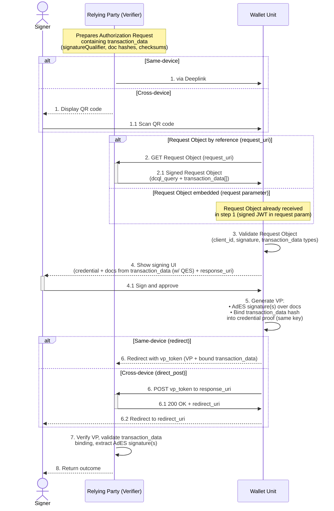
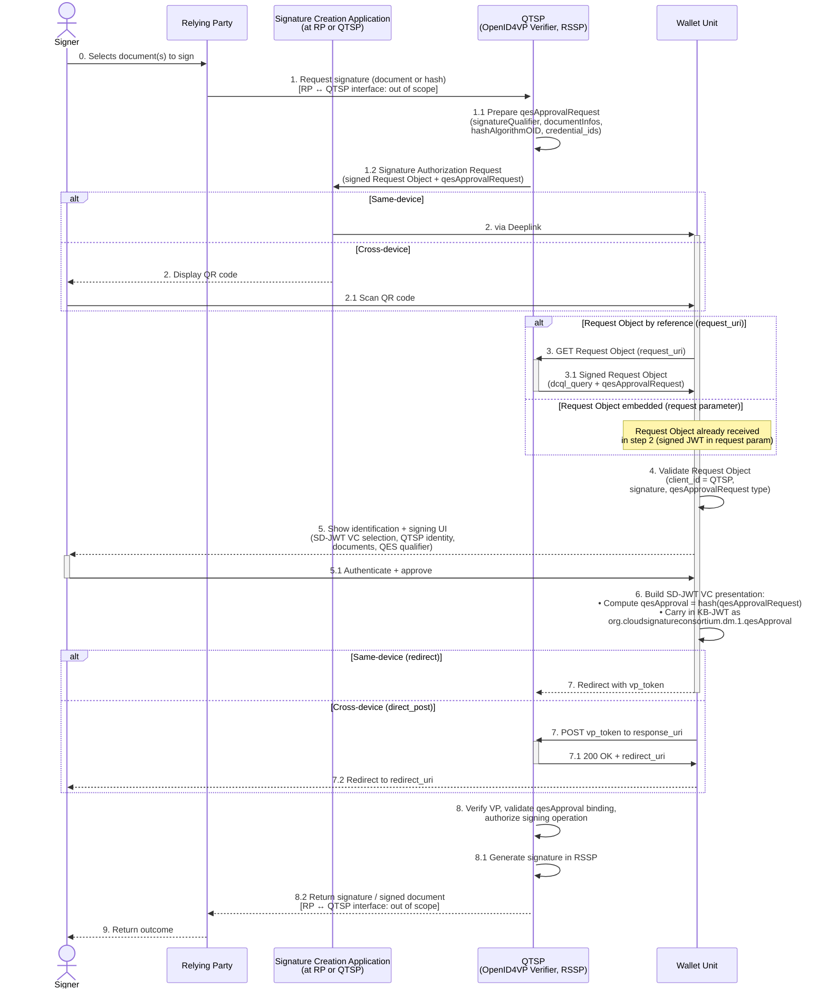

# WE BUILD - Conformance Specification: Remote Qualified Signing with Wallet Units

Version 1.1 / Draft
Date: 24 April 2026

**Authors / Contributors**: WP4 Architecture  

- Lal Chandran, iGrant.io, Sweden
- Hristian Daskalov, EvroTrust, Bulgaria
- George J Padayatti, iGrant.io, Sweden
- Andreas Abraham, ValidatedID, Spain
- Alejandro Nieto, DigitelTS, Spain
- Hidde Dorhout, Cleverbase, Netherlands
- Andrew Freund, D-Trust, Germany

**Table of Contents**
- [WE BUILD - Conformance Specification: Remote Qualified Signing with Wallet Units](#we-build---conformance-specification-remote-qualified-signing-with-wallet-units)
- [1. Introduction](#1-introduction)
- [2. Scope](#2-scope)
- [3. Normative Language](#3-normative-language)
- [4. Roles and Components](#4-roles-and-components)
  - [4.1 Wallet-Centric Model](#41-wallet-centric-model)
  - [4.2 QTSP-Centric Model](#42-qtsp-centric-model)
- [5. Protocol Overview](#5-protocol-overview)
  - [5.1 Wallet-Centric Model](#51-wallet-centric-model)
  - [5.2 QTSP-Centric Model](#52-qtsp-centric-model)
- [6. High-level Flows](#6-high-level-flows)
  - [6.1 Wallet-Centric Signing Flow (qesRequest)](#61-wallet-centric-signing-flow-qesrequest)
    - [6.1.1 Signature Request Creation](#611-signature-request-creation)
    - [6.1.2 Wallet Unit Invocation](#612-wallet-unit-invocation)
    - [6.1.3 Wallet Unit Validation](#613-wallet-unit-validation)
    - [6.1.4 Signer Consent](#614-signer-consent)
    - [6.1.5 Signature Generation](#615-signature-generation)
    - [6.1.6 Presentation Submission](#616-presentation-submission)
    - [6.1.7 Result Handling](#617-result-handling)
  - [6.2 QTSP-Centric Signing Flow (qesApproval)](#62-qtsp-centric-signing-flow-qesapproval)
    - [6.2.1 Signature Authorization Request Creation](#621-signature-authorization-request-creation)
    - [6.2.2 Wallet Unit Invocation](#622-wallet-unit-invocation)
    - [6.2.3 Wallet Unit Validation](#623-wallet-unit-validation)
    - [6.2.4 Signer Consent](#624-signer-consent)
    - [6.2.5 qesApproval Generation](#625-qesapproval-generation)
    - [6.2.6 Presentation Submission](#626-presentation-submission)
    - [6.2.7 Result Handling](#627-result-handling)
- [7. Normative Requirements](#7-normative-requirements)
  - [7.1 Wallet Unit Requirements](#71-wallet-unit-requirements)
    - [7.1.1 Wallet-Centric Model](#711-wallet-centric-model)
    - [7.1.2 QTSP-Centric Model](#712-qtsp-centric-model)
  - [7.2 Relying Party Requirements](#72-relying-party-requirements)
  - [7.3 Remote Signing Service Provider Considerations](#73-remote-signing-service-provider-considerations)
- [8. Interface Definitions](#8-interface-definitions)
  - [8.1 Signing Request Object Interface (Wallet-Centric)](#81-signing-request-object-interface-wallet-centric)
  - [8.2 Signing Authorization Request Object Interface (QTSP-Centric)](#82-signing-authorization-request-object-interface-qtsp-centric)
  - [8.3 Presentation Endpoint](#83-presentation-endpoint)
    - [8.3.1 Wallet-Centric Model](#831-wallet-centric-model)
    - [8.3.2 QTSP-Centric Model](#832-qtsp-centric-model)
  - [8.4 Verifier Metadata Interface](#84-verifier-metadata-interface)
- [9. Conformance](#9-conformance)
- [References](#references)

# 1. Introduction

This document defines the **WE BUILD Conformance Specification: Remote Qualified Signing with Wallet Units**, describing how Wallet Units (WU) and other actors interoperate to create qualified electronic signatures using OpenID for Verifiable Presentations (OpenID4VP) 1.0 [1] and the CSC Data Model Bindings [3].

This specification extends the WE BUILD Conformance Specification: Credential Presentation [5] (hereafter CS-02). All requirements defined in CS-02 apply unless explicitly superseded here. This document defines only the signing-specific additions.

Two interaction models are specified:

- **Wallet-Centric Model** — the Wallet Unit holds the signing key, and the signature is generated locally on the Signer's device using the CSC X.509 credential format and the `qesRequest` transaction data type.
- **QTSP-Centric Model** — the signing key is held in a Qualified Signature Creation Device (QSCD) operated by a Qualified Trust Service Provider (QTSP). The Wallet Unit is used for Signer identification and signature authorization, using an SD-JWT VC credential that carries a `qesApproval` binding as defined in CSC-DMB [3] Section 7.2.1.2. CSC-DMB [3] Section 7.3 refers to this as the "Provider-centric model".

> **NOTE_CSRS_00** In this specification, "remote" refers to the interaction pattern between the Signer and the other parties, in which signing-related requests and responses are exchanged over the network via OpenID4VP. In the Wallet-Centric Model, the Wallet Unit holds the signing key and generates the signature locally — "remote" does not imply a remote signing service in this model. In the QTSP-Centric Model, the signing key is held in a QSCD operated by the QTSP, and the signature is generated remotely upon authorization from the Signer.

It covers:

- Signing request and response flows using the CSC `qesRequest` transaction data type [3] for the Wallet-Centric Model.
- Signature authorization flows using the CSC `qesApprovalRequest` transaction data type [3] for the QTSP-Centric Model.
- Support for the CSC X.509 credential format (Wallet-Centric Model) and the SD-JWT VC credential format with `qesApproval` binding (QTSP-Centric Model).
- Signer consent requirements specific to qualified electronic signatures.
- Inline and out-of-band signed document delivery (Wallet-Centric Model).

# 2. Scope

This specification defines the conformance profile for remote qualified electronic signature creation. It applies in addition to CS-02 [5].

Requirements are defined for:

- Wallet Units that respond to signing requests (Wallet-Centric Model) and signature authorization requests (QTSP-Centric Model).
- Relying Parties that initiate signing requests in the Wallet-Centric Model.

Mandatory features beyond CS-02:

**Wallet-Centric Model**

- CSC `qesRequest` transaction data type [3].
- CSC X.509 credential format (`https://cloudsignatureconsortium.org/2025/x509`).
- AdES signature generation in the Wallet Unit.
- Inline and out-of-band (`responseURI`) response delivery.

**QTSP-Centric Model**

- CSC `qesApprovalRequest` transaction data type [3] Section 7.1.
- SD-JWT VC credential format carrying the `qesApproval` binding as defined in [3] Section 7.2.1.2.

**Common**

- Signer consent rendering requirements.

Out of scope:

- All requirements already covered by CS-02 [5].
- The CSC API endpoints used between a Relying Party and a QTSP in the QTSP-Centric Model (for example `signatures/signDoc` and `signatures/signHash`), and any QTSP-proprietary API used for the same purpose.
- The identification and registration procedures by which a Signer obtains a signing credential from a QTSP.
- The credential used for signature request confirmation in the Wallet-Centric Model.

> **NOTE_CSRS_01** The Relying Party ↔ QTSP interface in the QTSP-Centric Model is intentionally not normatively specified by this document. Implementations MAY use the CSC Architectures and Protocols for Remote Signature Applications v2 API, a QTSP-proprietary API, or any other agreed mechanism. This document only specifies the OpenID4VP leg between the QTSP and the Wallet Unit.

# 3. Normative Language

As defined in CS-02 [5] Section 3.

# 4. Roles and Components

This specification uses the roles defined in CS-02 [5] Section 4, with substitutions and additions per model.

## 4.1 Wallet-Centric Model

- **Holder** is referred to as **Signer** in this specification.
- **Verifier** is referred to as **Relying Party (RP)** in this specification.
- The Wallet Unit acts as both credential holder and Signature Creation Application, producing AdES signatures locally.

## 4.2 QTSP-Centric Model

- **Holder** is referred to as **Signer** in this specification.
- **Relying Party (RP)** is the organisation or natural person requesting a document to be signed.
- **Qualified Trust Service Provider (QTSP)** operates a **Remote Signing Service Provider (RSSP)** as defined in CSC-DMB [3] Section 4. The RSSP manages signing keys in a QSCD on the Signer's behalf.
- **Signature Creation Application** is the application that accepts the Signer's original document and produces a signature or signed document in accordance with AdES (per CSC-DMB [3] Section 4 and ETSI EN 319 102-1 [7]). The Signature Creation Application MAY be operated by the Relying Party or by the QTSP.
- In the OpenID4VP exchange specified by this section, the **QTSP plays the Verifier role** toward the Wallet Unit for the signature authorization step. The Relying Party is not a direct party to this OpenID4VP exchange.
- The Wallet Unit is used by the Signer for identification (via PID or equivalent EAA presentation) and for authorization and activation of the signing operation. Signing keys are not held by the Wallet Unit in this model.

> **NOTE_CSRS_02** Terminology note: CSC-DMB [3] Section 7.3 refers to the QTSP-Centric Model as the "Provider-centric model". The two terms are equivalent.

# 5. Protocol Overview

This specification applies the protocol baseline defined in CS-02 [5] Section 5 without modification, with the signing-specific additions in this section.

## 5.1 Wallet-Centric Model

Additions on top of CS-02:

- The Authorisation Request MUST include `transaction_data` containing a base64url-encoded `qesRequest` object as defined in CSC-DMB [3] Section 6.2.1.
- `signatureQualifier` MUST always be present in the `qesRequest`.
- Document integrity MUST be verified by the Wallet Unit when both `href` and `checksum` are present.

High-level steps:

1. Relying Party creates a Signing Request containing a `qesRequest` transaction data object.
2. Wallet Unit is invoked via `openid4vp://` (same-device) or QR code (cross-device).
3. Wallet Unit validates the Signing Request.
4. Signer reviews documents and consents.
5. Wallet Unit generates AdES signature(s).
6. Wallet Unit submits the Presentation Response containing the signed document(s).
7. Relying Party validates and returns the outcome.

The above flow is illustrated below:



<br>

## 5.2 QTSP-Centric Model

Additions on top of CS-02:

- The QTSP acts as the OpenID4VP Verifier toward the Wallet Unit.
- The Authorisation Request MUST include `transaction_data` containing a base64url-encoded `qesApprovalRequest` object as defined in CSC-DMB [3] Section 7.1.
- `signatureQualifier` MUST always be present in the `qesApprovalRequest`.
- The Wallet Unit MUST return a `qesApproval` value in the Key Binding JWT of the SD-JWT VC presentation, computed as defined in CSC-DMB [3] Section 7.2.1.2.

High-level steps:

1. The Relying Party (directly, or via its Signature Creation Application) requests the QTSP to sign one or more documents.
2. The QTSP (directly, or via its Signature Creation Application) prepares a Signature Authorization Request containing a `qesApprovalRequest` transaction data object.
3. The Signature Creation Application invokes the Wallet Unit via `openid4vp://` (same-device) or QR code (cross-device).
4. The Wallet Unit validates the Request Object, including that the OpenID4VP Verifier is the expected QTSP.
5. The Signer identifies themselves (PID, or EAA from prior enrolment) and authorizes the signature. The Signer identification and the QES authorization MAY be conveyed in a single OpenID4VP request, or in two separate OpenID4VP requests.
6. The Wallet Unit returns the SD-JWT VC presentation, whose Key Binding JWT carries the `qesApproval` value bound to the `qesApprovalRequest`.
7. The QTSP validates the presentation and the `qesApproval` binding, activates the signature creation operation, and generates the signature using its RSSP.
8. The signature value is returned to the Relying Party (and integrated into the document by the Signature Creation Application), which returns the outcome to the Signer. This step uses the Relying Party ↔ QTSP interface and is out of scope of this specification.

The flow is illustrated below:



<br>

> **NOTE_CSRS_03** CSC-DMB [3] Section 7.1 Note 16 explicitly warns that the `qesApprovalRequest` transaction data type may change in future versions. Implementations of this specification SHOULD be prepared to track those changes.

> **NOTE_CSRS_04** ISO/IEC 18013-5 and ISO/IEC 18013-7 credential formats will be considered in subsequent versions based on use case requirements.

# 6. High-level Flows

## 6.1 Wallet-Centric Signing Flow (qesRequest)

The subsections below apply to both the same-device and cross-device variants of the Wallet-Centric Signing Flow. The cross-device variant follows CS-02 [5] Section 6.2 (rather than Section 6.1) at each corresponding step. Where the two variants differ, the difference is noted inline.

### 6.1.1 Signature Request Creation

The Relying Party prepares a signed Presentation Request Object as defined in CS-02 [5] Section 6.1.1, with the following additional requirements:

- The DCQL query MUST contain a credential entry with `format: "https://cloudsignatureconsortium.org/2025/x509"` and optionally `certificatePolicies` or `certificateFingerprints` in the `meta` field.
- `transaction_data` MUST contain a base64url-encoded `qesRequest` specifying `type`, `credential_ids`, `signatureQualifier`, and at least one `signatureRequests` entry.

### 6.1.2 Wallet Unit Invocation

As defined in CS-02 [5] Section 6.1.2 for the same-device variant (deeplink), or CS-02 [5] Section 6.2.2 for the cross-device variant (QR code).

### 6.1.3 Wallet Unit Validation

As defined in CS-02 [5] Section 6.1.3, with the following additional checks:

- `transaction_data` MUST decode to a valid `qesRequest`.
- `signatureQualifier` MUST be present and recognised.
- The available credential MUST be capable of producing a QES with the specified `signatureQualifier`; if not, the Wallet Unit MUST abort.
- If both `href` and `checksum` are present in a `signatureRequest`, the Wallet Unit MUST verify document integrity; if verification fails, the Wallet Unit MUST abort.

### 6.1.4 Signer Consent

In addition to the consent requirements of CS-02 [5] Section 6.1.4, the Wallet Unit MUST display:

- A clear indication that the transaction creates a qualified electronic signature or seal.
- The trust framework identified by `signatureQualifier`.
- The label of each document, or a clear indication that no label is provided.
- Whether document integrity has been automatically verified.
- The URI to which the signed response will be sent, if `responseURI` is specified.

The Wallet Unit SHOULD provide a preview or rendering of the to-be-signed document(s) where technically feasible, to allow the Signer to verify the content before approving.

### 6.1.5 Signature Generation

Upon consent, the Wallet Unit MUST generate AdES signature(s) per the `signature_format` and `conformance_level` specified in each `signatureRequest`.

### 6.1.6 Presentation Submission

As defined in CS-02 [5] Section 6.1.6 for the same-device variant (redirect with `vp_token`), or CS-02 [5] Section 6.2.6 for the cross-device variant (HTTP POST to `response_uri`), with the following additions:

The `vp_token` MUST include a `qes` object containing either:

- `documentWithSignature`: base64-encoded signed document(s), for enveloped formats (e.g. PAdES).
- `signatureObject`: base64-encoded detached signature(s).

If `responseURI` is specified in the `qesRequest`, the Wallet Unit MUST HTTP POST the `qesResponse` to that URI as defined in Section 8.3.1, and MUST return an empty credential response in the `vp_token`.

### 6.1.7 Result Handling

As defined in CS-02 [5] Section 6.1.7.

## 6.2 QTSP-Centric Signing Flow (qesApproval)

The subsections below apply to both the same-device and cross-device variants of the QTSP-Centric Signing Flow. The cross-device variant follows CS-02 [5] Section 6.2 (rather than Section 6.1) at each corresponding step. Where the two variants differ, the difference is noted inline.

### 6.2.1 Signature Authorization Request Creation

The QTSP (directly, or via its Signature Creation Application) prepares a signed Presentation Request Object as defined in CS-02 [5] Section 6.1.1, with the following additional requirements:

- The `client_id` of the Request Object MUST identify the QTSP and MUST be resolvable to the QTSP's published metadata in the applicable trust framework.
- The DCQL query MUST request a credential in SD-JWT VC format whose issuance supports the `org.cloudsignatureconsortium.dm.1.qesApproval` claim as defined in CSC-DMB [3] Section 7.2.1.2.
- `transaction_data` MUST contain a base64url-encoded `qesApprovalRequest` as defined in CSC-DMB [3] Section 7.1, specifying at minimum `type`, `credential_ids`, `signatureQualifier`, `documentInfos`, and `hashAlgorithmOID`.

Signer identification (for example via PID presentation) and QES authorization MAY be conveyed in a single OpenID4VP authorization request (multiple DCQL credential queries plus the `qesApprovalRequest`) or in two separate OpenID4VP authorization requests, at the QTSP's discretion. Wallet Units MUST support both patterns.

### 6.2.2 Wallet Unit Invocation

As defined in CS-02 [5] Section 6.1.2 for the same-device variant (deeplink), or CS-02 [5] Section 6.2.2 for the cross-device variant (QR code). The Signature Creation Application is the invoker; the OpenID4VP Verifier that signed the Request Object is the QTSP.

### 6.2.3 Wallet Unit Validation

As defined in CS-02 [5] Section 6.1.3, with the following additional checks:

- The `client_id` of the Request Object MUST resolve to a QTSP listed in the applicable trust framework, and the Request Object signature MUST verify against that QTSP's published metadata.
- `transaction_data` MUST decode to a valid `qesApprovalRequest`.
- `signatureQualifier` MUST be present and recognised.
- The selected SD-JWT VC MUST support the `org.cloudsignatureconsortium.dm.1.qesApproval` claim (typically, by being issued with a type whose rulebook declares the claim); if not, the Wallet Unit MUST abort.
- If any `documentInfos` entry contains both a `href` and a `checksum`, the Wallet Unit MUST verify document integrity; if verification fails, the Wallet Unit MUST abort.

### 6.2.4 Signer Consent

In addition to the consent requirements of CS-02 [5] Section 6.1.4, the Wallet Unit MUST display:

- A clear indication that the transaction authorizes a qualified electronic signature or seal to be created by the QTSP's Remote Signing Service Provider.
- The identity of the QTSP operating the RSSP that will perform the signature creation.
- The trust framework identified by `signatureQualifier`.
- The label of each document in `documentInfos`, or a clear indication that no label is provided.
- The number of signatures authorized, if `numSignatures` is present in the `qesApprovalRequest`.
- Whether document integrity has been automatically verified.

The Wallet Unit SHOULD provide a preview or rendering of the to-be-signed document(s) where technically feasible.

### 6.2.5 qesApproval Generation

Upon consent, the Wallet Unit MUST compute the `qesApproval` value as defined in CSC-DMB [3] Section 7.2.1.2:

- Hash input: the base64url-encoded UTF-8 `qesApprovalRequest` as it appears in the Authorization Request.
- Hash algorithm: as identified by `hashAlgorithmOID` in the `qesApprovalRequest`.
- Representation: a String containing the base64-encoded digest.

The `qesApproval` value MUST be carried in the Key Binding JWT of the SD-JWT VC presentation, as a top-level claim with key `org.cloudsignatureconsortium.dm.1.qesApproval`.

### 6.2.6 Presentation Submission

As defined in CS-02 [5] Section 6.1.6 for the same-device variant (redirect with `vp_token`), or CS-02 [5] Section 6.2.6 for the cross-device variant (HTTP POST to `response_uri`). The `vp_token` MUST contain the SD-JWT VC presentation with its Key Binding JWT carrying the `org.cloudsignatureconsortium.dm.1.qesApproval` claim. No `qes` object (as defined in Section 6.1.6 for the Wallet-Centric Model) is produced in this model; the signature itself is generated remotely by the RSSP after the QTSP validates the `qesApproval` binding.

### 6.2.7 Result Handling

As defined in CS-02 [5] Section 6.1.7. After the QTSP validates the presentation and the `qesApproval` binding, the signature is created by the RSSP and returned to the Relying Party via the Relying Party ↔ QTSP interface, which is out of scope of this specification (see NOTE_CSRS_01).

# 7. Normative Requirements

## 7.1 Wallet Unit Requirements

In addition to all requirements in CS-02 [5] Section 7.1, Wallet Units MUST support the Wallet-Centric Model as defined in Section 7.1.1. Wallet Units that claim QTSP-Centric Model support MUST additionally comply with Section 7.1.2.

### 7.1.1 Wallet-Centric Model

Wallet Units MUST:

1. Support the CSC X.509 credential format (`https://cloudsignatureconsortium.org/2025/x509`).
2. Process `qesRequest` transaction data as defined in CSC-DMB [3] Section 6.2.1.
3. Verify document integrity against `checksum` when both `href` and `checksum` are present.
4. Support `data:` URIs with base64 encoding in `href`.
5. Display the signing-specific consent information defined in Section 6.1.4.
6. Generate AdES signatures per the specified `signature_format` and `conformance_level`.
7. Support inline response delivery via `documentWithSignature` or `signatureObject`.
8. Support out-of-band response delivery via `responseURI`.

Wallet Units MUST NOT:

- Proceed if document integrity verification fails.
- Proceed if the credential cannot satisfy the specified `signatureQualifier`.

### 7.1.2 QTSP-Centric Model

Wallet Units MUST:

1. Support the SD-JWT VC credential format for credentials that carry the `org.cloudsignatureconsortium.dm.1.qesApproval` claim as defined in CSC-DMB [3] Section 7.2.1.2.
2. Process `qesApprovalRequest` transaction data as defined in CSC-DMB [3] Section 7.1.
3. Verify that the OpenID4VP `client_id` resolves to a QTSP in the applicable trust framework, and verify the Request Object signature against that QTSP's published metadata.
4. Verify document integrity against `checksum` when both `href` and `checksum` are present in a `documentInfos` entry.
5. Compute the `qesApproval` value as defined in CSC-DMB [3] Section 7.2.1.2 and carry it in the Key Binding JWT as a top-level claim `org.cloudsignatureconsortium.dm.1.qesApproval`.
6. Display the signing-specific consent information defined in Section 6.2.4.
7. Interoperate with both the single-request pattern (PID and `qesApprovalRequest` bundled in one OpenID4VP authorization request) and the separate-request pattern (PID presentation followed by a `qesApprovalRequest` authorization request).

Wallet Units MUST NOT:

- Proceed if the selected credential does not support the `org.cloudsignatureconsortium.dm.1.qesApproval` claim.
- Proceed if document integrity verification fails.
- Return a `qesApproval` claim for credentials not issued with the intention of supporting QES authorization (see CSC-DMB [3] Section 7.2.1.2, Note 22).

## 7.2 Relying Party Requirements

These requirements apply to Relying Parties operating in the Wallet-Centric Model. In the QTSP-Centric Model, the Relying Party's obligations are limited to the Relying Party ↔ QTSP interface, which is out of scope of this specification (see NOTE_CSRS_01).

In addition to all requirements in CS-02 [5] Section 7.2, Relying Parties MUST:

1. Include `transaction_data` with a valid `qesRequest` in every signing request.
2. Include `signatureQualifier` in every `qesRequest`.
3. Use the CSC X.509 credential format in the DCQL query.
4. Provide a valid access method (`public` or `OTP`) for all `href` document references.
5. If using `responseURI`: implement an HTTPS endpoint accepting HTTP POST as defined in Section 8.3.1.

Relying Parties MUST NOT:

- Omit `signatureQualifier` from `qesRequest` objects.

## 7.3 Remote Signing Service Provider Considerations

This section is informative.

In the QTSP-Centric Model, the QTSP operating the Remote Signing Service Provider plays the OpenID4VP Verifier role toward the Wallet Unit for the signature authorization step. Implementations are expected to:

- Sign the Authorization Request Object with a key bound to the QTSP's published metadata, such that the Wallet Unit's `client_id` validation succeeds against the applicable trust framework.
- Include a well-formed `qesApprovalRequest` in `transaction_data` as defined in CSC-DMB [3] Section 7.1.
- Upon receipt of the `vp_token`, validate the `qesApproval` value in the Key Binding JWT against the base64url-encoded `qesApprovalRequest` as dispatched, using the algorithm identified by `hashAlgorithmOID`.
- Use the validated `qesApproval` binding as the authorization basis for the subsequent signature creation call on the RSSP.

Detailed conformance of the RSSP itself (including signature creation, activation, and the Relying Party ↔ QTSP interface) is out of scope of this specification.

# 8. Interface Definitions

Interfaces in this specification follow the structure defined in CS-02 [5] Section 8. The Wallet Invocation Interface defined in CS-02 [5] Section 8.1 applies without modification.

## 8.1 Signing Request Object Interface (Wallet-Centric)

The Presentation Request Object MUST satisfy CS-02 [5] Section 8.2, with the following additions.

The DCQL query MUST include a credential entry of the following form:

```json
{
  "id": "signing-cert-01",
  "format": "https://cloudsignatureconsortium.org/2025/x509",
  "meta": {
    "certificatePolicies": ["0.4.0.2042.1"]
  }
}
```

The `transaction_data` array MUST contain the following object, base64url-encoded:

```json
{
  "type": "https://cloudsignatureconsortium.org/2025/qes",
  "credential_ids": ["signing-cert-01"],
  "signatureQualifier": "eu_eidas_qes",
  "signatureRequests": [
    {
      "label": "Example Contract",
      "access": { "type": "public" },
      "href": "https://rp.example.org/documents/contract.pdf",
      "checksum": "sha256-HZQzZmMAIWekfGH0/ZKW1nsdt0xg3H6bZYztgsMTLw0=",
      "signature_format": "P",
      "conformance_level": "AdES-B-B",
      "signed_envelope_property": "Certification"
    }
  ]
}
```

> **NOTE_CSRS_05** In this profile, the base64url-decoded `transaction_data` value is the CSC `qesRequest` object with `type` `https://cloudsignatureconsortium.org/2025/qes`. The `credential_ids` values refer to the `id` of the associated DCQL credential query, and not to CSC API `credentialID` values. For interoperability with Wallet Units that validate `transaction_data` strictly, Relying Parties should not include additional profile-specific members unless this specification defines them.

## 8.2 Signing Authorization Request Object Interface (QTSP-Centric)

The Presentation Request Object MUST satisfy CS-02 [5] Section 8.2, with the following additions.

- The `client_id` MUST identify the QTSP and MUST be resolvable to the QTSP's published metadata.
- The Request Object MUST be signed by a key bound to that metadata.

The DCQL query MUST include a credential entry requesting an SD-JWT VC suitable for QES approval, for example:

```json
{
  "id": "qes-approval-01",
  "format": "dc+sd-jwt",
  "meta": {
    "vct_values": ["https://example-qtsp.eu/credentials/service-user/1.0"]
  }
}
```

The credential requested MUST be one whose issuance policy supports the `org.cloudsignatureconsortium.dm.1.qesApproval` claim as defined in CSC-DMB [3] Section 7.2.1.2.

The `transaction_data` array MUST contain the following object, base64url-encoded:

```json
{
  "type": "https://cloudsignatureconsortium.org/2025/qes-approval",
  "credential_ids": ["qes-approval-01"],
  "numSignatures": 1,
  "signatureQualifier": "eu_eidas_qes",
  "documentInfos": [
    {
      "label": "Example Contract",
      "hash": "sTOgwOm+474gFj0q0x1iSNspKqbcse4IeiqlDg/HWuI=",
      "hashType": "sodr",
      "access": { "type": "public" },
      "href": "https://public.rp-cdn.example/contract-01.pdf",
      "checksum": "sha256-sTOgwOm+474gFj0q0x1iSNspKqbcse4IeiqlDg/HWuI="
    }
  ],
  "hashAlgorithmOID": "2.16.840.1.101.3.4.2.1"
}
```

> **NOTE_CSRS_06** CSC-DMB [3] Section 7.1 renders the `qesApprovalRequest` type URI consistently as `https://cloudsignatureconsortium.org/2025/qes-approval` (hyphenated) in its heading and its example (§7.1.2), while the same section's parameter table renders the identifier without the hyphen. This specification normatively uses the hyphenated form, matching the CSC example in [3] §7.1.2. Implementers should accept only the hyphenated form until the CSC specification resolves the inconsistency.

## 8.3 Presentation Endpoint

The Presentation Endpoint defined in CS-02 [5] Section 8.3 applies.

### 8.3.1 Wallet-Centric Model

The request body MUST use the following structure for inline signing responses:

```json
{
  "signing-cert-01": {
    "qes": {
      "documentWithSignature": ["<base64-encoded signed document>"]
    }
  }
}
```

When `responseURI` *(CSC-DMB parameter, not to be confused with OpenID4VP `response_uri`)* is specified in the `qesRequest`, the Wallet Unit MUST HTTP POST the `qesResponse` to that URI. The following requirements apply:

- `responseURI` MUST use the `https` scheme.
- The Wallet Unit MUST verify that the `responseURI` host matches the Relying Party's `client_id` or a domain listed in the Relying Party's verified metadata. This prevents the signed output from being redirected to an endpoint not controlled by the authenticated Relying Party, even if the Request Object itself is properly signed.
- If the HTTP POST to `responseURI` fails (network error or non-2xx response), the Wallet Unit MUST abort the signing flow and report an error to the Signer.

```
POST <responseURI path> HTTP/1.1
Host: <responseURI host>
Content-Type: application/json

{ "documentWithSignature": ["<base64-encoded signed document>"] }
```

The `responseURI` endpoint MUST return `HTTP 200 OK` on successful receipt.

> **NOTE_CSRS_07** Replay protection for the signing flow is provided by the OpenID4VP `nonce` binding mandated by CS-02, combined with the `transaction_data` hash bound into the VP token. Implementations SHOULD additionally consider including an application-specific nonce in the `qesRequest` as recommended by CSC Data Model Bindings Note 25, to provide defence-in-depth at the CSC layer.

The `vp_token` returned to the Presentation Endpoint when `responseURI` is used MUST be empty:

```json
{ "signing-cert-01": {} }
```

### 8.3.2 QTSP-Centric Model

The request body MUST carry the SD-JWT VC presentation including the Key Binding JWT with the `org.cloudsignatureconsortium.dm.1.qesApproval` claim:

```json
{
  "qes-approval-01": "<SD-JWT VC presentation including KB-JWT>"
}
```

The Key Binding JWT payload MUST include, at minimum:

```json
{
  "iat": 1711449600,
  "aud": "<QTSP client_id>",
  "nonce": "<OpenID4VP nonce>",
  "org.cloudsignatureconsortium.dm.1.qesApproval": "<base64-encoded hash of base64url-encoded qesApprovalRequest>"
}
```

No `qes` object as defined for the Wallet-Centric Model is returned in this model. The signature value is produced remotely by the RSSP and delivered to the Relying Party via an interface that is out of scope of this specification (see NOTE_CSRS_01).

## 8.4 Verifier Metadata Interface

The Verifier Metadata Interface defined in CS-02 [5] Section 8.4 applies, with the following additions:

- A Relying Party supporting the Wallet-Centric Model MUST declare support for the CSC X.509 credential format in `vp_formats_supported`.
- A QTSP acting as OpenID4VP Verifier in the QTSP-Centric Model MUST declare support for the SD-JWT VC credential format in `vp_formats_supported`, and MUST publish metadata sufficient for the Wallet Unit to resolve its `client_id` and validate the Authorization Request Object signature.

# 9. Conformance

An implementation conforms to this specification as a **Wallet Unit** if it:

1. Conforms to CS-02 [5] Section 9 as a Wallet Provider.
2. Implements all Wallet Unit requirements in Section 7.1.1 of this specification (Wallet-Centric Model).
3. Supports both the same-device and cross-device variants of the Wallet-Centric Signing Flow defined in Section 6.1.

A Wallet Unit that additionally claims QTSP-Centric Model support MUST also:

4. Implement all Wallet Unit requirements in Section 7.1.2 of this specification.
5. Support both the same-device and cross-device variants of the QTSP-Centric Signing Flow defined in Section 6.2.

An implementation conforms to this specification as a **Relying Party** if it:

1. Conforms to CS-02 [5] Section 9 as a Verifier (referred to as "Issuer" in CS-02 Section 9).
2. Implements all Relying Party requirements in Section 7.2 of this specification.
3. Supports both the same-device and cross-device variants of the Wallet-Centric Signing Flow.

Conformance of a **Qualified Trust Service Provider** operating a Remote Signing Service Provider in the QTSP-Centric Model is not defined by this specification; see Section 7.3 and NOTE_CSRS_01.

# References

[1] OpenID Foundation (2025). OpenID for Verifiable Presentations 1.0. Available at: https://openid.net/specs/openid-4-verifiable-presentations-1_0.html (Accessed: 5 March 2026).

[2] OpenID Foundation (2025). OpenID4VC High Assurance Interoperability Profile - Implementer's Draft 1. Available at: https://openid.net/specs/openid4vc-high-assurance-interoperability-profile-1_0-ID1.html (Accessed: 5 March 2026).

[3] Cloud Signature Consortium (2025). CSC Data Model Bindings, version 1.0.0. Published 14 October 2025. Available at: https://cloudsignatureconsortium.org/wp-content/uploads/2025/10/data-model-bindings.pdf (Accessed: 30 March 2026)

[4] Cloud Signature Consortium (2025). Data Model for Remote Signature Applications, version 1.0.0. Published 16 October 2025. Available at: https://cloudsignatureconsortium.org/wp-content/uploads/2025/10/csc-dm.pdf (Accessed: 30 March 2026)

[5] WE BUILD (2025). Conformance Specification: Credential Presentation, version 1.0. Available at: https://github.com/webuild-consortium/wp4-architecture/blob/main/conformance-specs/cs-02-credential-presentation.md (Accessed: 5 March 2026).

[6] EWC Consortium (2025). RFC-010: Document Signing on a Remote Signing Service Provider using Long-Term Certificates, version 1.1. Available at: https://github.com/EWC-consortium/eudi-wallet-rfcs/blob/main/ewc-rfc010-long-term-certifice-qes-creation.md (Accessed: 5 March 2026).

[7] ETSI EN 319 102-1. Electronic Signatures and Trust Infrastructures (ESI); Procedures for Creation and Validation of AdES Digital Signatures; Part 1: Creation and Validation.
