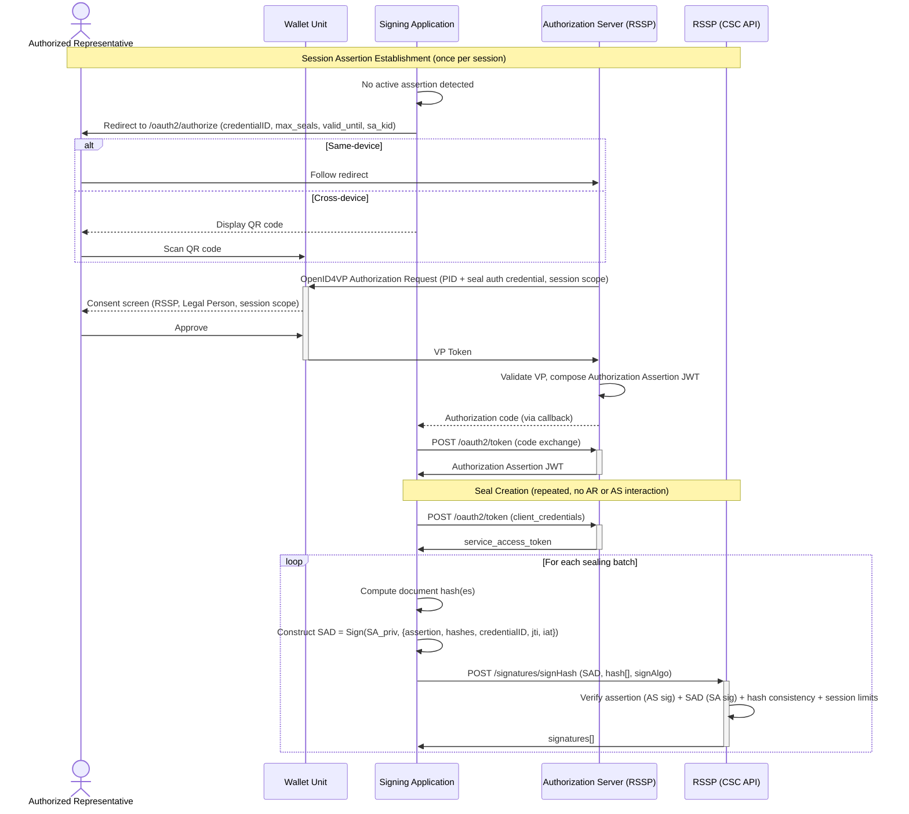

# WE BUILD - Conformance Specification: Remote Qualified Seals via CSC API

Version 0.1 / Draft  
Date: 11 May 2026

**Authors / Contributors**: WP4 Architecture

**Table of Contents**

- [WE BUILD - Conformance Specification: Remote Qualified Seals via CSC API](#we-build---conformance-specification-remote-qualified-seals-via-csc-api)
- [1. Introduction](#1-introduction)
- [2. Scope](#2-scope)
- [3. Normative Language](#3-normative-language)
- [4. Roles and Components](#4-roles-and-components)
- [5. Protocol Overview](#5-protocol-overview)
  - [5.1 Authorization Architecture](#51-authorization-architecture)
  - [5.2 Sole Control and Authorization Granularity](#52-sole-control-and-authorization-granularity)
  - [5.3 Authentication Modes for Seals](#53-authentication-modes-for-seals)
  - [5.4 Seal vs Signature: Architectural Differences](#54-seal-vs-signature-architectural-differences)
- [6. High-level Flows](#6-high-level-flows)
  - [6.1 Session-based Authorization Flow (wallet, pre-authorized)](#61-session-based-authorization-flow-wallet-pre-authorized)
  - [6.2 Per-operation Wallet Authorization Flow](#62-per-operation-wallet-authorization-flow)
- [7. Normative Requirements](#7-normative-requirements)
  - [7.1 Wallet Unit Requirements](#71-wallet-unit-requirements)
  - [7.2 Signing Application Requirements](#72-signing-application-requirements)
  - [7.3 Remote Signing Service Provider Requirements](#73-remote-signing-service-provider-requirements)
  - [7.4 Authorization Server Requirements](#74-authorization-server-requirements)
- [8. Interface Definitions](#8-interface-definitions)
  - [8.1 CSC Service Info Interface](#81-csc-service-info-interface)
  - [8.2 Service Authorization Interface](#82-service-authorization-interface)
  - [8.3 Session Assertion Interface](#83-session-assertion-interface)
  - [8.4 Signature Creation Interface](#84-signature-creation-interface)
- [9. Conformance](#9-conformance)
- [References](#references)

# 1. Introduction

This document defines the **WE BUILD Conformance Specification: Remote Qualified Seals via CSC API**, describing how Signing Applications, Wallet Units (WUs), and Remote Signing Service Providers (RSSPs) interoperate to create qualified electronic seals using the Cloud Signature Consortium API version 2.2 (CSC API v2.2) [1].

A **qualified electronic seal** is a qualified electronic signature attributed to a legal person (organisation). Under eIDAS2 [2], it assures the origin and integrity of documents issued by the organisation and carries equivalent legal effect to a handwritten signature for legal persons. Unlike qualified signatures created by natural persons, seals are controlled by the legal person and the corresponding private key is managed by a QTSP on behalf of the legal person in a server-side QSCD.

Qualified seals are typically created in **system-to-system operations at scale** — for example, sealing every outgoing invoice, certificate, or signed correspondence of an organisation. It is not practical to require per-document interaction from a natural person. At the same time, sole control of the seal key must be traceable to a deliberate human authorization decision made by an Authorized Representative of the legal person.

This specification adopts a **SA-local SAD model** to address both requirements. The Authorization Server's role is limited to authenticating the AR and issuing a signed **Authorization Assertion** to the Signing Application. The SA then constructs the Signature Activation Data (SAD) **locally** by embedding the full assertion inside a JWS signed with its own registered private key, together with the document hashes. The RSSP extracts and verifies the AS-issued assertion from the SAD payload, and verifies the SA's outer signature, before activating the QSCD.

This two-party construction gives each party an independent and non-delegable role: the AS cannot generate a SAD without the SA's private key, and the SA cannot generate a valid SAD without a genuine AS-issued assertion that traces to AR wallet authentication. Neither party alone has sufficient material to authorize a seal. The SAD is self-contained: it carries the assertion and hash binding in a single verifiable object, conforming to the standard CSC API `SAD` field without requiring additional API parameters.

> **NOTE_QSEAL_00** This specification covers the RSSP-centric architecture in which the seal key is held by the QTSP in a server-side QSCD and the Signing Application calls the CSC API to request seal creation. This is structurally different from CS-03 [6], where the Wallet Unit holds the signing key and generates the signature locally. In the seal model, the WU's role is to authenticate the Authorized Representative to the RSSP AS; it does not hold or use the seal key.

# 2. Scope

This specification defines conformance requirements for remote qualified seal creation via CSC API v2.2.

Roles in scope:

- **Signing Applications** calling the CSC API and computing SADs locally
- **Wallet Units** authenticating the Authorized Representative
- **RSSPs** verifying SA-computed SADs and activating the QSCD
- **Authorization Servers** authenticating the AR and issuing Authorization Assertions

Capabilities in scope:

- Session-based wallet authorization: AR authenticates once via OpenID4VP, the AS issues a session-scoped Authorization Assertion; SA computes SADs locally per batch (SCAL2)
- Per-operation wallet authorization: AR authenticates per signing operation, AS issues a single-operation assertion; SA computes SAD locally (SCAL2)
- CSC API v2.2 credential discovery and signature creation interfaces

Out of scope:

- Implicit (static) service authorization without AR wallet involvement: `authMode: implicit` (SCAL1 without an AR authorization chain) is not accepted for qualified seals in the WE BUILD ecosystem.
- PIN/OTP authorization: this specification requires wallet-based authentication for all qualified seal operations within WE BUILD. PIN/OTP (`authMode: PIN`, `authMode: OTP`) is not in scope.
- Local signing with keys held in the Wallet Unit (covered by CS-03 [6])
- Seal credential lifecycle management (enrolment, renewal, revocation)
- Document format requirements and AdES profile selection (governed by ETSI EN 319 102-1 [10])
- QTSP qualification procedures under eIDAS2

# 3. Normative Language

The keywords **MUST**, **MUST NOT**, **REQUIRED**, **SHALL**, **SHOULD**, **SHOULD NOT**, **RECOMMENDED**, **MAY**, and **OPTIONAL** are to be interpreted as described in RFC 2119 [3].

# 4. Roles and Components

- **Legal Person**: the organisation on whose behalf the qualified electronic seal is created. The Legal Person registers a seal credential with the RSSP and designates Authorized Representatives who may establish sessions.
- **Authorized Representative (AR)**: a natural person authorized by the Legal Person to control use of the seal. In all flows, the AR authenticates via their Wallet Unit to trigger issuance of an Authorization Assertion, before any sealing can occur.
- **Wallet Unit (WU)**: the EUDI-compliant wallet operated by the AR. The WU presents credentials (PID and/or a seal authorization credential) to the RSSP's Authorization Server via OpenID4VP when the AR authorizes a session or individual operation.
- **Signing Application (SA)**: a software component that requests seal creation from the RSSP via the CSC API. The SA holds a registered asymmetric key pair at the RSSP and uses its private key to compute SADs locally, combining the AS-issued Authorization Assertion with document hashes.
- **SA Signing Key Pair**: an asymmetric key pair held exclusively by the SA. The SA's public key is registered at the RSSP during SA onboarding; the private key is used to sign SADs and never leaves the SA. This key pair is distinct from the SA's OAuth2 service credentials.
- **Authorization Assertion**: a short-lived signed JWT issued by the AS to the SA after successful AR wallet authentication. It attests to the AR's identity, the seal credential authorized, the SA's client identity, and the session scope (validity period and/or maximum seal count). The SA uses the assertion as input to local SAD construction.
- **Signature Activation Data (SAD)**: a cryptographic proof computed locally by the SA as a JWS signed with the SA's private key. The SAD payload embeds the full Authorization Assertion JWT together with the document hashes, credentialID, and a unique identifier. The RSSP extracts the assertion from the SAD, verifies the AS signature on it, and verifies the SA's outer JWS signature, confirming that the sealing batch was authorized by both the AS (via the embedded assertion) and the SA (via the private key signature).
- **Remote Signing Service Provider (RSSP)**: a QTSP that manages the Legal Person's seal credential (X.509 certificate and private key in a server-side QSCD) and exposes a CSC API v2.2 interface. The RSSP verifies both the Authorization Assertion and the SA-computed SAD before activating the QSCD.
- **Authorization Server (AS)**: the OAuth2 authorization server operated by the RSSP. It authenticates the AR via OpenID4VP, issues service access tokens, and issues Authorization Assertions to the SA. The AS does not create SADs.

# 5. Protocol Overview

## 5.1 Authorization Architecture

This specification replaces the standard CSC API `credentials/authorize` SAD-issuance step with a **SA-local SAD construction** model. The interaction has three distinct phases:

1. **Service Authorization**: The SA authenticates itself to the RSSP using OAuth2 client credentials, obtaining a `service_access_token` for all CSC API calls.

2. **Session Assertion Issuance**: The AR authenticates via their WU through an OAuth2 authorization code flow at the RSSP AS. The AS validates the AR's VP, then issues a signed **Authorization Assertion** (JWT) to the SA. The assertion encodes: the AR's identity, the authorized `credentialID`, the SA's client identity, and the session scope (maximum seal count, validity period).

3. **SA-local SAD Construction and Seal Creation**: For each sealing batch, the SA:
   - Computes the document hashes locally
   - Constructs the SAD as a JWS signed with its registered private key over `{ assertion: "<full-assertion-JWT>", hash[], credentialID, iat, jti }`
   - Calls `POST /signatures/signHash` presenting the SAD and the document hashes — no additional `assertion` parameter is needed
   - The RSSP extracts the assertion from the SAD payload, verifies the AS signature on it, verifies the SA's outer JWS signature, checks hash consistency, and enforces session limits before activating the QSCD

`credentials/authorize` is not called for SAD derivation in this profile. The `credentials/list` and `credentials/info` endpoints are used unchanged for credential discovery. This SAD profile conforms to the standard CSC API `SAD` field semantics — no new top-level request parameters are introduced.

## 5.2 Sole Control and Authorization Granularity

This specification targets SCAL2 for all flows. The SA-local SAD model achieves SCAL2 sole control through a two-party construction where:

- The **AS** provides the Authorization Assertion: signed with the AS private key, bound to the AR's authenticated identity and the SA's client identity. The SA cannot forge an assertion; it requires genuine AR wallet authentication.
- The **SA** provides the SAD: signed with the SA's registered private key, bound to the specific document hashes. The AS cannot compute a SAD; it does not hold the SA's private key.

Neither party alone can generate a valid (`assertion`, `SAD`) pair accepted by the RSSP.

The granularity of the AR's authorization is determined by the session scope in the assertion:

- **Session-based authorization** (primary): the AR issues an assertion with `max_seals > 1` and a `valid_until` timestamp. The SA operates autonomously within the session. The AR's deliberate authorization act is establishing the session scope; individual SAD construction is system-to-system.
- **Per-operation authorization**: the AR issues an assertion with `max_seals: 1`. Used when individual review of each sealing act is required.

> **NOTE_QSEAL_01** The session-based model satisfies SCAL2 because each SAD is hash-bound (created over specific document hashes at batch time) and requires the SA's private key — a key that was registered with the RSSP and whose use is independently tracked. The AR's authentication event (session establishment) is the human activation that justifies the session scope. This is analogous to a signature wafer seal: the authorized person stamps the wax (establishes the session), and the automated process uses that seal within the authorized limits.

## 5.3 Authentication Modes for Seals

The `authMode` value `oauth2code` is used for both session-based and per-operation wallet authorization. The distinction lies in the session scope in the Authorization Assertion.

| Flow | Authorization Assertion scope | AR interaction | Wallet involved |
|---|---|---|---|
| Session-based | `max_seals > 1`, `valid_until` | Once per session | Yes — at session establishment and renewal |
| Per-operation | `max_seals: 1` | Per signing operation | Yes — per operation |

## 5.4 Seal vs Signature: Architectural Differences

| Aspect | Qualified Signature (CS-03 [6]) | Qualified Seal (this spec) |
|---|---|---|
| Subject | Natural person | Legal person |
| Key location | Wallet Unit (WSCD) | RSSP (server-side QSCD) |
| Sole control proof | WSCD-protected key in WU | Two-party: AS assertion (AR auth) + SA-computed SAD (SA private key) |
| Wallet role | Holds key; generates AdES signature; responds to OpenID4VP | Authenticates AR to RSSP AS to trigger assertion issuance |
| SAD construction | In WU WSCD | Locally in SA, using SA private key |
| Primary protocol | OpenID4VP (signing request sent to WU) | CSC API v2.2 + WE BUILD SAD profile; WU authenticates AR at session establishment |
| Consent shown by WU | Signing consent (document, QES indication) | Session authorization consent (scope, limits, Legal Person identity) |

# 6. High-level Flows

## 6.1 Session-based Authorization Flow (wallet, pre-authorized)

This is the primary flow for system-to-system qualified sealing at scale. The AR authenticates once via wallet to establish a session. The SA then constructs SADs and creates seals autonomously within the session, without further AR or AS involvement.

### 6.1.1 Session Assertion Establishment

The SA detects that no active Authorization Assertion exists (or that the current one is near expiry or exhaustion) and redirects the AR to the RSSP AS OAuth2 authorization endpoint. The request includes the target `credentialID`, the requested session scope (`max_seals`, `valid_until`), and the SA's registered `kid` (the identifier of the SA public key to embed in the assertion):

- **Same-device**: the SA redirects the AR's user agent to the AS authorization endpoint.
- **Cross-device**: the SA displays a QR code encoding the authorization endpoint URL; the AR scans it with their WU.

The RSSP AS acts as an OpenID4VP Verifier [4] and sends an Authorization Request to the AR's WU. The WU presents a VP containing:

- A **PID** credential confirming the AR's natural person identity
- A **seal authorization credential** confirming the AR's authorization to act for the Legal Person (see NOTE_QSEAL_02)

The WU MUST display a consent screen identifying: the verifier (RSSP), the Legal Person, the purpose (authorizing seal creation), and the requested session scope (validity period and/or maximum seal count).

The AS validates the VP, verifies the AR is registered for the target `credentialID`, and issues an Authorization Code. The SA exchanges this for an **Authorization Assertion JWT** at `POST /oauth2/token`. The SA stores this assertion securely.

> **NOTE_QSEAL_02** The type and required claims of the seal authorization credential are RSSP-specific and MUST be documented in the RSSP's published policy. In the absence of a standardized mandate credential format in the WE BUILD ecosystem, implementations SHOULD use the PID in combination with the RSSP's own AR registry (bound at enrolment) as the minimum proof. A dedicated seal authorization credential type will be addressed in a future version of this specification.

### 6.1.2 SA-local SAD Construction and Seal Creation

For each sealing batch, the SA operates autonomously without contacting the AS:

1. Obtains a `service_access_token` via OAuth2 client credentials (refreshed as needed).
2. Computes the document hash(es) to be sealed.
3. Constructs the SAD as a JWS signed with the SA's private key over the payload: `{ assertion: "<full-assertion-JWT>", hash[], credentialID, iat, jti }` — embedding the full Authorization Assertion JWT received in Section 6.1.1.
4. Calls `POST /signatures/signHash` presenting the `SAD` and the `hash[]`. The RSSP extracts the assertion from the SAD payload, verifies the AS signature on it, verifies the SA's outer JWS signature, checks hash consistency, and enforces session limits before activating the QSCD.

No AR interaction and no AS contact occurs during steps 1–4. The AR is only involved when establishing or renewing a session (Section 6.1.1).

> **NOTE_QSEAL_03** Embedding the full assertion JWT inside the SAD JWS payload cryptographically binds the SAD to the specific assertion under which it was created — stronger than a hash reference, since the RSSP can verify the AS signature directly from the SAD without a separate `assertion` parameter. This prevents SAD portability across sessions and ensures the RSSP can verify the full chain in a single self-contained object: AS authorized this session for this AR and this SA, and the SA authorized these specific document hashes within that session.

### 6.1.3 Session Renewal

When the Authorization Assertion expires or `max_seals` is reached, the SA repeats Section 6.1.1 to obtain a new assertion. The SA SHOULD proactively initiate renewal before expiry to avoid interruption.



## 6.2 Per-operation Wallet Authorization Flow

This flow applies when per-operation AR authorization is required — for high-value individual seals where the AR should explicitly authorize each sealing act. The AS issues an Authorization Assertion scoped to a single operation (`max_seals: 1`). The SA constructs the SAD locally as in Section 6.1.2.

### 6.2.1 Service Authentication

The SA authenticates to the RSSP's AS using OAuth2 client credentials, obtaining a `service_access_token`.

### 6.2.2 Credential Discovery

The SA calls `POST /credentials/info` for the target credential to confirm `authMode`, certificate details, and algorithm parameters.

### 6.2.3 Per-operation Assertion Establishment

The SA redirects the AR to the AS OAuth2 authorization endpoint with `credentialID`, `max_seals: 1`, and optionally a `description` of the sealing operation. Device handoff and wallet presentation follow Section 6.1.1. The WU consent screen MUST identify the specific operation via the `description` parameter.

### 6.2.4 SAD Construction and Seal Creation

The AS issues a single-operation Authorization Assertion (with `max_seals: 1`). The SA constructs the SAD locally as per Section 6.1.2 step 3 and calls `POST /signatures/signHash`.

# 7. Normative Requirements

## 7.1 Wallet Unit Requirements

Wallet Units participating in the wallet-based flows (Sections 6.1 and 6.2) MUST:

1. Support OpenID4VP [4] for responding to Authorization Requests from RSSP Authorization Servers acting as OpenID4VP Verifiers.
2. Present PID credentials in response to valid OpenID4VP Authorization Requests from RSSPs.
3. Present seal authorization credentials (mandate or role credentials) in response to Authorization Requests that include them in the DCQL query, when such credentials are available in the WU's credential store.
4. Display a consent screen before submitting any VP, identifying: the verifier (RSSP), the Legal Person, and the authorization scope — for session-based flows, the session scope (validity period and/or maximum seal count); for per-operation flows, the specific operation description.
5. Verify the RSSP AS's identity (`client_id`, RP metadata) before presenting credentials, in accordance with CS-02 [5] Section 6.1.3.
6. If the RSSP AS includes `transaction_data` in the OpenID4VP Authorization Request: include the `transaction_data` hash in the VP token.

Wallet Units MUST NOT:

- Present credentials to an RSSP AS whose identity cannot be verified.
- Suppress or bypass the consent screen for seal authorization presentations.

## 7.2 Signing Application Requirements

Signing Applications MUST:

1. Register an asymmetric SA Signing Key Pair with the RSSP during SA onboarding. The private key MUST be held exclusively by the SA and MUST NOT be shared with the AS or RSSP.
2. Obtain a `service_access_token` via OAuth2 client credentials before calling any CSC API endpoint.
3. Call `POST /credentials/info` to retrieve the `authMode` and parameters of the target seal credential.
4. Establish a session assertion via the OAuth2 authorization endpoint (Section 8.3) before sealing. The SA MUST NOT construct SADs without a valid Authorization Assertion.
5. Construct the SAD as a JWS by signing over `{ assertion: "<full-assertion-JWT>", hash[], credentialID, iat, jti }` with the SA private key, embedding the full Authorization Assertion JWT received from the AS.
6. Include the `SAD` in every `POST /signatures/signHash` request. No separate `assertion` parameter is used.
7. Include the same `hash[]` values in `signatures/signHash` as were embedded in the SAD payload.
8. Not reuse a `jti` value across SADs, even within the same session.
9. Store the SA private key and Authorization Assertion securely. Initiate session renewal before assertion expiry or before `max_seals` is reached.

Signing Applications MUST NOT:

- Share the SA private key or Authorization Assertion across different Legal Persons.
- Construct SADs under a revoked or expired Authorization Assertion.
- Construct more SADs than `max_seals` authorized in the current assertion.

## 7.3 Remote Signing Service Provider Requirements

RSSPs MUST:

1. Expose a CSC API v2.2 [1] compliant interface including `GET /info`, `POST /credentials/list`, `POST /credentials/info`, and `POST /signatures/signHash`.
2. Register the SA Signing Key Pair during SA onboarding, associating the SA public key(s) with the SA's `client_id`.
3. Expose an OAuth2 authorization endpoint (`GET /oauth2/authorize`) as the entry point for session assertion establishment.
4. Accept `authMode: oauth2code` for qualified seal credentials. The `authMode: implicit`, `authMode: PIN`, and `authMode: OTP` MUST NOT be offered for qualified seal credentials within the WE BUILD ecosystem.
5. At `signatures/signHash`, extract the Authorization Assertion from the SAD payload and verify it: validate the AS signature, check `aud` matches the calling SA's `client_id`, check `credentialID` matches the request, and confirm the assertion has not expired or been revoked.
6. At `signatures/signHash`, verify the SAD JWS: validate the outer JWS signature using the SA's registered public key (identified by `sa_kid` in the embedded assertion), and confirm the SAD's `hash[]` matches the submitted `hash[]`.
7. Enforce session limits: track cumulative SAD usage per assertion `jti` and refuse `signatures/signHash` once `max_seals` is reached.
8. Enforce SAD replay protection: reject any SAD whose `jti` has been seen before.
9. Issue seal credentials only to Legal Persons whose Authorized Representatives have been identified and registered during onboarding, in compliance with eIDAS2 [2] qualification requirements.
10. Publish supported `authType` values and OAuth2 endpoint URLs via `GET /info`.
11. Include `authMode` in every `credentials/info` response.

RSSPs MUST additionally:

12. Configure the Authorization Server to act as an OpenID4VP Verifier [4], conforming to CS-02 [5] Section 7.2.
13. Accept PID credentials issued by eIDAS2-compliant PID Providers as the primary proof of the AR's natural person identity.
14. Publish the credential types accepted as proof of seal authorization (including required claims and accepted issuers) in a machine-readable policy document referenced from RSSP metadata.
15. Verify that the PID subject in the VP corresponds to the AR registered for the requested `credentialID`.
16. Support Authorization Assertion revocation: the AR MUST be able to revoke an active assertion at any time, after which the RSSP MUST refuse `signatures/signHash` calls presenting that assertion.

RSSPs MUST NOT:

- Activate the QSCD if either the Authorization Assertion or the SAD fails verification.
- Accept a SAD whose `hash[]` differs from those in the `signatures/signHash` request.
- Accept a SAD constructed under a revoked, expired, or exhausted assertion.

## 7.4 Authorization Server Requirements

Authorization Servers MUST:

1. Follow the OpenID4VP Verifier requirements defined in CS-02 [5] Section 7.2 when sending Authorization Requests to the AR's WU.
2. Include a `nonce` in the OpenID4VP Authorization Request that is unique per session and bound to the issued assertion.
3. Validate the VP token signature, credential integrity, and credential revocation status before issuing an Authorization Assertion.
4. Verify that the PID subject in the presented VP matches the AR registered for the requested `credentialID`.
5. Verify that any presented seal authorization credential authorizes the AR for the specific `credentialID` and Legal Person.
6. Issue the Authorization Assertion as a signed JWT containing at minimum: `iss` (AS identifier), `sub` (AR identity), `aud` (SA `client_id`), `iat`, `exp`, `jti`, `credentialID`, `max_seals`, `sa_kid` (the SA public key identifier to use for SAD verification).
7. Include the session scope (`max_seals`, `valid_until`) in the OAuth2 authorization request parameters so the WU can display them in the consent screen.
8. Issue authorization codes with short validity periods (RECOMMENDED: 60 seconds or less).
9. Support Authorization Assertion revocation (by `jti`) accessible to the AR.

Authorization Servers MUST NOT:

- Compute or issue SADs. The AS role is limited to authenticating the AR and issuing Authorization Assertions.

# 8. Interface Definitions

## 8.1 CSC Service Info Interface

*Direction:* Signing Application → RSSP  
*Method:* GET `/info`

**Response (relevant fields)**

- `specs`: CSC API version string
- `authType`: array of supported service authorization types (e.g., `["oauth2client", "oauth2code"]`)
- `oauth2`: object containing:
  - `authorizationUrl`: URL of the `/oauth2/authorize` endpoint
  - `tokenUrl`: URL of the `/oauth2/token` endpoint
- `methods`: array of supported CSC API method names

Example (illustrative only):

```json
{
  "specs": "2.2.0",
  "name": "Example RSSP",
  "authType": ["oauth2client", "oauth2code"],
  "oauth2": {
    "authorizationUrl": "https://rssp.example.com/oauth2/authorize",
    "tokenUrl": "https://rssp.example.com/oauth2/token"
  },
  "methods": [
    "credentials/list",
    "credentials/info",
    "signatures/signHash"
  ]
}
```

## 8.2 Service Authorization Interface

*Direction:* Signing Application → Authorization Server  
*Method:* POST `/oauth2/token`

**Request**

- `grant_type`: `client_credentials`
- `client_id`: SA's registered client identifier at the RSSP
- `client_secret` (or mTLS client certificate): SA authentication credential
- `scope`: `service`

**Response**

- `access_token`: service access token
- `token_type`: `Bearer`
- `expires_in`: token lifetime in seconds

## 8.3 Session Assertion Interface

This interface is used to establish (or renew) a session assertion. The SA redirects the AR to the OAuth2 authorization endpoint. This is the only entry point for AR wallet authentication in this profile.

*Direction:* Signing Application → AR user agent → Authorization Server  
*Method:* GET `/oauth2/authorize` (redirect)

**Authorization Request Parameters**

- `response_type`: `code`
- `client_id`: SA's registered client identifier
- `redirect_uri`: SA callback URI
- `scope`: `credential` (or an RSSP-defined scope covering credential authorization)
- `credentialID`: identifier of the target seal credential
- `sa_kid`: identifier of the SA public key to embed in the assertion (from the SA's registered key set)
- `max_seals` (RECOMMENDED): maximum number of seals requested for this session
- `valid_until` (RECOMMENDED): requested session validity timestamp (ISO 8601)
- `description` (RECOMMENDED for per-operation): human-readable description of the sealing operation, displayed in the WU consent screen
- `state`: opaque CSRF-protection value generated by the SA
- `nonce`: unique value bound to this authorization session

The AS authenticates the AR via OpenID4VP, then redirects back to the SA callback with an authorization code.

**Code Exchange**

*Direction:* Signing Application → Authorization Server  
*Method:* POST `/oauth2/token`

- `grant_type`: `authorization_code`
- `code`: authorization code received at SA callback
- `client_id`: SA's registered client identifier
- `redirect_uri`: SA callback URI (MUST match the value in the authorization request)

**Response**

- `assertion`: Authorization Assertion JWT (see below)
- `expires_in`: assertion validity in seconds

**Authorization Assertion JWT structure (relevant claims)**

| Claim | Description |
|---|---|
| `iss` | AS identifier (URI) |
| `sub` | AR identity derived from the PID credential |
| `aud` | SA `client_id` — binds assertion to this SA |
| `iat` | Issued-at timestamp |
| `exp` | Expiry timestamp |
| `jti` | Unique assertion identifier (used for revocation and replay detection) |
| `credentialID` | Seal credential authorized |
| `max_seals` | Maximum number of seals within this session |
| `sa_kid` | Identifier of the SA public key to use for SAD verification |

Example (illustrative only):

```json
{
  "iss": "https://rssp.example.com",
  "sub": "AR-PID-identifier-12345",
  "aud": "sa-client-id-001",
  "iat": 1746950000,
  "exp": 1747036400,
  "jti": "a9f3c2e1-7b44-4d8a-b012-3456789abcde",
  "credentialID": "seal-credential-001",
  "max_seals": 10000,
  "sa_kid": "sa-key-2026-01"
}
```

## 8.4 Signature Creation Interface

This interface is the primary sealing interface in this profile. The `SAD` parameter carries the SA-locally-computed JWS and embeds the Authorization Assertion within its payload. No additional `assertion` parameter is introduced: this profile defines only the structure of the standard CSC API `SAD` field.

*Direction:* Signing Application → RSSP  
*Method:* POST `/signatures/signHash`

**Request**

- `credentialID` (REQUIRED): identifier of the seal credential
- `SAD` (REQUIRED): SA-computed JWS (WE BUILD SAD profile). The JWS MUST be signed with the SA private key corresponding to `sa_kid` in the embedded assertion. The JWS payload MUST contain:
  - `assertion`: the full Authorization Assertion JWT (as issued by the AS in Section 8.3)
  - `hash`: array of base64url-encoded document hash values (MUST match the `hash[]` field)
  - `credentialID`: MUST match the `credentialID` field
  - `iat`: SAD creation timestamp
  - `jti`: unique SAD identifier (MUST NOT be reused)
- `hash` (REQUIRED): array of base64-encoded document hash values to be sealed
- `hashAlgorithmOID` (REQUIRED): OID of the hash algorithm
- `signAlgo` (REQUIRED): OID of the signature algorithm
- `signAlgoParams` (OPTIONAL): algorithm parameters
- `clientData` (OPTIONAL): opaque client-specific data

**Response**

- `signatures`: array of base64-encoded signature values, one per submitted hash value

Example (illustrative only):

```text
POST /signatures/signHash HTTP/1.1
Host: rssp.example.com
Authorization: Bearer <service_access_token>
Content-Type: application/json

{
  "credentialID": "seal-credential-001",
  "SAD": "<base64url-encoded-SAD-JWS>",
  "hash": ["base64Hash1=", "base64Hash2="],
  "hashAlgorithmOID": "2.16.840.1.101.3.4.2.1",
  "signAlgo": "1.2.840.113549.1.1.11"
}
```

The decoded SAD JWS payload (illustrative only):

```json
{
  "assertion": "<full-Authorization-Assertion-JWT>",
  "hash": ["base64Hash1=", "base64Hash2="],
  "credentialID": "seal-credential-001",
  "iat": 1746950100,
  "jti": "b7c4d3f2-9a12-4e6b-c034-567890bcdef1"
}
```

# 9. Conformance

An implementation conforms to this specification as a **Signing Application** if it:

1. Implements all Signing Application requirements in Section 7.2
2. Registers an SA Signing Key Pair with the RSSP
3. Supports at least one of the flows defined in Section 6
4. Implements the service authorization interface (Section 8.2), the session assertion interface (Section 8.3), and the signature creation interface (Section 8.4)

An implementation conforms to this specification as a **Remote Signing Service Provider** if it:

1. Implements all RSSP requirements in Section 7.3
2. Exposes CSC API v2.2 [1] compliant `GET /info`, `POST /credentials/info`, and `POST /signatures/signHash` endpoints, accepting the WE BUILD SAD payload profile defined in Section 8.4
3. Exposes an OAuth2 authorization endpoint (`GET /oauth2/authorize`) for session assertion establishment
4. Supports `authMode: oauth2code` and does not offer `authMode: implicit`, `authMode: PIN`, or `authMode: OTP` for qualified seal credentials

An implementation conforms to this specification as a **Wallet Unit** if it:

1. Conforms to CS-02 [5] Section 9 as a Wallet Provider
2. Implements all Wallet Unit requirements in Section 7.1
3. Supports responding to OpenID4VP Authorization Requests from RSSP Authorization Servers

An implementation conforms to this specification as an **Authorization Server** if it:

1. Implements all Authorization Server requirements in Section 7.4
2. Exposes OAuth2 endpoints (`/oauth2/authorize`, `/oauth2/token`) compliant with CSC API v2.2 [1] Section 5.2
3. Issues Authorization Assertion JWTs as defined in Section 8.3 and does not issue SADs

Additional WE BUILD profiles may define stricter requirements for specific use cases. Such profiles **MUST NOT** weaken the mandatory requirements in this specification.

# References

[1] Cloud Signature Consortium (2025). CSC API for Remote Signature Creation, version 2.2. Published November 2025. Available at: https://cloudsignatureconsortium.org/wp-content/uploads/2025/11/csc-api.pdf (Accessed: 11 May 2026).

[2] European Parliament and Council (2024). Regulation (EU) 2024/1183 (eIDAS2), amending Regulation (EU) No 910/2014. Official Journal of the European Union.

[3] IETF (1997). Key words for use in RFCs to Indicate Requirement Levels, RFC 2119. Available at: https://datatracker.ietf.org/doc/html/rfc2119 (Accessed: 11 May 2026).

[4] OpenID Foundation (2025). OpenID for Verifiable Presentations 1.0. Available at: https://openid.net/specs/openid-4-verifiable-presentations-1_0.html (Accessed: 11 May 2026).

[5] WE BUILD (2025). Conformance Specification: Credential Presentation, version 1.0. Available at: https://github.com/webuild-consortium/wp4-architecture/blob/main/conformance-specs/cs-02-credential-presentation.md (Accessed: 11 May 2026).

[6] WE BUILD (2026). Conformance Specification: Remote Qualified Signing with Wallet Units, version 1.0. Available at: https://github.com/webuild-consortium/wp4-architecture/blob/main/conformance-specs/cs-03-remote-signing-with-wallet-units.md (Accessed: 11 May 2026).

[7] European Commission (2025). Architecture and Reference Framework (ARF), version 2.8.0. Available at: https://eudi.dev/2.8.0/architecture-and-reference-framework-main/ (Accessed: 11 May 2026).

[8] Cloud Signature Consortium (2025). CSC Data Model Bindings, version 1.0.0. Published 14 October 2025. Available at: https://cloudsignatureconsortium.org/wp-content/uploads/2025/10/data-model-bindings.pdf (Accessed: 11 May 2026).

[9] ETSI EN 419 241-1. Protection Profiles for TSP Supporting Server Signing — Part 1: Overview and Framework.

[10] ETSI EN 319 102-1. Electronic Signatures and Trust Infrastructures (ESI); Procedures for Creation and Validation of AdES Digital Signatures; Part 1: Creation and Validation.
