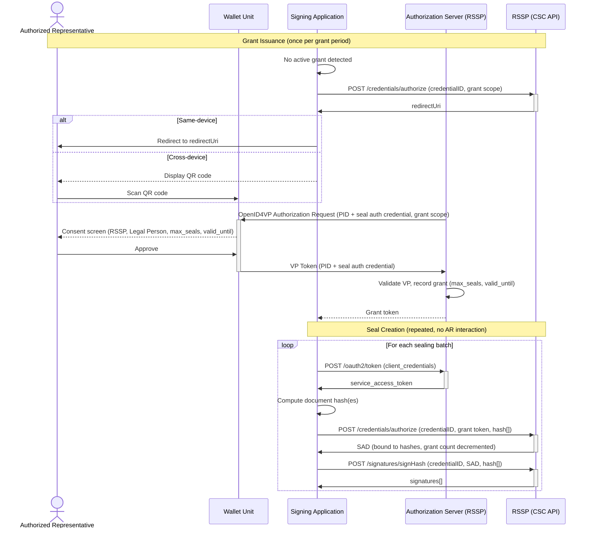

# WE BUILD - Conformance Specification: Remote Qualified Seals via CSC API

Version 0.1 / Draft  
Date: 24 April 2026

**Authors / Contributors**: WP4 Architecture

**Table of Contents**

- [WE BUILD - Conformance Specification: Remote Qualified Seals via CSC API](#we-build---conformance-specification-remote-qualified-seals-via-csc-api)
- [1. Introduction](#1-introduction)
- [2. Scope](#2-scope)
- [3. Normative Language](#3-normative-language)
- [4. Roles and Components](#4-roles-and-components)
- [5. Protocol Overview](#5-protocol-overview)
  - [5.1 CSC API v2.2 Authorization Layers](#51-csc-api-v22-authorization-layers)
  - [5.2 Sole Control and Authorization Granularity](#52-sole-control-and-authorization-granularity)
  - [5.3 Authentication Modes for Seals](#53-authentication-modes-for-seals)
  - [5.4 Seal vs Signature: Architectural Differences](#54-seal-vs-signature-architectural-differences)
- [6. High-level Flows](#6-high-level-flows)
  - [6.1 Grant-based Authorization Flow (wallet, pre-authorized)](#61-grant-based-authorization-flow-wallet-pre-authorized)
  - [6.2 Per-operation Wallet Authorization Flow](#62-per-operation-wallet-authorization-flow)
  - [6.3 PIN/OTP Authorization Flow](#63-pinotp-authorization-flow)
- [7. Normative Requirements](#7-normative-requirements)
  - [7.1 Wallet Unit Requirements](#71-wallet-unit-requirements)
  - [7.2 Signing Application Requirements](#72-signing-application-requirements)
  - [7.3 Remote Signing Service Provider Requirements](#73-remote-signing-service-provider-requirements)
  - [7.4 Authorization Server Requirements](#74-authorization-server-requirements)
- [8. Interface Definitions](#8-interface-definitions)
  - [8.1 CSC Service Info Interface](#81-csc-service-info-interface)
  - [8.2 Service Authorization Interface](#82-service-authorization-interface)
  - [8.3 Credential Authorization Interface](#83-credential-authorization-interface)
  - [8.4 Wallet-based Authorization Interface](#84-wallet-based-authorization-interface)
  - [8.5 Signature Creation Interface](#85-signature-creation-interface)
- [9. Conformance](#9-conformance)
- [References](#references)

# 1. Introduction

This document defines the **WE BUILD Conformance Specification: Remote Qualified Seals via CSC API**, describing how Signing Applications, Wallet Units (WUs), and Remote Signing Service Providers (RSSPs) interoperate to create qualified electronic seals using the Cloud Signature Consortium API version 2.2 (CSC API v2.2) [1].

A **qualified electronic seal** is a qualified electronic signature attributed to a legal person (organisation). Under eIDAS2 [2], it assures the origin and integrity of documents issued by the organisation and carries equivalent legal effect to a handwritten signature for legal persons. Unlike qualified signatures created by natural persons, seals are controlled by the legal person and the corresponding private key is managed by a QTSP on behalf of the legal person in a server-side QSCD.

Qualified seals are typically created in **system-to-system operations at scale** — for example, sealing every outgoing invoice, certificate, or signed correspondence of an organisation. It is therefore not practical to require per-document interaction from a natural person. At the same time, sole control of the seal key must ultimately be traceable to a deliberate human authorization decision made by an Authorized Representative of the legal person.

This specification addresses that challenge through an **authorization grant model**: the Authorized Representative authenticates once via their EUDI Wallet Unit and issues a bounded authorization grant to the Signing Application (scoped by time or count). The SA then creates seals autonomously within that grant — each seal being produced in response to specific document hashes — without further AR interaction until the grant expires or is exhausted. This provides the scale required for system operations while maintaining a genuine human authorization chain.

The central challenge addressed here is how the Authorized Representative proves their authority to the RSSP's Authorization Server using the authentication methods defined in CSC API v2.2 [1]. This specification profiles those methods for the WE BUILD ecosystem.

> **NOTE_QSEAL_00** This specification covers the RSSP-centric architecture in which the seal key is held by the QTSP in a server-side QSCD and the Signing Application calls the CSC API to request seal creation. This is structurally different from CS-03 [6], where the Wallet Unit holds the signing key and generates the signature locally. In the seal model, the WU's role is to authenticate the Authorized Representative to the RSSP; it does not hold or use the seal key.

# 2. Scope

This specification defines conformance requirements for remote qualified seal creation via CSC API v2.2.

Roles in scope:

- **Signing Applications** calling the CSC API on behalf of the legal person
- **Wallet Units** authenticating the Authorized Representative
- **RSSPs** exposing a CSC API v2.2 interface
- **Authorization Servers** issuing authorization grants and Signature Activation Data (SAD) tokens

Capabilities in scope:

- Grant-based wallet authorization: AR authenticates once via OpenID4VP, issuing a time- or count-bounded grant; SA creates seals autonomously within the grant
- Per-operation wallet authorization: AR authenticates via OpenID4VP for each signing operation
- PIN/OTP authorization per signing operation (SCAL2 classical)
- CSC API v2.2 credential discovery, credential authorization, and signature creation interfaces

Out of scope:

- Implicit (static) service authorization without AR wallet involvement: while SCAL1 with `authMode: implicit` is technically valid under ETSI EN 419 241-1 [9], it provides no AR authorization chain and is not accepted for qualified seals in the WE BUILD ecosystem.
- Local signing with keys held in the Wallet Unit (covered by CS-03 [6])
- Seal credential lifecycle management (enrolment, renewal, revocation)
- Document format requirements and AdES profile selection (governed by ETSI EN 319 102-1 [10])
- QTSP qualification procedures under eIDAS2

# 3. Normative Language

The keywords **MUST**, **MUST NOT**, **REQUIRED**, **SHALL**, **SHOULD**, **SHOULD NOT**, **RECOMMENDED**, **MAY**, and **OPTIONAL** are to be interpreted as described in RFC 2119 [3].

# 4. Roles and Components

- **Legal Person**: the organisation on whose behalf the qualified electronic seal is created. The Legal Person registers a seal credential with the RSSP and designates Authorized Representatives who may issue authorization grants.
- **Authorized Representative (AR)**: a natural person authorized by the Legal Person to control use of the seal. In all flows, the AR issues an authorization (either a standing grant or per-operation approval) via their Wallet Unit before sealing can occur.
- **Wallet Unit (WU)**: the EUDI-compliant wallet operated by the AR. The WU presents credentials (PID and/or a seal authorization credential) to the RSSP's Authorization Server via OpenID4VP when the AR issues or renews an authorization.
- **Signing Application (SA)**: a software component that requests seal creation from the RSSP via the CSC API. It operates autonomously within the scope of an active authorization grant. The SA orchestrates the two-layer CSC authorization and calls the signing endpoints.
- **Authorization Grant**: a bounded authorization issued by the AR to the AS, permitting the SA to create seals on behalf of the Legal Person within defined limits (time window and/or maximum count). The grant is established through AR authentication via the WU and is stored at the AS.
- **Remote Signing Service Provider (RSSP)**: a QTSP that manages the Legal Person's seal credential (X.509 certificate and private key in a server-side QSCD) and exposes a CSC API v2.2 interface.
- **Authorization Server (AS)**: the OAuth2 authorization server operated by the RSSP that issues service access tokens, stores authorization grants, and issues SAD tokens. The AS acts as an OpenID4VP Verifier when the AR establishes or renews a grant.

# 5. Protocol Overview

## 5.1 CSC API v2.2 Authorization Layers

CSC API v2.2 [1] separates authorization into two distinct layers:

1. **Service Authorization**: The SA establishes its identity to the RSSP using OAuth2, obtaining a `service_access_token`. This token is required for all subsequent CSC API calls.

2. **Credential Authorization**: Using the service access token, the SA requests authorization to use a specific seal credential for a set of signing operations. This yields a Signature Activation Data (SAD) token (`credential_access_token`) that is passed directly to the signing endpoints.

This two-layer model allows the RSSP to separate machine-to-machine authentication (SA identity) from activation authorization (human authorization chain).

## 5.2 Sole Control and Authorization Granularity

Qualified seals require that the seal key is under the sole control of the legal person, traceable to deliberate human authorization. This specification recognizes that sealing operations occur at scale and adopts the following model:

**Authorization must always originate from an AR wallet authentication.** The AR authenticates via their EUDI Wallet Unit and establishes an authorization at the RSSP's AS. The question is the granularity of that authorization:

- **Grant-based authorization** (primary): the AR issues a standing authorization grant, bounded by a validity period and/or a maximum seal count. The SA creates seals autonomously within the grant without further AR interaction. The grant is the AR's explicit delegation decision; individual seal operations are system-to-system.

- **Per-operation authorization** (for high-value cases): the AR authenticates per signing operation. Used when individual review of each sealing act is required.

Both patterns require that the AS has received a genuine AR wallet authentication before issuing any SAD. The SA's service credentials alone are never sufficient to authorize seal creation.

> **NOTE_QSEAL_01** From the perspective of ETSI EN 419 241-1 [9], grant-based authorization corresponds to SCAL1 at the level of individual signing operations (no per-signing Signature Activation Protocol). However, it differs fundamentally from the `authMode: implicit` case excluded by this specification: grant-based authorization requires a traceable, wallet-authenticated human decision with defined limits, whereas implicit authorization relies solely on static service credentials provisioned during onboarding. The WE BUILD requirement is that sole control must trace to an AR wallet authentication, regardless of whether that authentication occurs per operation or per grant period.

## 5.3 Authentication Modes for Seals

The following `authMode` values are in scope for this specification. The `authMode` is determined by the seal credential configuration at the RSSP (returned by `credentials/info`).

| authMode | Authorization granularity | Wallet involved |
|---|---|---|
| `oauth2code` (grant-based) | AR issues standing grant; SA operates autonomously within it | Yes — at grant issuance and renewal |
| `oauth2code` (per-operation) | AR approves each signing operation | Yes — per signing operation |
| `PIN` | AR provides PIN per signing operation | No |
| `OTP` | AR provides OTP per signing operation | No |

> **NOTE_QSEAL_02** The `oauth2code` authMode is used for both grant-based and per-operation wallet authorization. The distinction lies in whether the AS issues a short-lived SAD (per-operation) or a longer-lived authorization grant from which the SA can derive SADs autonomously. The specific grant parameters — maximum count (`max_seals`) and validity window (`valid_until`) — are agreed between the AR and the RSSP policy.

## 5.4 Seal vs Signature: Architectural Differences

| Aspect | Qualified Signature (CS-03 [6]) | Qualified Seal (this spec) |
|---|---|---|
| Subject | Natural person | Legal person |
| Key location | Wallet Unit (WSCD) | RSSP (server-side QSCD) |
| Sole control proof | WSCD-protected key in WU | AR wallet authentication at grant issuance |
| Wallet role | Holds key; generates AdES signature; responds to OpenID4VP | Authenticates AR to RSSP AS at grant issuance or per operation |
| Primary protocol | OpenID4VP (signing request sent to WU) | CSC API v2.2 (SA calls RSSP; WU authenticates AR at grant issuance) |
| Consent shown by WU | Signing consent (document review, QES indication) | Authorization grant consent (scope, limits, Legal Person identity) |

# 6. High-level Flows

## 6.1 Grant-based Authorization Flow (wallet, pre-authorized)

This is the primary flow for system-to-system qualified sealing at scale. The AR authenticates once via wallet to issue an authorization grant. The SA then creates seals autonomously within the grant, calling `credentials/authorize` for each batch with specific document hashes, without further AR interaction.

### 6.1.1 Grant Issuance

The SA detects that no active grant exists (or that the current grant is near expiry or exhausted) and initiates grant issuance. The SA calls the grant issuance endpoint (or triggers an `oauth2code` credential authorization that returns a `redirectUri`) and passes the `redirectUri` to the AR's device:

- **Same-device**: the SA opens the `redirectUri` in the AR's user agent.
- **Cross-device**: the SA displays a QR code; the AR scans it with their WU.

The RSSP AS acts as an OpenID4VP Verifier [4] and sends an Authorization Request to the AR's WU. The WU presents a VP containing:

- A **PID** credential confirming the AR's natural person identity
- A **seal authorization credential** confirming the AR's authorization to act for the Legal Person (see NOTE_QSEAL_03)

The WU MUST display a consent screen identifying: the verifier (RSSP), the Legal Person, the purpose (authorizing seal creation), and the grant scope (validity period and/or maximum seal count).

The AS validates the VP, checks that the AR is registered for the target `credentialID`, and issues an authorization grant to the SA. The grant is represented as a grant token (e.g., an OAuth2 refresh token) returned to the SA.

> **NOTE_QSEAL_03** The type and required claims of the seal authorization credential are RSSP-specific and MUST be documented in the RSSP's published policy. In the absence of a standardized mandate credential format in the WE BUILD ecosystem, implementations SHOULD use the PID in combination with the RSSP's own AR registry (bound at enrolment) as the minimum proof. A dedicated seal authorization credential type will be addressed in a future version of this specification.

### 6.1.2 Seal Creation within Grant

For each sealing operation (or batch), the SA:

1. Authenticates to the RSSP's AS using OAuth2 client credentials to obtain a `service_access_token`.
2. Computes the document hash(es) to be sealed.
3. Calls `POST /credentials/authorize`, presenting the grant token alongside the `credentialID`, `hash` values, and `numSignatures`. The AS verifies the grant is valid (not expired, not exhausted) and issues a SAD bound to the submitted hashes.
4. Calls `POST /signatures/signHash` with the SAD, hashes, and algorithm parameters.

No AR interaction occurs during step 1–4. The AR is only involved when the grant is issued or renewed (Section 6.1.1).



### 6.1.3 Grant Renewal

When the grant expires or the count is exhausted, the SA repeats Section 6.1.1 to obtain a new grant. The SA SHOULD proactively initiate renewal before expiry to avoid interruption of sealing operations.

## 6.2 Per-operation Wallet Authorization Flow

This flow applies when per-operation AR authorization is required — for example, for high-value individual seals where the AR should explicitly review and authorize each sealing act. The AR authenticates via their WU for each signing operation.

### 6.2.1 Service Authentication

The SA authenticates to the RSSP's AS using OAuth2 client credentials, obtaining a `service_access_token`.

### 6.2.2 Credential Discovery

The SA calls `POST /credentials/info` for the target credential to confirm `authMode`, certificate details, and algorithm parameters.

### 6.2.3 Credential Authorization Initiation

The SA computes the document hash(es) and calls `POST /credentials/authorize` with the `credentialID`, `numSignatures`, `hash` values, and `hashAlgorithmOID`. The RSSP returns a `redirectUri` for the per-operation AR authorization.

### 6.2.4 AR Device Handoff and Wallet Presentation

As per Section 6.1.1 (device handoff and wallet presentation), with the following difference: the consent screen MUST show the specific documents being sealed (if labels or descriptions are available in the request) rather than a grant scope.

### 6.2.5 SAD Issuance

The AS validates the VP, binds the authorization to the document hashes, and issues a SAD. The SA exchanges the authorization code for the SAD at `POST /oauth2/token`.

### 6.2.6 Seal Creation

The SA calls `POST /signatures/signHash` with the SAD, hashes, and algorithm parameters.

## 6.3 PIN/OTP Authorization Flow

This flow applies when the seal credential has `authMode: PIN` or `authMode: OTP`. It does not involve the WU and is included as a baseline interoperability requirement for RSSPs and SAs that do not use wallet-based authentication.

### 6.3.1 Service Authentication

As per Section 6.2.1.

### 6.3.2 OTP Delivery (OTP mode only)

For `authMode: OTP`, the SA calls `POST /credentials/sendotp` with the `credentialID`. The RSSP delivers a one-time password to the AR's registered contact.

### 6.3.3 Credential Authorization with PIN or OTP

The SA collects the PIN or OTP from the AR and calls `POST /credentials/authorize` including the `hash` values, `PIN` or `OTP`, `numSignatures`, and `hashAlgorithmOID`. The RSSP validates the PIN or OTP and returns a SAD.

### 6.3.4 Seal Creation

The SA calls `POST /signatures/signHash` with the SAD, hashes, and algorithm parameters.

# 7. Normative Requirements

## 7.1 Wallet Unit Requirements

Wallet Units participating in the wallet-based flows (Sections 6.1 and 6.2) MUST:

1. Support OpenID4VP [4] for responding to Authorization Requests from RSSP Authorization Servers acting as OpenID4VP Verifiers.
2. Present PID credentials in response to valid OpenID4VP Authorization Requests from RSSPs.
3. Present seal authorization credentials (mandate or role credentials) in response to Authorization Requests that include them in the DCQL query, when such credentials are available in the WU's credential store.
4. Display a consent screen before submitting any VP, identifying: the verifier (RSSP), the Legal Person, the purpose (seal authorization), and the grant scope (validity period and/or maximum seal count for grant-based flows, or the specific operation for per-operation flows).
5. Verify the RSSP AS's identity (client_id, RP metadata) before presenting credentials, in accordance with CS-02 [5] Section 6.1.3.
6. If the RSSP AS includes `transaction_data` in the OpenID4VP Authorization Request: include the `transaction_data` hash in the VP token.

Wallet Units MUST NOT:

- Present credentials to an RSSP AS whose identity cannot be verified.
- Suppress or bypass the consent screen for seal authorization presentations.

## 7.2 Signing Application Requirements

Signing Applications MUST:

1. Obtain a `service_access_token` via OAuth2 before calling any CSC API endpoint.
2. Call `POST /credentials/info` to retrieve the `authMode` of the target seal credential before initiating credential authorization.
3. Include the document `hash` values and `hashAlgorithmOID` in every `POST /credentials/authorize` request.
4. For `authMode: oauth2code` (both grant-based and per-operation): implement a secure callback endpoint to receive the authorization code from the RSSP AS.
5. For grant-based flows: store the grant token securely and present it in subsequent `credentials/authorize` calls. Initiate grant renewal before expiry.
6. For `authMode: OTP`: call `POST /credentials/sendotp` before calling `POST /credentials/authorize`.
7. Use the SAD returned by credential authorization as the `SAD` parameter in `POST /signatures/signHash`.
8. Not submit `signatures/signHash` with hash values that differ from those submitted in the corresponding `credentials/authorize` request.
9. Not reuse a SAD beyond the `numSignatures` count authorized or after SAD expiry.

Signing Applications MUST NOT:

- Cache or share SADs or grant tokens across different Legal Persons.
- Request a `numSignatures` count larger than the number of documents to be sealed in the current operation.
- Initiate sealing operations when no active authorization grant exists (grant-based flow) or when AR per-operation authorization has not been obtained.

## 7.3 Remote Signing Service Provider Requirements

RSSPs MUST:

1. Expose a CSC API v2.2 [1] compliant interface including `GET /info`, `POST /credentials/list`, `POST /credentials/info`, `POST /credentials/authorize`, and `POST /signatures/signHash`.
2. Support at least one wallet-based `authMode` (`oauth2code`) for qualified seal credentials. The `authMode: implicit` (SCAL1 without AR authorization) MUST NOT be offered for qualified seal credentials.
3. Bind the SAD to the document hashes submitted in `credentials/authorize`, and validate hash consistency when processing `signatures/signHash`.
4. Issue seal credentials only to Legal Persons whose Authorized Representatives have been identified and registered during onboarding, in compliance with eIDAS2 [2] qualification requirements.
5. Publish supported `authType` values and OAuth2 endpoint URLs via `GET /info`.
6. Include `authMode` in every `credentials/info` response.

RSSPs implementing wallet-based flows (Sections 6.1 and 6.2) MUST additionally:

7. Configure the Authorization Server to act as an OpenID4VP Verifier [4], conforming to CS-02 [5] Section 7.2.
8. Accept PID credentials issued by eIDAS2-compliant PID Providers as the primary proof of the AR's natural person identity.
9. Publish the credential types accepted as proof of seal authorization (including required claims and accepted issuers) in a machine-readable policy document referenced from RSSP metadata.
10. For grant-based flows: record the issued grant including the AR identity, `credentialID`, validity period, and maximum seal count. Track grant usage and refuse SAD issuance once the grant is exhausted or expired.
11. Verify that the PID subject in the VP corresponds to the AR registered for the requested `credentialID`.
12. Bind the SAD to the specific document hashes from `credentials/authorize` and to the OpenID4VP `nonce`.
13. Return an error to the SA if VP validation fails or if no valid grant exists.

RSSPs MUST NOT:

- Issue a SAD bound to hash values other than those submitted in the corresponding `credentials/authorize` request.
- Accept expired, revoked, or invalid VPs as authorization for seal activation.
- Issue SADs against an exhausted or expired grant.
- Issue a SAD for a `credentialID` to an SA whose service credentials are not associated with the owning Legal Person.

## 7.4 Authorization Server Requirements

Authorization Servers MUST:

1. Follow the OpenID4VP Verifier requirements defined in CS-02 [5] Section 7.2 when sending Authorization Requests to the AR's WU.
2. Include a `nonce` in the OpenID4VP Authorization Request that is unique per authorization session and cryptographically bound to the issued grant or SAD.
3. Validate the VP token signature, credential integrity, and credential revocation status before issuing a grant or SAD.
4. Verify that the PID subject in the presented VP matches the AR registered for the requested `credentialID`.
5. Verify that any presented seal authorization credential authorizes the AR for the specific `credentialID` and Legal Person.
6. For grant-based flows: include the grant scope (validity period and/or maximum seal count) in the OpenID4VP Authorization Request so that the WU can display it in the consent screen. Record the issued grant with its limits.
7. Support grant revocation: the AR MUST be able to revoke an active grant at any time, after which the AS MUST refuse further SAD issuance against that grant.
8. Issue authorization codes with short validity periods (RECOMMENDED: 60 seconds or less).

# 8. Interface Definitions

## 8.1 CSC Service Info Interface

*Direction:* Signing Application → RSSP  
*Method:* GET `/info`

**Response (relevant fields)**

- `specs`: CSC API version string
- `authType`: array of supported service authorization types (e.g., `["oauth2client", "oauth2code"]`)
- `oauth2`: object containing:
  - `authorizationUrl`: URL of the `/oauth2/authorize` endpoint
  - `tokenUrl`: URL of the `/oauth2/token` endpoint
- `methods`: array of supported CSC API method names

Example (illustrative only):

```json
{
  "specs": "2.2.0",
  "name": "Example RSSP",
  "authType": ["oauth2client", "oauth2code"],
  "oauth2": {
    "authorizationUrl": "https://rssp.example.com/oauth2/authorize",
    "tokenUrl": "https://rssp.example.com/oauth2/token"
  },
  "methods": [
    "credentials/list",
    "credentials/info",
    "credentials/authorize",
    "credentials/sendotp",
    "signatures/signHash"
  ]
}
```

## 8.2 Service Authorization Interface

*Direction:* Signing Application → Authorization Server  
*Method:* POST `/oauth2/token`

**Request**

- `grant_type`: `client_credentials`
- `client_id`: SA's registered client identifier at the RSSP
- `client_secret` (or mTLS client certificate): SA authentication credential
- `scope`: `service`

**Response**

- `access_token`: service access token
- `token_type`: `Bearer`
- `expires_in`: token lifetime in seconds

## 8.3 Credential Authorization Interface

*Direction:* Signing Application → RSSP  
*Method:* POST `/credentials/authorize`

**Request**

- `credentialID` (REQUIRED): identifier of the seal credential
- `numSignatures` (REQUIRED): number of signatures to authorize in this call
- `hash` (REQUIRED): array of base64-encoded document hash values
- `hashAlgorithmOID` (REQUIRED): OID of the hash algorithm used
- `description` (RECOMMENDED): human-readable description of the sealing operation
- `PIN` (conditional): PIN value, included when `authMode: PIN`
- `OTP` (conditional): OTP value, included when `authMode: OTP`
- Grant token (conditional): OAuth2 refresh token or grant reference, presented when calling within an active grant (grant-based flow)
- `clientData` (OPTIONAL): opaque client-specific data

**Response — immediate SAD (PIN, OTP, or grant-based)**

- `SAD`: Signature Activation Data token, bound to the submitted hash values

**Response — pending AR authorization (oauth2code, no active grant)**

- `redirectUri`: URI to redirect the AR to the RSSP AS
- `state`: opaque session binding value

Example request within an active grant (illustrative only):

```json
{
  "credentialID": "seal-credential-001",
  "numSignatures": 50,
  "hash": ["base64Hash1=", "base64Hash2="],
  "hashAlgorithmOID": "2.16.840.1.101.3.4.2.1",
  "description": "Batch sealing: invoices 2026-04-24"
}
```

## 8.4 Wallet-based Authorization Interface

This interface applies during grant issuance (Section 6.1.1) and per-operation authorization (Section 6.2). The RSSP AS acts as an OpenID4VP Verifier as defined in CS-02 [5] Section 8.2, with the following additions.

*Direction:* Authorization Server (RSSP) → Wallet Unit  
*Method:* OpenID4VP Authorization Request (via redirect or QR)

**Authorization Request (relevant parameters)**

- `client_id`: RSSP AS identifier (MUST match verified RP metadata)
- `response_type`: `vp_token`
- `nonce`: unique value per session
- `state`: session binding value for SA callback
- `dcql_query`: credential query requesting:
  - PID credential (AR natural person identity)
  - Seal authorization credential (type defined by RSSP policy)
- For grant-based flows: grant scope parameters (e.g., `max_seals`, `valid_until`) MUST be included so the WU can present them in the consent screen
- `response_uri` (cross-device) or `redirect_uri` (same-device)

**Grant token exchange (grant-based flow)**

*Direction:* Signing Application → Authorization Server  
*Method:* POST `/oauth2/token`

- `grant_type`: `authorization_code`
- `code`: authorization code from AR authentication
- `client_id`: SA's registered client identifier
- `redirect_uri`: SA callback URI

Response:
- `access_token`: short-lived SAD (per-operation flow), or
- `refresh_token`: long-lived grant token (grant-based flow) from which SADs can be derived
- `expires_in`: token validity

## 8.5 Signature Creation Interface

*Direction:* Signing Application → RSSP  
*Method:* POST `/signatures/signHash`

**Request**

- `credentialID` (REQUIRED): identifier of the seal credential
- `SAD` (REQUIRED): Signature Activation Data token from credential authorization
- `hash` (REQUIRED): array of base64-encoded document hash values (MUST match those submitted in `credentials/authorize`)
- `hashAlgorithmOID` (REQUIRED): OID of the hash algorithm
- `signAlgo` (REQUIRED): OID of the signature algorithm
- `signAlgoParams` (OPTIONAL): algorithm parameters
- `clientData` (OPTIONAL): opaque client-specific data

**Response**

- `signatures`: array of base64-encoded signature values, one per submitted hash value

Example (illustrative only):

```text
POST /signatures/signHash HTTP/1.1
Host: rssp.example.com
Authorization: Bearer <service_access_token>
Content-Type: application/json

{
  "credentialID": "seal-credential-001",
  "SAD": "<SAD_token>",
  "hash": ["base64Hash1=", "base64Hash2="],
  "hashAlgorithmOID": "2.16.840.1.101.3.4.2.1",
  "signAlgo": "1.2.840.113549.1.1.11"
}
```

# 9. Conformance

An implementation conforms to this specification as a **Signing Application** if it:

1. Implements all Signing Application requirements in Section 7.2
2. Supports at least one of the flows defined in Section 6
3. Implements the service authorization interface (Section 8.2), the credential authorization interface (Section 8.3), and the signature creation interface (Section 8.5)

An implementation conforms to this specification as a **Remote Signing Service Provider** if it:

1. Implements all RSSP requirements in Section 7.3
2. Exposes CSC API v2.2 [1] compliant `GET /info`, `POST /credentials/info`, `POST /credentials/authorize`, and `POST /signatures/signHash` endpoints
3. Supports `authMode: oauth2code` with wallet-based grant issuance and does not offer `authMode: implicit` for qualified seal credentials

An implementation conforms to this specification as a **Wallet Unit** if it:

1. Conforms to CS-02 [5] Section 9 as a Wallet Provider
2. Implements all Wallet Unit requirements in Section 7.1
3. Supports responding to OpenID4VP Authorization Requests from RSSP Authorization Servers

An implementation conforms to this specification as an **Authorization Server** if it:

1. Implements all Authorization Server requirements in Section 7.4
2. Exposes OAuth2 endpoints (`/oauth2/token`) compliant with CSC API v2.2 [1] Section 5.2
3. Supports grant-based authorization with defined validity period and seal count limits
4. Acts as an OpenID4VP Verifier conforming to CS-02 [5] Section 7.2

Additional WE BUILD profiles may define stricter requirements for specific use cases. Such profiles **MUST NOT** weaken the mandatory requirements in this specification.

# References

[1] Cloud Signature Consortium (2025). CSC API for Remote Signature Creation, version 2.2. Published November 2025. Available at: https://cloudsignatureconsortium.org/wp-content/uploads/2025/11/csc-api.pdf (Accessed: 24 April 2026).

[2] European Parliament and Council (2024). Regulation (EU) 2024/1183 (eIDAS2), amending Regulation (EU) No 910/2014. Official Journal of the European Union.

[3] IETF (1997). Key words for use in RFCs to Indicate Requirement Levels, RFC 2119. Available at: https://datatracker.ietf.org/doc/html/rfc2119 (Accessed: 24 April 2026).

[4] OpenID Foundation (2025). OpenID for Verifiable Presentations 1.0. Available at: https://openid.net/specs/openid-4-verifiable-presentations-1_0.html (Accessed: 24 April 2026).

[5] WE BUILD (2025). Conformance Specification: Credential Presentation, version 1.0. Available at: https://github.com/webuild-consortium/wp4-architecture/blob/main/conformance-specs/cs-02-credential-presentation.md (Accessed: 24 April 2026).

[6] WE BUILD (2026). Conformance Specification: Remote Qualified Signing with Wallet Units, version 1.0. Available at: https://github.com/webuild-consortium/wp4-architecture/blob/main/conformance-specs/cs-03-remote-signing-with-wallet-units.md (Accessed: 24 April 2026).

[7] European Commission (2025). Architecture and Reference Framework (ARF), version 2.8.0. Available at: https://eudi.dev/2.8.0/architecture-and-reference-framework-main/ (Accessed: 24 April 2026).

[8] Cloud Signature Consortium (2025). CSC Data Model Bindings, version 1.0.0. Published 14 October 2025. Available at: https://cloudsignatureconsortium.org/wp-content/uploads/2025/10/data-model-bindings.pdf (Accessed: 24 April 2026).

[9] ETSI EN 419 241-1. Protection Profiles for TSP Supporting Server Signing — Part 1: Overview and Framework.

[10] ETSI EN 319 102-1. Electronic Signatures and Trust Infrastructures (ESI); Procedures for Creation and Validation of AdES Digital Signatures; Part 1: Creation and Validation.
