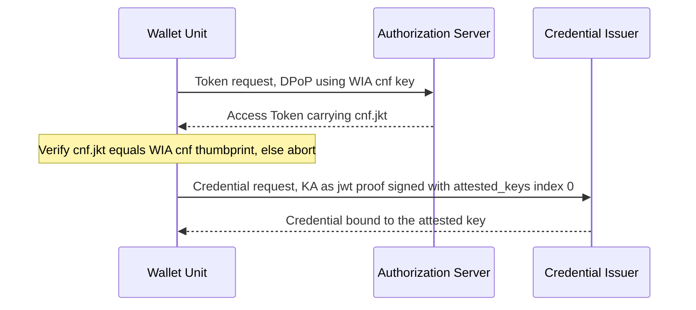

# WE BUILD - Conformance Specification CS-04: Individual Wallet Unit Attestation (WUA) Lifecycle

Version 0.2 / Draft
Date: 30 May 2026

**Authors / Contributors**: WP4 Architecture
- «add contributors»

## Table of Contents

- [WE BUILD - Conformance Specification CS-04: Individual Wallet Unit Attestation (WUA) Lifecycle](#we-build---conformance-specification-cs-04-individual-wallet-unit-attestation-wua-lifecycle)
  - [Table of Contents](#table-of-contents)
- [1. Introduction](#1-introduction)
- [2. Scope](#2-scope)
- [3. Normative Language](#3-normative-language)
- [4. Roles and Components](#4-roles-and-components)
- [5. Protocol Overview](#5-protocol-overview)
  - [5.1 Actors and information flows](#51-actors-and-information-flows)
  - [5.2 WUA lifecycle](#52-wua-lifecycle)
  - [5.3 Key binding](#53-key-binding)
  - [5.4 Signing](#54-signing)
  - [5.5 Wallet Provider responsibilities](#55-wallet-provider-responsibilities)
- [6. High-level Flows](#6-high-level-flows)
  - [6.1 Activation and WUA provisioning](#61-activation-and-wua-provisioning)
  - [6.2 Lifecycle and revocation](#62-lifecycle-and-revocation)
  - [6.3 Rotation / re-issuance](#63-rotation--re-issuance)
  - [6.4 Binding](#64-binding)
  - [6.5 Signing (by reference)](#65-signing-by-reference)
- [7. Normative Requirements](#7-normative-requirements)
  - [7.1 WUA structure and validity](#71-wua-structure-and-validity)
  - [7.2 Lifecycle, revocation and unlinkability](#72-lifecycle-revocation-and-unlinkability)
  - [7.3 Binding](#73-binding)
  - [7.4 Signing model](#74-signing-model)
- [8. Interface Definitions](#8-interface-definitions)
  - [8.1 WUA format](#81-wua-format)
  - [8.2 Status / revocation interface](#82-status--revocation-interface)
- [9. Conformance](#9-conformance)
- [References](#references)
- [Annex A (informative): Example WUA](#annex-a-informative-example-wua)
  - [A.1 Example WIA (decoded JWT)](#a1-example-wia-decoded-jwt)
  - [A.2 Example KA (decoded JWT)](#a2-example-ka-decoded-jwt)

# 1. Introduction

This document defines the **WE BUILD Conformance Specification for the EUDI Wallet WUA lifecycle**. It describes how a natural-person EUDI Wallet's attestation (the **WUA**, comprising the **WIA** and **KA**) is created, maintained, revoked and rotated across its lifecycle, in a consistent and testable way.

It profiles and aligns with:
- The EU ARF version 2.9.0 [1] and ARF discussion Topic C [2]
- The EUDI Wallet Technical Specification TS-03 [3]
- ETSI TS 119 472-3 [4], and OpenID4VCI [5], OpenID4VP [6] and HAIP [7] where relevant

It should be read together with CS-01 [10], CS-02 [11] and CS-03 [12]. The companion specification CS-05 covers the European Business Wallet (BWUA).

The WUA is an infrastructure attestation, not a user-facing credential. The WIA is a *client attestation* (OAuth attestation-based client authentication) and the KA is a *key attestation*; both are used by the Wallet Unit during issuance (the WIA for client authentication, the KA in the Credential Request) and are not presented to verifiers as credentials. Consequently, unlike user-facing attestation types such as PID or (Q)EAA, which are registered in the attestation catalogue and follow an attestation rulebook, the WUA has **no attestation rulebook**; its data model is defined normatively by TS-03 [3].

> [!NOTE]
> **Terminology priority: ARF 2.9.0 (Topic C).** WUA is the umbrella for WIA (Wallet Instance Attestation) + KA (Key Attestation), for the natural-person EUDI Wallet. Where ETSI / older TS-03 text says "WUA" meaning the key attestation, read it as KA.

# 2. Scope

This specification defines the conformance expectations for the **lifecycle** of the WUA for the natural-person EUDI Wallet.

In scope:
- WUA structure and role (WIA and KA) at the level needed to express lifecycle behaviour, based on TS-03 [3]
- **Lifecycle**: activation, validity, revocation and status maintenance, rotation / re-issuance, as defined in TS-03 [3] and ARF Topic C [2] (Proposal 4, revocation maintenance period)
- **Binding**: key binding, holder binding and attestation-to-session binding, as defined in TS-03 [3] (see also ARF Topic C [2], Proposal 7)
- The **signing model**, by reference to CS-03 [12]

Out of scope (handled elsewhere):
- The issuance protocol itself (CS-01 [10])
- The presentation protocol itself (CS-02 [11])
- Remote qualified signing mechanics (CS-03 [12])
- Trust anchoring and discovery, including trusted-list and metadata discovery (handled separately)
- European Business Wallet / BWUA specifics (CS-05)

# 3. Normative Language

The keywords **MUST**, **MUST NOT**, **REQUIRED**, **SHALL**, **SHOULD**, **SHOULD NOT**, **RECOMMENDED**, **MAY** and **OPTIONAL** are to be interpreted as described in RFC 2119 [8].

# 4. Roles and Components

The role names are protocol/functional roles, not products. One product may implement several roles.

- **Wallet Provider:** creates and signs the WUA (WIA and KA); operates revocation status lists.
- **Wallet Unit (WU):** the natural person's wallet; presents the WUA.
- **Holder:** the natural person controlling the WU.
- **Issuer / Attestation Provider:** consumes the WUA when issuing PID / (Q)EAA.
- **Verifier / Relying Party:** consumes attestation-related evidence at presentation, as profiled in CS-02 [11].
- **Authorization Server (AS):** issues tokens during issuance.
- **WSCD / WSCA:** secure device/application protecting the keys.

# 5. Protocol Overview

The WUA is the evidence that lets a PID Provider or Attestation Provider trust a natural-person EUDI Wallet during issuance, and that underpins holder binding when the resulting credentials are later presented. The Wallet Provider creates and signs two JSON Web Tokens: the **Wallet Instance Attestation (WIA)**, attesting the integrity and authenticity of the wallet instance, and the **Key Attestation (KA)**, attesting the security properties of the keys to which credentials will be bound (TS-03 [3], clauses 2.3.1 and 2.3.2). Together they form the WUA. Detailed behaviour is in sections 6 to 8; this section gives the high-level picture.

## 5.1 Actors and information flows

The Wallet Provider issues and signs the attestations and publishes their revocation status; the Wallet Unit presents them; relying parties verify the signature and check revocation status (TS-03 [3], clause 2.5), as illustrated below:

*Figure 1: Actors and the High-level WUA Issuance and Verification*

## 5.2 WUA lifecycle

This lifecycle is described from the **Wallet Provider's perspective**, as the authority over the attestation's state: the Wallet Provider issues each WUA, sets its validity, maintains its revocation status, and revokes it. The Wallet Unit holds and presents the WUA; relying parties (PID or and attestation providers) read and re-check its status.

The WUA lifecycle is independent of two things the Wallet Provider does not track for it:
- whether the Wallet Unit is **installed or uninstalled** (a Wallet Unit lifecycle matter, ARF 2.9.0 §6.5; the Wallet Provider is generally not notified of uninstallation and does not rely on it here); and
- the **presence, expiry or revocation of any PID or attestation** the wallet holds (the PID/attestation lifecycle, ARF 2.9.0 §6.6, handled by the PID or Attestation Provider).

The Wallet Provider tracks only the WUAs it has issued, their status-list entries, and the events that trigger revocation.

From the Wallet Provider's perspective a WUA has three states:
- **Issued** — the Wallet Provider has signed and issued the WIA/KA to the Wallet Unit; it remains in use until it expires or is revoked. The WIA is deliberately short-lived, with a time-to-live under 24 hours so a stale one cannot be reused (TS-03 [3], clause 2.2.1.1).
- **Expired** — the WIA's time-to-live has elapsed (TS-03 [3], clause 2.2.1.1).
- **Revoked** — the Wallet Provider has set the WUA's status-list entry to revoked (TS-03 [3], clause 2.5.1).

Because WUAs are short-lived and single-use, the Wallet Provider issues fresh WUAs to the Wallet Unit as needed; each fresh WUA is a **new instance** of this lifecycle, not a reactivation of an expired one. Independently of any single WUA's time-to-live, the Wallet Provider maintains the revocation status entry until its `client_status.exp` (kept at least 31 days ahead at presentation, TS-03 [3], clause 2.4.2; ARF Topic C [2], Proposal 4), so that relying parties can re-check it throughout the life of any credential issued against it (TS-03 [3], clause 2.4.3).

A WUA exists only while the Wallet Unit is **Operational** or **Valid** in the Wallet Unit lifecycle (ARF 2.9.0 [1], section 4.6.4); revoking the WUA is what moves the Wallet Unit to **Revoked**. The Operational/Valid distinction (whether a PID is present) and the Installed/Uninstalled states are Wallet Unit lifecycle matters outside this specification.


*Figure 2: WUA (WIA/KA) attestation lifecycle, from the Wallet Provider's perspective. Re-issuance produces a new WUA, i.e. a new run of this lifecycle. The Wallet Unit lifecycle (Installed, Operational, Valid, Revoked, Uninstalled) is defined separately in ARF 2.9.0 [1], section 4.6.4.*

## 5.3 Key binding

Key binding ties the attestation, the wallet's keys and the issuance session together. Within an issuance session the Wallet Unit uses the WIA `cnf` key as its DPoP key and verifies that the issued Access Token's `cnf.jkt` matches that key, aborting on mismatch (TS-03 [3], clause 2.2.1.1; ARF Topic C [2], Proposal 7). When a KA is presented as a `jwt` proof, the Wallet Unit signs with the key at index 0 of `attested_keys`, proving possession (TS-03 [3], clause 2.2.2.1). The issuance transport that carries these messages is profiled in CS-01 [10]; CS-04 owns only the binding obligations (section 7.3).



*Figure 3: High-level attestation-to-session and key binding (transport profiled in CS-01 [10]).*

## 5.4 Signing

Where the wallet is used to create signatures, the signing mechanism is defined by CS-03 [12]; the WUA evidences the wallet's eligibility. CS-04 adds no signing requirements of its own.

## 5.5 Wallet Provider responsibilities

This overview is non-normative; the binding requirements are in sections 7.1 and 7.2. Per TS-03 [3], the Wallet Provider:
- Creates and signs each WIA and KA (ES256, ES384 or ES512) with the required claims (TS-03 [3], clauses 2.6, 2.3.1, 2.3.2);
- Ensures the Wallet Unit has WIAs available **as needed** for issuance (TS-03 [3], clause 2.2.1.1);
- Keeps each WIA **short-lived** (under 24 hours) and **single-use per relying party**, for freshness and unlinkability (TS-03 [3], clauses 2.2.1.1, 2.2.2.1);
- **maintains revocation status** via Token Status List [9], kept at least 31 days ahead at presentation and live until each entry's `exp` (TS-03 [3], clauses 2.5, 2.4.2);
- **revokes** all `client_status` entries for a Wallet Unit on revocation, triggered by a detected security vulnerability or a user request such as loss or theft (TS-03 [3], clauses 2.4.2, 2.5.1).

# 6. High-level Flows

Each flow is a step-by-step sequence. *To draft* during the workshop.

## 6.1 Activation and WUA provisioning
*To draft:* actors (Wallet Provider, WU, WSCD); steps for key creation in the WSCD and first WIA and KA issuance.

## 6.2 Lifecycle and revocation
*To draft:* actors (Wallet Provider, relying parties); steps for freshness, status publication, revocation triggers and the re-checking cadence.

## 6.3 Rotation / re-issuance
*To draft:* steps for replacing keys and attestations and handling single-use.

## 6.4 Binding
*To draft:* steps for key binding, holder binding at presentation, and `cnf`/DPoP session binding.

## 6.5 Signing (by reference)
*To draft:* point to CS-03 [12]; describe only how the WUA underpins the right to sign.

# 7. Normative Requirements

These requirements are pre-seeded from TS-03 [3] and ARF Topic C [2], with references and clause numbers inline. They are concrete candidate text for workshop ratification. Items still needing a decision are marked **[DRAFT]**.

## 7.1 WUA structure and validity

Wallet Provider **MUST**:
1. Sign every WIA and KA as a JWT using ES256, ES384 or ES512 (TS-03 [3], clause 2.6).
2. Populate the WIA with at least `wallet_name`, `wallet_version`, `wallet_solution_certification_information`, a `client_status` object (containing `status` and `exp`) and a `cnf` key, as defined in TS-03 [3], clause 2.3.1.
3. Populate the KA with at least the `attested_keys` array (one or more keys), `key_storage`, `certification`, `user_authentication` and a `key_storage_status` object (containing `status` and `exp`), as defined in TS-03 [3], clause 2.3.2.
4. Issue each WIA with a time-to-live of less than 24 hours (TS-03 [3], clause 2.2.1.1).

Wallet Provider **SHOULD**:
1. Include `wallet_link` in the WIA (TS-03 [3], clause 2.3.1).

Wallet Unit **MUST**:
1. Present a WIA whose time-to-live has not expired, together with a KA, where the consuming process requires it (TS-03 [3], clause 2.2.1.1).

## 7.2 Lifecycle, revocation and unlinkability

Wallet Provider **MUST**:
1. Use Token Status List [9] as the revocation mechanism for both WIAs and KAs (TS-03 [3], clause 2.5).
2. Maintain revocation status so that a Wallet Unit can always present a WIA and KA whose `client_status.exp` and `key_storage_status.exp` are at least 31 days in the future at the time of presentation (TS-03 [3], clause 2.4.2).
3. For KA revocation, either reference the same status list index for all KAs attesting keys stored in the same WSCD or keystore type (Option 1, type-shared), or assign a fresh status list index to each KA (Option 2, per-KA) (TS-03 [3], clause 2.5.2).
4. Ensure a Wallet Unit uses a single KA at most once, and that each attested public key is included in at most one KA (TS-03 [3], clause 2.2.2.1).
5. Ensure a Wallet Unit sends the same WIA to at most one PID Provider or Attestation Provider, unless per-issuer reuse applies (TS-03 [3], clause 2.2.1.1).
6. Ensure that a Wallet Unit has WIAs available as needed for issuance (TS-03 [3], clause 2.2.1.1). The specification does not mandate on-demand versus batch pre-provisioning.
7. Keep each published status list entry available until its `exp` has passed (TS-03 [3], clause 2.4.2).
8. On revocation of a Wallet Instance, revoke all `client_status.status` entries associated with that Wallet Unit (TS-03 [3], clause 2.4.2).
9. Revoke a Wallet Instance upon detecting a security vulnerability in its device or operating environment, or upon a user request such as loss or theft (TS-03 [3], clause 2.5.1).

> Note: the token-level `exp` (technical validity, under 24 hours) and `client_status.exp` (the revocation maintenance commitment) are independent. A short-lived WIA can carry a far-future `client_status.exp` (TS-03 [3], clause 2.4.1).

Wallet Unit **MUST NOT** (Option 2, per-KA index):
1. Reuse the same per-KA status list index for interactions with different PID Providers or Attestation Providers (TS-03 [3], clause 2.5.2).

Relying parties **MUST**:
1. (PID Provider) Check the revocation status of both the WIA and the KA received during issuance at least once every 24 hours for the validity period of the PID. Where the PID validity period is less than 24 hours, checking on issuance is sufficient (TS-03 [3], clause 2.4.3).

Relying parties **SHOULD**:
1. (Attestation Provider) Apply the same revocation re-check cadence as PID Providers (TS-03 [3], clause 2.4.3).

Relying parties **MAY**:
1. Express `preferred_client_status_period` (top level of Credential Issuer Metadata) and `preferred_key_storage_status_period` (within the `key_attestations_required` object) to state a preferred remaining status maintenance period, in seconds (TS-03 [3], clause 2.4).

Wallet Unit **MUST**:
1. Where a preferred status period is expressed, present the available WIA or KA whose remaining maintenance period minus the preferred period is as small as possible but non-negative; if none is available, obtain a fresh one from the Wallet Provider that satisfies the preference (TS-03 [3], clause 2.4.2).

## 7.3 Binding

> The issuance transport (Authorization Server, Token and Credential endpoints) is profiled in CS-01 [10]. The items below are the binding obligations CS-04 owns.

Wallet Unit **MUST**:
1. Use the `cnf` key in the WIA as the DPoP key when requesting an Access Token from the Authorization Server (TS-03 [3], clause 2.2.1.1).
2. Verify, on receipt of an Access Token, that its `cnf.jkt` matches the JWK Thumbprint of the `cnf` key in the WIA presented in the same issuance session, and abort the issuance session on mismatch (TS-03 [3], clause 2.2.1.1; ARF Topic C [2], Proposal 7, HLR WUA_37).
3. Where a KA is included in a `jwt` proof element, sign that element with the key at index 0 of the `attested_keys` array (TS-03 [3], clause 2.2.2.1).
4. Use a WIA in at most one credential issuance process, unless per-issuer reuse applies (TS-03 [3], clause 2.2.1.1).

Relying parties **MUST**:
1. Verify that the signature of the `jwt` proof element verifies under the key at index 0 of the `attested_keys` array (TS-03 [3], clause 2.2.2.2).
2. [DRAFT] Validate holder binding (key-binding JWT, nonce, audience) at presentation, as profiled in HAIP [7], Section 5, and CS-02 [11], section 7.2. (To be confirmed that CS-04 only references, and does not restate, this.)

## 7.4 Signing model
Implementations **MUST**:
1. Where signing is offered, conform to CS-03 [12]; the WUA evidences the wallet's eligibility. CS-04 adds no signing requirements of its own. (To be confirmed.)

# 8. Interface Definitions

Logical interfaces; exact paths are deployment-specific.

## 8.1 WUA format
WIA and KA are JWTs signed with ES256, ES384 or ES512 (TS-03 [3], clause 2.6). WIA claims are defined in TS-03 [3], clause 2.3.1; KA claims in TS-03 [3], clause 2.3.2. (ETSI TS 119 472-3 [4], clauses 4.4.2 and 4.6.1.2, reference an older TS-03 numbering, clauses 2.3.3/2.3.4; see issue CS04-I7.)

## 8.2 Status / revocation interface
Token Status List [9] retrieval (TS-03 [3], clause 2.5): the Wallet Instance via `client_status.status` (TS-03 [3], clause 2.5.1), and the WSCD/keystore (type-shared or per-KA) via `key_storage_status.status` (TS-03 [3], clause 2.5.2). This specification **pins the IETF Token Status List to draft-ietf-oauth-status-list-20** [9]. TS-03 [3] references the mechanism non-specifically (clause 2.5), so CS-04 fixes the version for conformance testability; see issue CS04-I8.

# 9. Conformance

An implementation **conforms as a Wallet Provider** if it: implements the requirements in 7.1 to 7.4 applicable to the Wallet Provider role and the interfaces in section 8.

An implementation **conforms as a Wallet Unit** if it: implements the WU requirements in section 7 and the relevant flows in section 6.

An implementation **conforms as an Issuer or Verifier** if it: implements the relying-party requirements in 7.2 and 7.3 and validates the WUA as specified.

Profiles MUST NOT weaken the mandatory requirements in this specification.

# References

[1] European Commission (2025) The European Digital Identity Wallet Architecture and Reference Framework, version 2.9.0. Available at: https://eudi.dev/2.9.0/architecture-and-reference-framework-main/ (Accessed: 30 May 2026).

[2] European Commission (2025) ARF Discussion Topic C: Wallet Unit Attestations. Available at: https://eudi.dev/2.9.0/discussion-topics/c-rr-wallet-unit-attestations/ (Accessed: 30 May 2026).

[3] European Commission (2025) EUDI Wallet Technical Specification TS-03: Wallet Unit Attestations (WUA) used in issuance of PID and Attestations. Available at: https://github.com/eu-digital-identity-wallet/eudi-doc-standards-and-technical-specifications/blob/main/docs/technical-specifications/ts3-wallet-unit-attestation.md (Accessed: 30 May 2026).

[4] ETSI (2026) ETSI TS 119 472-3 V1.1.1: Electronic Signatures and Trust Infrastructures (ESI); Profiles for Electronic Attestation of Attributes; Part 3: Profiles for issuance of EAA or PID.

[5] OpenID Foundation (2025) OpenID for Verifiable Credential Issuance 1.0. Available at: https://openid.net/specs/openid-4-verifiable-credential-issuance-1_0.html (Accessed: 30 May 2026).

[6] OpenID Foundation (2025) OpenID for Verifiable Presentations 1.0. Available at: https://openid.net/specs/openid-4-verifiable-presentations-1_0.html (Accessed: 30 May 2026).

[7] OpenID Foundation (2025) OpenID4VC High Assurance Interoperability Profile (HAIP) 1.0. Available at: https://openid.net/specs/openid4vc-high-assurance-interoperability-profile-1_0-ID1.html (Accessed: 30 May 2026).

[8] IETF (1997) RFC 2119: Key words for use in RFCs to Indicate Requirement Levels. Available at: https://datatracker.ietf.org/doc/html/rfc2119 (Accessed: 30 May 2026).

[9] IETF (2026) OAuth Token Status List, draft-ietf-oauth-status-list-20, 20 April 2026 (Internet-Draft, OAuth WG). Available at: https://datatracker.ietf.org/doc/draft-ietf-oauth-status-list/20/ (Accessed: 30 May 2026). CS-04 pins this revision (see issue CS04-I8); TS-03 [3] references the mechanism non-specifically.

[10] WE BUILD (2025) Conformance Specification CS-01: Credential Issuance, version 1.0.

[11] WE BUILD (2026) Conformance Specification CS-02: Credential Presentation, version 1.1.

[12] WE BUILD (2025) Conformance Specification CS-03: Remote Qualified Signing with Wallet Units, version 1.0.

# Annex A (informative): Example WUA

This annex is **informative**. It gives illustrative examples of a WIA and a KA to help readers and test developers. The **normative** data model is TS-03 [3], clause 2.3.1 (WIA) and clause 2.3.2 (KA); where this annex and TS-03 differ, TS-03 prevails. The WUA is an infrastructure attestation and has **no attestation rulebook** (see Section 1). All values below are placeholders.

## A.1 Example WIA (decoded JWT)

JOSE header:

```json
{ "alg": "ES256", "typ": "oauth-client-attestation+jwt", "x5c": ["<wallet provider signing certificate chain>"] }
```

Payload:

```json
{
  "iss": "https://wallet-provider.example",
  "sub": "https://wallet-provider.example/instances/3f9a...c1",
  "iat": 1777000000,
  "exp": 1777040000,
  "cnf": { "jwk": { "kty": "EC", "crv": "P-256", "x": "...", "y": "..." } },
  "wallet_name": "Example EUDI Wallet",
  "wallet_version": "2.4.1",
  "wallet_link": "https://wallet-provider.example/info",
  "wallet_solution_certification_information": { "...": "conformity assessment body and certification details" },
  "client_status": {
    "status": { "status_list": { "idx": 1337, "uri": "https://wallet-provider.example/wia-statuslists/42" } },
    "exp": 1779678000
  }
}
```

Where each element comes from:
- `alg` (ES256, ES384 or ES512) - TS-03 [3], clause 2.6.
- `typ` (`oauth-client-attestation+jwt`) and the JWT encoding - the WIA is a Wallet Attestation per OpenID4VCI [5], Appendix E (TS-03 [3], clause 2.2.1; example in clause 3.1); JWT encoding follows RFC 7519.
- `cnf` (DPoP key) and token-level `exp` under 24 hours - TS-03 [3], clause 2.2.1.1.
- `wallet_name`, `wallet_version`, `wallet_solution_certification_information`, `wallet_link`, `client_status` - TS-03 [3], clause 2.3.1.
- `client_status.status` (the `status_list` reference with `idx` and `uri`) - TS-03 [3], clause 2.5.1, using the IETF Token Status List [9].
- `client_status.exp` (revocation maintenance commitment, at least 31 days ahead at presentation) - TS-03 [3], clauses 2.4.1 and 2.4.2.

## A.2 Example KA (decoded JWT)

JOSE header:

```json
{ "alg": "ES256", "typ": "keyattestation+jwt", "x5c": ["<wallet provider signing certificate chain>"] }
```

Payload:

```json
{
  "iss": "https://wallet-provider.example",
  "iat": 1777000000,
  "exp": 1777040000,
  "attested_keys": [ { "kty": "EC", "crv": "P-256", "x": "...", "y": "..." } ],
  "key_storage": ["iso_18045_high"],
  "user_authentication": ["iso_18045_high"],
  "certification": { "...": "WSCD or keystore certification scheme, evaluated requirements and level" },
  "key_storage_status": {
    "status": { "status_list": { "idx": 8081, "uri": "https://wallet-provider.example/ka-statuslists/7" } },
    "exp": 1779678000
  }
}
```

Where each element comes from:
- `alg` (ES256, ES384 or ES512) - TS-03 [3], clause 2.6.
- `attested_keys`, `key_storage`, `certification`, `key_storage_status` - TS-03 [3], clause 2.3.2.
- `user_authentication` - OpenID4VCI [5], Appendix D, as referenced by TS-03 [3], clause 2.3.2.
- Signing a `jwt` proof with the key at index 0 of `attested_keys` - TS-03 [3], clause 2.2.2.1.
- `key_storage_status.status` (type-shared or per-KA index) - TS-03 [3], clause 2.5.2, using the IETF Token Status List [9].

> Note: the header `typ` values and the exact shapes of `key_storage`, `user_authentication` and `certification` are defined by TS-03 [3] and OpenID4VCI [5]; reproduce TS-03's own examples for the authoritative form.
