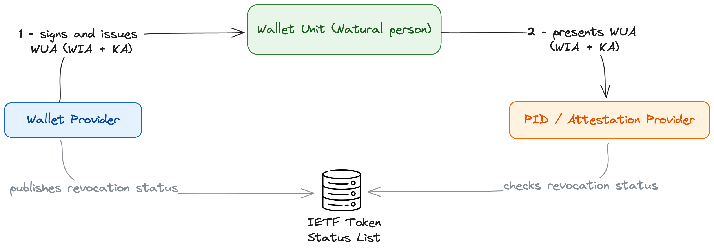
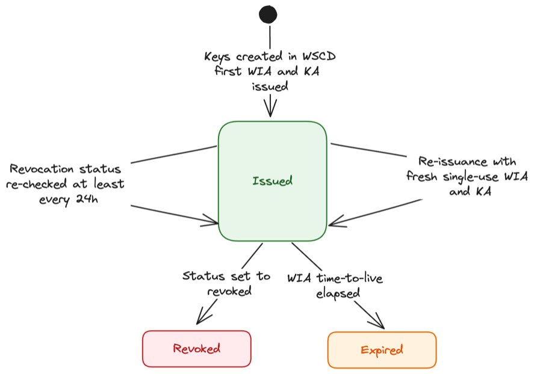
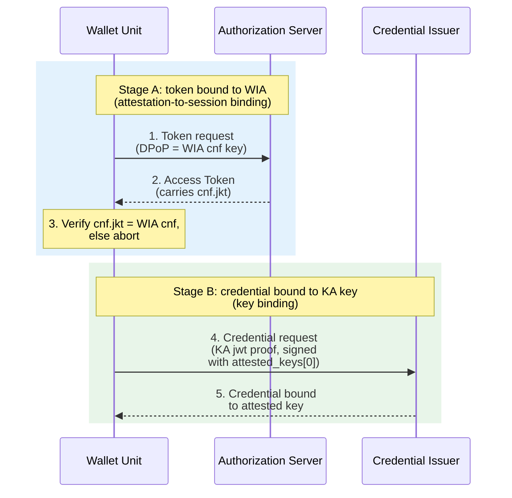
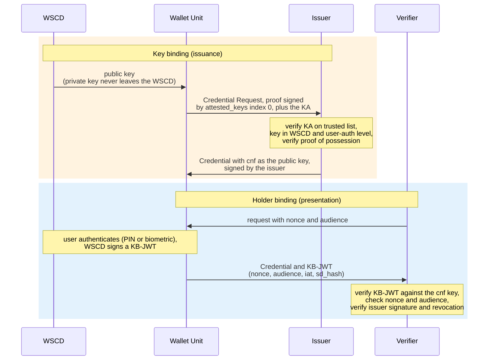

# WE BUILD - Conformance Specification CS-04: Individual Wallet Unit Attestation (WUA) Lifecycle

Version 0.5 / Draft
Date: 30 May 2026

**Authors / Contributors**: WP4 Architecture
- Lal Chandran, iGrant.io, Sweden
- George J Padayatti, iGrant.io, Sweden
- Filip Hladky, BankID, Czech Republic
- Nikolaos Triantafyllou, University of Aegean, Greece
- Erik Eriksson, DIGG, Sweden

## Table of Contents

- [WE BUILD - Conformance Specification CS-04: Individual Wallet Unit Attestation (WUA) Lifecycle](#we-build---conformance-specification-cs-04-individual-wallet-unit-attestation-wua-lifecycle)
  - [Table of Contents](#table-of-contents)
- [1. Introduction](#1-introduction)
- [2. Scope](#2-scope)
- [3. Normative Language](#3-normative-language)
- [4. Roles and Components](#4-roles-and-components)
- [5. Protocol Overview](#5-protocol-overview)
  - [5.1 Actors and information flows](#51-actors-and-information-flows)
  - [5.2 WUA lifecycle](#52-wua-lifecycle)
  - [5.3 Signing and key binding](#53-signing-and-key-binding)
  - [5.4 Wallet Provider responsibilities](#54-wallet-provider-responsibilities)
- [6. High-level Flows](#6-high-level-flows)
  - [6.1 Activation and WUA provisioning](#61-activation-and-wua-provisioning)
  - [6.2 Lifecycle and revocation](#62-lifecycle-and-revocation)
  - [6.3 Rotation / re-issuance](#63-rotation--re-issuance)
  - [6.4 Binding](#64-binding)
- [7. Normative Requirements](#7-normative-requirements)
  - [7.1 WUA structure and validity](#71-wua-structure-and-validity)
  - [7.2 Lifecycle, revocation and unlinkability](#72-lifecycle-revocation-and-unlinkability)
  - [7.3 Binding](#73-binding)
- [8. Interface Definitions](#8-interface-definitions)
  - [8.1 WUA format](#81-wua-format)
  - [8.2 Status / revocation interface](#82-status--revocation-interface)
- [9. Conformance](#9-conformance)
- [References](#references)
- [Annex A (informative): Example WUA](#annex-a-informative-example-wua)
  - [A.1 Example WIA (decoded JWT)](#a1-example-wia-decoded-jwt)
  - [A.2 Example KA (decoded JWT)](#a2-example-ka-decoded-jwt)
- [Annex B (informative): Key binding and holder binding](#annex-b-informative-key-binding-and-holder-binding)
  - [B.1 Key binding at issuance](#b1-key-binding-at-issuance)
  - [B.2 Holder binding at presentation](#b2-holder-binding-at-presentation)
  - [B.3 The sequence](#b3-the-sequence)

# 1. Introduction

This document defines the **WE BUILD Conformance Specification for the EUDI Wallet WUA lifecycle**. It describes how a natural-person EUDI Wallet's attestation (the **WUA**, comprising the **WIA** and **KA**) is created, maintained, revoked and rotated across its lifecycle, in a consistent and testable way.

It profiles and aligns with:
- The EU ARF version 2.9.0 [1] and ARF discussion Topic C [2]
- The EUDI Wallet Technical Specification TS-03 [3]
- ETSI TS 119 472-3 [4], and OpenID4VCI [5], OpenID4VP [6] and HAIP [7] where relevant

It should be read together with CS-01 [10] and CS-02 [11]; CS-01 profiles the issuance transport and references this specification for the WUA (WIA and KA). The companion specification CS-05 covers the European Business Wallet (BWUA).

The WUA is an infrastructure attestation, not a user-facing credential. The WIA is a *client attestation* (OAuth attestation-based client authentication) and the KA is a *key attestation*; both are used by the Wallet Unit during issuance (the WIA for client authentication, the KA in the Credential Request) and are not presented to verifiers as credentials. Consequently, unlike user-facing attestation types such as PID or (Q)EAA, which are registered in the attestation catalogue and follow an attestation rulebook, the WUA has **no attestation rulebook**; its data model is defined normatively by TS-03 [3].

> [!NOTE]
> **Terminology priority: ARF 2.9.0 (Topic C).** WUA is the umbrella for WIA (Wallet Instance Attestation) + KA (Key Attestation), for the natural-person EUDI Wallet. Where ETSI / older TS-03 text says "WUA" meaning the key attestation, read it as KA.

# 2. Scope

This specification defines the conformance expectations for the **lifecycle** of the WUA for the natural-person EUDI Wallet.

In scope:
- WUA structure and role (WIA and KA) at the level needed to express lifecycle behaviour, based on TS-03 [3]
- **Lifecycle**: activation, validity, revocation and status maintenance, rotation / re-issuance, as defined in TS-03 [3] and ARF Topic C [2] (Proposal 4, revocation maintenance period)
- **Binding**: key binding, holder binding and attestation-to-session binding, as defined in TS-03 [3] (see also ARF Topic C [2], Proposal 7)
- Signing of the WUA by the Wallet Provider (the signature over the WIA and KA), per TS-03 [3]

Out of scope (handled elsewhere):
- The issuance protocol itself (CS-01 [10])
- The presentation protocol itself (CS-02 [11])
- Trust anchoring and discovery, including trusted-list and metadata discovery (handled separately)
- European Business Wallet / BWUA specifics (CS-05)

# 3. Normative Language

The keywords **MUST**, **MUST NOT**, **REQUIRED**, **SHALL**, **SHOULD**, **SHOULD NOT**, **RECOMMENDED**, **MAY** and **OPTIONAL** are to be interpreted as described in RFC 2119 [8].

# 4. Roles and Components

The role names are protocol/functional roles, not products. One product may implement several roles.

- **Wallet Provider:** creates and signs the WUA (WIA and KA); operates revocation status lists.
- **Wallet Unit (WU):** the natural person's wallet; presents the WUA.
- **Holder:** the natural person controlling the WU.
- **Issuer / Attestation Provider:** consumes the WUA when issuing PID / (Q)EAA.
- **Verifier / Relying Party:** verifies PIDs or attestations and holder/device-binding evidence during presentation, as profiled in CS-02 [11]. The Verifier does not receive or validate the WIA or KA directly.
- **Authorization Server (AS):** issues tokens during issuance.
- **WSCD / WSCA:** Wallet Secure Cryptographic Device or Application, a secure device/application protecting the keys.

# 5. Protocol Overview

The WUA is the evidence that lets a PID Provider or Attestation Provider trust a natural-person EUDI Wallet during issuance, and that underpins holder binding when the resulting credentials are later presented. The Wallet Provider creates and signs two JSON Web Tokens: the **Wallet Instance Attestation (WIA)**, attesting the integrity and authenticity of the wallet instance, and the **Key Attestation (KA)**, attesting the security properties of the keys to which credentials will be bound (TS-03 [3], clauses 2.3.1 and 2.3.2). Together they form the WUA. Detailed behaviour is in sections 6 to 8; this section gives the high-level picture.

## 5.1 Actors and information flows

The Wallet Provider issues and signs the attestations and publishes their revocation status; the Wallet Unit presents them; relying parties verify the signature and check revocation status (TS-03 [3], clause 2.5), as illustrated below:

 *Figure 1: Actors and the High-level WUA Issuance and Verification*

## 5.2 WUA lifecycle

This lifecycle is described from the **Wallet Provider's perspective**, as the authority over the attestation's state: the Wallet Provider issues each WUA, sets its validity, maintains its revocation status, and revokes it. The Wallet Unit holds and presents the WUA; relying parties (PID or Attestation Providers) read and re-check its status.

The WUA lifecycle is independent of two things the Wallet Provider does not track for it:
- whether the Wallet Unit is **installed or uninstalled** (a Wallet Unit lifecycle matter, ARF 2.9.0 §6.5; the Wallet Provider is generally not notified of uninstallation and does not rely on it here); and
- the **presence, expiry or revocation of any PID or attestation** the wallet holds (the PID/attestation lifecycle, ARF 2.9.0 §6.6, handled by the PID or Attestation Provider).

The Wallet Provider tracks only the WUAs it has issued, their status-list entries, and the events that trigger revocation.

From the Wallet Provider's perspective a WUA has three states:
- **Issued**: the Wallet Provider has signed and issued the WIA/KA to the Wallet Unit; it remains in use until it expires or is revoked. The WIA is deliberately short-lived, with a time-to-live under 24 hours so a stale one cannot be reused (TS-03 [3], clause 2.2.1.1).
- **Expired**: the WIA's time-to-live has elapsed (TS-03 [3], clause 2.2.1.1).
- **Revoked**: the Wallet Provider has set the WUA's status-list entry to revoked (TS-03 [3], clause 2.5.1).

Because WUAs are short-lived and single-use, the Wallet Provider issues fresh WUAs to the Wallet Unit as needed; each fresh WUA is a **new instance** of this lifecycle, not a reactivation of an expired one. Independently of any single WUA's time-to-live, the Wallet Provider maintains the revocation status entry until its `client_status.exp` (kept at least 31 days ahead at presentation, TS-03 [3], clause 2.4.2; ARF Topic C [2], Proposal 4), so that relying parties can re-check it throughout the life of any credential issued against it (TS-03 [3], clause 2.4.3).

A WUA exists only while the Wallet Unit is **Operational** or **Valid** in the Wallet Unit lifecycle (ARF 2.9.0 [1], section 4.6.4). Revocation of the WIA `client_status.status` entry signals revocation of the Wallet Instance, which moves the Wallet Unit to **Revoked** (TS-03 [3], clause 2.5.1). Revocation of the KA `key_storage_status.status` entry signals that the WSCD or keystore referenced by the KA is no longer trusted (TS-03 [3], clause 2.5.2). If the breach affects the Wallet Instance as a whole, the Wallet Provider revokes the Wallet Instance and, where relevant, the corresponding KAs. The Operational/Valid distinction (whether a PID is present) and the Installed/Uninstalled states are Wallet Unit lifecycle matters outside this specification.



*Figure 2: WUA (WIA/KA) attestation lifecycle, from the Wallet Provider's perspective. Re-issuance produces a new WUA, i.e. a new run of this lifecycle. The Wallet Unit lifecycle (Installed, Operational, Valid, Revoked, Uninstalled) is defined separately in ARF 2.9.0 [1], section 4.6.4.*

## 5.3 Signing and key binding

The Wallet Provider signs each WIA and KA as a JWT, using ES256, ES384 or ES512 (TS-03 [3], clause 2.6; see the requirement in section 7.1). A credential issuer verifies this signature against the Wallet Provider's key before trusting the attestation.

Key binding links an issued credential to a key that the Wallet Unit controls in the WSCD. It is required whenever a credential must be cryptographically bound to such a key, for example a PID, or a (Q)EAA such as a Strong Customer Authentication (SCA) attestation.

Within a single issuance session, binding happens in two stages, shown in Figure 3 below.



*Figure 3: Key binding during issuance, in two stages (transport profiled in CS-01 [10]).*

**Stage A - attestation-to-session binding: the Access Token is bound to the WIA.**

1. **Token request (Wallet Unit -> Authorization Server).** The Wallet Unit requests an Access Token, authenticating with the WIA and using the WIA `cnf` key as its Demonstration of Proof-of-Possession (DPoP) key. By verifying the WIA (its Wallet Provider signature, that it has not expired, and its revocation status), the Authorization Server issues a token only to a genuine, non-revoked Wallet Unit, that is one in the Operational or Valid state of the Wallet Unit lifecycle (ARF 2.9.0 [1], section 4.6.4; TS-03 [3], clause 2.2.1.1).
2. **Access Token returned (Authorization Server -> Wallet Unit).** The Access Token carries `cnf.jkt`.
3. **Session-binding check (Wallet Unit).** The Wallet Unit verifies that the Access Token's `cnf.jkt` matches the JWK thumbprint of the WIA `cnf` key, and aborts the session on any mismatch (TS-03 [3], clause 2.2.1.1; ARF Topic C [2], Proposal 7).

**Stage B - key binding: the issued credential is bound to a key attested by the KA.**

4. **Credential Request (Wallet Unit -> Credential Issuer).** The Wallet Unit sends the KA as a `jwt` proof, signed with the key at index 0 of `attested_keys`, proving possession (TS-03 [3], clause 2.2.2.1). See the example below.
5. **Credential issued (Credential Issuer -> Wallet Unit).** The Credential Issuer binds the issued credential to the attested key.

The issuance transport that carries these messages is profiled in CS-01 [10]; CS-04 owns only the binding obligations (section 7.3).

Example Credential Request for step 4 (from TS-03 [3], illustrative):

```json
{
  "credential_configuration_id": "org.iso.18013.5.1.mDL",
  "proofs": {
    "jwt": [
      "eyJraWQiOiJkaWQ6ZXhhbXBsZSIsImFsZyI6IkVTMjU2IiwidHlwIjoib3BlbmlkNHZjaS1wcm9vZitqd3QifQ..."
    ]
  }
}
```

Decoded JOSE header of the `jwt` proof sent in step 4 (the `key_attestation` parameter carries the KA; TS-03 [3], clause 2.2.2):

```json
{
  "typ": "openid4vci-proof+jwt",
  "alg": "ES256",
  "key_attestation": "<the KA JWT>"
}
```

Decoded payload of the `jwt` proof sent in step 4 (the `nonce`, `aud` and `iat` provide the proof of possession the Credential Issuer verifies in step 5; TS-03 [3], clause 2.2.2):

```json
{
  "aud": "https://credential-issuer.example.com",
  "iat": 1701960444,
  "nonce": "LarRGSbmUPYtRYO6BQ4yn8"
}
```

## 5.4 Wallet Provider responsibilities

This overview is non-normative; the binding requirements are in sections 7.1 and 7.2. Per TS-03 [3], the Wallet Provider:
- Creates and signs each WIA and KA (ES256, ES384 or ES512) with the required claims (TS-03 [3], clauses 2.6, 2.3.1, 2.3.2);
- Ensures the Wallet Unit has WIAs available **as needed** for issuance (TS-03 [3], clause 2.2.1.1);
- Keeps each WIA **short-lived** (under 24 hours) and **single-use per relying party**, for freshness and unlinkability (TS-03 [3], clauses 2.2.1.1, 2.2.2.1);
- **Maintains revocation status** via Token Status List [9], kept at least 31 days ahead at presentation and live until each entry's `exp` (TS-03 [3], clauses 2.5, 2.4.2);
- **Revokes** all `client_status` entries for a Wallet Unit on revocation, triggered by a detected security vulnerability or a user request such as loss or theft (TS-03 [3], clauses 2.4.2, 2.5.1).

# 6. High-level Flows

This section describes the main WUA flows as step-by-step sequences, from the Wallet Provider's perspective, consistent with the lifecycle in section 5.2 and the requirements in section 7.

## 6.1 Activation and WUA provisioning

Actors: Wallet Provider, Wallet Unit, WSCD.

1. The Wallet Unit is activated and the Wallet Provider verifies its integrity (a Wallet Unit lifecycle step, ARF 2.9.0 [1], section 4.6.4; out of scope here).
2. Cryptographic keys are created in the WSCD.
3. The Wallet Provider issues the first WIA(s) and KA(s) to the Wallet Unit, each signed as a JWT (section 7.1).
4. The Wallet Provider records the association between each WUA and the Wallet Unit, together with the status-list entries it will maintain (ARF Topic C [2], Proposal 7).

**Outcome**: the Wallet Unit holds valid (Issued) WUAs and is Operational in the Wallet Unit lifecycle (ARF 2.9.0 [1], section 4.6.4).

## 6.2 Lifecycle and revocation

Actors: Wallet Provider, PID or Attestation Providers (relying parties).

1. The Wallet Provider publishes and maintains the revocation status of each WUA using a Token Status List [9], keeping `client_status.exp` and `key_storage_status.exp` at least 31 days ahead at the time of presentation (section 7.2).
2. On a revocation trigger (a security vulnerability detected by the Wallet Provider, or a user request such as loss or theft), the Wallet Provider sets all `client_status` entries for that Wallet Unit to revoked; the Wallet Unit moves to Revoked (section 7.2; ARF 2.9.0 [1], section 4.6.4).
3. Relying parties re-check the WUA revocation status at least once every 24 hours for the validity period of the credential, and stop relying on a credential bound to a revoked Wallet Unit (section 7.2).

**Outcome**: revocation of a Wallet Unit propagates to every relying party still holding a credential issued against it.

## 6.3 Rotation / re-issuance

Actors: Wallet Provider, Wallet Unit.

1. A WIA or KA approaches expiry, has been used (single-use), or its remaining maintenance period is insufficient for a forthcoming issuance.
2. The Wallet Unit requests fresh WUAs from the Wallet Provider as needed (section 7.2).
3. The Wallet Provider re-verifies the Wallet Unit's integrity and issues fresh, single-use WIA(s) and KA(s) (sections 7.1 and 7.2).

**Outcome**: the Wallet Unit continuously holds usable WUAs while staying unlinkable; each fresh WUA is a new instance of the lifecycle in section 5.2, and the previous one simply expires.

## 6.4 Binding

The binding of the Access Token and of the issued credential during issuance is described as a step-by-step sequence in section 5.3 (Stage A and Stage B, Figure 3) and is not repeated here. Holder binding at presentation is out of scope and is profiled in CS-02 [11].

# 7. Normative Requirements

These requirements are pre-seeded from TS-03 [3] and ARF Topic C [2], with references and clause numbers inline. They are concrete candidate text for workshop ratification. Items still needing a decision are marked **[DRAFT]**.

## 7.1 WUA structure and validity

Wallet Provider **MUST**:
1. Sign every WIA and KA as a JWT using ES256, ES384 or ES512 (TS-03 [3], clause 2.6).
2. Populate the WIA with at least `wallet_name`, `wallet_version`, `wallet_solution_certification_information`, a `client_status` object (containing `status` and `exp`) and a `cnf` key, as defined in TS-03 [3], clause 2.3.1.
3. Populate the KA with at least the `attested_keys` array (one or more keys), `key_storage`, `certification`, `user_authentication` and a `key_storage_status` object (containing `status` and `exp`), as defined in TS-03 [3], clause 2.3.2.
4. Issue each WIA with a time-to-live of less than 24 hours (TS-03 [3], clause 2.2.1.1).

Wallet Provider **SHOULD**:
1. Include `wallet_link` in the WIA (TS-03 [3], clause 2.3.1).

Wallet Unit **MUST**:
1. Present a WIA whose time-to-live has not expired, together with a KA, where the consuming process requires it (TS-03 [3], clause 2.2.1.1).

> **Note (security levels).** `key_storage` and `user_authentication` (KA) carry the attested security levels of the keystore/WSCD and of user authentication, expressed on the ISO 18045 AVA_VAN scale (OpenID4VCI [5], Appendix D, as referenced by TS-03 [3], clause 2.3.2). An issuer may require minimum levels via the `key_attestations_required` object in Credential Issuer Metadata. The Wallet Unit's matching behaviour (provide a KA meeting the required level or a higher one, never lower) and the issuer's acceptance decision on a discrepancy are profiled in CS-01 [10]; this specification defines only the claims.

## 7.2 Lifecycle, revocation and unlinkability

Wallet Provider **MUST**:
1. Use Token Status List [9] as the revocation mechanism for both WIAs and KAs (TS-03 [3], clause 2.5).
2. Maintain revocation status so that a Wallet Unit can always present a WIA and KA whose `client_status.exp` and `key_storage_status.exp` are at least 31 days in the future at the time of presentation (TS-03 [3], clause 2.4.2).
3. For KA revocation, either reference the same status list index for all KAs attesting keys stored in the same WSCD or keystore type (Option 1, type-shared), or assign a fresh status list index to each KA (Option 2, per-KA) (TS-03 [3], clause 2.5.2).
4. Ensure a Wallet Unit uses a single KA at most once, and that each attested public key is included in at most one KA (TS-03 [3], clause 2.2.2.1).
5. Ensure a Wallet Unit sends the same WIA to at most one PID Provider or Attestation Provider, unless per-issuer reuse applies (TS-03 [3], clause 2.2.1.1).
6. Ensure that a Wallet Unit has WIAs available as needed for issuance (TS-03 [3], clause 2.2.1.1). The specification does not mandate on-demand versus batch pre-provisioning.
7. Keep each published status list entry available until its `exp` has passed (TS-03 [3], clause 2.4.2).
8. On revocation of a Wallet Instance, revoke all `client_status.status` entries associated with that Wallet Unit (TS-03 [3], clause 2.4.2).
9. Revoke a Wallet Instance upon detecting a security vulnerability in its device or operating environment, or upon a user request such as loss or theft (TS-03 [3], clause 2.5.1).

> Note: the token-level `exp` (technical validity, under 24 hours) and `client_status.exp` (the revocation maintenance commitment) are independent. A short-lived WIA can carry a far-future `client_status.exp` (TS-03 [3], clause 2.4.1).

Wallet Unit **MUST NOT** (Option 2, per-KA index):
1. Reuse the same per-KA status list index for interactions with different PID Providers or Attestation Providers (TS-03 [3], clause 2.5.2).

Relying parties **MUST**:
1. (PID Provider) Check the revocation status of both the WIA and the KA received during issuance at least once every 24 hours for the validity period of the PID. Where the PID validity period is less than 24 hours, checking on issuance is sufficient (TS-03 [3], clause 2.4.3).

Relying parties **SHOULD**:
1. (Attestation Provider) Apply the same revocation re-check cadence as PID Providers (TS-03 [3], clause 2.4.3).

Relying parties **MAY**:
1. Express `preferred_client_status_period` (top level of Credential Issuer Metadata) and `preferred_key_storage_status_period` (within the `key_attestations_required` object) to state a preferred remaining status maintenance period, in seconds (TS-03 [3], clause 2.4).

Wallet Unit **MUST**:
1. Where a preferred status period is expressed, present the available WIA or KA whose remaining maintenance period minus the preferred period is as small as possible but non-negative; if none is available, obtain a fresh one from the Wallet Provider that satisfies the preference (TS-03 [3], clause 2.4.2).

## 7.3 Binding

> The issuance transport (Authorization Server, Token and Credential endpoints) is profiled in CS-01 [10]. The items below are the binding obligations CS-04 owns.

Wallet Unit **MUST**:
1. Use the `cnf` key in the WIA as the DPoP key when requesting an Access Token from the Authorization Server (TS-03 [3], clause 2.2.1.1).
2. Verify, on receipt of an Access Token, that its `cnf.jkt` matches the JWK Thumbprint of the `cnf` key in the WIA presented in the same issuance session, and abort the issuance session on mismatch (TS-03 [3], clause 2.2.1.1; ARF Topic C [2], Proposal 7, HLR WUA_37).
3. Where a KA is included in a `jwt` proof element, sign that element with the key at index 0 of the `attested_keys` array (TS-03 [3], clause 2.2.2.1).
4. Use a WIA in at most one credential issuance process, unless per-issuer reuse applies (TS-03 [3], clause 2.2.1.1).

Relying parties **MUST**:
1. Verify that the signature of the `jwt` proof element verifies under the key at index 0 of the `attested_keys` array (TS-03 [3], clause 2.2.2.2).

> Note: Presentation-time holder binding is specified normatively in CS-02 [11]. CS-04 imposes no direct WIA or KA validation obligations on Relying Parties at presentation, because the WIA and KA are not presented to Relying Parties (section 4); CS-04 specifies only how the issued credential becomes bound, during issuance, to a key attested by the KA.

# 8. Interface Definitions

Logical interfaces; exact paths are deployment-specific.

## 8.1 WUA format
WIA and KA are JWTs signed with ES256, ES384 or ES512 (TS-03 [3], clause 2.6). WIA claims are defined in TS-03 [3], clause 2.3.1; KA claims in TS-03 [3], clause 2.3.2. (ETSI TS 119 472-3 [4], clauses 4.4.2 and 4.6.1.2, reference an older TS-03 numbering, clauses 2.3.3/2.3.4; see issue CS04-I7.)

## 8.2 Status / revocation interface
Token Status List [9] retrieval (TS-03 [3], clause 2.5): the Wallet Instance via `client_status.status` (TS-03 [3], clause 2.5.1), and the WSCD/keystore (type-shared or per-KA) via `key_storage_status.status` (TS-03 [3], clause 2.5.2). This specification **pins the IETF Token Status List to draft-ietf-oauth-status-list-20** [9]. TS-03 [3] references the mechanism non-specifically (clause 2.5), so CS-04 fixes the version for conformance testability; see issue CS04-I8.

# 9. Conformance

An implementation **conforms as a Wallet Provider** if it: implements the requirements in 7.1 to 7.3 applicable to the Wallet Provider role and the interfaces in section 8.

An implementation **conforms as a Wallet Unit** if it: implements the WU requirements in section 7 and the relevant flows in section 6.

An implementation **conforms as an Issuer or Verifier** if it: implements the relying-party requirements in 7.2 and 7.3 and validates the WUA as specified.

Profiles MUST NOT weaken the mandatory requirements in this specification.

# References

[1] European Commission (2025) The European Digital Identity Wallet Architecture and Reference Framework, version 2.9.0. Available at: https://eudi.dev/2.9.0/architecture-and-reference-framework-main/ (Accessed: 30 May 2026)

[2] European Commission (2025) ARF Discussion Topic C: Wallet Unit Attestations. Available at: https://eudi.dev/2.9.0/discussion-topics/c-rr-wallet-unit-attestations/ (Accessed: 30 May 2026)

[3] European Commission (2025) EUDI Wallet Technical Specification TS-03: Wallet Unit Attestations (WUA) used in issuance of PID and Attestations. Available at: https://github.com/eu-digital-identity-wallet/eudi-doc-standards-and-technical-specifications/blob/main/docs/technical-specifications/ts3-wallet-unit-attestation.md (Accessed: 30 May 2026)

[4] ETSI (2026) ETSI TS 119 472-3 V1.1.1: Electronic Signatures and Trust Infrastructures (ESI); Profiles for Electronic Attestation of Attributes; Part 3: Profiles for issuance of EAA or PID

[5] OpenID Foundation (2025) OpenID for Verifiable Credential Issuance 1.0. Available at: https://openid.net/specs/openid-4-verifiable-credential-issuance-1_0.html (Accessed: 30 May 2026)

[6] OpenID Foundation (2025) OpenID for Verifiable Presentations 1.0. Available at: https://openid.net/specs/openid-4-verifiable-presentations-1_0.html (Accessed: 30 May 2026)

[7] OpenID Foundation (2025) OpenID4VC High Assurance Interoperability Profile (HAIP) 1.0. Available at: https://openid.net/specs/openid4vc-high-assurance-interoperability-profile-1_0-ID1.html (Accessed: 30 May 2026)

[8] IETF (1997) RFC 2119: Key words for use in RFCs to Indicate Requirement Levels. Available at: https://datatracker.ietf.org/doc/html/rfc2119 (Accessed: 30 May 2026)

[9] IETF (2026) OAuth Token Status List, draft-ietf-oauth-status-list-20, 20 April 2026 (Internet-Draft, OAuth WG). Available at: https://datatracker.ietf.org/doc/draft-ietf-oauth-status-list/20/ (Accessed: 30 May 2026). CS-04 pins this revision (see issue CS04-I8); TS-03 [3] references the mechanism non-specifically.

[10] WE BUILD (2025) Conformance Specification CS-01: Credential Issuance, version 1.0

[11] WE BUILD (2026) Conformance Specification CS-02: Credential Presentation, version 1.1

[12] IETF (2025) SD-JWT-based Verifiable Credentials (SD-JWT-VC). Available at: https://datatracker.ietf.org/doc/draft-ietf-oauth-sd-jwt-vc/ (Accessed: 30 May 2026)

[13] IETF (2013) RFC 7800: Proof-of-Possession Key Semantics for JSON Web Tokens (JWTs). Available at: https://datatracker.ietf.org/doc/html/rfc7800 (Accessed: 30 May 2026)

# Annex A (informative): Example WUA

This annex is **informative**. It gives illustrative examples of a WIA and a KA to help readers and test developers. The **normative** data model is TS-03 [3], clause 2.3.1 (WIA) and clause 2.3.2 (KA); where this annex and TS-03 differ, TS-03 prevails. The WUA is an infrastructure attestation and has **no attestation rulebook** (see Section 1). All values below are placeholders.

## A.1 Example WIA (decoded JWT)

JOSE header:

```json
{ "alg": "ES256", "typ": "oauth-client-attestation+jwt", "x5c": ["<wallet provider signing certificate chain>"] }
```

Payload:

```json
{
  "sub": "https://wallet-provider.example/instances/3f9a...c1",
  "iat": 1777000000,
  "exp": 1777040000,
  "cnf": { "jwk": { "kty": "EC", "crv": "P-256", "x": "...", "y": "..." } },
  "wallet_name": "Example EUDI Wallet",
  "wallet_version": "2.4.1",
  "wallet_link": "https://wallet-provider.example/info",
  "wallet_solution_certification_information": { "...": "conformity assessment body and certification details" },
  "client_status": {
    "status": { "status_list": { "idx": 1337, "uri": "https://wallet-provider.example/wia-statuslists/42" } },
    "exp": 1779678000
  }
}
```

Where each element comes from:
- `alg` (ES256, ES384 or ES512) - TS-03 [3], clause 2.6.
- `typ` (`oauth-client-attestation+jwt`) and the JWT encoding - the WIA is a Wallet Attestation per OpenID4VCI [5], Appendix E (TS-03 [3], clause 2.2.1; example in clause 3.1); JWT encoding follows RFC 7519.
- `cnf` (DPoP key) and token-level `exp` under 24 hours - TS-03 [3], clause 2.2.1.1.
- `wallet_name`, `wallet_version`, `wallet_solution_certification_information`, `wallet_link`, `client_status` - TS-03 [3], clause 2.3.1.
- `client_status.status` (the `status_list` reference with `idx` and `uri`) - TS-03 [3], clause 2.5.1, using the IETF Token Status List [9].
- `client_status.exp` (revocation maintenance commitment, at least 31 days ahead at presentation) - TS-03 [3], clauses 2.4.1 and 2.4.2.

## A.2 Example KA (decoded JWT)

JOSE header:

```json
{ "alg": "ES256", "typ": "keyattestation+jwt", "x5c": ["<wallet provider signing certificate chain>"] }
```

Payload:

```json
{
  "iat": 1777000000,
  "exp": 1777040000,
  "attested_keys": [ { "kty": "EC", "crv": "P-256", "x": "...", "y": "..." } ],
  "key_storage": ["iso_18045_high"],
  "user_authentication": ["iso_18045_high"],
  "certification": { "...": "WSCD or keystore certification scheme, evaluated requirements and level" },
  "key_storage_status": {
    "status": { "status_list": { "idx": 8081, "uri": "https://wallet-provider.example/ka-statuslists/7" } },
    "exp": 1779678000
  }
}
```

Where each element comes from:
- `alg` (ES256, ES384 or ES512) - TS-03 [3], clause 2.6.
- `attested_keys`, `key_storage`, `certification`, `key_storage_status` - TS-03 [3], clause 2.3.2.
- `user_authentication` - OpenID4VCI [5], Appendix D, as referenced by TS-03 [3], clause 2.3.2.
- Signing a `jwt` proof with the key at index 0 of `attested_keys` - TS-03 [3], clause 2.2.2.1.
- `key_storage_status.status` (type-shared or per-KA index) - TS-03 [3], clause 2.5.2, using the IETF Token Status List [9].

> Note: the header `typ` values and the exact shapes of `key_storage`, `user_authentication` and `certification` are defined by TS-03 [3] and OpenID4VCI [5]; reproduce TS-03's own examples for the authoritative form. The `key_storage` and `user_authentication` values are ISO 18045 AVA_VAN levels; the mechanism by which an issuer requires minimum levels is profiled in CS-01 [10]. `iss` is intentionally omitted from both the WIA and the KA: the Wallet Provider identity is inferred from the signing certificate in the `x5c` JOSE header (TS-03 [3], clause 2.2.1).

# Annex B (informative): Key binding and holder binding

This annex is **informative**. It summarises how a credential becomes bound to a key that the KA attests (key binding, at issuance) and how the holder proves control of that key at presentation (holder binding). The issuance transport is profiled in CS-01 [10] and the presentation protocol in CS-02 [11]; the normative WUA requirements are in section 7. Formats follow OpenID4VCI [5], OpenID4VP [6], SD-JWT-VC [12] and RFC 7800 [13].

## B.1 Key binding at issuance

1. The Wallet Unit generates the key pair inside the WSCD; the private key never leaves it.
2. In the Credential Request, the `jwt` proof carries the KA in its `key_attestation` header and is signed by the key at index 0 of `attested_keys` (TS-03 [3], clause 2.2.2.1), presenting the public key and proving possession in one step.
3. The issuer verifies the KA against the trusted list, reads `key_storage` / `certification` (WSCD level) and `user_authentication` (TS-03 [3], clause 2.3.2), and verifies the proof of possession (TS-03 [3], clause 2.2.2.2).
4. The issuer embeds the holder's public key in the credential's `cnf` claim (RFC 7800 [13]) and signs the credential (for example an SD-JWT-VC [12]). The credential is now bound to that key.

The credential's `cnf` claim (illustrative):

```json
"cnf": { "jwk": { "kty": "EC", "crv": "P-256", "x": "...", "y": "..." } }
```

## B.2 Holder binding at presentation

Profiled in CS-02 [11]; summarised here for context.

1. The verifier sends a request carrying a `nonce` and its identifier `aud` (OpenID4VP [6]).
2. The Wallet Unit signs a Key Binding JWT with the bound private key; the WSCD requires user authentication (PIN or biometric) before the key can be used.
3. The verifier verifies the KB-JWT against the `cnf` key inside the credential, checks `nonce` (anti-replay) and `aud` (intended verifier), and verifies the issuer's signature and the credential's revocation status. The WUA is not presented.

The KB-JWT (illustrative, SD-JWT-VC [12]):

```json
{ "typ": "kb+jwt", "alg": "ES256" }
```

```json
{ "nonce": "n-0S6_WzA2Mj", "aud": "https://verifier.example", "iat": 1777000000, "sd_hash": "..." }
```

For ISO mdoc, the device signature over the session transcript is the equivalent of the KB-JWT.

## B.3 The sequence



*Figure B.1: Key binding (issuance) and holder binding (presentation). The KA assures the issuer that the `cnf` key is hardware-held; the verifier later checks the KB-JWT against that same key in the credential, not against the WUA.*

> Note: the two `cnf` uses are different. In the WIA, `cnf` is the DPoP key that binds the issuance session (section 7.3). In the issued credential, `cnf` is the holder key the credential is bound to (this annex).

