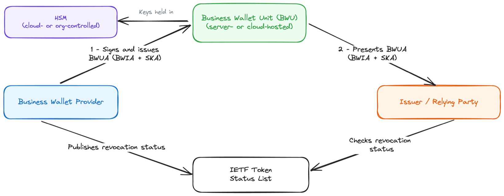
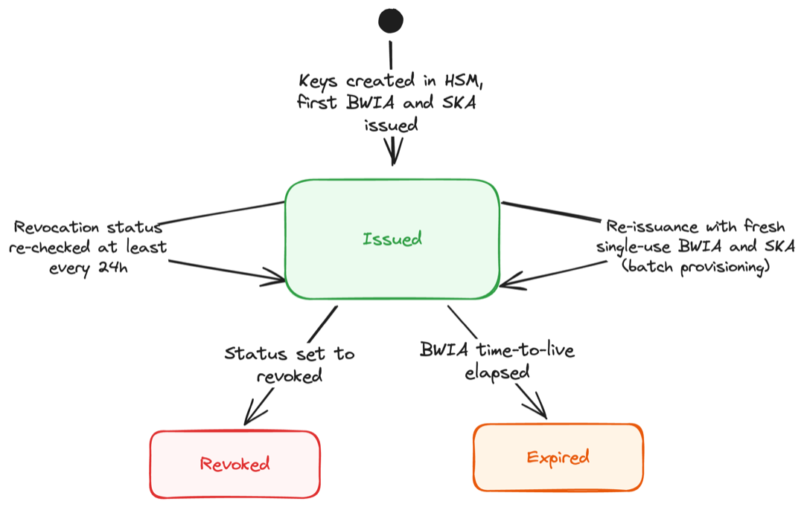
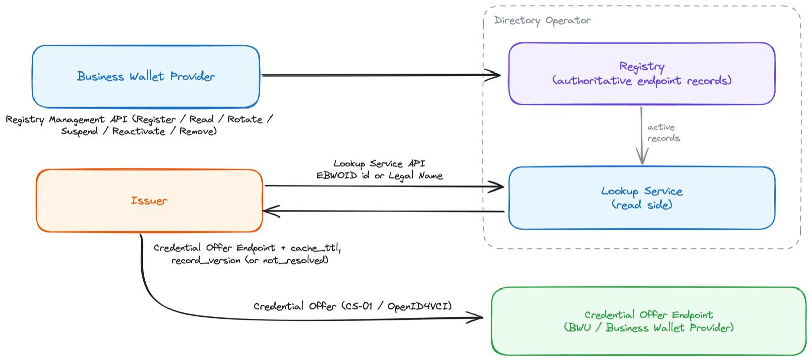
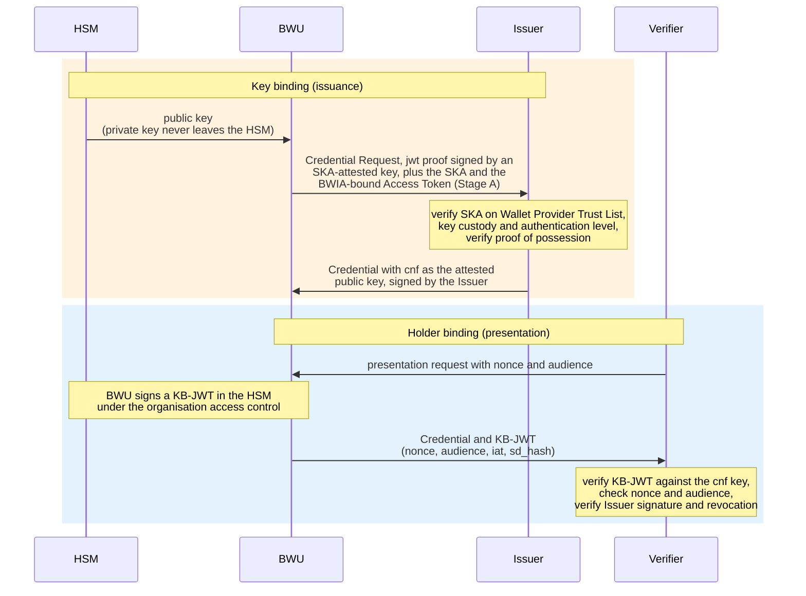

# WE BUILD - Conformance Specification CS-05: Business Wallet Unit Attestation (BWUA) Lifecycle

Version 1.0
Date: 05-August-2026

**Authors / Contributors**: WP4 Architecture

- Lal Chandran, iGrant.io, Sweden
- Eelco Klaver, Credenco, The Netherlands
- George Padayatti, iGrant.io, Sweden
- Nikolaos Triantafyllou, University of the Aegean, Greece

## Table of Contents

- [WE BUILD - Conformance Specification CS-05: Business Wallet Unit Attestation (BWUA) Lifecycle](#we-build---conformance-specification-cs-05-business-wallet-unit-attestation-bwua-lifecycle)
- [Table of Contents](#table-of-contents)
- [1. Introduction](#1-introduction)
- [2. Scope](#2-scope)
- [3. Normative Language](#3-normative-language)
- [4. Roles and Components](#4-roles-and-components)
- [5. Protocol Overview](#5-protocol-overview)
  - [5.1 Actors and information flows](#51-actors-and-information-flows)
  - [5.2 BWUA lifecycle](#52-bwua-lifecycle)
  - [5.3 Signing and key binding](#53-signing-and-key-binding)
  - [5.4 Business Wallet Provider responsibilities](#54-business-wallet-provider-responsibilities)
- [6. High-level Flows](#6-high-level-flows)
  - [6.1 Activation and BWUA provisioning](#61-activation-and-bwua-provisioning)
  - [6.2 Lifecycle and revocation](#62-lifecycle-and-revocation)
  - [6.3 Rotation / re-issuance](#63-rotation--re-issuance)
  - [6.4 Binding](#64-binding)
  - [6.5 Discovery](#65-discovery)
    - [6.5.1 Discovery model](#651-discovery-model)
    - [6.5.2 Endpoint registration and lifecycle management](#652-endpoint-registration-and-lifecycle-management)
    - [6.5.3 Endpoint lookup and Credential Offer delivery](#653-endpoint-lookup-and-credential-offer-delivery)
  - [6.6 Throughput](#66-throughput)
- [7. Normative Requirements](#7-normative-requirements)
  - [7.1 BWUA structure and validity](#71-bwua-structure-and-validity)
  - [7.2 Lifecycle, revocation, and unlinkability](#72-lifecycle-revocation-and-unlinkability)
  - [7.3 Binding](#73-binding)
  - [7.4 Discovery](#74-discovery)
    - [7.4.1 General discovery requirements](#741-general-discovery-requirements)
    - [7.4.2 Business Wallet Provider and BWU requirements](#742-business-wallet-provider-and-bwu-requirements)
    - [7.4.3 Issuer requirements](#743-issuer-requirements)
    - [7.4.4 Endpoint URI requirements](#744-endpoint-uri-requirements)
  - [7.5 Throughput](#75-throughput)
- [8. Interface Definitions](#8-interface-definitions)
  - [8.1 BWUA format](#81-bwua-format)
  - [8.2 Status / revocation interface](#82-status--revocation-interface)
  - [8.3 Discovery interface](#83-discovery-interface)
- [9. Conformance](#9-conformance)
- [References](#references)
- [Annex A (informative): Example BWUA](#annex-a-informative-example-bwua)
  - [A.1 Example BWIA (decoded JWT)](#a1-example-bwia-decoded-jwt)
  - [A.2 Example SKA (decoded JWT)](#a2-example-ska-decoded-jwt)
- [Annex B (informative): Key binding and holder binding](#annex-b-informative-key-binding-and-holder-binding)
  - [B.1 Key binding at issuance](#b1-key-binding-at-issuance)
  - [B.2 Holder binding at presentation](#b2-holder-binding-at-presentation)
  - [B.3 The sequence](#b3-the-sequence)
- [Annex C (informative): Discovery Registry and Lookup Service](#annex-c-informative-discovery-registry-and-lookup-service)
  - [C.1 Components](#c1-components)
  - [C.2 Registry behaviour](#c2-registry-behaviour)
  - [C.3 Lookup Service behaviour](#c3-lookup-service-behaviour)
  - [C.4 Security, privacy and audit](#c4-security-privacy-and-audit)
  - [C.5 Common API security model](#c5-common-api-security-model)
  - [C.6 OAuth scopes](#c6-oauth-scopes)
  - [C.7 Registry entry model](#c7-registry-entry-model)
  - [C.8 Lookup Service API](#c8-lookup-service-api)
    - [C.8.1 Endpoint lookup request](#c81-endpoint-lookup-request)
    - [C.8.2 Successful lookup response](#c82-successful-lookup-response)
    - [C.8.3 Non-resolution response](#c83-non-resolution-response)
  - [C.9 Registry Management API](#c9-registry-management-api)
    - [C.9.1 Register endpoint](#c91-register-endpoint)
    - [C.9.2 Read endpoint record for management](#c92-read-endpoint-record-for-management)
    - [C.9.3 Rotate endpoint](#c93-rotate-endpoint)
    - [C.9.4 Suspend endpoint](#c94-suspend-endpoint)
    - [C.9.5 Reactivate endpoint](#c95-reactivate-endpoint)
    - [C.9.6 Remove endpoint](#c96-remove-endpoint)
  - [C.10 Record-level authorisation and validation](#c10-record-level-authorisation-and-validation)
  - [C.11 Errors, idempotency, audit and caching](#c11-errors-idempotency-audit-and-caching)

# 1. Introduction

This document defines the **WE BUILD Conformance Specification for the Business Wallet BWUA lifecycle**. It describes how a Business Wallet Unit Attestation (**BWUA**, comprising the **Business Wallet Instance Attestation (BWIA)** and **Server Key Attestation (SKA)**) is created, maintained, revoked, and rotated throughout its lifecycle, in a consistent and testable way. The BWUA is the business counterpart of the natural-person WUA defined in CS-04 [13].

It profiles and aligns with:

- The EU ARF version 2.9.0 [1] (including its legal-person provisions) and ARF discussion Topic C [2].
- The EUDI Wallet Technical Specification TS3 [3].
- ETSI TS 119 472-3 [4], OpenID4VCI [5], OpenID4VP [6], and HAIP [7] where relevant.

It should be read together with CS-01 [10], CS-02 [11], CS-03 [12], and CS-04 [13]. CS-05 is written as a profile of CS-04: wherever a dimension carries over (Section 2), CS-05 adopts the CS-04 behaviour with the stated substitution; the new design is limited to discovery, session binding and throughput.

Like the WUA, the BWUA is an infrastructure attestation, not a user-facing credential, and has **no attestation rulebook**. Unlike the WUA, the wallet is a server- or cloud-hosted service; its keys are held in a cloud- or organisation-controlled HSM, and it is operated by several people (administrators and users) on behalf of a legal person; it commonly plays the Holder, Issuer, and Verifier roles in a single deployment.

# 2. Scope

This specification defines the conformance expectations for the **BWUA lifecycle** of the business wallet.

In scope:

- BWUA structure and role (BWIA and SKA) at the level needed to express lifecycle behaviour, by analogy to TS3 [3].
- **Lifecycle**: activation, validity, revocation and status maintenance, rotation / re-issuance, adopting CS-04 [13] Section 7.2 by analogy.
- **Binding**: key binding, holder binding, and session binding, adopting CS-04 [13] Section 7.3 by analogy, with the server-side session binding specified in 5.3, 6.4 and 7.3.
- Signing of the BWUA by the Business Wallet Provider.
- Discovery of a Credential Offer Endpoint, session binding for a server-hosted wallet, and throughput for high-volume services.

Out of scope (handled elsewhere):

- The issuance protocol itself (CS-01 [10]); the presentation protocol itself (CS-02 [11]); remote signing mechanics (CS-03 [12]); natural-person WUA specifics (CS-04 [13]).
- Trust anchoring and organisation-registration discovery (Handled separately). CS-05 requires an Issuer to verify the Business Wallet Provider's certificate against the Wallet Provider Trust List (section 7.3), but does not define how that Trust List is established, populated or discovered.
- Co-signature by a natural person alongside the BWU, and the session construction that would require.

# 3. Normative Language

The keywords **MUST**, **MUST NOT**, **REQUIRED**, **SHALL**, **SHOULD**, **SHOULD NOT**, **RECOMMENDED**, **MAY**, and **OPTIONAL** are to be interpreted as described in RFC 2119 [8].

# 4. Roles and Components

Role names are protocol/functional roles, not products. One product may implement several roles; a business wallet commonly implements several at once.

- **Business Wallet Provider:** creates and signs the BWUA (BWIA and SKA); operates revocation status lists. (= Wallet Provider in CS-04)
- **Business Wallet Unit (BWU):** the organisation's server- or cloud-hosted wallet; presents the BWUA. May act as Holder, Issuer, and Verifier (CS-02 [11]).
- **Holder (organisation):** the legal person that controls the BWU, as set out in the EBWOID.
- **Administrators and Users:** natural persons who operate the BWU on the organisation's behalf under role-based access control. Their authority derives from the legal person identified by the EBWOID and is bounded by the roles that the organisation assigns: an administrator may manage the wallet service and request BWUA revocation on behalf of the organisation, while a user may drive issuance and presentation sessions within the permissions granted. No BWUA claim identifies an individual administrator or user, and attestation-to-session binding is at the wallet-service-instance level (section 7.3), so a change of operator does not change the BWUA. This authority is expressed in line with the ARF [1] legal-person provisions.
- **Issuer / Relying Party:** consumes the BWUA; profiled in CS-01 [10] and CS-02 [11].
- **Authorization Server (AS):** issues tokens during issuance.
- **WSCA / Server-side WSCD (HSM):** Cloud- or organisation-controlled HSM protecting the keys on the server side.

# 5. Protocol Overview

The BWUA is the evidence that lets a counterparty trust a business wallet and underpins the binding of the credentials it issues, holds, or verifies. The Business Wallet Provider creates and signs the **BWIA**, attesting the integrity and authenticity of the wallet instance (service), and the **SKA**, attesting the security properties of the server-side keys. Together they form the BWUA. Detailed behaviour is in sections 6 to 8; this section gives the high-level picture.

## 5.1 Actors and information flows

The Business Wallet Provider issues and signs the attestations (BWIA and SKA) and publishes their revocation status; the BWU presents them; issuers and Relying Parties verify the Business Wallet Provider's signature and check revocation status (TS3 [3], clause 2.5). The BWU is a server- or cloud-hosted service; its keys are held in a cloud- or organisation-controlled HSM, and it may act in the Holder, Issuer, and Verifier roles within a single deployment, as illustrated below:



*Figure 1: Actors and the high-level BWUA issuance and verification*

## 5.2 BWUA lifecycle

The BWUA lifecycle is described from the **Business Wallet Provider's perspective**, as the authority over the attestation's state: the Business Wallet Provider issues each BWUA, sets its validity, maintains its revocation status, and revokes it. The BWU holds and presents the BWUA, and Relying Parties read and re-check its status.

The BWUA lifecycle is independent of two things that the Business Wallet Provider does not track:
- Whether the wallet service is **installed, migrated, or decommissioned**: the deployment state of the organisation's wallet service is a BWU lifecycle matter, and
- The **presence, expiry, or revocation of any attestation** held by the wallet is handled by the relevant Attestation Provider.

The Business Wallet Provider tracks only the BWUAs it has issued, their status-list entries, and the events that trigger revocation.

From the Business Wallet Provider's perspective, a BWUA has three states:

- **Issued**: the Business Wallet Provider has signed and issued the BWIA and SKA to the BWU; they remain in use until they expire or are revoked. The BWIA is deliberately short-lived, so a stale one cannot be reused.
- **Expired**: the BWIA's or SKA's time-to-live has elapsed.
- **Revoked**: the Business Wallet Provider has set the BWUA's status-list entry to revoked.

Because BWUAs are short-lived and single-use, the Business Wallet Provider issues fresh BWUAs to the BWU as needed; each fresh BWUA is a **new instance** of this lifecycle, not a reactivation of an expired one. For high-volume services, the provisioning cadence is profiled under section 6.6. Independent of any single BWUA's time-to-live, the Business Wallet Provider maintains the revocation status entry until its expiration, keeping it at least 31 days ahead at presentation, so that Relying Parties can recheck it throughout the life of any credential issued against it. Lifecycle transitions are driven by the organisation administrator and the Business Wallet Provider rather than a single user.

Revocation of the BWIA `client_status` entry signals revocation of the wallet service instance. Revocation of the SKA `key_storage_status` entry signals that the HSM or keystore referenced by the SKA is no longer trusted. If a breach affects the wallet service as a whole, the Business Wallet Provider revokes the wallet service instance and, where relevant, the corresponding SKAs.



*Figure 2: BWUA (BWIA/SKA) attestation lifecycle, from the Business Wallet Provider's perspective. Re-issuance produces a new BWUA, i.e. a new run of this lifecycle. The deployment state of the organisation's wallet service (installed, migrated or decommissioned) is a BWU lifecycle matter, tracked separately from this lifecycle.*

## 5.3 Signing and key binding

The Business Wallet Provider signs each BWIA and SKA as a JWT using ES256, ES384, or ES512 (TS3 [3], clause 2.6; see the requirement in section 7.1). A credential issuer verifies this signature against the Business Wallet Provider's key before trusting the attestation.

Key binding links an issued or held credential to a key that the BWU controls in the HSM. It is required whenever a credential must be cryptographically bound to such a key. Within a single issuance session, binding happens in two stages: **Stage A** binds the Access Token to the BWIA (attestation-to-session binding), and **Stage B** binds the issued credential to a key attested by the SKA (key binding), as specified below.

For a server- or cloud-hosted wallet there is no single device to bind to, and a transaction may involve a natural-person counterparty presenting from a personal wallet. Stage A therefore binds the Access Token to the wallet-service instance rather than to a device: the BWU proves possession of the BWIA `cnf` key, held in the HSM, over a fresh Authorization Server nonce and the token request, and the Authorization Server issues an Access Token sender-constrained to that key following DPoP [14]. The binding is at the wallet-service-instance level and does not depend on which administrator or user drives the session. Stage B, binding a credential to an SKA-attested key, carries over from CS-04 [13] by analogy, with the keys held on the server side. The normative requirements are in section 7.3.

## 5.4 Business Wallet Provider responsibilities

This overview is non-normative; the binding requirements are in sections 7.1 and 7.2. The Business Wallet Provider:

- Creates and signs each BWIA and SKA (ES256, ES384, or ES512) with the required claims (TS3 [3], clauses 2.6, 2.3.1, and 2.3.2),
- Ensures the BWU has BWIAs available **as needed** for issuance, and that a given BWIA is used in **a single issuance process** and is **never shared across issuers**,
- Keeps each BWIA **short-lived** (under 24 hours) and ensures the BWU treats it as **single-use** for freshness and unlinkability, and issues **no long-lived SKA**; the provisioning cadence for high-volume services follows section 7.5,
- **Maintains revocation status** via Token Status List [9], kept at least 31 days ahead of presentation and live until each entry's `exp`,
- **Revokes** all status entries for a BWU on revocation, triggered by a detected security vulnerability in the wallet service or its operating environment, or by an authorised administrator request on behalf of the organisation.

# 6. High-level Flows

This section describes the main BWUA flows as step-by-step sequences, from the Business Wallet Provider's perspective, consistent with the lifecycle in section 5.2 and the requirements in section 7.

## 6.1 Activation and BWUA provisioning

Actors: Business Wallet Provider, BWU (business wallet service), HSM, organisation administrator.

1. The organisation is onboarded: its identity is anchored by the EBWOID issued from a member-state business registry, where administrators and users are set up under role-based access control (section 4).
2. The BWU (wallet service instance) is activated, and the Business Wallet Provider verifies its integrity.
3. Cryptographic keys are created in the cloud or organisation-controlled HSM.
4. The Business Wallet Provider issues the first BWIAs and SKAs to the BWU, each signed as a JWT (section 7.1).
5. The Business Wallet Provider records the association between each BWUA and the BWU, along with the status-list entries it maintains.

**Outcome**: the BWU holds valid (issued) BWUAs and is operational for the organisation.

## 6.2 Lifecycle and revocation

Actors: Business Wallet Provider, Issuers, and Verifiers relying on the BWUA.

1. The Business Wallet Provider publishes and maintains the revocation status of each BWUA using a Token Status List [9], keeping the status entries' `exp` at least 31 days ahead at the time of presentation (section 7.2).
2. On a revocation trigger (a security vulnerability detected in the wallet service or its operating environment, or an authorised administrator request, for example, on key compromise, business change, or cessation of the service), the Business Wallet Provider sets all status entries for that BWU to revoked (section 7.2).
3. Issuers and Relying Parties recheck the BWUA revocation status at least once every 24 hours during the validity period of the credential issued against it; the check is a status list retrieval, not a per-wallet call, and a single status list covers many BWUs (section 7.2).

**Outcome**: revocation of a business wallet propagates to every relying party still holding a credential issued against it.

## 6.3 Rotation / re-issuance

Actors: Business Wallet Provider, BWU.

1. A BWIA or SKA approaches expiry, has been used (single-use), or has an insufficient remaining maintenance period for a forthcoming issuance.
2. The BWU requests fresh BWUAs from the Business Wallet Provider as needed; for high-volume services, the provisioning cadence follows section 6.6.
3. The Business Wallet Provider re-verifies the wallet service's integrity and issues fresh, single-use BWIAs and SKAs (sections 7.1 and 7.2).

**Outcome**: the BWU continuously holds usable BWUAs; each fresh BWUA is a new instance of the lifecycle in section 5.2, and the previous one simply expires.

## 6.4 Binding

This flow gives the server-side form of the two-stage binding in 5.3, for issuance in which the BWU acts as Holder. Stage A binds at the token endpoint; Stage B carries over from CS-04 [13] Section 7.3 at the credential endpoint. Normative requirements are in section 7.3.

Actors: Business Wallet Provider, BWU (Holder), HSM, Authorization Server (AS) and Issuer, and a personal wallet counterparty (only where presentation during issuance is requested of a natural person).

1. **Stage A**: the BWU obtains a fresh AS nonce, presents a valid BWIA, and proves possession of the BWIA `cnf` key held in the HSM over the nonce and the token request. This binds the Access Token to the wallet-service instance, the server-side analogue of the CS-04 DPoP-on-device binding.
2. The AS issues a sender-constrained Access Token bound to the BWIA `cnf` key, independent of which administrator or user (section 4) drives the session.
3. Where the Issuer requires a presentation as a condition of issuance (OpenID4VCI [5], via OpenID4VP [6]) and the requested holder is a natural person, that person presents from their personal wallet; the presentation is holder-bound (WUA-bound key, Annex B) into the same session.
4. **Stage B**: at the credential endpoint, the BWU proves possession of a key listed in the SKA `attested_keys` using the HSM; the issued credential is bound to that key.
5. The Issuer verifies the Business Wallet Provider's signature on the BWIA and SKA, checks their status (section 6.2), and verifies the Stage A and Stage B proofs before issuing.

**Freshness**: each session carries a fresh AS nonce, and the BWIA is short-lived and single-use (sections 5.2 and 7.1), so a binding cannot be replayed.

**Outcome**: the Access Token is bound to the wallet-service instance, and each issued credential is bound to an SKA-attested, HSM-protected key; when presentation is requested during issuance, a natural-person counterparty is holder-bound to the same session.

Stage A uses attestation-based client authentication over a fresh Authorization Server nonce, with the resulting Access Token sender-constrained to the BWIA `cnf` key following DPoP [14]; the interface is profiled in section 8.

## 6.5 Discovery

### 6.5.1 Discovery model

The discovery capability allows an Issuer or Attestation Provider to resolve the Credential Offer Endpoint for a Business Wallet Unit (BWU) using the Wallet Owner's EBWOID identifier.

Discovery is provided by a directory service comprising a **Registry**, which holds the authoritative record of Credential Offer Endpoints, a **Lookup Service**, which resolves an EBWOID identifier or Legal Name against that record, and a **Directory Operator**, which operates either or both. The behaviour of that service is described in Annex C.

One other component participates in this flow:

- **Credential Offer Endpoint**: The HTTPS endpoint exposed by the BWU or Business Wallet Provider for receiving a CS-01 / OpenID4VCI Credential Offer or `credential_offer_uri`.

The primary lookup key is the EBWOID identifier or the Legal Entity Name of the Wallet Owner.

Discovery answers the following question:

> Which Credential Offer Endpoint, if any, is currently registered for this EBWOID identifier or Legal Name?

A Registry entry records an operational association registered by a Business Wallet Provider. It is not the authoritative source of the EBWOID itself and does not establish:

- EBWOID validity;
- BWUA validity;
- Issuer eligibility;
- authorisation to issue;
- Wallet Owner consent;
- Credential Offer validity;
- support for the requested credential type; or
- acceptance of a delivered Credential Offer.

Those checks remain the responsibility of the relevant BWU, Business Wallet Provider, Issuer, CS-01 flow, attestation rulebook and applicable trust framework.



*Figure 3: Discovery of a Credential Offer Endpoint for a BWU. The Business Wallet Provider registers and maintains the endpoint record through the Registry Management API; an Issuer resolves an EBWOID identifier or Legal Name through the Lookup Service API and then delivers the Credential Offer to the resolved endpoint under CS-01 [10]. Successful resolution is technical endpoint resolution only (section 7.4.1).*

### 6.5.2 Endpoint registration and lifecycle management

Actors: Wallet Owner, Business Wallet Provider and BWU.

1. The Wallet Owner obtains or already holds an EBWOID.
2. The Business Wallet Provider establishes, according to its onboarding and authorisation process, that it operates a BWU for that Wallet Owner.
3. The Business Wallet Provider determines the Credential Offer Endpoint that the BWU uses.
4. The Business Wallet Provider authenticates to the Registry Management API and submits a registration request containing the EBWOID identifier, Credential Offer Endpoint, Legal Name and required operational metadata.
5. The Registry validates the request, records the association and makes the active record available for lookup (Annex C).

**Outcome**: an active endpoint record exists and may be resolved by an authorised Issuer.

When the endpoint or BWU changes, the Business Wallet Provider performs the applicable lifecycle operation:

- **Rotation**: the current Credential Offer Endpoint is replaced without changing the EBWOID identifier/Legal Name
- **Suspension**: the record is temporarily made non-resolvable, for example during an incident or suspected endpoint compromise.
- **Reactivation**: a suspended record is returned to active use after the Business Wallet Provider and Registry determine that it may safely be resolved again.
- **Removal**: the record is permanently removed from active resolution, for example when the BWU is decommissioned or the Business Wallet Provider relationship ends.

Endpoint rotation, suspension, reactivation or removal does not require the EBWOID identifier to change.

### 6.5.3 Endpoint lookup and Credential Offer delivery

Actors: Issuer, BWU and Credential Offer Endpoint.

1. The Issuer obtains the EBWOID identifier or Legal Name of the intended Wallet Owner.
2. The Issuer authenticates to the Lookup Service.
3. The Issuer submits a lookup request that includes the EBWOID identifier or the Legal Name.
4. The Lookup Service returns either the Credential Offer Endpoint, together with a cache lifetime or validity indication and the record version, or a non-resolution response (Annex C).
5. The Issuer creates a Credential Offer according to CS-01 and sends the Credential Offer to the resolved Credential Offer Endpoint.
6. The Credential Offer Endpoint receives the delivery request, applies its own sender, delivery-envelope, replay, rate-limit and abuse controls, and accepts, queues, rejects or ignores the offer according to the Business Wallet Provider's implementation and the Wallet Owner's configuration.
7. If the offer is accepted for processing, the BWU continues according to CS-01.

**Outcome**: the Issuer obtains a current technical delivery endpoint or learns that no endpoint is resolvable; endpoint resolution then proceeds to the normal CS-01 issuance flow.

> Successful endpoint resolution does not mean that the Credential Offer has been validated or will be accepted.

## 6.6 Throughput

A business wallet issues, holds and presents credentials at organisational volume rather than at the pace of a single person, while each BWIA remains short-lived and single-use (sections 5.2 and 7.1). This flow describes how a Business Wallet Provider keeps a high-volume BWU supplied with BWUAs without weakening freshness or unlinkability. Normative requirements are in section 7.5.

Actors: Business Wallet Provider, BWU, HSM, Issuers and Relying Parties.

1. The BWU forecasts its demand for BWIAs and SKAs from its expected issuance and presentation volume, and keeps a buffer of unused BWUAs sized to that forecast.
2. When the buffer falls below its refill threshold, the BWU requests a batch of fresh, single-use BWIAs and SKAs in a single provisioning call, rather than one call per transaction.
3. The Business Wallet Provider re-verifies the integrity of the wallet service, issues the batch (section 6.3), and records a status-list entry for every BWUA in it.
4. The BWU uses one BWIA per issuance session and never sends the same BWIA to more than one Issuer (section 7.2); unused BWUAs simply expire.
5. Issuers and Relying Parties check revocation by retrieving the status list rather than by a per-wallet call, so verification load stays independent of transaction volume (section 6.2).

**Outcome**: a high-volume BWU always holds usable, single-use BWUAs, and neither provisioning nor status checking becomes a per-transaction bottleneck. Batch size, refill threshold and provisioning interval are deployment parameters, bounded by the requirements in 7.5.

# 7. Normative Requirements

## 7.1 BWUA structure and validity

Business Wallet Provider **MUST**:

1. Sign every BWIA and SKA as a JWT using ES256, ES384, or ES512 (TS3 [3], clause 2.6).
2. Populate the BWIA, by analogy to TS3 [3], clause 2.3.1, with at least the wallet service identification (name, version, and certification information), a `client_status` object (containing `status` and `exp`), and a `cnf` key.
3. Populate the SKA, by analogy to TS3 [3] clause 2.3.2, with at least the `attested_keys` array (one or more keys), the key storage and certification information for the HSM, and a `key_storage_status` object (containing `status` and `exp`).
4. Issue each BWIA with a time-to-live of less than 24 hours; the provisioning cadence for high-volume services is profiled under section 7.5.
5. Issue each SKA with a short token-level time-to-live comparable to the BWIA, so that no SKA is long-lived. The token-level `exp` is independent of the `key_storage_status.exp` revocation-maintenance commitment (section 7.2).

BWU **MUST**:

1. Present a BWIA whose time-to-live has not expired, together with an SKA, where the consuming process requires it.

## 7.2 Lifecycle, revocation, and unlinkability

Business Wallet Provider **MUST**:

1. Use Token Status List [9] as the revocation mechanism for both BWIAs and SKAs.
2. Maintain revocation status so that a BWU can always present a BWIA and SKA whose `client_status.exp` and `key_storage_status.exp` are at least 31 days in the future.
3. For SKA revocation, either reference the same status-list index for all SKAs attesting keys stored in the same HSM or keystore type (type-shared), or assign a fresh status-list index to each SKA (per-SKA).
4. Ensure a BWU uses a single SKA at most once, and that each attested public key is included in at most one SKA.
5. Ensure a BWU sends the same BWIA to at most one Issuer, unless per-issuer reuse applies; status-list entries are never reused across different issuers, preserving unlinkability between issuers.
6. Keep each published status-list entry available until its expiration has passed.
7. On revocation of a wallet service instance, revoke all `client_status` entries associated with that BWU.
8. Revoke a wallet service instance upon detecting a security vulnerability in the service or its operating environment, or upon an authorised administrator's request on behalf of the organisation.

BWU **MUST NOT** (per-SKA index):

1. Reuse the same per-SKA status-list index for interactions with different Issuers.

Relying Parties **MUST**:

1. Check the revocation status of both the BWIA and the SKA received during issuance at least once every 24 hours for the validity period of the credential issued against them; where that validity period is less than 24 hours, checking on issuance is sufficient. The check is a status-list retrieval, not a per-wallet call; a single status list covers many BWUs.

> Note: the token-level `exp` (technical validity, under 24 hours) and `client_status.exp` (the revocation maintenance commitment) are independent. A short-lived BWIA can carry a far-future `client_status.exp`.

## 7.3 Binding

Business Wallet Provider **MUST**:

1. Issue each BWIA with a `cnf` key suitable as the proof-of-possession key for attestation-to-session binding (Stage A), with the corresponding private key held in the HSM.
2. Issue each SKA such that every key in `attested_keys` is held in the HSM and usable for key binding (Stage B).

BWU **MUST**:

1. Bind the Access Token to the wallet-service instance (Stage A) by presenting a valid, unexpired BWIA and proving possession of the BWIA `cnf` key held in the HSM over a fresh AS-provided nonce and the token request.
2. Ensure the attestation-to-session binding is at the wallet-service-instance level and does not depend on which administrator or user (section 4) drives the session.
3. Bind each issued credential (Stage B) to a key listed in the `attested_keys` of a valid SKA by proving possession of that key using the HSM at the credential endpoint.
4. Where the Issuer requires a presentation as a condition of issuance and the requested holder is a natural person, ensure that person's presentation is holder-bound into the same issuance session, carrying the session freshness value.
5. Use each BWIA in a single issuance session and not reuse a Stage A or Stage B proof across sessions.

Issuer **MUST**:

1. Verify that the Business Wallet Provider's signing certificate, taken from the `x5c` JOSE header of the BWIA and SKA (Annex A), chains to a trust anchor on the Wallet Provider Trust List, and reject the attestation where it does not.
2. Verify the Business Wallet Provider's signature on the BWIA and SKA and check their status (section 7.2) before issuing.
3. Verify the Stage A binding (the Access Token is sender-constrained to the BWIA `cnf` key) and the Stage B binding (proof of possession of an SKA-attested key).
4. Where presentation during issuance is requested, verify the counterparty presentation, its holder binding, and that it is bound to the same issuance session, before issuing.

## 7.4 Discovery

### 7.4.1 General discovery requirements

1. A successful lookup response **MUST** be interpreted only as technical endpoint resolution.
2. A successful lookup response **MUST NOT** be interpreted as:
   - confirmation of EBWOID validity;
   - confirmation of BWUA validity;
   - confirmation that the Issuer is eligible or authorised to issue;
   - evidence of Wallet Owner consent;
   - validation of the Credential Offer;
   - confirmation that the requested credential type is supported; or
   - confirmation that the Credential Offer will be accepted.
3. Credential Offer creation, processing, authorisation, token exchange and credential issuance **MUST** continue according to CS-01.
4. An endpoint URI **MUST NOT** itself be treated as a secret, bearer credential or proof of authorisation.

### 7.4.2 Business Wallet Provider and BWU requirements

The Business Wallet Provider **MUST**:

1. Register a Credential Offer Endpoint for every BWU that supports inbound Credential Offers.
2. Associate the endpoint record with the correct Wallet Owner EBWOID.
3. Establish that it is authorised to operate the BWU and manage the corresponding endpoint record.
4. Authenticate to the Registry Management API for all record-management operations.
5. Ensure that the registered endpoint is under the control of the BWU or Business Wallet Provider.
6. Keep endpoint records and operational metadata up to date.
7. Rotate the endpoint when the endpoint URI changes or is replaced.
8. Suspend the endpoint record when the endpoint cannot securely receive Credential Offers.
9. Remove the endpoint record when:
   - the BWU is decommissioned;
   - the Business Wallet Provider no longer operates the BWU for the Wallet Owner;
   - the Wallet Owner requests removal through an authorised process; or
   - continued resolution would create a security or privacy risk.
10. Coordinate endpoint suspension or removal with the BWU and BWUA lifecycle as specified in section 6.5.2.

The Business Wallet Provider **SHOULD**:

1. Use endpoint URIs containing non-identifying and rotatable routing identifiers.
2. Use a cache lifetime appropriate to the expected endpoint lifecycle and incident-response requirements.
3. Provide supported delivery methods and endpoint metadata where this assists interoperable delivery.

The BWU or Credential Offer Endpoint **MUST**:

1. Be reachable over HTTPS.
2. Support receiving a CS-01 / OpenID4VCI Credential Offer.
3. Treat lookup as endpoint discovery only.
4. Apply its own sender authentication or delivery-time access controls where required.
5. Validate the delivery envelope before processing it.
6. Reject malformed delivery requests.
7. Protect against replay, spam, uncontrolled retries and denial-of-service attempts.
8. Avoid disclosing unnecessary Wallet Owner, BWU or Credential Offer processing state to unauthorised senders.
9. Ensure that receipt or acceptance of a delivery request does not bypass the normal CS-01 issuance checks.

### 7.4.3 Issuer requirements

An Issuer **MUST**:

1. Obtain the EBWOID identifier or Legal Name of the intended Wallet Owner before lookup.
2. Authenticate to the Lookup Service.
3. Submit the EBWOID identifier or Legal Name as the primary lookup key.
4. Use the returned endpoint only for Credential Offer delivery.
5. Respect the cache lifetime or validity indication returned by the Lookup Service.
6. Perform a new lookup after the cached endpoint information expires.
7. Create the Credential Offer according to CS-01.
8. Send only a CS-01 / OpenID4VCI-compliant Credential Offer to the Credential Offer Endpoint.
9. Handle a non-resolution response without probing, enumeration or attempts to infer Registry state.
10. Handle endpoint rejection or temporary failure without uncontrolled retries or retry storms.
11. Independently verify the BWUA where reliance on the BWU requires such verification.

An Issuer **MUST NOT**:

1. Treat endpoint resolution as authorisation to issue.
2. Treat endpoint resolution as evidence of Wallet Owner consent.
3. Treat endpoint resolution as evidence of BWUA or EBWOID validity.
4. Continue using endpoint information after its cache lifetime has expired.
5. Scrape, enumerate or perform wildcard searches over EBWOID identifiers.

### 7.4.4 Endpoint URI requirements

A registered Credential Offer Endpoint URI **MUST**:

1. Be an absolute HTTPS URI.
2. Be directly usable by an Issuer for Credential Offer delivery.
3. Be capable of rotation without changing the EBWOID identifier.
4. Not be treated as a secret or bearer credential.

The URI **SHOULD**:

1. Be non-identifying.
2. Not contain the EBWOID identifier in its path or query string.
3. Not contain legal names, tax identifiers, registration numbers or similar directly identifying information.
4. Use an opaque or randomised routing identifier.

## 7.5 Throughput

Business Wallet Provider **MUST**:

1. Support batch provisioning, so that a BWU can obtain more than one single-use BWIA and SKA in a single provisioning request.
2. Issue every BWUA in a batch with the same structure, validity and status-maintenance guarantees as a singly issued BWUA (sections 7.1 and 7.2).
3. Assign each BWIA in a batch its own status-list entry, so that batching does not create linkability between Issuers (section 7.2).

Business Wallet Provider **SHOULD**:

1. Publish the maximum batch size and any rate limit applied to the provisioning interface.
2. Apply per-BWU rate limiting and abuse controls to that interface.

BWU **MUST**:

1. Maintain a buffer of unused BWUAs sized to its expected issuance and presentation volume, and request a fresh batch before that buffer is exhausted.
2. Use each BWIA in a single issuance session and allow unused BWUAs to expire rather than reusing them (sections 7.1 and 7.2).

Relying Parties **MUST**:

1. Check BWUA revocation by retrieving the status list rather than by a per-wallet call to the Business Wallet Provider (section 7.2), so that verification load does not scale with transaction volume.

> Note: batch size, refill threshold and provisioning interval are deployment parameters and are not fixed by this specification.

# 8. Interface Definitions

Logical interfaces; exact paths are deployment-specific.

## 8.1 BWUA format

BWIA and SKA are JWTs signed with ES256, ES384, or ES512 (TS3 [3], clause 2.6). BWIA claims follow TS3 [3], clause 2.3.1, and SKA claims follow TS3 [3], clause 2.3.2, applied to the business wallet, with the business subject anchored by the EBWOID and the attested keys held in a cloud- or organisation-controlled HSM. See Annex A for illustrative examples.

## 8.2 Status / revocation interface

Token Status List [9] retrieval (TS3 [3], clause 2.5, by analogy): the wallet service instance via `client_status.status`, and the HSM or keystore (type-shared or per-SKA) via `key_storage_status.status`. This specification **pins the IETF Token Status List to draft-ietf-oauth-status-list-20** [9], following CS-04 [13], section 8.2, to enable conformance testing.

## 8.3 Discovery interface

Discovery is exposed through two logical interfaces operated by the Directory Operator and described in Annex C. Exact deployment topology and base URLs are deployment-specific.

- **Registry Management API**: the protected management interface used by an authorised Business Wallet Provider to create and manage endpoint records.
- **Lookup Service API**: the protected read interface used by an Issuer or other authorised participant to resolve an EBWOID identifier or Legal Name to a Credential Offer Endpoint.

Both interfaces are authenticated using OAuth 2.0 Client Credentials.

A Business Wallet Provider uses the Registry Management API to register a Credential Offer Endpoint for a BWU, to read an endpoint record it is authorised to manage, and to rotate, suspend, reactivate or remove that endpoint.

An Issuer uses the Lookup Service API to resolve an EBWOID identifier or Legal Name, and receives either a resolution response carrying the Credential Offer Endpoint and a cache lifetime, or a non-resolution response.

Neither interface participates in the CS-01 / OpenID4VCI issuance protocol.

The logical paths, request and response structures, OAuth scopes, Registry entry model, lifecycle status values, error handling, idempotency, audit and caching rules are given in Annex C.

# 9. Conformance

An implementation **conforms to the Business Wallet Provider role** if it implements the requirements in sections 7.1 to 7.5 applicable to the role and the interfaces in section 8.

An implementation **conforms to the Business Wallet Unit (BWU)** if it meets the BWU requirements in section 7 and the relevant flows in section 6.

An implementation **conforms as an Issuer or Verifier** if it implements the relying-party requirements in sections 7.2 to 7.5 and validates the BWUA as specified.

Profiles MUST NOT weaken the mandatory requirements in this specification.

# References

[1] European Commission (2026), The European Digital Identity Wallet Architecture and Reference Framework, version 2.9.0. Available at: https://eudi.dev/2.9.0/architecture-and-reference-framework-main/ (Accessed: 11 June 2026)

[2] European Commission (2026) ARF Discussion Topic C: Wallet Unit Attestations. Available at: https://eudi.dev/2.9.0/discussion-topics/c-rr-wallet-unit-attestations/ (Accessed: 11 June 2026)

[3] European Commission (2026) EUDI Wallet Technical Specification TS3: Wallet Unit Attestations (WUA) used in issuance of PID and Attestations. Available at: https://github.com/eu-digital-identity-wallet/eudi-doc-standards-and-technical-specifications/blob/main/docs/technical-specifications/ts3-wallet-unit-attestation.md (Accessed: 11 June 2026)

[4] ETSI (2026) ETSI TS 119 472-3 V1.1.1: Electronic Signatures and Trust Infrastructures (ESI); Profiles for Electronic Attestation of Attributes; Part 3: Profiles for issuance of EAA or PID

[5] OpenID Foundation (2025) OpenID for Verifiable Credential Issuance 1.0. Available at: https://openid.net/specs/openid-4-verifiable-credential-issuance-1_0.html (Accessed: 10 July 2026)

[6] OpenID Foundation (2025) OpenID for Verifiable Presentations 1.0. Available at: https://openid.net/specs/openid-4-verifiable-presentations-1_0.html (Accessed: 10 July 2026)

[7] OpenID Foundation (2025) OpenID4VC High Assurance Interoperability Profile (HAIP) 1.0. Available at: https://openid.net/specs/openid4vc-high-assurance-interoperability-profile-1_0-ID1.html (Accessed: 10 July 2026)

[8] IETF (1997) RFC 2119: Key words for use in RFCs to Indicate Requirement Levels. Available at: https://datatracker.ietf.org/doc/html/rfc2119 (Accessed: 10 July 2026)

[9] IETF (2026) OAuth Token Status List, draft-ietf-oauth-status-list-20 (Internet-Draft, OAuth WG). Available at: https://datatracker.ietf.org/doc/draft-ietf-oauth-status-list/20/ (Accessed: 10 July 2026). CS-05 pins this revision, following CS-04 [13].

[10] WE BUILD (2026) Conformance Specification CS-01: Credential Issuance, version 1.2

[11] WE BUILD (2026) Conformance Specification CS-02: Credential Presentation, version 1.1

[12] WE BUILD (2026) Conformance Specification CS-03: Remote Qualified Signing with Wallet Units, version 1.2

[13] WE BUILD (2026) Conformance Specification CS-04: Individual Wallet Unit Attestation (WUA) Lifecycle, version 1.0

[14] IETF (2023) RFC 9449: OAuth 2.0 Demonstrating Proof of Possession (DPoP). Available at: https://datatracker.ietf.org/doc/html/rfc9449 (Accessed: 3 August 2026)

[15] IETF (2025) SD-JWT-based Verifiable Credentials (SD-JWT-VC). Available at: https://datatracker.ietf.org/doc/draft-ietf-oauth-sd-jwt-vc/ (Accessed: 3 August 2026)

[16] IETF (2013) RFC 7800: Proof-of-Possession Key Semantics for JSON Web Tokens (JWTs). Available at: https://datatracker.ietf.org/doc/html/rfc7800 (Accessed: 3 August 2026)

# Annex A (informative): Example BWUA

This annex is **informative**. It gives illustrative examples of a BWIA and an SKA, mirroring CS-04 [13] Annex A, in which the BWUA comprises the BWIA and the SKA. All values are placeholders; where a normative TS3 [3] data model is later adopted for the business wallet, it prevails.

## A.1 Example BWIA (decoded JWT)

JOSE header:

```json
{
  "alg": "ES256",
  "typ": "oauth-client-attestation+jwt",
  "x5c": ["<Business Wallet Provider signing certificate chain>"]
}
```

Payload:

```json
{
  "sub": "https://wallet-provider.example/instances/7c2e...9b",
  "iat": 1785600000,
  "exp": 1785640000,
  "cnf": { "jwk": { "kty": "EC", "crv": "P-256", "x": "...", "y": "..." } },
  "wallet_name": "Example Business Wallet",
  "wallet_version": "1.2.0",
  "wallet_link": "https://wallet-provider.example/info",
  "wallet_solution_certification_information": { "...": "conformity assessment body and certification details" },
  "ebwoid_id": "SEBOLREG.123456789",
  "legal_name": "SEBOLREG",
  "client_status": {
    "status": { "status_list": { "idx": 4211, "uri": "https://wallet-provider.example/bwia-statuslists/17" } },
    "exp": 1788278400
  }
}
```

Where each element comes from:
- `alg` (ES256, ES384 or ES512) - TS3 [3], clause 2.6, as required by section 7.1.
- `typ` (`oauth-client-attestation+jwt`) and the JWT encoding - the BWIA is a Wallet Attestation per OpenID4VCI [5], Appendix E, by analogy to TS3 [3], clause 2.2.1.
- `cnf` (the proof-of-possession key used for Stage A attestation-to-session binding) and the token-level `exp` under 24 hours - TS3 [3], clause 2.2.1.1, with the corresponding private key held in the HSM (section 7.3).
- `wallet_name`, `wallet_version`, `wallet_solution_certification_information`, `wallet_link` and `client_status` - TS3 [3], clause 2.3.1, applied to the business wallet service.
- `ebwoid_id` and `legal_name` - the business subject, anchored by the EBWOID issued from a member-state business registry (sections 4 and 6.1). These have no CS-04 [13] counterpart and follow the ARF [1] legal-person provisions.
- `client_status.status` (the `status_list` reference with `idx` and `uri`) - TS3 [3], clause 2.5.1, using the Token Status List [9].
- `client_status.exp` (the revocation-maintenance commitment, at least 31 days ahead at presentation) - TS3 [3], clauses 2.4.1 and 2.4.2, as required by section 7.2.

> Note: `iss` is omitted, as in CS-04 [13] Annex A; the Business Wallet Provider identity is inferred from the signing certificate in the `x5c` JOSE header.

## A.2 Example SKA (decoded JWT)

JOSE header:

```json
{
  "alg": "ES256",
  "typ": "keyattestation+jwt",
  "x5c": ["<Business Wallet Provider signing certificate chain>"]
}
```

Payload:

```json
{
  "iat": 1785600000,
  "exp": 1785640000,
  "attested_keys": [ { "kty": "EC", "crv": "P-256", "x": "...", "y": "..." } ],
  "key_storage": ["iso_18045_high"],
  "user_authentication": ["iso_18045_high"],
  "certification": { "...": "HSM certification scheme, evaluated requirements and level" },
  "key_storage_status": {
    "status": { "status_list": { "idx": 9107, "uri": "https://wallet-provider.example/ska-statuslists/4" } },
    "exp": 1788278400
  }
}
```

Where each element comes from:

- `alg` (ES256, ES384 or ES512) - TS3 [3], clause 2.6, as required by section 7.1.
- `attested_keys`, `key_storage`, `certification` and `key_storage_status` - TS3 [3], clause 2.3.2, applied to a cloud- or organisation-controlled HSM rather than a device WSCD.
- `user_authentication` - OpenID4VCI [5], Appendix D, as referenced by TS3 [3], clause 2.3.2. For a business wallet it expresses the authentication level applied to the administrator or user operating the BWU (section 4), not that of a single device holder.
- `key_storage_status.status` (type-shared or per-SKA index) - TS3 [3], clause 2.5.2, using the Token Status List [9], as required by section 7.2.

> Note: the exact shapes of `key_storage`, `user_authentication` and `certification` are defined by TS3 [3] and OpenID4VCI [5]; the values shown are ISO 18045 AVA_VAN levels. As in the BWIA, `iss` is omitted and the Business Wallet Provider identity is inferred from the `x5c` JOSE header.

# Annex B (informative): Key binding and holder binding

This annex is **informative**. Key binding at issuance and holder binding at presentation carry over from CS-04 [13] Annex B, and the server-side session binding in section 5.3 and server-side key custody.

## B.1 Key binding at issuance

1. The BWU generates the key pair inside the HSM; the private key never leaves it.
2. In the Credential Request, the `jwt` proof carries the SKA in its `key_attestation` header and is signed by a key listed in `attested_keys`, presenting the public key and proving possession in one step (section 7.3).
3. The Issuer verifies the SKA against the Wallet Provider Trust List, reads `key_storage` and `certification` (the HSM protection level) and `user_authentication` (TS3 [3], clause 2.3.2), and verifies the proof of possession.
4. The Issuer embeds the holder public key in the credential `cnf` claim (RFC 7800 [16]) and signs the credential, for example an SD-JWT-VC [15]. The credential is now bound to that HSM-held key.

The credential `cnf` claim (illustrative):

```json
"cnf": { "jwk": { "kty": "EC", "crv": "P-256", "x": "...", "y": "..." } }
```

## B.2 Holder binding at presentation

Profiled in CS-02 [11]; summarised here for context.

1. The Verifier sends a request carrying a `nonce` and its identifier `aud` (OpenID4VP [6]).
2. The BWU signs a Key Binding JWT with the bound private key in the HSM; use of that key is authorised under the organisation role-based access control (section 4) rather than by a single device holder authentication.
3. The Verifier verifies the KB-JWT against the `cnf` key inside the credential, checks `nonce` (anti-replay) and `aud` (intended verifier), and verifies the Issuer signature and the credential revocation status. The BWUA is not presented.

The KB-JWT (illustrative, SD-JWT-VC [15]):

```json
{ "typ": "kb+jwt", "alg": "ES256" }
```

```json
{ "nonce": "n-0S6_WzA2Mj", "aud": "https://verifier.example", "iat": 1785600000, "sd_hash": "..." }
```

## B.3 The sequence

1. HSM to BWU: the public key, the private key never leaving the HSM.
2. BWU to Issuer: Credential Request, with the `jwt` proof signed by an SKA-attested key, together with the SKA and the BWIA-bound Access Token obtained in Stage A (section 6.4).
3. Issuer: verifies the SKA on the Wallet Provider Trust List, the key custody and authentication level, and the proof of possession.
4. Issuer to BWU: the credential with `cnf` set to the attested public key, signed by the Issuer.
5. Verifier to BWU: presentation request with `nonce` and audience.
6. BWU: signs a KB-JWT in the HSM under the organisation access control.
7. BWU to Verifier: the credential and the KB-JWT (`nonce`, audience, `iat`, `sd_hash`).
8. Verifier: verifies the KB-JWT against the `cnf` key, checks `nonce` and audience, and verifies the Issuer signature and revocation status.



*Figure B.1: Key binding (issuance) and holder binding (presentation) for a business wallet. The SKA assures the Issuer that the `cnf` key is held in the HSM; the Verifier later checks the KB-JWT against that same key in the credential, not against the BWUA.*

Where the requested holder is a natural person, the presentation comes from the personal wallet and is holder-bound into the same issuance session (section 6.4).

> Note: the two `cnf` uses are different. In the BWIA, `cnf` is the key that binds the issuance session (Stage A, section 7.3). In the issued credential, `cnf` is the holder key to which the credential is bound (this annex).

# Annex C (informative): Discovery Registry and Lookup Service

> **Note: status of this annex.** This annex is informative, not normative. It records the Credential Offer Endpoint Registry and Lookup Service as currently built, following the decision in [adr/ebw-endpoint-lookup-service.md](../adr/ebw-endpoint-lookup-service.md). It addresses one use case, an Issuer that has to reach a business wallet where there is no browser session and no user present to scan a QR code, and it is not a specification of the WE BUILD Digital Directory as a whole. Wider directory requirements, and the further use cases they bring, are expected to be specified separately. This annex will be revisited and refined in a subsequent iteration of CS-05 once that work has settled. The normative discovery requirements in section 7.4 depend on a Registry Management API and a Lookup Service API existing, but not on the specific paths, payloads or scopes given here, so refining this annex does not disturb section 7.

It describes the directory service that the discovery requirements in section 7.4 assume, so that a Directory Operator can implement a service the participants in section 7.4 can rely on. Within WE BUILD the discovery directory is operated as a separate service.

## C.1 Components

- **Registry**: the authoritative write-side source of Credential Offer Endpoint records. It stores and maintains associations between EBWOID identifiers, Legal Entity Names, Business Wallet Providers and Credential Offer Endpoints.
- **Lookup Service**: the read-side interface over the Registry. It resolves an EBWOID identifier or Legal Entity Name to an active Credential Offer Endpoint.
- **Directory Operator**: the party operating the Registry, Lookup Service or both.

The Registry and Lookup Service preserve a logical separation between endpoint record management and endpoint resolution.

## C.2 Registry behaviour

The Registry **MUST**:

1. Support creation, management read, rotation, suspension, reactivation and removal of endpoint records.
2. Accept write operations only from an authenticated party authorised to manage the submitted EBWOID endpoint record.
3. Perform record-level authorisation for every write operation.
4. Use the EBWOID identifier as the external management key for Business Wallet Provider-initiated operations.
5. Resolve the managed record using both the authenticated Business Wallet Provider identity and the submitted EBWOID identifier or Legal Name.
6. Store at least an internal record identifier, the EBWOID identifier, the Legal Name, the responsible Business Wallet Provider, the Credential Offer Endpoint, the lifecycle status, the creation timestamp and the last-updated timestamp.
7. Support endpoint rotation without requiring the EBWOID identifier to change.
8. Validate that the Credential Offer Endpoint is an absolute HTTPS URI.
9. Ensure that suspended and removed records are not returned as active lookup results.
10. Update the record version and last-updated timestamp following each successful lifecycle operation.
11. Maintain audit records for successful and failed write operations.
12. Protect audit records against unauthorised access and tampering.
13. Prevent unauthorised creation, modification, suspension, reactivation or removal of endpoint records.
14. Prevent unauthorised bulk export of endpoint records.
15. Preserve removed records where required for audit and historical accountability.

The Registry **SHOULD**:

1. Store a record version.
2. Store a cache lifetime.
3. Store supported Credential Offer delivery methods.
4. Store an endpoint metadata URI where available.
5. Store a human-readable administrative label.
6. Store an internal reference to the BWU.
7. Store operational contact or delivery metadata where required.
8. Support multiple endpoints for one EBWOID only where each endpoint has a clear and unambiguous routing purpose.

The Registry **MUST NOT**:

1. Act as the authoritative source of EBWOID validity.
2. Act as the authoritative source of BWUA validity.
3. Validate a Credential Offer as part of endpoint registration.
4. Treat the endpoint URI as a secret or proof of authorisation.

For every lifecycle operation, the Registry authenticates the caller, verifies record-level authorisation, validates the requested state transition, updates the record version and timestamp, and makes the updated state available to the Lookup Service.

## C.3 Lookup Service behaviour

The Lookup Service **MUST**:

1. Require authentication for external lookup requests.
2. Accept lookup requests containing an EBWOID identifier or Legal Name.
3. Resolve endpoint information only from Registry records.
4. Resolve only records whose lifecycle status is active.
5. Return a directly usable HTTPS Credential Offer Endpoint upon successful resolution.
6. Return a non-resolution response when no active endpoint can be resolved.
7. Minimise the successful response to information required for Credential Offer delivery.
8. Include a cache lifetime or equivalent validity indication in each successful response.
9. Stop returning a record after it is suspended or removed, unless the endpoint information is already cached by an Issuer.
10. Apply per-client rate limits and abuse-prevention controls.
11. Support suspension or revocation of a caller's Lookup Service access.
12. Prevent public search, browsing, wildcard lookup, bulk lookup, scraping and unauthorised bulk download.
13. Use non-enumerating responses where required by governance or privacy policy.
14. Maintain sufficient security logs to support abuse investigation.

The Lookup Service **MAY**:

1. Support delivery-method selection.
2. Support routing hints where multiple endpoints exist for one EBWOID.
3. Return an endpoint metadata URI.
4. Apply deployment-specific access-control policies.

Routing hints **MUST** be used only for technical endpoint selection. They **MUST NOT** be used to determine Issuer eligibility, Credential Offer validity or Wallet Owner consent.

The Lookup Service **MUST NOT**:

1. Decide whether an Issuer is legally, contractually or technically eligible to issue a credential.
2. Decide whether the Wallet Owner consents to issuance.
3. Validate the Credential Offer.
4. Validate the EBWOID or BWUA.
5. Participate in the subsequent CS-01 issuance protocol.

## C.4 Security, privacy and audit

The Registry and Lookup Service **MUST**:

1. Use TLS for all external interfaces.
2. Use OAuth 2.0 Client Credentials for external API authentication as defined in C.5.
3. Validate the access-token issuer, audience, expiry, client identity, required scope and participant status.
4. Apply replay protection or idempotency controls to registry write operations.
5. Apply per-caller throttling to lookup operations.
6. Prevent unauthorised bulk collection of endpoint records.
7. Minimise stored and returned data.
8. Support endpoint suspension during incidents.
9. Maintain audit logs for all Registry write operations.
10. Protect audit logs against unauthorised access and tampering.

The Registry and Lookup Service **SHOULD**:

1. Apply anomaly detection for lookup abuse.
2. Use non-enumerating responses where required.
3. Support short cache lifetimes where rapid endpoint changes must be propagated.
4. Store a privacy-preserving hash of the EBWOID rather than the clear EBWOID in audit logs where operationally appropriate.

## C.5 Common API security model

The interfaces in this annex are logical interfaces. Exact deployment topology and base URLs are deployment-specific. The logical paths and data structures below define the minimum interoperable contract.

Two service interfaces are defined:

- **Lookup Service API**: the protected read interface used by an Issuer or other authorised participant to resolve an EBWOID identifier or Legal Name to a Credential Offer Endpoint.
- **Registry Management API**: the protected management interface used by an authorised Business Wallet Provider or Directory Operator to create and manage endpoint records.

The Lookup Service and Registry Management API **MAY** be deployed on the same platform, but their access control, operations and responsibilities **MUST** remain logically separate. Neither interface participates in the CS-01 / OpenID4VCI issuance protocol.

All external Lookup Service and Registry Management API requests **MUST** be authenticated using OAuth 2.0 Client Credentials.

Each authorised participant, Business Wallet Provider or technical system **MUST** be registered as a separate OAuth client by the Directory Operator or an authorised governance function.

The API or an API gateway acting on its behalf **MUST** validate at least the token issuer, the token audience, the token expiry, the OAuth client identity, the required scope, and the participant or client status.

Client-secret-based authentication **MAY** be used for MVP or pilot deployments.

## C.6 OAuth scopes

The following scopes are defined:

- `cs05.discovery.lookup`: resolve an EBWOID identifier to a Credential Offer Endpoint. Typical caller: Issuer, Attestation Provider or authorised participant.
- `cs05.discovery.registry.write`: create, read, rotate, suspend, reactivate or remove endpoint records. Typical caller: Business Wallet Provider or authorised registry-management client.
- `cs05.discovery.registry.admin`: perform administrative override operations. Typical caller: Directory Operator or authorised governance function.

The Lookup Service API **MUST** require `cs05.discovery.lookup`.

The Registry Management API **MUST** require `cs05.discovery.registry.write` for normal record-management operations and `cs05.discovery.registry.admin` for administrative override operations.

## C.7 Registry entry model

A Registry entry represents the association between an EBWOID identifier and a Credential Offer Endpoint.

A Registry entry **MUST** contain:

- `record_id`: internal unique identifier of the Registry record.
- `ebwoid_id`: EBWOID identifier used as the lookup key.
- `legal_name`: legal name used as the lookup key.
- `business_wallet_provider`: stable identifier of the responsible Business Wallet Provider.
- `credential_offer_endpoint`: absolute HTTPS URI used for Credential Offer delivery.
- `status`: lifecycle status of the endpoint record.
- `created_at`: record creation timestamp.
- `updated_at`: timestamp of the most recent record change.

A Registry entry **SHOULD** contain:

- `cache_ttl`: maximum number of seconds for which a lookup result may be cached.
- `record_version`: version identifier incremented following a record change.
- `administrative_label`: human-readable label for management purposes.

Example Registry entry:

```json
{
  "record_id": "cs05-rec-01J2YQZ7Q6E4J6FQ6V9RZ2Z7MT",
  "ebwoid_id": "SEBOLREG.123456789",
  "legal_name": "SEBOLREG",
  "business_wallet_provider": "https://wallet-provider.example",
  "credential_offer_endpoint": "https://wallet-provider.example/credential-offers/inbox/8bb1f1d7-3e8c-4fb9-9c37-6de401ef42ad",
  "status": "active",
  "record_version": "3",
  "cache_ttl": 300,
  "administrative_label": "Production business wallet",
  "created_at": "2026-07-06T09:00:00Z",
  "updated_at": "2026-07-06T09:30:00Z"
}
```

The following lifecycle status values are defined:

- `active`: the endpoint record is active and may be resolved. Returned by lookup.
- `suspended`: the endpoint record is temporarily disabled. Not returned by lookup.
- `removed`: the endpoint record has been removed from active use. Not returned by lookup.

A removed record **MAY** remain stored for audit and historical accountability but **MUST NOT** be returned by the Lookup Service.

## C.8 Lookup Service API

The Lookup Service API is a protected read interface. It **MUST NOT** expose public search, browse, wildcard lookup or bulk-download operations.

### C.8.1 Endpoint lookup request

Direction: Issuer to Lookup Service.

Logical endpoint:

```http
POST /lookup/credential-offer-endpoint
Authorization: Bearer <access_token>
Content-Type: application/json
```

The request **MUST** contain `ebwoid_id` or `legal_name`. It **MAY** contain `request_id`. Where the Lookup Service supports routing hints (C.3), the request **MAY** also contain `routing_hint`.

Example:

```json
{
  "ebwoid_id": "SEBOLREG.123456789",
  "request_id": "1db78f6c-30dd-40f3-9a91-7f511f40f75d"
}
```

A routing hint **MUST** be used only for technical routing. It **MUST NOT** affect decisions concerning Issuer eligibility, Credential Offer validity or Wallet Owner consent.

### C.8.2 Successful lookup response

A successful response **MUST** contain `result` with the value `resolved`, `credential_offer_endpoint`, and `cache_ttl` or an equivalent validity indication. It **MAY** contain `record_version` and applicable routing metadata.

Example:

```json
{
  "result": "resolved",
  "ebwoid_id": "SEBOLREG.123456789",
  "credential_offer_endpoint": "https://wallet-provider.example/credential-offers/inbox/8bb1f1d7-3e8c-4fb9-9c37-6de401ef42ad",
  "cache_ttl": 300,
  "record_version": "3"
}
```

### C.8.3 Non-resolution response

Where no active endpoint record can be resolved, the Lookup Service **MUST** return:

```json
{
  "result": "not_resolved"
}
```

Where non-enumeration is required, the response **SHOULD** avoid revealing whether the EBWOID exists, no endpoint record exists, a record exists but is suspended or removed, or the caller is not authorised to receive the resolution result.

## C.9 Registry Management API

The Registry Management API **MUST**:
- be accessible only to authenticated and authorised callers;
- be protected as an OAuth 2.0 Resource Server;
- perform record-level authorisation;
- maintain audit records for successful and failed write operations; and
- apply replay protection or idempotency controls to state-changing requests.

### C.9.1 Register endpoint

Direction: Business Wallet Provider to Registry Management API.

```http
POST /registry/credential-offer-endpoints
Authorization: Bearer <access_token>
Content-Type: application/json
Idempotency-Key: <unique-value>
```

The request **MUST** contain `ebwoid_id`, `legal_name`, `credential_offer_endpoint` and `business_wallet_provider`. It **MAY** contain `business_wallet_reference`, `cache_ttl` and `administrative_label`.

Example:

```json
{
  "ebwoid_id": "SEBOLREG.123456789",
  "legal_name": "SEBOLREG",
  "credential_offer_endpoint": "https://wallet-provider.example/credential-offers/inbox/8bb1f1d7-3e8c-4fb9-9c37-6de401ef42ad",
  "business_wallet_provider": "https://wallet-provider.example",
  "cache_ttl": 300,
  "administrative_label": "Production business wallet"
}
```

Example response:

```json
{
  "result": "created",
  "record_id": "cs05-rec-01J2YQZ7Q6E4J6FQ6V9RZ2Z7MT",
  "ebwoid_id": "SEBOLREG.123456789",
  "status": "active",
  "record_version": "1",
  "created_at": "2026-07-06T09:00:00Z",
  "updated_at": "2026-07-06T09:00:00Z"
}
```

The Registry validates this as a directory-management request. It does not validate any Credential Offer.

### C.9.2 Read endpoint record for management

Direction: Business Wallet Provider or Directory Operator to Registry Management API.

```http
GET /registry/credential-offer-endpoints/{record_id}
Authorization: Bearer <access_token>
```

This operation is a protected management operation and **MUST NOT** be exposed as public lookup. A Business Wallet Provider **MUST** be permitted to read only records it is authorised to manage.

### C.9.3 Rotate endpoint

Direction: Business Wallet Provider or Directory Operator to Registry Management API.

For Business Wallet Provider-initiated rotation, the target record **MUST** be identified using the authenticated Business Wallet Provider identity and the submitted EBWOID identifier.

```http
POST /registry/ebwoids/{ebwoid_id}/credential-offer-endpoint/rotate
Authorization: Bearer <access_token>
Content-Type: application/json
Idempotency-Key: <unique-value>
```

Example request:

```json
{
  "new_credential_offer_endpoint": "https://wallet-provider.example/credential-offers/inbox/3c1552e0-53cf-4a8c-8b3f-5d6921a48c1d",
  "reason": "scheduled_rotation",
  "effective_from": "2026-07-06T10:00:00Z",
  "cache_ttl": 120
}
```

Example response:

```json
{
  "result": "rotated",
  "ebwoid_id": "SEBOLREG.123456789",
  "credential_offer_endpoint": "https://wallet-provider.example/credential-offers/inbox/3c1552e0-53cf-4a8c-8b3f-5d6921a48c1d",
  "status": "active",
  "record_version": "3",
  "effective_from": "2026-07-06T10:00:00Z",
  "updated_at": "2026-07-06T09:45:00Z"
}
```

Where `effective_from` is present, the Lookup Service **MUST** return the new endpoint only from that time. If it is omitted, rotation takes effect immediately following successful processing.

### C.9.4 Suspend endpoint

```http
POST /registry/ebwoids/{ebwoid_id}/credential-offer-endpoint/suspend
Authorization: Bearer <access_token>
Content-Type: application/json
```

Example request:

```json
{
  "reason": "suspected_endpoint_compromise"
}
```

Example response:

```json
{
  "result": "suspended",
  "ebwoid_id": "SEBOLREG.123456789",
  "status": "suspended",
  "record_version": "4",
  "updated_at": "2026-07-06T11:00:00Z"
}
```

A suspended record **MUST** immediately cease to be returned by the Lookup Service, subject to cached lookup results whose validity period has not yet expired.

### C.9.5 Reactivate endpoint

A suspended record **MAY** be returned to active use through an authenticated and authorised reactivation operation.

```http
POST /registry/ebwoids/{ebwoid_id}/credential-offer-endpoint/activate
Authorization: Bearer <access_token>
Content-Type: application/json
```

Example request:

```json
{
  "reason": "incident_resolved"
}
```

Example response:

```json
{
  "result": "activated",
  "ebwoid_id": "SEBOLREG.123456789",
  "status": "active",
  "record_version": "5",
  "updated_at": "2026-07-06T12:00:00Z"
}
```

The Registry **MUST** reject reactivation where the caller is not authorised, no corresponding record exists, the record is not suspended, the record has been removed, or the lifecycle transition is not permitted.

### C.9.6 Remove endpoint

```http
DELETE /registry/ebwoids/{ebwoid_id}/credential-offer-endpoint
Authorization: Bearer <access_token>
Content-Type: application/json
```

Example request:

```json
{
  "reason": "wallet_provider_relationship_ended"
}
```

Example response:

```json
{
  "result": "removed",
  "ebwoid_id": "SEBOLREG.123456789",
  "status": "removed",
  "record_version": "6",
  "updated_at": "2026-07-06T13:00:00Z"
}
```

Removal **SHOULD** be implemented as a lifecycle-state change rather than physical deletion. Removed records **MUST NOT** be returned by the Lookup Service and **SHOULD** remain available for authorised audit and historical accountability.

## C.10 Record-level authorisation and validation

Authentication identifies the caller but does not, by itself, authorise the caller to manage a particular EBWOID endpoint record.

For every Registry write operation, the Registry Management API **MUST** verify:

- the access token is valid;
- the required scope is present;
- the OAuth client and participant are active;
- the client is associated with the claimed Business Wallet Provider;
- the Business Wallet Provider is authorised to manage the submitted EBWOID;
- the requested operation is permitted;
- the target record exists where required; and
- the requested lifecycle transition is valid.

The Registry authorisation model **MUST** bind:

- OAuth client identity;
- Business Wallet Provider identity;
- managed EBWOID identifiers;
- permitted Registry operations; and
- participant status.

The full list of managed EBWOIDs **SHOULD NOT** be placed in the access token. The token **SHOULD** identify the caller, while the Registry's authorisation data determines which EBWOID records the caller may manage.

The Registry Management API **MUST** reject a request where:

- authentication is missing, invalid or expired;
- the required scope is missing;
- the caller is not authorised for the submitted EBWOID;
- the EBWOID is syntactically invalid;
- the Credential Offer Endpoint is not an absolute HTTPS URI;
- the endpoint URI contains the EBWOID in its path or query string;
- the endpoint URI contains legal names, tax identifiers, registration numbers or similar identifying values where detectable;
- the lifecycle transition is not allowed;
- the request exceeds configured size limits; or
- the request is malformed.

## C.11 Errors, idempotency, audit and caching

Error responses **SHOULD** use a consistent structure:

```json
{
  "error": "invalid_request",
  "error_description": "The credential_offer_endpoint must be an absolute HTTPS URI."
}
```

The following error values **SHOULD** be supported:

- `unauthorized`;
- `forbidden`;
- `invalid_request`;
- `not_found`, where non-enumeration policy permits;
- `invalid_state_transition`;
- `conflict`;
- `rate_limited`; and
- `server_error`.

Where non-enumeration is required, an error response **SHOULD** avoid revealing whether a specific EBWOID or Registry record exists.

State-changing Registry operations **MUST** use an idempotency key or an equivalent replay-protection mechanism. Repeated requests carrying the same idempotency key and equivalent content **SHOULD** return the original result rather than performing the operation again.

The Registry **MUST** audit successful and failed write attempts. Audit records **SHOULD** contain:

- timestamp;
- OAuth `client_id`;
- Business Wallet Provider identity;
- requested operation;
- EBWOID identifier or a privacy-preserving hash;
- internal `record_id`, where available;
- request identifier or idempotency key;
- previous and resulting lifecycle status, where applicable;
- operation result;
- reason, where supplied; and
- source network metadata, where appropriate.

Audit logs **MUST** be protected against unauthorised access, alteration and deletion.

A successful lookup response **MUST** include `cache_ttl` or an equivalent validity indication. An Issuer **MUST NOT** use the result after this period expires.

Where a rotation includes `effective_from`, the previous endpoint remains resolvable until the stated effective time and the replacement endpoint becomes resolvable from that time. Suspension and removal prevent new lookup results but cannot invalidate endpoint information already cached by an Issuer. Deployments requiring rapid propagation **SHOULD** therefore use short cache lifetimes.
