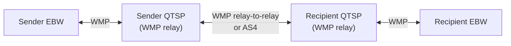
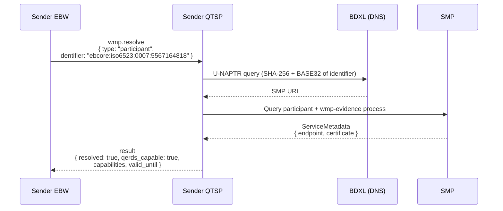
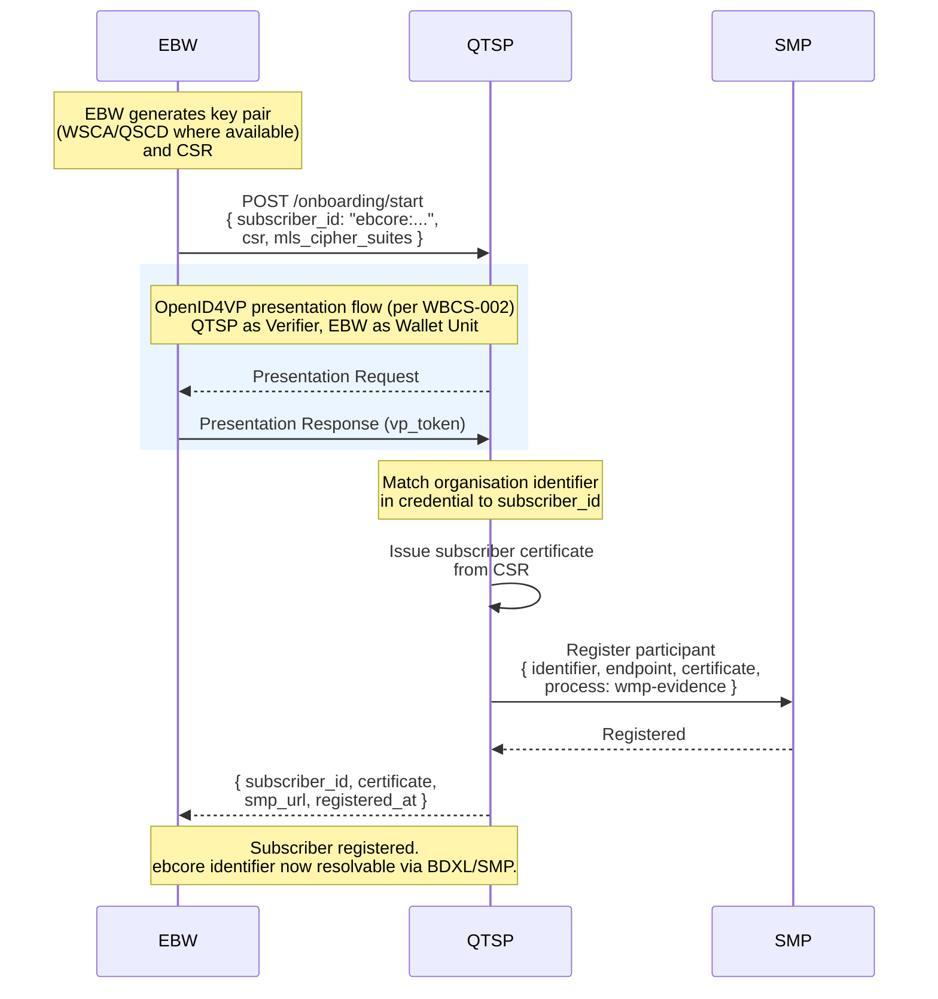
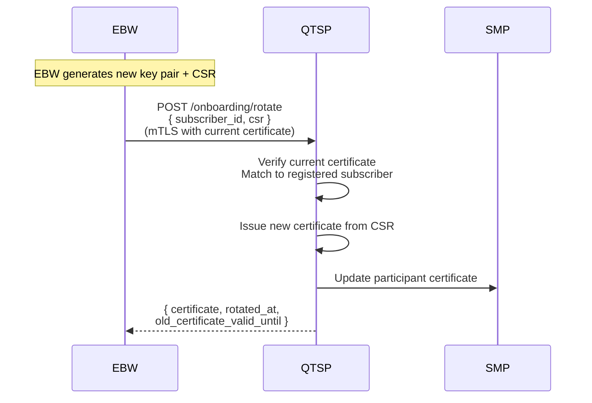
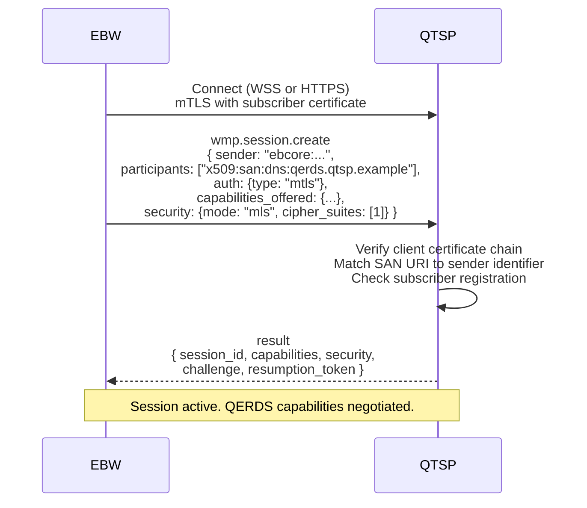
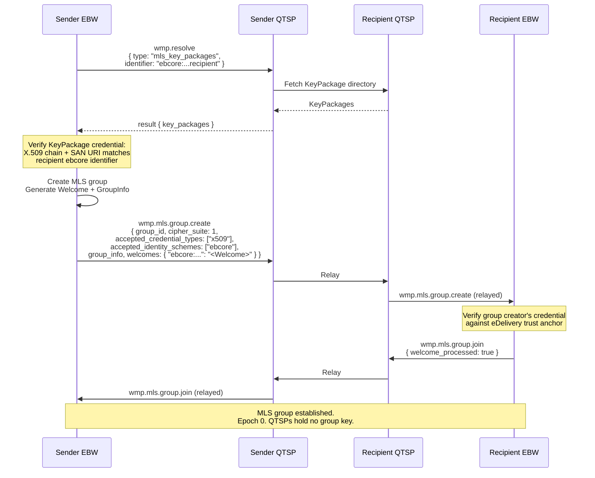
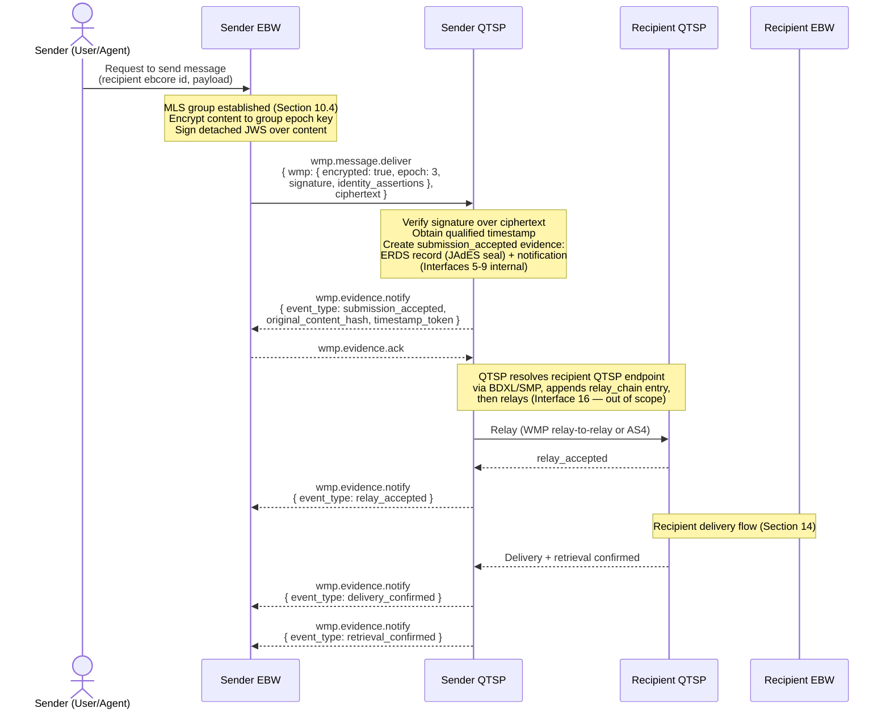
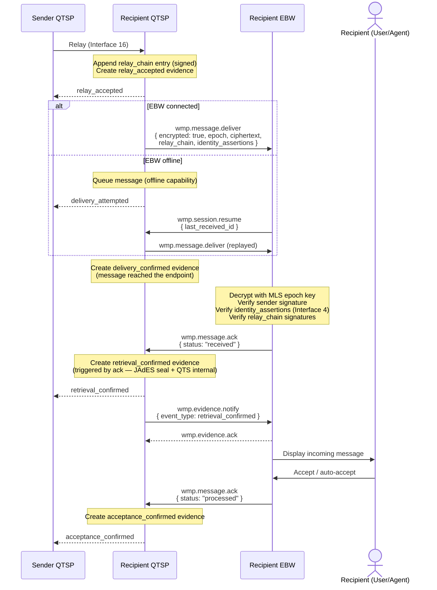

# WE BUILD - Conformance Specification: EBW–QTSP WMP Interface

Version 0.1 (Draft)

## Table of Contents

- [1. Introduction](#1-introduction)
- [2. Scope](#2-scope)
- [3. Normative Language](#3-normative-language)
- [4. Roles and Components](#4-roles-and-components)
- [5. Protocol Overview](#5-protocol-overview)
- [Part 1: WMP Profile for QERDS](#part-1-wmp-profile-for-qerds)
  - [6. Subscriber Identifiers](#6-subscriber-identifiers)
  - [7. Endpoint Discovery](#7-endpoint-discovery)
  - [8. Subscriber Onboarding and Registration](#8-subscriber-onboarding-and-registration)
  - [9. Session Establishment and Authentication](#9-session-establishment-and-authentication)
  - [10. MLS Encryption Layer](#10-mls-encryption-layer)
  - [11. Transport](#11-transport)
  - [12. Capability Negotiation](#12-capability-negotiation)
- [Part 2: QERDS Delivery](#part-2-qerds-delivery)
  - [13. Message Submission Flow](#13-message-submission-flow)
  - [14. Message Reception Flow](#14-message-reception-flow)
  - [15. Evidence](#15-evidence)
    - [15.1 Two Artefacts, One Event](#151-two-artefacts-one-event)
    - [15.2 Mapping to ETSI EN 319 522](#152-mapping-to-etsi-en-319-522)
      - [15.2.1 ETSI Events Not Generated on This Leg](#1521-etsi-events-not-generated-on-this-leg)
    - [15.3 Evidence Notification Format](#153-evidence-notification-format)
    - [15.4 ERDS Evidence Record](#154-erds-evidence-record)
    - [15.5 Qualified Signature and Timestamp](#155-qualified-signature-and-timestamp)
    - [15.6 Evidence Routing and Acknowledgement](#156-evidence-routing-and-acknowledgement)
    - [15.7 Evidence Chain](#157-evidence-chain)
    - [15.8 Retention](#158-retention)
  - [16. Method Reference](#16-method-reference)
  - [17. Normative Requirements](#17-normative-requirements)
- [Part 3: Extensions](#part-3-extensions)
  - [18. Credential Issuance and Presentation](#18-credential-issuance-and-presentation)
- [19. Interface Definitions](#19-interface-definitions)
- [20. Conformance](#20-conformance)
- [21. Security Considerations](#21-security-considerations)
- [References](#references)

---

# 1. Introduction

This document defines the **WE BUILD Conformance Specification for the European Business Wallet (EBW)–QTSP Interface** (WBCS-004).

It specifies how a European Business Wallet interacts with a Qualified Trust Service Provider (QTSP) offering a Qualified Electronic Registered Delivery Service (QERDS), using the **Wallet Messaging Protocol (WMP)** [WMP-CORE] as the wallet-facing communication protocol.

The specification covers the **optional API access protocol** mandated by the ADR as an abstraction layer between the EBW and the QERDS, and is one of the Conformance Specifications required by the ADR's consequences section.

This profile composes four WMP specifications. All four are **mandatory** for QERDS conformance:

| Specification | Role in this profile |
|---|---|
| [WMP-CORE] | Session lifecycle, authentication, message delivery, identity assertions, relay provenance |
| [WMP-MLS] | End-to-end encryption of message content between EBWs; the QTSP is the MLS Delivery Service |
| [WMP-EDELIVERY] | Subscriber identifiers (`ebcore`), BDXL/SMP endpoint discovery, legal entity binding, AS4 coexistence |
| [WMP-EVIDENCE] | Registered delivery evidence — the mechanism by which WMP satisfies eIDAS ERDS obligations |

This specification is based on the [WE BUILD ADR: Deliver business wallet data using QERDS](https://github.com/webuild-consortium/wp4-architecture/blob/main/adr/build-qerds.md), the [WE BUILD QERDS Architecture](https://github.com/webuild-consortium/wp4-qtsp-group/blob/main/docs/qerds/architecture.md), and the [WE BUILD QERDS Interoperability Framework](https://github.com/webuild-consortium/wp4-qtsp-group/blob/main/docs/qerds/interop-framework.md).

# 2. Scope

This specification covers:

- Identification of EBW Subscribers using the WMP `ebcore` identifier scheme
- Discovery of QTSP and Subscriber WMP endpoints via BDXL/SMP and well-known configuration
- Subscriber onboarding, identity proofing, and SMP registration
- Establishment, authentication, and resumption of a WMP session between the EBW and the QTSP
- Mandatory MLS end-to-end encryption of message content between EBWs
- Message submission by the EBW (Interface 14 — Data submission)
- Message notification and data delivery to the EBW (Interface 10 — Data transmission)
- QERDS evidence generation and delivery to the EBW (Interface 11 — Evidence transmission)
- Consignment identity verification at the recipient EBW (Interface 4 — Identity verification)
- Mapping of WMP evidence event types to ETSI EN 319 522-2 evidence semantics

This specification covers the **EBW–QTSP** leg of the four-corner QERDS model only.

**Out of scope:**
- Internal QTSP services (QESeal creation, QTS creation, Evidence creation — Interfaces 5–9)
- The inter-QTSP relay leg (Interface 16), whether carried over WMP relay-to-relay or AS4
- EU Digital Directory (EDD) and SMP operator requirements
- Credential issuance and presentation (see Section 18 — provided as a WMP extension, not profiled here)
- EUDIW-to-QERDS interface
- Gateway flows to legacy systems (Peppol, OOTS) beyond the AS4 coexistence model inherited from [WMP-EDELIVERY]

# 3. Normative Language

The keywords **MUST**, **MUST NOT**, **REQUIRED**, **SHALL**, **SHOULD**, **SHOULD NOT**, **RECOMMENDED**, **MAY**, and **OPTIONAL** are to be interpreted as described in [RFC 2119].

# 4. Roles and Components

| Role | Description |
|---|---|
| **European Business Wallet (EBW)** | Software acting on behalf of a business (the Subscriber), implementing both wallet and QERDS subscriber capabilities. Referred to as the EBW or wallet throughout this specification. A WMP participant. |
| **Subscriber** | The legal entity (business) that owns and controls the EBW. Identified by an ISO 6523 organisation identifier expressed as a WMP `ebcore` identifier. |
| **EBWOID** | European Business Wallet Organisation Identity Document — the credential attesting the Subscriber's legal identity, presented as a WMP identity assertion to bind messages to that identity (Sections 13, 14). |
| **QTSP** | A Qualified Trust Service Provider offering a QERDS to Subscribers. Operates a **WMP relay** and, in MLS terms, the **Delivery Service**. Acts as evidence generator. |
| **QERDS** | The Qualified Electronic Registered Delivery Service provided by the QTSP. |
| **Sender EBW** | The EBW initiating a QERDS message submission. |
| **Recipient EBW** | The EBW designated to receive a QERDS message. |
| **SMP** | Service Metadata Publisher — publishes the Subscriber's WMP endpoint and certificate. |
| **BDXL** | Business Document Exchange Location — the DNS layer resolving an identifier to its SMP. |
| **Registration Authority** | The authority (national eDelivery gateway, PEPPOL Authority, or the QTSP acting under delegated authority) that verifies the Subscriber controls its organisation identifier. |
| **TSA** | A qualified Time Stamping Authority under eIDAS, issuing RFC 3161 timestamp tokens for evidence. |

# 5. Protocol Overview

This specification defines the EBW–QTSP interface within the QERDS four-corner model:



The wallet never communicates with another wallet or another QTSP directly. All QERDS interactions are mediated by the Subscriber's own QTSP.

**WMP** [WMP-CORE] is used for the EBW–QTSP leg. WMP provides:
- A JSON-RPC 2.0 envelope with a stable metadata object (`wmp`) used for routing, signatures, timestamps, and provenance
- Session-scoped capability negotiation, so a QERDS session is explicitly distinguishable from a best-effort messaging session
- Application-layer end-to-end encryption via MLS, independent of the transport layer (TLS)
- Multi-transport support (WebSocket and HTTPS)
- A credible post-quantum migration path via MLS cipher suite negotiation, without protocol changes

**MLS** [WMP-MLS] provides end-to-end confidentiality of message content between the Sender EBW and the Recipient EBW. Both QTSPs act as the MLS Delivery Service: they route and queue ciphertext but never hold the plaintext. This is the property that lets a QTSP provide a qualified delivery service over content it cannot read.

**The WMP Evidence profile** [WMP-EVIDENCE] provides the registered-delivery evidence that makes the service an ERDS. Evidence records are signed with a qualified certificate, carry a qualified timestamp, and bind to the hash of the delivered content. Section 15 maps WMP evidence event types onto the ETSI EN 319 522-2 evidence set.

**The WMP eDelivery profile** [WMP-EDELIVERY] supplies the identifier scheme and discovery layer. Legal entity binding is inherited wholesale from the eDelivery registration authority that issued the identifier — WMP does not re-verify what the registration authority already verified.

**Three layers of protection** apply to every QERDS message, and they are deliberately independent:

| Layer | Protects | Visible to QTSP |
|---|---|---|
| TLS | The EBW–QTSP hop | n/a — terminated at the QTSP |
| MLS | Message content, end-to-end between EBWs | No |
| Detached JWS + RFC 3161 timestamp | Non-repudiation of the submitted content and of each evidence record | Yes — over the ciphertext and metadata |

---

# Part 1: WMP Profile for QERDS

## 6. Subscriber Identifiers

### 6.1 Identifier Scheme

EBW Subscribers **MUST** be identified using the WMP `ebcore` identifier scheme defined in [WMP-EDELIVERY] Section 2:

```
ebcore:<catalog>:<scheme>:<identifier>
```

The `catalog` **MUST** be `iso6523`. The `scheme` **MUST** be an ISO 6523 ICD code identifying the national register or identifier authority. The `identifier` **MUST** be the Subscriber's organisation identifier as registered with that authority.

**Examples:**

| Entity | WMP identifier |
|---|---|
| Swedish company (Organisationsnummer) | `ebcore:iso6523:0007:5567164818` |
| German company (Leitweg-ID) | `ebcore:iso6523:0204:DE123456789` |
| Italian company (Partita IVA) | `ebcore:iso6523:9906:IT12345678901` |
| Norwegian company (Organisasjonsnummer) | `ebcore:iso6523:0192:987654321` |

The identifier maps bidirectionally to the ebCore Party ID URN and to the PEPPOL participant identifier, per [WMP-EDELIVERY] Sections 2.2 and 2.3. This is what allows a QERDS Subscriber to be addressed from, and to address, the existing eDelivery network.

### 6.2 QTSP Identifiers

A QTSP **MUST** be identified by an `x509:san:dns:` identifier whose DNS SAN value is the QTSP's service domain, for example `x509:san:dns:qerds.qtsp.example`. The certificate carrying that SAN **MUST** be the QTSP's qualified certificate as listed on the EU Trusted List.

The QTSP identifier appears as the `wmp.sender` of every evidence notification the QTSP generates and as a `relay_chain` `relay_id` entry on every message it relays.

### 6.3 Identifier Consistency

Per [WMP-CORE] Section 7.3, a participant **MUST NOT** change identifier scheme mid-session. An EBW **MUST** use the same `ebcore` identifier for the lifetime of a session and **MUST NOT** present a `did:`, `opaque`, or `uri` identifier on a QERDS session.

---

## 7. Endpoint Discovery

### 7.1 Discovery Layers

Three discovery questions arise on the EBW–QTSP leg, and each resolves at a different layer:

| Question | Mechanism |
|---|---|
| Where is my own QTSP's WMP endpoint, and what does it support? | `/.well-known/wmp-configuration` on the QTSP's domain ([WMP-CORE] §7.5.1) |
| Where is the Recipient Subscriber, and is it QERDS-capable? | BDXL → SMP resolution of the recipient's `ebcore` identifier ([WMP-EDELIVERY] §3), performed **by the QTSP** on the EBW's behalf |
| What are the Recipient EBW's MLS KeyPackages? | `wmp.resolve` against the EBW's own QTSP (Section 7.4) |

### 7.2 QTSP Well-Known Configuration

The QTSP **MUST** serve a WMP configuration document at `/.well-known/wmp-configuration` over HTTPS, per [WMP-CORE] Section 7.5.1.

```json
{
  "supported_versions": ["0.1"],
  "participant_id": "x509:san:dns:qerds.qtsp.example",
  "endpoints": {
    "websocket": "wss://qerds.qtsp.example/wmp",
    "https": "https://qerds.qtsp.example/wmp"
  },
  "capabilities": {
    "messaging": {"max_size": 65536},
    "offline": {"max_queued": 1000, "ttl": 2592000, "status_notifications": true},
    "resolve": {"supported_types": ["mls_key_packages", "participant"]},
    "evidence": {
      "event_types": [
        "submission_accepted", "submission_rejected",
        "relay_accepted", "relay_rejected", "relay_forwarded",
        "delivery_attempted", "delivery_confirmed", "delivery_failed", "delivery_expired",
        "retrieval_confirmed", "retrieval_timeout",
        "acceptance_confirmed", "acceptance_rejected"
      ],
      "repository": "https://qerds.qtsp.example/evidence/api",
      "retention_period": "P10Y",
      "signing_algorithm": "ES256",
      "timestamp_authority": "https://tsa.qtsp.example/rfc3161"
    }
  },
  "accepted_schemes": ["ebcore"],
  "security_modes": ["mls"],
  "mls_key_packages": "https://qerds.qtsp.example/.well-known/mls-key-packages",
  "onboarding_endpoint": "https://qerds.qtsp.example/onboarding",
  "qtsp_id": "ebcore:iso6523:0204:DE123456789",
  "trusted_list_url": "https://eidas.ec.europa.eu/efda/tl/browser/"
}
```

| Field | Requirement | Notes |
|---|---|---|
| `supported_versions` | MUST | Per [WMP-CORE] §2.2 |
| `participant_id` | MUST | The QTSP's `x509:san:dns:` identifier (Section 6.2) |
| `endpoints` | MUST | **MUST** include both `websocket` and `https` (Section 11) |
| `capabilities.evidence` | MUST | **MUST** advertise all event types in Sections 3.1–3.5 of [WMP-EVIDENCE]; `retention_period` **MUST** be at least `P10Y` |
| `capabilities.offline` | MUST | Required for store-and-forward delivery to disconnected EBWs |
| `capabilities.resolve` | MUST | **MUST** include `mls_key_packages` |
| `accepted_schemes` | MUST | **MUST** include `ebcore` |
| `security_modes` | MUST | **MUST** be exactly `["mls"]` (Section 10.1) |
| `mls_key_packages` | MUST | KeyPackage directory the QTSP serves for its Subscribers (Section 10.3) |
| `onboarding_endpoint` | MUST | URI to initiate onboarding (Section 8) |
| `qtsp_id` | MUST | The QTSP's own `ebcore` identifier |
| `trusted_list_url` | SHOULD | The Trusted List under which the QTSP's qualified status is published |

The configuration document **MUST** be served either over TLS with a certificate chaining to the QTSP's qualified certificate, or as a signed JWT with `Content-Type: application/jwt` signed by a key from the QTSP's TSL entry. The EBW **MUST** verify the QTSP's qualified status against the EU Trusted List before onboarding, and **MUST NOT** onboard to a QTSP whose qualified status cannot be established. This requirement stands independently of `trusted_list_url`, which is a convenience hint only.

### 7.3 Recipient Discovery via BDXL/SMP

The EBW does **not** perform BDXL/SMP resolution. It addresses a recipient by `ebcore` identifier and the QTSP resolves it, per [WMP-EDELIVERY] Section 3.1:



The QTSP **MUST**:
1. Verify the SMP response signature before using any endpoint or certificate from it ([WMP-EDELIVERY] §8.1).
2. Use DNSSEC-validated resolvers for BDXL lookups where available ([WMP-EDELIVERY] §8.3).
3. Return `qerds_capable: true` only if the SMP entry advertises a `wmp-evidence` process identifier and a `bdxr-transport-wmp-ws-v0p1` or `bdxr-transport-wmp-https-v0p1` transport profile.
4. Return error `-31008` (Participant not found) if the identifier does not resolve.

The EBW **MUST NOT** treat a positive `wmp.resolve` result as a delivery guarantee. SMP data is a discovery hint; the authoritative outcome is the evidence chain (Section 15).

### 7.4 MLS KeyPackage Resolution

Before a Sender EBW can create an MLS group including a Recipient EBW, it needs the recipient's KeyPackage. It obtains one through its own QTSP using `wmp.resolve` with `type: "mls_key_packages"` (Section 16.1). The QTSP fetches the KeyPackage from the recipient QTSP's KeyPackage directory and returns it.

This indirection is deliberate. It preserves the [WMP-CORE] Section 7.5 privacy principle — endpoints and key material are associated with the **service provider**, not published per wallet unit — while keeping the EBW's discovery interface to a single method against a single party it already trusts.

---

## 8. Subscriber Onboarding and Registration

Onboarding is a one-time process establishing that the Subscriber controls its organisation identifier, and registering the Subscriber's WMP endpoint so that other participants can reach it.

### 8.1 Two Registration Models

| Model | Identifier binding source | When |
|---|---|---|
| **Inherited registration** | The Subscriber already holds an eDelivery-registered `ebcore` identifier and an SMP entry issued by a registration authority | The Subscriber is already on the eDelivery network |
| **QTSP-mediated registration** | The QTSP performs identity proofing and registers the Subscriber in the SMP on its behalf | The Subscriber is new to the eDelivery network |

A QTSP **MUST** support QTSP-mediated registration. A QTSP **SHOULD** support inherited registration.

### 8.2 Onboarding Flow



### 8.3 Identity Proofing

Identity proofing uses the OpenID4VP credential presentation flow specified in [WBCS-002]. The QTSP **MUST** act as Verifier and the EBW as Wallet Unit, and both **MUST** conform to [WBCS-002] for the presentation exchange. This specification adds no requirements to that flow.

Two requirements are specific to onboarding and are **not** covered by [WBCS-002]. The QTSP **MUST**:
- Verify that the organisation identifier in the presented credential corresponds to the `subscriber_id` in the onboarding request.
- Not register a Subscriber or issue a certificate without a successfully verified presentation.

The credential types accepted for identity proofing, and the assurance level required, are governed by the WP4 QTSP group specification [QTSP-SPEC] and by the QTSP's own qualified service policy.

### 8.4 Subscriber Certificate

On successful identity proofing, the QTSP **MUST** issue an X.509 certificate to the Subscriber from the submitted CSR. The certificate:

- **MUST** contain a SAN URI encoding the Subscriber's `ebcore` identifier, per [WMP-EDELIVERY] Section 4.3
- **MUST** chain to a CA accepted by the eDelivery network the Subscriber is registered in
- **MUST** be the certificate registered in the Subscriber's SMP entry
- **SHOULD** have a validity period no longer than 12 months

The Subscriber's private key **MUST** be generated inside a hardware-backed secure element or WSCA/QSCD where available, and **MUST NOT** leave it.

This certificate is what the EBW authenticates with on every subsequent session (Section 9). There is no bearer access token in this profile: the certificate is long-lived, the identity proofing is not repeated per session, and session authentication is a signature the EBW can always produce. This removes the token renewal cycle that a short-lived bearer token would otherwise force on every EBW.

### 8.5 SMP Registration

The QTSP **MUST** register, or cause to be registered, an SMP entry for the Subscriber containing:

- The Subscriber's participant identifier in `iso6523-actorid-upis` form
- A `wmp-evidence` Process entry (per [WMP-EDELIVERY] §3.4), pointing at the QTSP's WMP endpoint
- Both `bdxr-transport-wmp-ws-v0p1` and `bdxr-transport-wmp-https-v0p1` transport profile endpoints
- The Subscriber's certificate

The endpoint registered in SMP is the **QTSP's** endpoint, not the EBW's. The QTSP relays inbound messages to the correct wallet unit internally. This follows the [WMP-CORE] Section 7.5 privacy principle and means the EBW needs no publicly reachable network position.

```xml
<ServiceMetadata xmlns="http://docs.oasis-open.org/bdxr/ns/SMP/2016/05">
  <ServiceInformation>
    <ParticipantIdentifier scheme="iso6523-actorid-upis">
      0007:5567164818
    </ParticipantIdentifier>
    <DocumentIdentifier scheme="busdox-docid-qns">
      urn:wmp:session:v0.1
    </DocumentIdentifier>
    <ProcessList>
      <Process>
        <ProcessIdentifier scheme="wmp-process">wmp-evidence</ProcessIdentifier>
        <ServiceEndpointList>
          <Endpoint transportProfile="bdxr-transport-wmp-ws-v0p1">
            <EndpointURI>wss://qerds.qtsp.example/wmp</EndpointURI>
            <Certificate>MIICxz...</Certificate>
            <ServiceDescription>QERDS WMP WebSocket endpoint</ServiceDescription>
          </Endpoint>
          <Endpoint transportProfile="bdxr-transport-wmp-https-v0p1">
            <EndpointURI>https://qerds.qtsp.example/wmp</EndpointURI>
            <Certificate>MIICxz...</Certificate>
            <ServiceDescription>QERDS WMP HTTPS endpoint</ServiceDescription>
          </Endpoint>
        </ServiceEndpointList>
      </Process>
    </ProcessList>
  </ServiceInformation>
</ServiceMetadata>
```

The QTSP **MUST** update the SMP entry within 24 hours of any certificate rotation or endpoint change.

### 8.6 Key Rotation

A Subscriber **MAY** rotate its key at any time. Rotation reissues the Subscriber certificate and updates the SMP entry. It does not repeat identity proofing if the existing certificate is still valid and is used to authenticate the rotation request.



The QTSP **MUST**:
- Authenticate the rotation request with the Subscriber's current valid certificate, or require full re-proofing (Section 8.3) if the current certificate has expired or been revoked.
- Update the SMP entry within 24 hours.
- Honour the previous certificate for a grace period of no more than 24 hours after rotation, and state the grace period end in `old_certificate_valid_until`.

The EBW **MUST** publish fresh MLS KeyPackages bound to the new certificate before the grace period ends (Section 10.3).

> **Note on in-flight messages:** MLS key material is separate from the Subscriber certificate. Rotating the certificate does not invalidate existing MLS groups — the group's epoch keys are unaffected. An EBW **SHOULD** perform an MLS key update (Section 10.4) after certificate rotation, but in-flight messages encrypted under the current epoch remain decryptable throughout.

---

## 9. Session Establishment and Authentication

### 9.1 Session Creation

The EBW creates a WMP session with its QTSP per [WMP-CORE] Section 4.1. The session is the container for all subsequent QERDS interactions.



**`wmp.session.create` params:**

```json
{
  "wmp": {
    "version": "0.1",
    "sender": "ebcore:iso6523:0007:5567164818",
    "timestamp": "2026-07-16T10:15:30Z"
  },
  "participants": ["x509:san:dns:qerds.qtsp.example"],
  "auth": {"type": "mtls"},
  "capabilities_offered": {
    "messaging": {"max_size": 65536},
    "offline": {"max_queued": 1000, "ttl": 2592000, "status_notifications": true},
    "resolve": {"supported_types": ["mls_key_packages", "participant"]},
    "evidence": {
      "event_types": [
        "submission_accepted", "relay_accepted", "relay_forwarded",
        "delivery_attempted", "delivery_confirmed", "delivery_failed",
        "retrieval_confirmed", "acceptance_confirmed"
      ]
    }
  },
  "security": {"mode": "mls", "cipher_suites": [1]},
  "ttl": 3600
}
```

### 9.2 Authentication

Per [WMP-CORE] Section 4.4.6, the `ebcore` scheme authenticates with `mtls` or `bearer`. This profile constrains that choice:

- The EBW **MUST** authenticate using `auth.type` of `mtls`, presenting its Subscriber certificate (Section 8.4) as the TLS client certificate.
- The EBW **MAY** additionally use `x5c` challenge-response authentication where the deployment terminates TLS at a component that cannot forward the client certificate. In that case the EBW **MUST** complete `wmp.session.authenticate` with a `signed_challenge` over the challenge issued in the session create result, per [WMP-CORE] Section 4.4.3.
- The QTSP **MUST NOT** accept `auth.type` of `bearer` or `opaque` on a QERDS session.

The QTSP **MUST**:
1. Verify the client certificate chain against the trust anchor for the Subscriber's eDelivery network.
2. Verify that the certificate's SAN URI encodes exactly the `ebcore` identifier presented in `wmp.sender`. A mismatch **MUST** be rejected with error `-31002`.
3. Verify that the certificate has not been revoked.
4. Verify that the Subscriber is registered (Section 8) and not suspended.
5. Reject with `-31002` (Not authorized) on any failure.

The QTSP **MUST** authenticate itself to the EBW. It does so implicitly via its TLS server certificate, and **MUST** additionally return an `auth` object of type `x5c` in the session create result ([WMP-CORE] §4.4.5) carrying its qualified certificate chain. The EBW **MUST** verify that chain against the EU Trusted List and **MUST NOT** proceed on a session with a QTSP whose qualified status it cannot establish.

### 9.3 Session Resumption

The QTSP **MUST** issue a `resumption_token` in the session create result and **MUST** support `wmp.session.resume` ([WMP-CORE] §4.5).

On resumption, the MLS epoch is preserved and the QTSP replays messages queued since `last_received_id`. Resumption is what makes an intermittently-connected EBW — a mobile wallet, a backgrounded app — workable without repeating capability negotiation or MLS group setup on every reconnect.

The QTSP **MUST** rotate the resumption token on each successful resume and **MUST** bind it to the authenticated Subscriber identity. A resumed session **MUST** re-verify the client certificate: resumption restores session state, not authentication.

### 9.4 Session Termination

Either party **MAY** close the session with `wmp.session.close`. Closing a session **MUST NOT** discard undelivered queued messages or pending evidence. The QTSP **MUST** deliver outstanding evidence in a new session created for that purpose, per [WMP-EVIDENCE] Section 5.3.

---

## 10. MLS Encryption Layer

### 10.1 MLS Is Mandatory

MLS is OPTIONAL in [WMP-MLS] Section 1. **In this profile it is mandatory.**

- The QTSP **MUST** advertise `security_modes: ["mls"]` and **MUST NOT** accept a QERDS session with `security.mode` of `tls` or `mls-optional`.
- The EBW **MUST** request `security.mode: "mls"` on session creation.
- Every message carrying Subscriber content **MUST** be MLS-encrypted. The QTSP **MUST** reject an unencrypted content message with error `-31003` (Encryption required).

End-to-end encryption of Subscriber content is a requirement of the QERDS: the QTSP attests to delivery events, and has no need of the content itself.

### 10.2 Cipher Suites

The EBW and QTSP **MUST** support:

- `MLS_128_DHKEMX25519_AES128GCM_SHA256_Ed25519` (0x0001)

The EBW and QTSP **SHOULD** support:

- `MLS_128_DHKEMP256_AES128GCM_SHA256_P256` (0x0002)

### 10.3 Credential Type and KeyPackages

Per [WMP-MLS] Section 2.2, the `ebcore` identifier scheme maps to the **`x509`** MLS credential type. Each EBW's MLS leaf node **MUST** carry its Subscriber certificate (Section 8.4) as the MLS credential. Validation follows the eDelivery network's trust anchor rules.

This binds the MLS group membership to the same certificate that authenticates the session and appears in the SMP entry. A participant in an MLS group is therefore provably the registered legal entity, not merely a party holding a group key.

Each EBW **MUST** publish MLS KeyPackages to its QTSP's KeyPackage directory. The QTSP **MUST** serve them at the `mls_key_packages` URL advertised in its well-known configuration:

```
GET /.well-known/mls-key-packages?participant=ebcore%3Aiso6523%3A0007%3A5567164818
```

```json
{
  "participant": "ebcore:iso6523:0007:5567164818",
  "key_packages": [
    {
      "id": "kp-001",
      "cipher_suite": 1,
      "key_package": "<base64url-encoded MLS KeyPackage>",
      "expires": "2026-08-15T00:00:00Z"
    }
  ]
}
```

The EBW **MUST** publish fresh KeyPackages before the previous set expires. The RECOMMENDED validity period is 30 days ([WMP-MLS] §7.2). The QTSP **MUST NOT** serve an expired KeyPackage and **MUST** return an empty `key_packages` array if none are valid — a Sender EBW that receives an empty array **MUST NOT** submit to that recipient and **SHOULD** surface the condition rather than fall back to an unencrypted send.

### 10.4 Group Lifecycle

An MLS group is created per QERDS correspondence, spanning the Sender EBW and the Recipient EBW. Both QTSPs are Delivery Service only — they are **not** MLS group members and **MUST NOT** be added to the group.



The Sender EBW **MUST** verify the recipient's KeyPackage credential before adding it to the group: the X.509 chain **MUST** validate to the eDelivery trust anchor and the SAN URI **MUST** encode exactly the `ebcore` identifier the sender intends to address. Skipping this check would let a compromised KeyPackage directory silently substitute a recipient — the evidence chain would then attest to correct delivery of content encrypted to the wrong party.

An EBW **MUST** perform an MLS key update ([WMP-MLS] §3.5) after every 100 messages or every hour, whichever comes first ([WMP-MLS] §7.3).

### 10.5 Encryption Scope

Per [WMP-MLS] Section 4.3, the split between ciphertext and plaintext framing is fixed:

| Encrypted (inside the MLS ciphertext) | Plaintext (outer JSON-RPC envelope) |
|---|---|
| `to`, `content_type`, `body` | `jsonrpc`, `method`, `id` |
| All other content fields in `params` | `wmp.version`, `wmp.session_id`, `wmp.sender` |
| `result` / `error` on responses | `wmp.encrypted`, `wmp.epoch`, `wmp.timestamp` |
| | `wmp.signature`, `wmp.timestamp_token`, `wmp.relay_chain` |

The QTSP routes on the plaintext `wmp` metadata alone. It **MUST NOT** attempt to decrypt, log, or inspect the ciphertext.

> **Metadata is not confidential.** The QTSP necessarily sees who is corresponding with whom, when, and how much — that is inherent to operating a delivery service, and it is what the evidence attests to. MLS protects content, not the fact of correspondence. Section 21 addresses the consequences.

---

## 11. Transport

### 11.1 Transport Bindings

| Transport | QTSP | EBW | Notes |
|---|---|---|---|
| **WebSocket** (`wmp.v1` subprotocol) | MUST | SHOULD | Push delivery; required for real-time automated flows |
| **HTTPS** (POST + SSE) | MUST | MUST | Baseline; works for any EBW deployment model |

A conforming QTSP **MUST** support both so that any EBW can connect regardless of deployment model. A conforming EBW **MUST** support HTTPS and **SHOULD** support WebSocket where it is a server-side or always-on deployment.

Transport details follow [WMP-TRANSPORT]. TLS 1.3 is REQUIRED on both bindings. The default message size limit is 64 KiB; a QTSP **MAY** negotiate a larger `messaging.max_size` and **SHOULD** do so where its service supports large consignments.

### 11.2 Offline Delivery

The `offline` capability ([WMP-CORE] §5.3.1) **MUST** be negotiated on every QERDS session. It is what allows an EBW to be disconnected without the delivery failing — the QTSP queues, and the evidence chain records the queuing rather than a false non-delivery.

The QTSP **MUST**:
- Queue messages for disconnected EBWs for at least 30 days.
- Set `status_notifications: true` so senders receive `wmp.message.status` notifications.
- Send exactly one terminal status per message: `delivered`, `expired`, or `dropped`.
- Generate `delivery_expired` evidence when a queued message expires, and `retrieval_timeout` evidence when the recipient does not retrieve within the retention period.

An EBW **MUST NOT** set `expires_at` shorter than the QERDS service's minimum retention without understanding that doing so converts a slow delivery into a non-delivery, with corresponding evidence.

---

## 12. Capability Negotiation

### 12.1 Required Capabilities

A QERDS session **MUST** negotiate all of:

| Capability | Purpose | Notes |
|---|---|---|
| `messaging` | Content delivery | `max_size` at least 65536 |
| `evidence` | Registered delivery evidence | Section 15; this is what makes the session a QERDS session |
| `offline` | Store-and-forward for disconnected EBWs | Section 11.2 |
| `resolve` | Participant and KeyPackage resolution | Section 7 |

If the QTSP's session create result omits `evidence`, the session is **not** a QERDS session. The EBW **MUST** close it and **MUST NOT** submit content expecting registered delivery.

### 12.2 Evidence Capability Parameters

The QTSP's negotiated `evidence` capability **MUST** specify:

| Parameter | Requirement | Value |
|---|---|---|
| `event_types` | MUST | All event types in Sections 3.1–3.5 of [WMP-EVIDENCE] |
| `repository` | MUST | URL of the evidence repository API (Section 19.4) |
| `retention_period` | MUST | At least `P10Y` |
| `signing_algorithm` | MUST | An algorithm permitted for qualified seals under eIDAS |
| `timestamp_authority` | MUST | RFC 3161 endpoint of a qualified TSA |

Per [WMP-EVIDENCE] Section 9.2, all five are conditions of ERDS conformance. A QTSP that narrows `event_types` or shortens `retention_period` below `P10Y` in the negotiated result is not offering a qualified service on that session, and the EBW **MUST** treat the session as non-qualified.

---

# Part 2: QERDS Delivery

## 13. Message Submission Flow

This flow covers the Sender EBW submitting a message to the QERDS (Interfaces 14 and 11).

The Sender EBW's identity is established by the mutually-authenticated Subscriber certificate on the session (Section 9.2). No additional identity check is required at submission.



**Key ordering rule (submission):** The QTSP **MUST** generate and deliver `submission_accepted` evidence to the Sender EBW **before** relaying the message to the Recipient QTSP. The evidence timestamp records the moment of submission acceptance. Relaying first would leave a window in which the message is in transit with no evidence that it was ever accepted.

The Sender EBW **MUST**:
- MLS-encrypt the content (Section 10.1).
- Include a detached JWS `signature` over the content object ([WMP-CORE] §5.4), signed with the key bound to its Subscriber certificate. This is the sender's non-repudiable attestation of what it submitted; the QTSP's evidence attests only that it received it.
- Include `identity_assertions` ([WMP-CORE] §5.6) on the first message of a correspondence, and on every subsequent message where per-message legal identity binding is required. The assertion **MUST** be of type `verifiable_presentation` and **MUST** present the Subscriber's **EBWOID** (European Business Wallet Organisation Identity Document), disclosing at least the organisation identifier corresponding to the sender's `ebcore` identifier. Per [WMP-CORE] §5.6 the presentation binds to the session via `audience` and to the session challenge via `nonce`, and **SHOULD** carry an `eidas_lote` trust hint. An assertion sent once is valid for the session lifetime.

The QTSP **MUST**:
- Verify the sender's signature before accepting. Reject with `-31010` (Signature invalid) on failure.
- Verify `wmp.timestamp` is within its clock skew tolerance. Reject with `-31011` on failure.
- Compute `original_content_hash` over the JCS-canonicalized content object exactly as the signature payload is constructed ([WMP-EVIDENCE] §4.3), so that the evidence and the sender's signature cover the same bytes.
- Generate `submission_rejected` evidence — not a bare JSON-RPC error — where it rejects a well-formed submission on policy, quota, or format grounds. A rejection that produces no evidence is indistinguishable to the Subscriber from a service failure.

## 14. Message Reception Flow

This flow covers the Recipient EBW receiving a message from the QERDS (Interfaces 10, 11, and 4).



**Key ordering rule (reception):** The QTSP **MUST NOT** generate `retrieval_confirmed` evidence before receiving `wmp.message.ack` from the Recipient EBW. `delivery_confirmed` records that the QTSP delivered to the endpoint; `retrieval_confirmed` records that the EBW acknowledged it. These are different facts with different legal weight, and conflating them would let the QTSP attest to receipt it did not observe.

**Consignment identity verification (Interface 4):** The Recipient EBW **MUST** verify the Sender's `identity_assertions` per [WMP-CORE] §5.6 before presenting the message content to a user or downstream system, and **MUST** additionally verify that the organisation identifier disclosed in the sender's EBWOID corresponds to the `wmp.sender` identifier. It **MUST** reject the assertion with error `-31012` ([WMP-CORE] §5.6.2) where verification fails.

The EBW **MUST NOT** present content as originating from a named legal entity on the strength of the `wmp.sender` field alone — that field is routing metadata, and its binding to a legal identity is exactly what the EBWOID assertion establishes.

The Recipient EBW **MUST**:
- Verify the sender's detached JWS signature over the content, and reject the message if it does not verify.
- Verify each `relay_chain` entry's signature ([WMP-CORE] §5.7), and surface any relay in the chain it does not recognise rather than silently accepting the route.
- Send `wmp.message.ack` with status `received` on successful decryption and verification.
- Send `wmp.message.ack` with status `processed` on explicit user or system acceptance, where the use case requires an acceptance record.
- Send `wmp.message.ack` with status `failed` where decryption or verification fails, so that the QTSP generates `delivery_failed` evidence rather than leaving the correspondence unresolved.

## 15. Evidence

Evidence is the mechanism by which WMP satisfies eIDAS ERDS obligations. Everything else in this profile is transport; this section is the part that makes it a QERDS.

### 15.1 Two Artefacts, One Event

Every QERDS delivery event produces two things, and keeping them distinct is what allows this profile to satisfy both WMP and eIDAS without either specification bending:

| Artefact | Defined by | Role |
|---|---|---|
| **WMP evidence notification** — `wmp.evidence.notify` | [WMP-EVIDENCE] §4 | Tells the EBW an event occurred, when, and over what content. Signed and timestamped. This is the real-time signal. |
| **ERDS evidence record** — JSON conforming to [ERDS-EVIDENCE-SCHEMA] | ETSI EN 319 522-3, as JSON | The legally-binding artefact. JAdES-signed, self-contained, verifiable by a third party with no knowledge of WMP. Retrieved from the evidence repository. |

The notification is **not** a second evidence format and the ERDS record is **not** a WMP extension. They are the notification and the artefact, and WMP already anticipates exactly this split: [WMP-EVIDENCE] Section 6.2 types the repository's `signed_evidence` field as a JWS compact serialization — which is precisely what a detached compact JAdES signature over the ERDS evidence JSON is.

This profile therefore adds **no field to any WMP message**. The `wmp.evidence.notify` message is byte-for-byte as [WMP-EVIDENCE] Section 4 specifies it, and the ERDS record travels through the repository field WMP already defines for it.

### 15.2 Mapping to ETSI EN 319 522

A QTSP **MUST** generate one ERDS evidence record for each WMP evidence event, with `ERDSEventId` set per the following mapping.

`ERDSEventId` values are URIs of the form `http://uri.etsi.org/19522/Event/<event>`, per Table 2 of [EN-319-522-3]. The table below gives `<event>`; a QTSP **MUST** set `ERDSEventId` to the full URI.

| WMP event type | `ERDSEventId` event | Generated by | Trigger |
|---|---|---|---|
| `submission_accepted` | `SubmissionAcceptance` | Sender QTSP | Submission accepted, before relay |
| `submission_rejected` | `SubmissionRejection` | Sender QTSP | Submission rejected on policy/quota/format |
| `relay_accepted` | `RelayAcceptance` | Recipient QTSP | Message accepted from previous hop |
| `relay_rejected` | `RelayRejection` | Recipient QTSP | Message rejected from previous hop |
| `relay_forwarded` | `ContentConsignment` | Sender QTSP | Message forwarded to next hop |
| `delivery_attempted` | `ConsignmentNotification` | Recipient QTSP | Recipient offline; message queued and notification raised |
| `delivery_confirmed` | `ContentHandover` | Recipient QTSP | Content handed over to the EBW endpoint |
| `delivery_failed` | `ContentHandoverFailure` | Recipient QTSP | Handover permanently failed |
| `delivery_expired` | `ContentHandoverFailure` | Sender QTSP | Queued message expired before handover |
| `retrieval_confirmed` | `ContentAccessTracking` | Recipient QTSP | `wmp.message.ack` status `received` |
| `retrieval_timeout` | `ContentHandoverFailure` | Recipient QTSP | No ack within the retention period |
| `acceptance_confirmed` | `ConsignmentAcceptance` | Recipient QTSP | `wmp.message.ack` status `processed` |
| `acceptance_rejected` | `ConsignmentRejection` | Recipient QTSP | Recipient explicitly rejected the content |

Three WMP events map to `ContentHandoverFailure`, because ETSI models them as a single event — handover did not occur — distinguished by cause rather than by identifier. `EventReasons`, which Section 15.4 requires on every negative record, is what keeps a permanent failure, an expiry in the sender's queue, and a recipient that never retrieved distinguishable. The generating party disambiguates them further: `delivery_expired` originates at the Sender QTSP, the other two at the Recipient QTSP.

`ConsignmentAcceptance` and `ConsignmentRejection` arise only where the consignment mode requires the recipient to accept or reject the content — `http://uri.etsi.org/19522/v1#/consignment/consent` in [ERDS-EVIDENCE-SCHEMA]. Under `http://uri.etsi.org/19522/v1#/consignment/basic` a QERDS exchange completes at `ContentAccessTracking`, and no acceptance record arises.

A QTSP **MUST** support all thirteen event types. [WMP-EVIDENCE] Section 9.2 requires support for all event types in its Sections 3.1–3.5 for ERDS conformance; this table is the QERDS-specific reading of that requirement.

The non-ERDS events of [WMP-EVIDENCE] Section 3.6 (`read_confirmed`, `processed_confirmed`, `flow_completed`, `session_evidence`) are **OPTIONAL** in this profile, produce no ERDS evidence record, and carry no qualified status.

### 15.2.1 ETSI Events Not Generated on This Leg

Table 2 of [EN-319-522-3] defines events beyond those mapped above. They are unmapped for reasons of scope rather than oversight:

| ETSI event | Why not generated on the EBW–QTSP leg |
|---|---|
| `RelayFailure`, `ContentConsignmentFailure` | Inter-QTSP relay conditions (Interface 16) — out of scope (Section 2). A QTSP generates these on the relay leg where its topology requires them. |
| `NotificationForAcceptance`, `NotificationForAcceptanceFailure`, `AcceptanceRejectionExpiry` | Belong to consignment modes that solicit recipient consent before handover. WMP's event model has no equivalent; a deployment using `.../consignment/consent` with an out-of-band acceptance step **MAY** generate them. |
| `NotificationDelivered`, `NotificationAccessTracking`, `ConsignmentNotificationFailure` | Presuppose a notification channel separate from the content channel. In this profile the WMP session carries both, so `ConsignmentNotification`, `ContentAccessTracking`, and `ContentHandoverFailure` already record these facts. |
| `RelayToNonERDS`, `RelayToNonERDSFailure`, `ReceivedFromNonERDS` | Gateway flows to non-ERDS systems — out of scope (Section 2). |

A QTSP **MAY** generate any of these where its deployment warrants it. Doing so **MUST NOT** displace the records mandated in Section 15.2.

### 15.3 Evidence Notification Format

Evidence is notified with `wmp.evidence.notify` per [WMP-EVIDENCE] Section 4.1, using that section's fields and no others.

```json
{
  "jsonrpc": "2.0",
  "method": "wmp.evidence.notify",
  "params": {
    "wmp": {
      "version": "0.1",
      "session_id": "ses-a1b2c3d4",
      "sender": "x509:san:dns:qerds.qtsp.example",
      "timestamp": "2026-07-16T10:15:31Z",
      "timestamp_token": "<base64url-encoded RFC 3161 TimeStampToken from qualified TSA>",
      "signature": {
        "alg": "ES256",
        "kid": "x509:san:dns:qerds.qtsp.example#evidence-key-1",
        "value": "<base64url-encoded detached signature>",
        "x5c": ["<base64-encoded DER qualified certificate>", "<intermediate>", "<root>"]
      }
    },
    "evidence": {
      "evidence_id": "evi-7f8e9d0c-b1a2-43e5-8f6d-7e8a9b0c1d2e",
      "event_type": "submission_accepted",
      "original_message_id": "msg-550e8400-e29b-41d4-a716-446655440000",
      "original_sender": "ebcore:iso6523:0007:5567164818",
      "original_recipient": "ebcore:iso6523:0204:DE123456789",
      "original_content_hash": {
        "algorithm": "sha-256",
        "value": "<base64url-encoded hash of JCS-canonicalized content object>"
      },
      "event_time": "2026-07-16T10:15:31Z",
      "previous_evidence_id": null,
      "details": {
        "service_class": "registered",
        "submission_endpoint": "wss://qerds.qtsp.example/wmp"
      }
    }
  }
}
```

Every field above is defined in [WMP-EVIDENCE] Section 4.2. The `details` object carries event-type-specific information only, per that section. A QTSP **MUST NOT** place an ERDS evidence record, or any other evidence format, in `details` — the ERDS record is retrieved from the repository (Section 15.4), and duplicating it inline would create two artefacts that can disagree.

The `evidence_id` in the notification **MUST** equal the `EvidenceIdentifier` of the corresponding ERDS evidence record, so the EBW can retrieve the record without an intermediate lookup.

### 15.4 ERDS Evidence Record

The QTSP **MUST** generate, for every evidence event, an ERDS evidence record that is a JSON document conforming to [ERDS-EVIDENCE-SCHEMA] — the JSON representation of the ETSI EN 319 522-3 V1.2.1 `EvidenceType`, structurally equivalent to the XML schema in that standard.

The record **MUST** populate at least the schema's required properties:

| Property | Requirement | Value in this profile |
|---|---|---|
| `version` | REQUIRED | Schema version per [ERDS-EVIDENCE-SCHEMA] |
| `EvidenceIdentifier` | REQUIRED | **MUST** equal the `evidence_id` of the corresponding `wmp.evidence.notify` |
| `ERDSEventId` | REQUIRED | The Table 2 URI for the mapped event (Section 15.2) |
| `EventTime` | REQUIRED | **MUST** equal the `event_time` of the corresponding notification |
| `EvidenceIssuerDetails` | REQUIRED | The generating QTSP, with its qualified certificate in `CertificateDetails` |
| `SenderDetails` | REQUIRED | The Sender EBW's `ebcore` identifier and certificate details |
| `RecipientDetails` | REQUIRED | The Recipient EBW's `ebcore` identifier and certificate details |

The QTSP **MUST** additionally:

- Set `MessageIdentifier` to the `original_message_id` of the corresponding notification, binding the record to the WMP message it attests to.
- Set `SubmissionTime` on records generated after submission acceptance.
- Populate `EventReasons` on every rejection, failure, non-delivery, and non-retrieval record. A negative evidence record that does not say *why* is of little use to the party it is issued against.
- Sign the record with `jadesSignature`, per Section 15.5.

Identifiers carried in `SenderDetails` and `RecipientDetails` **MUST** be the parties' `ebcore` identifiers (Section 6.1), consistent with `original_sender` and `original_recipient` in the notification. The ERDS record and the WMP notification describe one event, and an EBW **MUST** be able to correlate them on `EvidenceIdentifier` / `evidence_id` alone.

> **`UserContentInfo` and confidentiality.** The schema's `UserContentInfo` describes the delivered content. Because content is MLS-encrypted end-to-end (Section 10), a QTSP **cannot** populate `ComposingParts` or `PartsInfo` with anything derived from plaintext, and **MUST NOT** attempt to. It populates only what it legitimately observes: the content hash and, where applicable, `AppLayerIdentifier`. This is not a limitation to work around — an ERDS attests that content was delivered, not what the content was.

> **Interoperability with non-WMP ERDS:** EN 319 522-3 XML formats and the EN 319 522-4-1 bindings remain relevant where a QERDS exchanges evidence with an ERDS that does not speak WMP. Because [ERDS-EVIDENCE-SCHEMA] is structurally equivalent to the EN 319 522-3 XML schema, that translation is mechanical. It belongs to the inter-QTSP leg (Interface 16) and to internal QTSP evidence creation (Interfaces 5–9), both out of scope here (Section 2). On the EBW–QTSP leg, an EBW consumes JSON and is never required to parse XML.

### 15.5 Qualified Signature and Timestamp

Per [WMP-EVIDENCE] Section 9.2, ERDS conformance requires qualified signatures and qualified timestamps. Both artefacts are signed, with different mechanisms, because they answer to different specifications.

**The notification.** The QTSP **MUST**:
1. Sign every `wmp.evidence.notify` with a key bound to its **qualified certificate**, included in the `x5c` chain, using the detached JWS of [WMP-CORE] Section 5.4.
2. Include a `timestamp_token` from a **qualified TSA** on every evidence notification.
3. Sign every `relay_chain` entry it appends ([WMP-CORE] §5.7; [WMP-EVIDENCE] §4.4).

**The ERDS record.** The QTSP **MUST**:
1. Sign every ERDS evidence record with `jadesSignature`, using the `compactDetached` form of [ERDS-EVIDENCE-SCHEMA] — a detached compact JAdES signature. This is the form [WMP-EVIDENCE] Section 6.2 expects in `signed_evidence`, which it types as a JWS compact serialization.
2. Produce that signature as a **qualified electronic seal** under [EIDAS], with the QTSP's qualified certificate resolvable from the JAdES header.
3. Include the qualified TSA's RFC 3161 token, reaching **JAdES-B-T** per [EN-319-182-1].

The `flattenedJson` and `generalJson` forms permitted by [ERDS-EVIDENCE-SCHEMA] **MUST NOT** be used on the EBW–QTSP leg. `signed_evidence` is a compact serialization field; the other two forms would not survive it.

The two signatures are not redundant. The notification's JWS authenticates a WMP message in a WMP session and is verified by a WMP implementation. The record's JAdES seal is what an auditor or a court verifies years later, with no WMP session, no relay, and possibly no WMP implementation in existence. Only the latter needs to be a qualified seal in the eIDAS sense; only the former needs to be intelligible to a relay.

**Verification.** The EBW **MUST** verify all three of the following before accepting an evidence notification, per [WMP-EVIDENCE] Section 8.1:
1. The detached JWS signature, with the `x5c` chain validated to the EU Trusted List and the QTSP's qualified status confirmed.
2. The RFC 3161 timestamp token, with the TSA's qualified status confirmed.
3. The `original_content_hash`, recomputed against the content the EBW actually submitted or received.

Verifying the signature but not the content hash would accept a validly-signed record attesting to a different message. Verifying the hash but not the timestamp would accept a record whose time — the entire point of registered delivery — is unattested.

On retrieving an ERDS evidence record, the EBW **MUST** verify the `jadesSignature` and the qualified status of the certificate that produced it, and **MUST** confirm that `EvidenceIdentifier`, `EventTime`, and `MessageIdentifier` agree with the notification it already holds. Where the two disagree, the **ERDS evidence record is authoritative** — it is the signed legal artefact; the notification is a message about it.

### 15.6 Evidence Routing and Acknowledgement

Evidence routing follows [WMP-EVIDENCE] Section 5.1:

| Event category | Delivered to |
|---|---|
| Submission events | Sender EBW |
| Relay events | Sender EBW + previous relay |
| Consignment/delivery events | Sender EBW |
| Retrieval events | Sender EBW |
| Acceptance events | Sender EBW |

In addition, and specific to this profile, the Recipient QTSP **MUST** deliver `retrieval_confirmed` and `acceptance_confirmed` evidence to the **Recipient EBW** as well as to the Sender. The recipient of a registered delivery needs its own evidence that it acknowledged, independent of the sender's copy.

Where no session exists between the evidence generator and recipient, the QTSP **MUST** create one for evidence delivery per [WMP-EVIDENCE] Section 5.3.

The EBW **MUST** acknowledge every received evidence record with `wmp.evidence.ack` ([WMP-EVIDENCE] §5.4) and **MUST** store it durably, associated with its `original_message_id` and `session_id`.

### 15.7 Evidence Chain

Each evidence record **SHOULD** set `previous_evidence_id` to the preceding record for the same `original_message_id`, producing a verifiable chain across the message lifecycle.

At the end of a successful QERDS exchange, the parties hold:

| Evidence | Held by |
|---|---|
| `submission_accepted` | Sender EBW |
| `relay_accepted` | Sender EBW |
| `relay_forwarded` | Sender EBW |
| `delivery_confirmed` | Sender EBW |
| `retrieval_confirmed` | Sender EBW + Recipient EBW |
| `acceptance_confirmed` (where the use case requires acceptance) | Sender EBW + Recipient EBW |

Every record carries a qualified timestamp and binds to the content hash, giving both parties an independently verifiable record of the transmission — of the *fact* of transmission, at an attested time, of specific content. The content itself remains known only to the two EBWs.

### 15.8 Retention

The QTSP **MUST** retain ERDS evidence records for at least 10 years ([WMP-EVIDENCE] §6.3 and §9.2) and **MUST** provide the evidence repository API (Section 19.4). Retention applies to the JAdES-signed ERDS record — the artefact with legal weight — not merely to the notification summary fields.

Per [WMP-EVIDENCE] Section 8.5, evidence signatures must remain verifiable across that period. The QTSP **MUST** archive the full X.509 chains used for verification and **SHOULD** re-timestamp evidence with current algorithms before the algorithms in use are deprecated. Section 21 addresses why this matters more for evidence than for the MLS layer.

## 16. Method Reference

All methods are defined in [WMP-CORE], [WMP-MLS], and [WMP-EVIDENCE]. This section states which are required on the EBW–QTSP leg and any profile-specific constraints. This profile defines **no new methods** — a QERDS session is a WMP session with a specific capability set and specific normative constraints.

| Method | Direction | Requirement | Profile constraint |
|---|---|---|---|
| `wmp.session.create` | EBW → QTSP | MUST | `security.mode` MUST be `mls`; `auth.type` MUST be `mtls` (Section 9) |
| `wmp.session.authenticate` | EBW → QTSP | MAY | Only for `x5c` challenge-response where mTLS is unavailable (Section 9.2) |
| `wmp.session.resume` | EBW → QTSP | MUST | QTSP MUST re-verify the client certificate (Section 9.3) |
| `wmp.session.close` | Both | MUST | MUST NOT discard queued messages or pending evidence (Section 9.4) |
| `wmp.capability.list` | Both | MUST | — |
| `wmp.capability.update` | Both | MAY | MUST NOT downgrade `security.mode` below `mls` |
| `wmp.resolve` | EBW → QTSP | MUST | Types `participant` and `mls_key_packages` (Sections 7.3, 7.4) |
| `wmp.mls.group.create` | EBW → QTSP | MUST | Credential type `x509`; identity scheme `ebcore` (Section 10.4) |
| `wmp.mls.group.join` | EBW → QTSP | MUST | — |
| `wmp.mls.group.add` / `.remove` | EBW → QTSP | MUST | QTSP MUST NOT be added to the group (Section 10.4) |
| `wmp.mls.group.update` | EBW → QTSP | MUST | Every 100 messages or 1 hour (Section 10.4) |
| `wmp.message.deliver` | Both | MUST | MUST be MLS-encrypted; MUST carry a detached JWS signature (Section 13) |
| `wmp.message.ack` | EBW → QTSP | MUST | Drives `retrieval_confirmed` and `acceptance_confirmed` (Section 14) |
| `wmp.message.fetch` | EBW → QTSP | MUST | For polling EBWs on the HTTPS binding |
| `wmp.message.status` | QTSP → EBW | MUST | `status_notifications` MUST be `true` (Section 11.2) |
| `wmp.evidence.notify` | QTSP → EBW | MUST | Qualified signature + qualified timestamp; format exactly as [WMP-EVIDENCE] §4 (Section 15) |
| `wmp.evidence.ack` | EBW → QTSP | MUST | EBW MUST acknowledge every evidence record (Section 15.4) |

### 16.1 `wmp.resolve` — QERDS Resolution Types

**Request (participant resolution):**

```json
{
  "jsonrpc": "2.0",
  "id": "res-1",
  "method": "wmp.resolve",
  "params": {
    "wmp": {
      "version": "0.1",
      "session_id": "ses-a1b2c3d4",
      "sender": "ebcore:iso6523:0007:5567164818"
    },
    "type": "participant",
    "identifier": "ebcore:iso6523:0204:DE123456789"
  }
}
```

**Result:**

```json
{
  "jsonrpc": "2.0",
  "id": "res-1",
  "result": {
    "wmp": {"version": "0.1", "session_id": "ses-a1b2c3d4"},
    "resolved": true,
    "identifier": "ebcore:iso6523:0204:DE123456789",
    "qerds_capable": true,
    "capabilities": {
      "messaging": {"max_size": 65536},
      "evidence": {"event_types": ["submission_accepted", "delivery_confirmed", "retrieval_confirmed"]}
    },
    "resolved_at": "2026-07-16T10:15:30Z",
    "valid_until": "2026-07-16T22:15:30Z"
  }
}
```

**Request (KeyPackage resolution):**

```json
{
  "jsonrpc": "2.0",
  "id": "res-2",
  "method": "wmp.resolve",
  "params": {
    "wmp": {
      "version": "0.1",
      "session_id": "ses-a1b2c3d4",
      "sender": "ebcore:iso6523:0007:5567164818"
    },
    "type": "mls_key_packages",
    "identifier": "ebcore:iso6523:0204:DE123456789",
    "cipher_suites": [1, 2]
  }
}
```

**Result:**

```json
{
  "jsonrpc": "2.0",
  "id": "res-2",
  "result": {
    "wmp": {"version": "0.1", "session_id": "ses-a1b2c3d4"},
    "resolved": true,
    "identifier": "ebcore:iso6523:0204:DE123456789",
    "key_packages": [
      {
        "id": "kp-001",
        "cipher_suite": 1,
        "key_package": "<base64url-encoded MLS KeyPackage>",
        "expires": "2026-08-15T00:00:00Z"
      }
    ],
    "resolved_at": "2026-07-16T10:15:30Z"
  }
}
```

The EBW **SHOULD** cache resolution results until `valid_until` and **MUST NOT** cache beyond it. A KeyPackage **MUST NOT** be reused across MLS groups — the EBW **MUST** resolve fresh KeyPackages for each new group.

If resolution fails, the QTSP **MUST** return error `-31008` (Participant not found) with diagnostic `data`.

## 17. Normative Requirements

### 17.1 QTSP Requirements

The QTSP **MUST**:

1. Serve a valid WMP configuration document at `/.well-known/wmp-configuration` (Section 7.2), authenticated by its qualified certificate.
2. Support the `ebcore` identifier scheme and reject any other scheme on a QERDS session.
3. Implement BDXL → SMP resolution for `ebcore` identifiers, verifying SMP response signatures before use.
4. Support QTSP-mediated onboarding, acting as an OpenID4VP Verifier per [WBCS-002] for identity proofing (Section 8.3), and register the Subscriber in the SMP.
5. Issue Subscriber certificates carrying the `ebcore` identifier in a SAN URI (Section 8.4).
6. Authenticate every session with mutual TLS against the Subscriber certificate, verifying that the SAN URI matches `wmp.sender`.
7. Present its own qualified certificate chain as an `x5c` `auth` object in the session create result.
8. Support both WebSocket and HTTPS transports with TLS 1.3.
9. Enforce `security.mode: "mls"` on every QERDS session and reject unencrypted content with `-31003`.
10. Act as MLS Delivery Service only, and never join an MLS group between EBWs.
11. Serve an MLS KeyPackage directory for its Subscribers, never serving expired KeyPackages.
12. Negotiate `messaging`, `evidence`, `offline`, and `resolve` on every QERDS session.
13. Support all thirteen evidence event types and the EN 319 522 mapping in Section 15.2.
14. Generate `submission_accepted` evidence before relaying to the Recipient QTSP.
15. Generate `delivery_confirmed` evidence only when the content reached the EBW endpoint.
16. Sign every evidence notification with a key bound to its qualified certificate and include a qualified timestamp token, using the message format of [WMP-EVIDENCE] Section 4 without extension.
17. Generate, for every evidence event, an ERDS evidence record conforming to [ERDS-EVIDENCE-SCHEMA], JAdES-signed as a qualified electronic seal in `compactDetached` form, and serve it as `signed_evidence` from the evidence repository (Sections 15.4, 15.5, 19.4).
18. Set the record's `EvidenceIdentifier` equal to the corresponding notification's `evidence_id`, and its `MessageIdentifier` to the `original_message_id`.
19. Populate `EventReasons` on every rejection, failure, non-delivery, and non-retrieval record.
20. Sign every `relay_chain` entry it appends.
21. Deliver `retrieval_confirmed` and `acceptance_confirmed` evidence to the Recipient EBW as well as the Sender EBW.
22. Queue messages for disconnected EBWs for at least 30 days, with `status_notifications` enabled.
23. Retain evidence for at least 10 years and provide the evidence repository API.
24. Verify the sender's detached JWS signature on every submission, rejecting with `-31010` on failure.
25. Update the SMP entry within 24 hours of any certificate rotation or endpoint change.

The QTSP **MUST NOT**:

1. Generate `retrieval_confirmed` evidence before receiving `wmp.message.ack` from the Recipient EBW.
2. Accept `auth.type` of `bearer` or `opaque` on a QERDS session.
3. Accept a session with `security.mode` of `tls` or `mls-optional`.
4. Attempt to decrypt, log, or inspect the MLS ciphertext.
5. Register a Subscriber or issue a certificate without a successfully verified OpenID4VP presentation whose organisation identifier matches the requested `subscriber_id`.
6. Serve an expired KeyPackage or an expired SMP-registered certificate.
7. Place an ERDS evidence record, or any other evidence format, in `evidence.details` of a `wmp.evidence.notify` message, or otherwise add fields to a WMP message.
8. Populate `UserContentInfo.ComposingParts` or `UserContentInfo.PartsInfo` with data derived from message plaintext.
9. Use the `flattenedJson` or `generalJson` JAdES forms for `signed_evidence`.

The QTSP **SHOULD**:

1. Use DNSSEC-validated resolvers for BDXL lookups.
2. Implement reconnection deduplication using JSON-RPC message `id` fields.
3. Set `previous_evidence_id` on each evidence record to chain the message lifecycle.
4. Re-timestamp archived evidence before the signing algorithms in use are deprecated.

### 17.2 EBW Requirements

The EBW **MUST**:

1. Verify the QTSP's qualified status against the EU Trusted List before onboarding, and on every session.
2. Generate its Subscriber key pair inside a hardware-backed secure element or WSCA/QSCD where available.
3. Complete identity proofing during onboarding as an OpenID4VP Wallet Unit per [WBCS-002].
4. Authenticate every session with its Subscriber certificate via mutual TLS.
5. Request `security.mode: "mls"` and never submit content unencrypted.
6. Verify a recipient's KeyPackage credential — X.509 chain and SAN URI — before adding it to an MLS group.
7. Publish fresh MLS KeyPackages before the previous set expires.
8. Perform an MLS key update after every 100 messages or every hour, whichever comes first.
9. Include a detached JWS signature over the content of every submission.
10. Include `identity_assertions` presenting its EBWOID on the first message of a correspondence, and wherever per-message legal identity binding is required (Section 13).
11. Verify the sender's signature, the `identity_assertions`, and the `relay_chain` signatures on every received message before presenting content, including that the EBWOID's organisation identifier matches `wmp.sender` (Interface 4, Section 14).
12. Send `wmp.message.ack` with the appropriate status on receipt, acceptance, or failure.
13. Verify every evidence notification's signature, timestamp token, and content hash before accepting it (Section 15.5).
14. Acknowledge every evidence notification with `wmp.evidence.ack` and store it durably against its `original_message_id`.
15. Verify the `jadesSignature` and the signer's qualified status on every ERDS evidence record it retrieves, and confirm the record agrees with the notification it holds (Section 15.5).
16. Close a session and refrain from submitting content where the QTSP's session create result omits the `evidence` capability.
17. Support the HTTPS transport.

The EBW **SHOULD**:

1. Support the WebSocket transport where it is a server-side or always-on deployment.
2. Use `wmp.session.resume` rather than creating a new session after transport loss.
3. Cache `wmp.resolve` results until `valid_until`, and never beyond.
4. Retrieve and durably store the ERDS evidence record for every evidence notification it receives, rather than relying on the notification alone. The notification is a message about an event; the ERDS record is the artefact that will still be verifiable, and admissible, in ten years.
5. Retain evidence records for at least as long as the underlying transaction's legal relevance.

---

# Part 3: Extensions

## 18. Credential Issuance and Presentation

Credential issuance and presentation between EBWs are **out of scope** for this specification. They are not required for QERDS operation: a QERDS delivers content and produces evidence, and neither obligation involves issuing or verifying a credential.

Where a deployment does need credential exchange over the same channel, WMP provides it as an extension: the OpenID4x profile [WMP-OPENID4X] defines `oid4vci` and `oid4vp` capabilities, negotiated on a WMP session exactly as the QERDS capabilities in Section 12 are. A session **MAY** negotiate them alongside `evidence`, in which case credential exchange inherits the registered-delivery evidence, the MLS encryption, and the qualified timestamps defined here.

A profile for credential exchange over QERDS, if the consortium determines one is needed, belongs in a separate WBCS that composes [WMP-OPENID4X] with this one. It **MUST NOT** weaken any requirement in this specification.

---

# 19. Interface Definitions

## 19.1 QTSP Well-Known Configuration Endpoint

*Direction:* EBW → QTSP
*Method:* HTTPS GET
*Path:* `/.well-known/wmp-configuration`

Response fields are defined in Section 7.2.

| Status | Meaning |
|---|---|
| `200 OK` | Configuration document (`application/json` or `application/jwt`) |
| `404 Not Found` | Endpoint does not offer WMP |

---

## 19.2 MLS KeyPackage Directory

*Direction:* EBW → QTSP (fetch), QTSP → QTSP (fetch on behalf of a Subscriber)
*Method:* HTTPS GET
*Path:* Value of `mls_key_packages` from the QTSP configuration

**Query parameters:**

| Parameter | Requirement | Description |
|---|---|---|
| `participant` | MUST | URL-encoded `ebcore` identifier of the Subscriber |
| `cipher_suite` | MAY | Filter by MLS cipher suite identifier |

**Response fields:**

| Field | Type | Requirement | Description |
|---|---|---|---|
| `participant` | string | MUST | The Subscriber's `ebcore` identifier |
| `key_packages` | array | MUST | Valid KeyPackages; empty array if none |
| `key_packages[].id` | string | MUST | KeyPackage identifier |
| `key_packages[].cipher_suite` | integer | MUST | MLS cipher suite identifier |
| `key_packages[].key_package` | string | MUST | Base64url-encoded MLS KeyPackage |
| `key_packages[].expires` | string | MUST | ISO 8601 expiry |

| Status | Meaning |
|---|---|
| `200 OK` | KeyPackage list (possibly empty) |
| `404 Not Found` | Participant not registered with this QTSP |

**Publication** by a Subscriber uses HTTPS POST to the same path, authenticated by mutual TLS with the Subscriber certificate.

---

## 19.3 Onboarding Endpoint

*Direction:* EBW → QTSP
*Method:* HTTPS POST
*Path:* Value of `onboarding_endpoint` from the QTSP configuration

**Step 1 — Start:** `{onboarding_endpoint}/start`

*Request fields:*

| Field | Type | Requirement | Description |
|---|---|---|---|
| `subscriber_id` | string | MUST | The Subscriber's intended `ebcore` identifier |
| `csr` | string | MUST | PEM-encoded PKCS#10 certificate signing request |
| `mls_cipher_suites` | array of integer | MUST | MLS cipher suites the EBW supports |

*Response:* An OpenID4VP Authorization Request per [WBCS-002], carrying the `onboarding_id` in the `state` parameter so the QTSP can correlate the presentation with the CSR submitted in step 1.

**Step 2 — Presentation:** The EBW completes the OpenID4VP presentation exchange with the QTSP as Verifier, per [WBCS-002]. Request and response formats, and the error responses, are defined there.

**Step 3 — Result:** On successful verification, the QTSP registers the Subscriber and returns:

*Response fields:*

| Field | Type | Requirement | Description |
|---|---|---|---|
| `subscriber_id` | string | MUST | The registered `ebcore` identifier |
| `certificate` | string | MUST | PEM-encoded Subscriber certificate |
| `certificate_chain` | array of string | MUST | Issuing chain, leaf first |
| `smp_url` | string | MUST | URL of the Subscriber's SMP entry |
| `registered_at` | string | MUST | ISO 8601 registration time |

| Status | Meaning |
|---|---|
| `200 OK` | Subscriber registered; certificate issued |
| `400 Bad Request` | Malformed request, CSR, or unknown `onboarding_id` |
| `401 Unauthorized` | Presentation verification failed, or the credential's organisation identifier does not match `subscriber_id` |
| `409 Conflict` | `subscriber_id` already registered with a different key |

Presentation-level errors are returned per [WBCS-002] within the OpenID4VP exchange of step 2.

**Rotate (optional):** `{onboarding_endpoint}/rotate`

Authenticated by mutual TLS with the Subscriber's current certificate.

*Request fields:*

| Field | Type | Requirement | Description |
|---|---|---|---|
| `subscriber_id` | string | MUST | The registered `ebcore` identifier |
| `csr` | string | MUST | PEM-encoded PKCS#10 CSR for the new key |

*Response fields:*

| Field | Type | Requirement | Description |
|---|---|---|---|
| `certificate` | string | MUST | New PEM-encoded Subscriber certificate |
| `certificate_chain` | array of string | MUST | Issuing chain, leaf first |
| `rotated_at` | string | MUST | ISO 8601 rotation time |
| `old_certificate_valid_until` | string | MUST | ISO 8601 end of the grace period (≤24 h after rotation) |

---

## 19.4 Evidence Repository API

*Direction:* EBW → QTSP
*Path:* Value of `evidence.repository` from the negotiated capability
*Authentication:* Mutual TLS with the Subscriber certificate

Defined by [WMP-EVIDENCE] Section 6.1. This profile constrains authorization: the QTSP **MUST** return only evidence records where the requesting Subscriber is the `original_sender` or the `original_recipient`.

**Retrieve by ID:**

```
GET /evidence/{evidence_id}
Accept: application/json
```

**Search by message:**

```
GET /evidence?message_id={original_message_id}
Accept: application/json
```

**Search by session:**

```
GET /evidence?session_id={session_id}&since={ISO8601}&until={ISO8601}
Accept: application/json
```

**Response fields (per record):**

| Field | Type | Requirement | Description |
|---|---|---|---|
| `evidence_id` | string | MUST | Unique identifier; equals the record's `EvidenceIdentifier` |
| `event_type` | string | MUST | Per Section 15.2 |
| `event_time` | string | MUST | ISO 8601 |
| `original_message_id` | string | MUST | The original message `id` |
| `original_content_hash` | object | MUST | Algorithm + base64url hash |
| `signed_evidence` | string | MUST | Base64url-encoded JWS compact serialization — **the JAdES-signed ERDS evidence record** conforming to [ERDS-EVIDENCE-SCHEMA] (Sections 15.4, 15.5) |
| `timestamp_token` | string | MUST | Base64url-encoded RFC 3161 token from a qualified TSA |

The field set is exactly that of [WMP-EVIDENCE] Section 6.2. This profile adds no fields; it specifies what `signed_evidence` contains — the ERDS evidence record, JAdES-signed in `compactDetached` form. An EBW retrieving a record **MUST** verify it per Section 15.5 rather than relying on the surrounding summary fields, which are conveniences for indexing and are not themselves the signed artefact.

**Example response:**

```json
{
  "evidence_records": [
    {
      "evidence_id": "evi-7f8e9d0c-b1a2-43e5-8f6d-7e8a9b0c1d2e",
      "event_type": "submission_accepted",
      "event_time": "2026-07-16T10:15:31Z",
      "original_message_id": "msg-550e8400-e29b-41d4-a716-446655440000",
      "original_content_hash": {
        "algorithm": "sha-256",
        "value": "<base64url-encoded hash>"
      },
      "signed_evidence": "<base64url-encoded JAdES compact detached signature over the ERDS evidence JSON>",
      "timestamp_token": "<base64url-encoded RFC 3161 TimeStampToken>"
    }
  ],
  "total_count": 1,
  "continuation_token": null
}
```

| Status | Meaning |
|---|---|
| `200 OK` | Evidence records |
| `401 Unauthorized` | Missing or invalid client certificate |
| `403 Forbidden` | Subscriber is neither sender nor recipient of the referenced evidence |
| `404 Not Found` | Evidence record not found or outside the retention period |

---

# 20. Conformance

An implementation **conforms to this specification** if it implements the requirements in Section 17 for its role and supports the flows in Sections 8–15.

Conformance to this specification presupposes conformance to [WMP-CORE] Section 10, the [WMP-MLS] configuration in its Section 2, [WMP-EDELIVERY] Section 9.2 (eDelivery + ERDS), and [WMP-EVIDENCE] Section 9.2 (ERDS). Where this profile and a WMP specification differ, this profile is authoritative for the EBW–QTSP leg — but only ever by *narrowing* WMP, never by contradicting it.

**Conformance class: QTSP**

An implementation conforms as a **QTSP** if it:

1. Implements all MUST and MUST NOT requirements in Section 17.1
2. Supports onboarding (Section 8), submission (Section 13), and reception (Section 14)
3. Serves a valid WMP configuration document (Section 7.2) and an MLS KeyPackage directory (Section 10.3)
4. Implements BDXL/SMP resolution and SMP registration (Sections 7.3, 8.5)
5. Conforms to [WMP-EVIDENCE] Section 9.2 (ERDS), implements the EN 319 522 mapping in Section 15.2, and issues JAdES-signed ERDS evidence records conforming to [ERDS-EVIDENCE-SCHEMA] (Sections 15.4, 15.5)
6. Conforms to [WMP-EDELIVERY] Section 9.2 (eDelivery + ERDS)
7. Acts as MLS Delivery Service without joining EBW groups, and relays ciphertext without inspection

**Conformance class: EBW**

An implementation conforms as an **EBW** if it:

1. Implements all MUST requirements in Section 17.2
2. Completes onboarding as a Subscriber (Section 8)
3. Supports the HTTPS transport; WebSocket is OPTIONAL
4. Supports mandatory MLS with the `x509` credential type bound to its Subscriber certificate (Section 10)
5. Submits (Section 13) and receives (Section 14) QERDS messages, including consignment identity verification
6. Verifies and durably stores every evidence notification, and verifies the JAdES signature on every ERDS evidence record it retrieves (Section 15.5)

**Conformance class: EBW (Sender-only)**

An EBW that only submits messages conforms if it meets the EBW class requirements excluding Section 14 (reception) and the reception-specific items of Section 17.2.

**Conformance class: EBW (Recipient-only)**

An EBW that only receives messages conforms if it meets the EBW class requirements excluding Section 13 (submission) and the submission-specific items of Section 17.2.

An EBW implementation **MAY** conform to multiple classes simultaneously. Additional WE BUILD profiles **MAY** define stricter requirements for specific use cases. Such profiles **MUST NOT** weaken the mandatory requirements in this specification.

---

# 21. Security Considerations

The considerations in [WMP-CORE] Section 8, [WMP-MLS] Section 7, [WMP-EDELIVERY] Section 8, and [WMP-EVIDENCE] Section 8 apply in full. This section addresses what is specific to QERDS.

**No bearer tokens.** This profile authenticates with certificates rather than bearer access tokens. A bearer token is a credential that anyone holding it can use, which forces a short lifetime, which forces a renewal cycle on every EBW. A certificate bound to a key in a QSCD cannot be replayed by a party that does not hold the key. The cost is certificate lifecycle management; the benefit is that session authentication is a signature the EBW can always produce, and that the same certificate binds the session, the MLS credential, and the SMP entry to one legal identity.

**Certificate compromise.** A compromised Subscriber key lets an attacker authenticate sessions and join MLS groups as the Subscriber. The QTSP **MUST** support certificate revocation, **MUST** check revocation status on every session establishment, and **MUST** remove revoked certificates' KeyPackages from its directory immediately. Evidence generated before the revocation remains valid — it attests to what happened at an attested time, which revocation does not retroactively change.

**Metadata is exposed to the QTSP.** MLS protects content, not the fact of correspondence. The QTSP sees sender, recipient, timing, and message size for every delivery, and it must — that is what it attests to. Subscribers who need to conceal correspondence patterns from their QTSP cannot achieve that within this profile, and this profile does not claim otherwise ([WMP-MLS] §7.4).

**Relay compromise.** A compromised QTSP cannot read content — MLS holds. It can suppress messages, delay them, or generate false evidence about deliveries that did not occur. The mitigations are structural: the `relay_chain` gives each hop independent, signed provenance the recipient can verify; both QTSPs generate evidence in the four-corner model, so a single relay's account can be contradicted; and the recipient's own `retrieval_confirmed` evidence, triggered by an ack the recipient actually sent, is not something the sender's QTSP can manufacture. A QTSP cannot forge the *recipient's* acknowledgement ([WMP-EVIDENCE] §8.4).

**Evidence forgery.** Evidence is only as trustworthy as the key that signed it. EBWs **MUST** validate the `x5c` chain to the EU Trusted List rather than to any trust anchor the message itself suggests. A `trust_hint` is a hint ([WMP-CORE] §5.6.1); treating it as authoritative would let a sender nominate its own trust anchor.

**Content hash binding.** Verifying an evidence signature without recomputing `original_content_hash` accepts a validly-signed attestation about a *different* message. Both checks are required, and neither substitutes for the other ([WMP-EVIDENCE] §8.1).

**Identity assertion replay.** For assertions carried on WMP messages, the session challenge (`nonce`) and session ID (`audience`) bind a presentation to one session. Challenges **MUST** be single-use, ≥128 bits of entropy, and valid for ≤60 seconds ([WMP-CORE] §4.4.7). A party that accepts a challenge twice accepts a replayed proof of identity. Replay protection for the onboarding presentation is [WBCS-002]'s concern, not this specification's.

**KeyPackage substitution.** The KeyPackage directory is served by a QTSP. If a Sender EBW adds a KeyPackage to an MLS group without validating its X.509 credential against the recipient's `ebcore` identifier, a compromised directory can substitute a recipient — and the evidence chain will faithfully attest to correct delivery of content encrypted to the wrong party. The evidence is not wrong; it attests to delivery, not to whom the sender *intended*. This is why the credential check in Section 10.4 is a MUST rather than a SHOULD.

**SMP and DNS.** Endpoint and certificate data come from SMP. Clients **MUST** verify SMP response signatures and **SHOULD** use DNSSEC-validated resolvers for BDXL ([WMP-EDELIVERY] §8.1, §8.3). An unsigned SMP response is an unauthenticated redirect.

**Post-quantum readiness.** The mandatory cipher suite (X25519, Ed25519, AES-128-GCM) is not post-quantum safe. MLS cipher suite negotiation means migration requires configuration changes rather than protocol changes, which is a genuine structural advantage over AS4/XML-DSIG ([WMP-MLS] §8.1). Implementations **MUST** keep cipher suite selection configuration-driven, and **SHOULD** follow the three-phase migration of [WMP-MLS] Section 8.3.

The urgency is asymmetric, and the asymmetry matters. MLS ciphertext is ephemeral and forward-secret; a future quantum adversary recovering a 2026 epoch key learns the content of messages that are by then years stale — assuming it recorded the ciphertext at the time. **Evidence signatures are the opposite.** They are retained for 10 years by mandate, are designed to be verified by third parties long after issuance, and are exactly the artefacts whose forgeability would undermine the service's legal standing. A signature that becomes forgeable in year 8 of its retention period retroactively devalues every record it protects. The JAdES seal on the ERDS evidence record (Section 15.5) **SHOULD** therefore move to hybrid or PQC algorithms ahead of the MLS layer, not behind it ([WMP-MLS] §8.5, [WMP-EVIDENCE] §8.5). Of the two signatures in this profile, it is the one that has to survive; the notification's JWS is verified within seconds of issue and then never again.

**Long-term evidence validity.** Beyond algorithm migration, evidence must remain verifiable across its retention period. QTSPs **MUST** archive the full certificate chains used for verification — a signature is unverifiable once the chain that validated it is gone, however sound the algorithm — and **SHOULD** re-timestamp before deprecation ([WMP-EVIDENCE] §8.5).

---

# References

[RFC 2119] Bradner, S. (1997) *Key words for use in RFCs to indicate Requirement Levels*. IETF. Available at: https://datatracker.ietf.org/doc/html/rfc2119

[WMP-CORE] Johansson, L. et al. (2026) *Wallet Messaging Protocol — Core Specification*. Available at: https://github.com/leifj/wmp/blob/main/spec/wmp-core.md

[WMP-MLS] Johansson, L. et al. (2026) *Wallet Messaging Protocol — MLS Encryption Layer*. Available at: https://github.com/leifj/wmp/blob/main/spec/wmp-mls.md

[WMP-EVIDENCE] Johansson, L. et al. (2026) *Wallet Messaging Protocol — Evidence Profile*. Available at: https://github.com/leifj/wmp/blob/main/spec/wmp-evidence.md

[WMP-EDELIVERY] Johansson, L. et al. (2026) *Wallet Messaging Protocol — eDelivery Integration Profile*. Available at: https://github.com/leifj/wmp/blob/main/spec/wmp-edelivery.md

[WMP-TRANSPORT] Johansson, L. et al. (2026) *Wallet Messaging Protocol — Transport Bindings*. Available at: https://github.com/leifj/wmp/blob/main/spec/wmp-transport.md

[WMP-OPENID4X] Johansson, L. et al. (2026) *Wallet Messaging Protocol — OpenID4x Profile*. Available at: https://github.com/leifj/wmp/blob/main/spec/wmp-openid4x.md

[RFC 9420] Barnes, R. et al. (2023) *The Messaging Layer Security (MLS) Protocol*. IETF RFC 9420. Available at: https://www.rfc-editor.org/rfc/rfc9420

[RFC 3161] Adams, C. et al. (2001) *Internet X.509 Public Key Infrastructure Time-Stamp Protocol (TSP)*. IETF RFC 3161. Available at: https://www.rfc-editor.org/rfc/rfc3161

[RFC 7515] Jones, M. et al. (2015) *JSON Web Signature (JWS)*. IETF RFC 7515. Available at: https://www.rfc-editor.org/rfc/rfc7515

[RFC 7797] Jones, M. (2016) *JSON Web Signature (JWS) Unencoded Payload Option*. IETF RFC 7797. Available at: https://www.rfc-editor.org/rfc/rfc7797

[RFC 8785] Rundgren, A. et al. (2020) *JSON Canonicalization Scheme (JCS)*. IETF RFC 8785. Available at: https://www.rfc-editor.org/rfc/rfc8785

[JSON-RPC] JSON-RPC Working Group (2010) *JSON-RPC 2.0 Specification*. Available at: https://www.jsonrpc.org/specification

[ADR-QERDS] Dijkhuis, S., Johansson, L. (2026) *WE BUILD ADR: Deliver business wallet data using QERDS*. WE BUILD Consortium. Available at: https://github.com/webuild-consortium/wp4-architecture/blob/main/adr/build-qerds.md

[QERDS-ARCH] WP4 QTSP Group (2026) *Architecture overview for QERDS in WE BUILD*. WE BUILD Consortium. Available at: https://github.com/webuild-consortium/wp4-qtsp-group/blob/main/docs/qerds/architecture.md

[QERDS-INTEROP] WP4 QTSP Group (2026) *QERDS Interoperability Framework Requirements*. WE BUILD Consortium. Available at: https://github.com/webuild-consortium/wp4-qtsp-group/blob/main/docs/qerds/interop-framework.md

[QTSP-SPEC] WP4 QTSP Group (2026) *WE BUILD QTSP Specification*. WE BUILD Consortium. Available at: https://github.com/webuild-consortium/wp4-qtsp-group (URL to be confirmed)

[ERDS-EVIDENCE-SCHEMA] WP4 QTSP Group (2026) *ETSI EN 319 522-3 V1.2.1 Evidence — JSON Schema*. WE BUILD Consortium. Available at: https://github.com/webuild-consortium/wp4-qtsp-group/blob/main/docs/qerds/data-schemas/erds-evidence.json

[EN-319-522-1] ETSI (2018) *Electronic Signatures and Infrastructures (ESI); Electronic Registered Delivery Services; Part 1: Framework and Architecture*. ETSI EN 319 522-1.

[EN-319-522-2] ETSI (2018) *Electronic Signatures and Infrastructures (ESI); Electronic Registered Delivery Services; Part 2: Semantic Contents*. ETSI EN 319 522-2.

[EN-319-522-3] ETSI (2022) *Electronic Signatures and Infrastructures (ESI); Electronic Registered Delivery Services; Part 3: Formats*. ETSI EN 319 522-3.

[EN-319-522-4-1] ETSI (2023) *Electronic Signatures and Infrastructures (ESI); Electronic Registered Delivery Services; Part 4-1: Bindings; Sub-part 1: Bindings for Message Transfer*. ETSI EN 319 522-4-1.

[EN-319-182-1] ETSI (2021) *Electronic Signatures and Infrastructures (ESI); JAdES digital signatures; Part 1: Building blocks and JAdES baseline signatures*. ETSI EN 319 182-1.

[EIDAS] European Parliament and Council (2014) *Regulation (EU) No 910/2014 on electronic identification and trust services for electronic transactions in the internal market (eIDAS)*. Available at: https://eur-lex.europa.eu/legal-content/EN/TXT/?uri=CELEX:32014R0910

[EU-2025-1944] European Commission (2025) *Commission Implementing Regulation (EU) 2025/1944*. Available at: https://eur-lex.europa.eu/eli/reg_impl/2025/1944/oj

[SMP-2.0] OASIS (2018) *Service Metadata Publishing (SMP) Version 2.0*. Available at: http://docs.oasis-open.org/bdxr/bdx-smp/v2.0/

[BDXL] European Commission (2020) *eDelivery BDXL 2.0*. Available at: https://ec.europa.eu/digital-building-blocks/sites/spaces/DIGITAL/pages/843612547/

[EBCORE] OASIS (2010) *ebCore Party Id Type Technical Specification Version 1.0*. Available at: http://docs.oasis-open.org/ebcore/PartyIdType/v1.0/

[ISO-6523] ISO (1998) *Information technology — Structure for the identification of organisations and organisation parts*. ISO 6523.

[WBCS-002] WE BUILD Consortium (2025) *WE BUILD Conformance Specification: Credential Presentation v1.0*. Available at: https://github.com/webuild-consortium/wp4-architecture/blob/main/conformance-specs/cs-02-credential-presentation.md