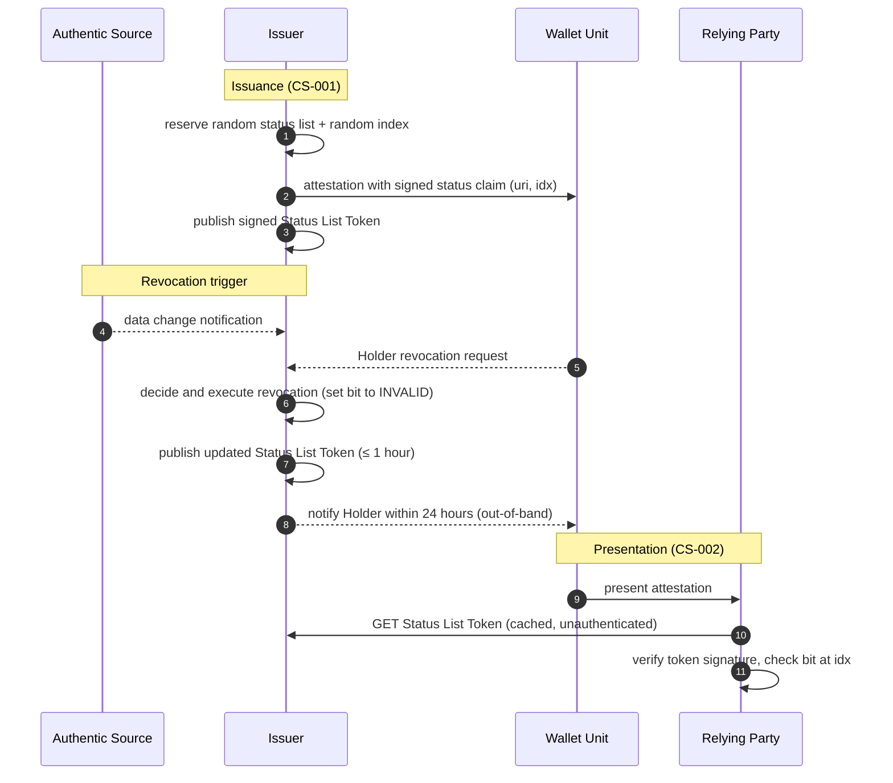

# WE BUILD - Pre-flight Conformance Specification CS-010: Attestation Revocation Mechanism

Version 0.1 / Pre-flight Draft
Date: 10 July 2026

**Authors**: WP4 Architecture, PID/EBWOID Group (Task 5)

* Artur Reaboi, e-Governance Agency, Republic of Moldova
* Alexandru Cozlovschi, e-Governance Agency, Republic of Moldova
* Francesca Fiore, InfoCamere, Italy
* Alessandro Bazzolo, InfoCamere, Italy

Table Of Contents

- [1. Introduction](#1-introduction)
- [2. Scope](#2-scope)
- [3. Normative Language](#3-normative-language)
- [4. Roles and Components](#4-roles-and-components)
- [5. Protocol Overview](#5-protocol-overview)
- [6. High-level Flows](#6-high-level-flows)
  - [6.1 Status Assignment at Issuance](#61-status-assignment-at-issuance)
  - [6.2 Revocation Execution](#62-revocation-execution)
  - [6.3 Status Verification at Presentation](#63-status-verification-at-presentation)
  - [6.4 Proactive Status Monitoring](#64-proactive-status-monitoring)
- [7. Normative Requirements](#7-normative-requirements)
  - [7.1 Issuer Requirements](#71-issuer-requirements)
  - [7.2 Wallet Unit Requirements](#72-wallet-unit-requirements)
  - [7.3 Relying Party Requirements](#73-relying-party-requirements)
- [8. Interface Definitions](#8-interface-definitions)
  - [8.1 Status Reference in the Attestation](#81-status-reference-in-the-attestation)
  - [8.2 Status List Token Retrieval](#82-status-list-token-retrieval)
- [9. Open Topics for Testing Feedback](#9-open-topics-for-testing-feedback)
- [10. Conformance](#10-conformance)
- [References](#references)

# 1. Introduction

This document is a **pre-flight conformance specification** as defined in [3]. It is intended to enable early testing of the attestation revocation mechanism adopted by the WE BUILD consortium in the [Attestation Revocation Mechanism ADR](../adr/attestation-revocation-mechanism.md) [2]: the **IETF Token Status List** [1]. The goal is to gather implementation experience and testing feedback that will inform a future full conformance specification.

Revocation is the process by which an attestation (including PID and EBWOID) is invalidated before its natural expiry, so that it can no longer be trusted or used. A revoked attestation is treated as invalid even if it is technically well-formed and unexpired. Revocation is irreversible: once revoked, an attestation cannot be re-activated, and the Holder must obtain a new one.

This specification translates the ADR decision and the applicable legal and ARF requirements [4], [5], [6] into testable expectations for Issuers, Wallet Units and Relying Parties. It complements **CS-001 (Credential Issuance)** [9], where the status reference is embedded at issuance time, and **CS-004 (Individual WUA Lifecycle)** [8], which is authoritative for the revocation of Wallet Unit Attestations (WUAs) themselves.

# 2. Scope

This specification defines the conformance expectations for the revocation of attestations issued within the WE BUILD ecosystem.

* **In scope:**
  * Revocation of PID, EBWOID and other attestations with a validity period longer than 24 hours
  * Assignment of a status list reference at issuance time (herd-privacy-preserving allocation)
  * Publication of revocation status as signed Status List Tokens by the Issuer
  * Retrieval, caching and verification of revocation status by Relying Parties
  * Proactive revocation status checking by Wallet Units and by PID/EBWOID Providers (against the WUA)
  * Holder notification obligations following revocation

* **Out of scope:**
  * Short-lived attestations (validity of 24 hours or less), which do not require a revocation mechanism ([4] VCR_01; [5])
  * The revocation mechanics of the WUA itself (WIA/KA status lists, maintenance periods) — covered by CS-004 [8]
  * A dedicated Revocation Status Service as a separate role or component: for simplification reasons, this pre-flight specification assumes the Issuer publishes and serves its Status List Tokens itself
  * Suspension (temporary invalidation): only the status values VALID and INVALID are used; suspension is managed at the wallet application level without altering the cryptographic status
  * The Attestation Revocation List (identifier/serial-number list) mechanism — see §9
  * The notification protocol between Authentic Sources and Issuers — see §9
  * Cascade revocation of attestations issued in reliance on a PID/EBWOID — see §9
  * Non-revocable EAAs whose rulebooks exempt them from revocation

# 3. Normative Language

The keywords **MUST**, **MUST NOT**, **REQUIRED**, **SHALL**, **SHOULD**, **SHOULD NOT**, **RECOMMENDED**, **MAY**, and **OPTIONAL** are to be interpreted as described in [RFC 2119](https://datatracker.ietf.org/doc/html/rfc2119).

> **Note:** As a pre-flight specification, the normative requirements herein are preliminary and subject to revision based on testing feedback.

# 4. Roles and Components

| Role | Description |
|------|-------------|
| **Issuer** | The PID Provider, EBWOID Provider or Attestation Provider that issued the attestation. The Issuer is the **only** party authorised to revoke the attestations it issued ([5] Article 5(2)); other actors may initiate revocation by notifying the Issuer, but only the Issuer decides and executes it. The Issuer also publishes and serves the signed Status List Tokens, which are publicly accessible. |
| **Wallet Unit (WU)** | The application acting on behalf of the Holder, storing the attestations and checking their status on the Holder's behalf. |
| **Holder** | The natural or legal person controlling the Wallet Unit, who may request revocation of their own attestations. |
| **Relying Party (Verifier)** | The entity that receives a presented attestation and checks its revocation status before relying on it. |
| **Wallet Provider** | Issues and revokes WUAs (see CS-004 [8]). WUA revocation is a mandatory trigger for revocation of the attestations issued against that WUA. |
| **Authentic Source** | The source of the attested data. It cannot revoke attestations directly, but notifies the Issuer of data changes that require revocation (e.g. death of the holder, dissolution of a legal entity, attribute modification). |

# 5. Protocol Overview

The Token Status List [1] represents the status of many attestations ("Referenced Tokens") in a single compressed bit array. Each revocable attestation carries, in its signed part, a `status` claim referencing a Status List Token URI and an index (`idx`) within that list. The Issuer maintains the bit array and publishes it as a signed **Status List Token**; anyone can fetch the token and read the bit at a given index to learn whether the referenced attestation is VALID (`0x00`) or INVALID (`0x01`).

The mechanism was selected in the ADR [2] because it is referenced by OpenID4VC HAIP 1.0 [7] for the SD-JWT VC format, gives Relying Parties one standardized format across Issuers, and preserves **herd privacy**: a Relying Party downloads a whole list covering many attestations, so the fetch does not reveal which attestation is being checked, and the randomly assigned list and index cannot be used to correlate the Holder across verifications.



The lifecycle of the status entry mirrors the attestation: it is allocated before the attestation is signed (because the reference is inside the signed payload), flipped to INVALID upon revocation, and can be forgotten once the attestation has expired.

# 6. High-level Flows

## 6.1 Status Assignment at Issuance

Participating actors: Issuer, Wallet Unit.

1. Before signing a revocable attestation, the Issuer reserves an entry for it: a **random** status list among its active lists and a **random unused index** within that list.
2. The Issuer embeds the reference (`uri` of the Status List Token and `idx`) in the `status` claim of the attestation payload and signs the attestation.
3. The Issuer records the association between the attestation, its status entry, and the WUA it was issued against (to support the WUA monitoring in §6.4).
4. The attestation is delivered to the Wallet Unit as specified in CS-001 [9].

**Outcome**: every revocable attestation in circulation carries a verifiable pointer to its own revocation status, allocated in a way that prevents correlation.

> **Note on scalability:** naive random allocation can create performance bottlenecks. The ADR [2] recommends pre-allocating randomized indices in batches out-of-process, so that issuance reserves indices sequentially from a pre-shuffled pool within a single database transaction.

## 6.2 Revocation Execution

Participating actors: Holder, Wallet Provider, Authentic Source, Issuer.

1. A revocation trigger reaches the Issuer. Triggers include:
   * **Holder-initiated**: explicit request (e.g. privacy reasons, loss, theft or compromise of the device), submitted via the Wallet Unit or out-of-band.
   * **Authentic-Source-initiated**: the underlying data is inaccurate, has changed, or no longer applies — including death of a natural person (PID) or dissolution / cessation of activity of a legal entity (EBWOID).
   * **System-initiated**: revocation of the WUA the attestation was issued against, revocation of the Issuer's or Wallet Provider's certificate, detected fraud or security breach, regulatory change, prolonged inactivity or breach of terms as defined in the Issuer's policy.
2. The Issuer validates the trigger and decides. Only the Issuer executes the revocation ([5] Article 5(2)); for the triggers of Article 5(4) (explicit Holder request, WUA revocation, policy-defined events) the Issuer MUST revoke without delay.
3. The Issuer sets the attestation's status entry to INVALID and publishes the updated, re-signed Status List Token.
4. The Issuer notifies the Holder within 24 hours through a secure channel independent of the Wallet Unit, stating the reasons in clear and plain language ([5] Article 5(3)).

**Outcome**: the attestation is irreversibly invalidated; any verifier consulting a fresh status list will reject it.

## 6.3 Status Verification at Presentation

Participating actors: Wallet Unit, Relying Party, Issuer.

1. The Wallet Unit presents an attestation to the Relying Party as specified in CS-002.
2. The Relying Party reads the `status` claim from the validated attestation.
3. The Relying Party obtains the Status List Token — from its cache if fresh, otherwise by an unauthenticated HTTP GET to the referenced `uri` (§8.2).
4. The Relying Party validates the Status List Token: signature by the expected issuer, `sub` matching the retrieval URI, and freshness (`iat`, `exp`, `ttl`).
5. The Relying Party checks the bit at `idx`. If the status is INVALID, the attestation is rejected even though its signature is valid and it is unexpired.
6. If no reliable status information can be obtained (e.g. offline scenario, service unreachable), the Relying Party performs a risk analysis appropriate to the use case instead of failing automatically ([4] VCR_13).

**Outcome**: revoked attestations are rejected; availability problems degrade to a documented risk decision, not an outage.

## 6.4 Proactive Status Monitoring

Participating actors: Issuer, Wallet Provider, Wallet Unit, Holder.

1. The PID/EBWOID Provider regularly checks the revocation status of the WUA against which each unexpired PID/EBWOID was issued, following the cadence defined in CS-004 [8] §7.2. Upon detecting WUA revocation, it revokes the corresponding PID/EBWOID (§6.2).
2. The Wallet Unit regularly checks the revocation status of its stored PIDs, EBWOIDs and attestations, and notifies the Holder when one is found revoked ([4] VCR_19).

**Outcome**: revocation of the Wallet Unit cascades to the attestations bound to it, and the Holder learns about revocations without waiting for a failed presentation.

# 7. Normative Requirements

## 7.1 Issuer Requirements

| ID | Requirement | Reference |
|----|-------------|-----------|
| ISS-RV-01 | The Issuer MUST implement this revocation mechanism for every attestation it issues with a validity period longer than 24 hours. | [2], [4] VCR_01, [5] |
| ISS-RV-02 | The Issuer MUST include a `status` claim with a `status_list` reference (`uri` and `idx`) in the signed payload of every revocable attestation. | [1] §6, [7] |
| ISS-RV-03 | The Issuer MUST assign a random status list and a random unused index within it to each revocable attestation, before the attestation is signed. Batch pre-allocation of randomized indices is RECOMMENDED for performance. | [2], [4] VCR_17, VCR_18 |
| ISS-RV-04 | The Issuer MUST publish revocation status as a Status List Token signed by itself, publicly accessible without requester authentication. | [1] §5, [5] Article 5(7) |
| ISS-RV-05 | The Issuer MUST publish the INVALID status of a revoked, not-yet-expired attestation within a reasonable time of the revocation decision; this SHOULD NOT exceed 1 hour. | [2] |
| ISS-RV-06 | The Issuer MUST NOT reverse a revocation: once published as INVALID, a status entry cannot return to VALID. | [5] Article 5(5) |
| ISS-RV-07 | The Issuer MUST revoke an attestation without delay upon: (a) an explicit request of the Holder to whom it was issued, (b) revocation of the WUA it was issued against, or (c) the conditions defined in its published revocation policy. | [5] Article 5(4) |
| ISS-RV-08 | The Issuer MUST publish a clear, written and publicly accessible policy describing its validity status management and the conditions under which it revokes attestations. | [5] Article 5(1) |
| ISS-RV-09 | The Issuer MUST inform the Holder within 24 hours of a revocation, through a secure channel independent of the Wallet Unit, stating the reasons in clear and plain language. | [5] Article 5(3) |
| ISS-RV-10 | The PID/EBWOID Provider MUST record the WUA each PID/EBWOID is issued against, MUST regularly check its revocation status for the attestation's validity period (cadence per CS-004 §7.2), and MUST revoke the PID/EBWOID upon detecting WUA revocation. | [4] VCR_07b, [6], [8] |
| ISS-RV-11 | The Issuer SHOULD include `exp` and `ttl` in Status List Tokens to drive Relying Party caching decisions, including offline scenarios. | [1] §5.1, [2], [4] VCR_15 |
| ISS-RV-12 | The Issuer SHOULD ensure each status list contains enough entries to preserve herd privacy, adding decoy entries where the population of a list is small. | [2], [4] |
| ISS-RV-13 | The Issuer SHOULD use a 1-bit status entry size (`bits` = 1); status values other than VALID (`0x00`) and INVALID (`0x01`) are out of scope of this specification. | [1] §4.1 |

## 7.2 Wallet Unit Requirements

| ID | Requirement | Reference |
|----|-------------|-----------|
| WU-RV-01 | The Wallet Unit SHOULD regularly check the revocation status of its stored PIDs, EBWOIDs and attestations. | [2], [4] VCR_19 |
| WU-RV-02 | The Wallet Unit SHOULD notify the Holder when a stored attestation is found to be revoked. | [2], [4] VCR_19 |
| WU-RV-03 | The Wallet Unit SHOULD offer the Holder a means to initiate revocation of a stored attestation, relaying the request to the Issuer (e.g. via the OpenID4VCI Notification Endpoint or an Issuer-specific channel). | [2], [5] Article 5(4)(a) |
| WU-RV-04 | The Wallet Unit SHOULD retrieve Status List Tokens in a manner that does not reveal which attestation is being checked (unauthenticated retrieval of whole lists, decoupled from presentation events). | [1] §12, [2] |

## 7.3 Relying Party Requirements

| ID | Requirement | Reference |
|----|-------------|-----------|
| RP-RV-01 | The Relying Party SHOULD check the revocation status of every presented attestation that carries a `status` claim. | [2], [4] VCR_13 |
| RP-RV-02 | The Relying Party MUST support retrieval and verification of Status List Tokens: validate the signature against the expected issuer, check that `sub` matches the retrieval URI, and check freshness (`iat`, `exp`, `ttl`). | [1] §§5, 8 |
| RP-RV-03 | The Relying Party MUST treat an attestation whose status is INVALID as invalid and reject it, even if its signature verifies and it is unexpired. | [1], [2] |
| RP-RV-04 | The Relying Party SHOULD cache Status List Tokens and refresh them based on `exp` and `ttl`, rather than fetching them for each individual presentation; cached lists SHOULD be distributed internally to all its verifier instances. | [1] §12.3, [4] VCR_15 |
| RP-RV-05 | When no reliable revocation status information is available, the Relying Party SHOULD perform a risk analysis considering the factors relevant to the use case before accepting or refusing the attestation, and MUST define an acceptance policy for such cases. | [2], [4] VCR_13 |
| RP-RV-06 | The Relying Party MUST NOT query revocation status in a way that discloses the specific attestation, the Holder, the time or the purpose of the verification to the Issuer (e.g. per-attestation lookups tied to user sessions). | [1] §12, [2] |

# 8. Interface Definitions

This specification pins the **IETF Token Status List to draft-ietf-oauth-status-list-20** [1], aligned with CS-004 [8].

## 8.1 Status Reference in the Attestation

The revocable attestation (SD-JWT VC per HAIP [7]) carries the status reference in its signed payload. The claim is not selectively disclosable.

```json
{
  "status": {
    "status_list": {
      "idx": 412,
      "uri": "https://issuer.example.com/statuslists/1"
    }
  }
}
```

- `uri` — the URI from which the Status List Token can be retrieved
- `idx` — the index of this attestation's entry within the status list, assigned per ISS-RV-03

## 8.2 Status List Token Retrieval

*Direction:* Relying Party / Wallet Unit → Issuer
*Method:* HTTP GET

**Request**

- URL: the `uri` value from the `status` claim
- Header: `Accept: application/statuslist+jwt`
- No authentication of the requester

**Response**

A JWT with header `typ: statuslist+jwt`, signed by the Issuer, containing:

- `sub` — the URI of the Status List Token itself (equal to the retrieval `uri`)
- `iat` — time of issuance of this token
- `exp` — (RECOMMENDED, see ISS-RV-11) time after which the token must be refreshed
- `ttl` — (RECOMMENDED) maximum cache duration in seconds
- `status_list` — object with `bits` (entry size, 1 for WE BUILD) and `lst` (DEFLATE-compressed, base64url-encoded bit array)

Example payload (illustrative only):

```json
{
  "sub": "https://issuer.example.com/statuslists/1",
  "iat": 1783075200,
  "exp": 1783161600,
  "ttl": 43200,
  "status_list": {
    "bits": 1,
    "lst": "eNrbuRgAAhcBXQ"
  }
}
```

The status of the attestation is the value of the bit at position `idx`: `0` = VALID, `1` = INVALID.

# 9. Open Topics for Testing Feedback

In line with the pre-flight process [3], the following topics are deliberately left open. Implementers are asked to gather experience on them during testing so the full CS can resolve them:

1. **Authentic Source → Issuer notification.** No standardized protocol exists yet for Authentic Sources to notify Issuers of data changes requiring revocation (the pending ETSI TS 119 478 work may affect this). Pre-flight testing uses Issuer-specific channels; report on what interface would be needed.
2. **Wallet Provider → Issuer notification.** Direct notification of WUA revocation (as an alternative to the polling in ISS-RV-10) would need a new protocol or endpoint.
3. **Holder-initiated revocation requests.** Report on the suitability of the OpenID4VCI Notification Endpoint versus dedicated endpoints for WU-RV-03.
4. **Attestation Revocation List fallback.** ARF Topic 7 also describes an identifier-based Attestation Revocation List. The ADR [2] selects the Token Status List for WE BUILD; feedback is sought on whether an ARL fallback for constrained Relying Parties is needed.
5. **Cascade revocation of dependent attestations.** Whether attestations issued in reliance on a PID/EBWOID (e.g. a professional permit) should be automatically revoked when the underlying PID/EBWOID is revoked remains under discussion in Task 5.
6. **Publication latency.** Whether the 1-hour target of ISS-RV-05 is achievable and sufficient in practice.

# 10. Conformance

An **Issuer** conforms to this specification if it satisfies all applicable requirements in §7.1 and implements the interfaces in §8 for the attestations it issues.

A **Wallet Unit** conforms to this specification if it satisfies the requirements in §7.2.

A **Relying Party** conforms to this specification if it satisfies the requirements in §7.3 and consumes the interfaces in §8.

Conformance testing for this pre-flight specification will be defined as part of the feedback process described in [3]. Implementers are encouraged to report their testing experience — in particular on the topics in §9 — to inform the development of a full conformance specification.

# References

| # | Reference |
|---|-----------|
| [1] | IETF (2026) OAuth Token Status List, draft-ietf-oauth-status-list-20 (Internet-Draft, OAuth WG). Available at: https://datatracker.ietf.org/doc/draft-ietf-oauth-status-list/20/ (Accessed: 10 July 2026). This specification pins this revision, aligned with CS-004 [8]. |
| [2] | WE BUILD (2026) ADR: Attestation Revocation Mechanism. Available at: [../adr/attestation-revocation-mechanism.md](../adr/attestation-revocation-mechanism.md) |
| [3] | WE BUILD (2026) ADR (pending): Pre-flight CS. Available at: [pre-flight CS ADR](https://github.com/webuild-consortium/wp4-architecture/pull/245) |
| [4] | European Commission (2026) EUDI Wallet Architecture and Reference Framework, Annex 2, Topic 7: Attestation validity checks and revocation (VCR_xx requirements). Available at: https://eu-digital-identity-wallet.github.io/eudi-doc-architecture-and-reference-framework/ (Accessed: 10 July 2026). |
| [5] | European Commission (2024) Commission Implementing Regulation (EU) 2024/2977 on person identification data and electronic attestations of attributes, Article 5 (Revocation of person identification data). Available at: https://eur-lex.europa.eu/eli/reg_impl/2024/2977/oj (Accessed: 10 July 2026). |
| [6] | European Commission (2024) Commission Implementing Regulation (EU) 2024/2979 on integrity and core functionalities, Article 7 (Revocation of wallet unit attestations). Available at: https://eur-lex.europa.eu/eli/reg_impl/2024/2979/oj (Accessed: 10 July 2026). |
| [7] | OpenID Foundation (2025) OpenID4VC High Assurance Interoperability Profile (HAIP) 1.0. Available at: https://openid.net/specs/openid4vc-high-assurance-interoperability-profile-1_0.html (Accessed: 10 July 2026). |
| [8] | WE BUILD (2026) Conformance Specification CS-04: Individual Wallet Unit Attestation (WUA) Lifecycle v1.0. Available at: [cs-04-wua-lifecycle.md](cs-04-wua-lifecycle.md) |
| [9] | WE BUILD (2026) Conformance Specification CS-001: Credential Issuance v1.0. Available at: [cs-01-credential-issuance.md](cs-01-credential-issuance.md) |
