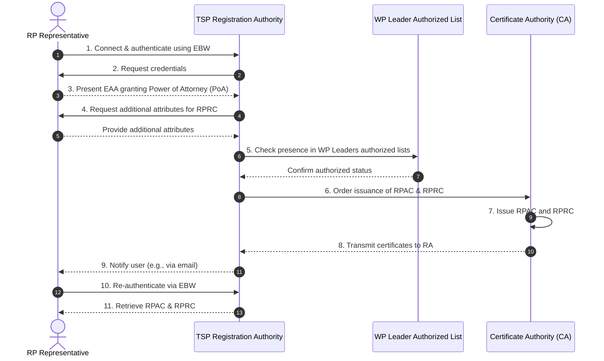
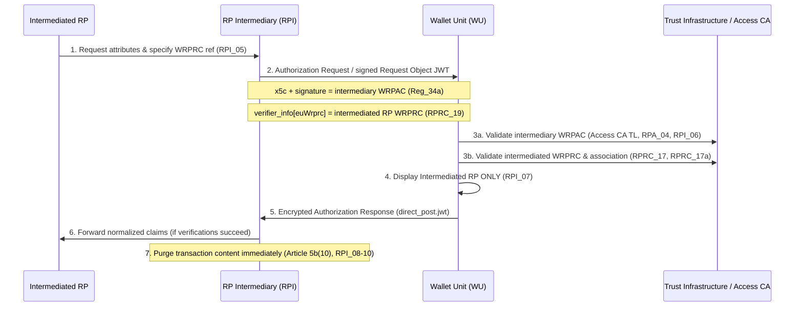

# WE BUILD - Pre-flight Conformance Specification CS-013: Intermediary Services

**Version**: 0.1 / Pre-flight Draft  
**Date**: 15 September 2026  
**Authors / Contributors**: WP4 Architecture / Trust Infrastructure Group  
- Sarah Amandusson, Digg

## Table of Contents
- [1. Introduction](#1-introduction)
- [2. Scope](#2-scope)
- [3. Normative Language](#3-normative-language)
- [4. Roles and Components](#4-roles-and-components)
- [5. Protocol Overview and Trust Model](#5-protocol-overview-and-trust-model)
- [6. High-Level Flows](#6-high-level-flows)
  - [6.1 Intermediary and Intermediated RP Registration Flow](#61-intermediary-and-intermediated-rp-registration-flow)
  - [6.2 Intermediated Credential Presentation Flow](#62-intermediated-credential-presentation-flow)
- [7. Normative Requirements](#7-normative-requirements)
  - [7.1 Relying Party Intermediary (RPI) Requirements](#71-relying-party-intermediary-rpi-requirements)
  - [7.2 Wallet Unit (WU) Requirements](#72-wallet-unit-wu-requirements)
  - [7.3 Intermediated Relying Party (RP) Requirements](#73-intermediated-relying-party-rp-requirements)
  - [7.4 Registrar and Trust Infrastructure Requirements](#74-registrar-and-trust-infrastructure-requirements)
- [8. Interface Definitions and Data Models](#8-interface-definitions-and-data-models)
  - [8.1 OpenID4VP Authorization Request Profile for Intermediaries](#81-openid4vp-authorization-request-profile-for-intermediaries)
  - [8.2 WRPAC Access Certificate Extension Profile](#82-wrpac-access-certificate-extension-profile)
  - [8.3 WRPRC Registration Certificate Profile](#83-wrprc-registration-certificate-profile)
  - [8.4 User Experience (UX) Display Rules](#84-user-experience-ux-display-rules)
- [9. Conformance and ITB+ Test Suite Guidance](#9-conformance-and-itb-test-suite-guidance)
- [10. References](#10-references)

## 1. Introduction
This document defines the **WE BUILD Pre-flight Conformance Specification (CS-013)** for **Intermediary Services**, specifying how Relying Party Intermediaries (RPI), intermediated Relying Parties (RP), Wallet Units (WU), and Member State Registrars interoperate within the WE BUILD ecosystem.

In accordance with Article 5b(10) of Regulation (EU) No 910/2014 (amended eIDAS) and ARF Topic 52 (v3.0.0), intermediaries acting on behalf of relying parties are deemed relying parties and shall not store content or transaction data. This specification complements **CS-002 (Credential Presentation)** by defining the protocol extensions, registration mechanics, access/registration certificate structures, and wallet verification logic required when a Relying Party presents credential requests via an intermediary.

This is a **pre-flight specification** as defined in ADR-21 (Pre-flight CS ADR), designed to enable immediate implementation and deployment of a dedicated **ITB+ test suite** for intermediary workflows.

An Intermediary sits between a Relying Party and the wallet to handle the technical work of presentation requests so the Relying Party doesn't have to implement it directly.

Technically, participating in the EUDI Wallet ecosystem requires a Relying Party to implement the OpenID4VP protocol, manage cryptographic request signing, hold and rotate the certificates needed to authenticate to wallets, validate returned credentials (signature checks, revocation status, trust-chain verification against issuer trust lists), and stay conformant as the specs evolve. An Intermediary implements this stack once and exposes it as a service, so a Relying Party can request and receive verified attributes through a simpler API instead of building and maintaining a full verifier itself.
## 2. Scope
This specification covers:
- **Registration Architecture**: Two-step registration acts for intermediaries and intermediated RPs at Member State Registrars.
- **Certificate Profiles**: Issuance and binding of Wallet Relying Party Access Certificates (WRPAC) and Wallet Relying Party Registration Certificates (WRPRC) for intermediated flows per CIR (EU) 2025/848 (amended by CIR (EU) 2026/1730), CIR (EU) 2026/1731, and ETSI TS 119 475.
- **OpenID4VP Protocol Extensions**: Ingestion of RPI WRPAC for channel authentication (`x509_hash`) and intermediated RP WRPRC (`verifier_info` / `euWrprc`) by value.
- **Wallet Unit Verification and UX**: Validation rules for RPI–RP associations and strict user consent rendering (displaying the intermediated RP name while hiding the intermediary trade name).
- **Data Minimisation & Privacy**: Strict non-persistence obligations for RPIs.
- **Testing & Conformance**: Target criteria for building the ITB+ Intermediary Test Suite.

Out of scope:
- Internal REST APIs between intermediated RPs and RPIs (implementation-specific).
- Peer-to-peer (W2W) discovery models (covered in EDD / CS-017).

## 3. Normative Language
The keywords **MUST**, **MUST NOT**, **REQUIRED**, **SHALL**, **SHALL NOT**, **SHOULD**, **SHOULD NOT**, **RECOMMENDED**, **MAY**, and **OPTIONAL** in this document are to be interpreted as described in RFC 2119.

## 4. Roles and Components
- **Relying Party Intermediary (RPI)**: An entity that connects to Wallet Units on behalf of one or more intermediated Relying Parties, constructs OpenID4VP presentation requests, forwards presented attributes, and immediately purges personal data.
- **Intermediated Relying Party (RP)**: The legal person or economic operator that ultimately relies on the presented attributes to deliver a service or fulfill a legal obligation.
- **Wallet Unit (WU)**: The wallet instance controlled by a user that validates presentation requests, enforces consent rules, and submits verifiable presentations.
- **Registrar**: The authority/registry managing registration and operational authorization for RPs and RPIs. This will be "Member State Registrar" but in WE BUILD we do not have Member States. ```
- **Access Certificate Authority (Access CA)**: The CA issuing WRPAC access certificates to registered entities complying with ETSI TS 119 411-8 / EN 319 411-1 (NCP).
- **Provider of Registration Certificates (RegCert Provider)**: The entity issuing WRPRC registration certificates per ETSI TS 119 475 / ARF specifications.

## 5. Protocol Overview and Trust Model
Intermediated presentation operates on a **protocol split**:
1. **Channel Authentication**: The Wallet Unit authenticates the **RPI's WRPAC** via the TLS handshake or signed request object (`x509_hash`). The WRPAC is issued to the RPI and contains an extension associating it with the specific intermediated RP and Service ID (`Reg_34a`). The intermediated RP does *not* present a WRPAC in this flow.
2. **Beneficiary Identification & Entitlements**: The Wallet Unit identifies the intermediated RP and verifies its requested attributes using the **WRPRC** embedded directly in the request by value (`RPRC_19`).
3. **Indirect Trust**: Trust in the request is indirect, mediated by the Access CA, RegCert Provider, and Trusted Lists (LoTE). Direct trust exists solely in the contractual principal-agent relationship between the intermediated RP and the RPI (`RPI_04`).

## 6. High-Level Flows

### 6.1 Intermediary and Intermediated RP Registration Flow



### 6.2 Intermediated Credential Presentation Flow

## 7. Normative Requirements

### 7.1 Relying Party Intermediary (RPI) Requirements
1. **RPI-REQ-01**: The RPI **MUST** register itself as a Relying Party Intermediary at the Member State Registrar (`RPI_01`, `Reg_26`).
2. **RPI-REQ-02**: The RPI **MUST** register each intermediated RP at the Registrar in the Member State where the RP is established (`RPI_03`), submitting legally valid evidence of the contractual relationship (`RPI_04`).
3. **RPI-REQ-03**: The RPI **MUST** obtain a separate set of WRPAC access certificates per intermediated RP, bound to that RP's unique identifier and Service ID (`Reg_34a`, `CIR 2026/1730 Annex I`).
4. **RPI-REQ-04**: The RPI **MUST** construct signed OpenID4VP Authorization Requests containing:
   - Client Identifier scheme: `x509_hash` carrying the RPI's WRPAC (`OIDFVP-HAIP-COMMON-REQ-RO-23`).
   - The intermediated RP's WRPRC embedded by value in `verifier_info` / `euWrprc` (`RPRC_19`).
   - `response_type=vp_token` and `response_mode=dc_api.jwt` or encrypted direct POST (`CS-002`).
5. **RPI-REQ-05**: The RPI **MUST NOT** persist, store, or profile any Person Identification Data (PID) or Electronic Attestation of Attributes (EAA) claims (`Article 5b(10) eIDAS`, `RPI_08-10`). All PII **MUST** be deleted immediately after forwarding to the intermediated RP. Audit logs **MUST** contain only verification metadata.

### 7.2 Wallet Unit (WU) Requirements
1. **WU-RPI-01**: The WU **MUST** authenticate the channel using the RPI's WRPAC access certificate against the Access CA Trust Anchors in the published Trusted List (`RPA_04`, `RPI_06`).
2. **WU-RPI-02**: The WU **MUST** validate the intermediated RP's WRPRC embedded in the request (`RPRC_17`, `WRP-VALIDATION-01`).
3. **WU-RPI-03**: The WU **MUST** verify that the association claim in the WRPRC (`RPRC_04`) matches the authenticated RPI WRPAC subject/identifier (`RPRC_17a`, `ETSI TS 119 475 §4.5`).
4. **WU-RPI-04**: If WRPRC validation fails or the RPI–RP association does not match, the WU **MUST** warn the user that the relying party could not be validated and **MUST NOT** present the request as successfully validated (`WRP-VALIDATION-02`, `CIR 2026/1731 Annex XII`).
5. **WU-RPI-05**: The WU **SHALL NOT** display the trade name or branding of the RPI or RPI-Service during consent rendering (`RPI_07`, `ARF RPA_06 note b`). The WU **MUST** display exclusively the intermediated RP's name and Service name.

### 7.3 Intermediated Relying Party (RP) Requirements
1. **RP-INT-01**: The intermediated RP **MUST** indicate to the RPI which single WRPRC to include in presentation requests (`RPI_05`).
2. **RP-INT-02**: Intermediated RPs **SHALL NOT** be required to present or hold a WRPAC for intermediated flows (`ARF §6.6.5`).

### 7.4 Registrar and Trust Infrastructure Requirements
1. **REG-INT-01**: The Registrar **MUST** record RPI–RP relationships upon verification of contractual evidence (`RPI_04`).
2. **REG-INT-02**: The RegCert Provider **MUST** automatically issue WRPRCs containing the RPI association attribute (`RPRC_04`, `RPRC_09`) upon successful RP registration.
3. **REG-INT-03**: Access CAs **MUST** issue WRPACs compliant with ETSI TS 119 411-8, embedding the RP association extension per `CIR (EU) 2026/1730 Annex I point 16`.

## 8. Interface Definitions and Data Models

### 8.1 OpenID4VP Authorization Request Profile for Intermediaries
Intermediated presentation requests MUST use the `x509_hash` client identifier scheme for the RPI WRPAC and include the intermediated RP's WRPRC in `verifier_info`.

```json
{
  "client_id": "x509_hash:Base64UrlEncodedWrpacHash...",
  "response_type": "vp_token",
  "response_mode": "dc_api.jwt",
  "client_id_scheme": "x509_hash",
  "client_metadata": {
    "verifier_info": {
      "euWrprc": "Base64CborEncodedWRPRC..."
    }
  },
  "presentation_definition": { ... }
}
```

### 8.2 WRPAC Access Certificate Extension Profile
Per CIR (EU) 2026/1730 (amending CIR 2025/848 Annex I), WRPACs issued for intermediated services MUST include point 16:

- **Extension OID**: `id-mod-eudi-wrpac-association` (1.3.6.1.4.1.XXXX.16)
- **Content**:
```asn1
WrpacAssociation ::= SEQUENCE {
    intermediatedRpIdentifier  UTF8String,
    serviceIdentifier          UTF8String
}
```

### 8.3 WRPRC Registration Certificate Profile
Per ETSI TS 119 475 and CIR 2026/1730, the WRPRC contains the authorized attributes and intended use for the intermediated RP, alongside the RPI association:

```cddl
RegistrationCertificate = {
    "version": 1,
    "rp_id": tstr,
    "service_id": tstr,
    "intended_use": tstr,
    "authorized_attributes": [* tstr],
    "rpi_association": tstr ; Identifier of the authorized RPI WRPAC
}
```

### 8.4 User Experience (UX) Display Rules
When an OpenID4VP request contains an intermediated WRPRC and an RPI WRPAC:
- **Displayed Requestor**: `[Legal Name from WRPRC]` (e.g., "ABN AMRO Bank N.V.")
- **Displayed Service**: `[Service Name from WRPRC]` (e.g., "Account Opening KYC")
- **Hidden Elements**: Trade names, logos, or domain names of the Intermediary (e.g., "Authologic", "itsme", "Mastercard") **MUST NOT** be displayed in the primary consent header (`RPI_07`).

---

## 9. Conformance and ITB+ Test Suite Guidance
To achieve conformance with **CS-013**, implementations must pass the **ITB+ Intermediary Test Suite**:

1. **RPI Test Suite (`ITB-RPI-01`)**:
   - Validates correct formatting of OpenID4VP requests with `x509_hash` WRPAC and embedded WRPRC by value.
   - Verifies zero PII retention post-presentation.
2. **Wallet Unit Test Suite (`ITB-WU-INT-01`)**:
   - Tests successful validation of valid RPI WRPAC + RP WRPRC pairs.
   - Tests failure handling and user warnings when WRPAC is revoked, WRPRC is expired, or association mismatch occurs (`WRP-VALIDATION-02`).
   - Verifies UX consent rendering (ensuring RPI trade name is absent).
3. **Registrar / RegCert Test Suite (`ITB-REG-01`)**:
   - Verifies 11-step issuance of RPAC/RPRC per ETSI TS 119 475 Annex D1.

## 10. References
1. [Technical Report: Relying Party Intermediaries in OpenID4VP Remote Presentation Flows](https://github.com/webuild-consortium/wp4-trust-group/blob/main/task2-trust-framework/rp-intermediary-openid4vp-technical-report.md))
2. Regulation (EU) No 910/2014 as amended by Regulation (EU) 2024/1183 (eIDAS 2.0).
3. Commission Implementing Regulation (EU) 2025/848 as amended by **CIR (EU) 2026/1730** (RP Access Certificates).
4. **Commission Implementing Regulation (EU) 2026/1731** (Protocols and interfaces, HAIP profile, WRPRC validation).
5. EUDI Wallet Architecture Reference Framework (ARF) v3.0.0 — Topic 52 (Intermediaries) & Topic 31.
6. ETSI TS 119 475 V1.1.1 — Selection of execution profiles for RPAC and WRPRC.
7. ETSI TS 119 411-8 V1.1.1 — Access Certificate Profiles.
8. [WE BUILD Conformance Specification CS-002 (Credential Presentation v1.1)](https://github.com/webuild-consortium/wp4-architecture/blob/main/conformance-specs/cs-02-credential-presentation.md)
9. WE BUILD Blueprint D4.1 — [Appendix C (Trust Ecosystem)](https://github.com/webuild-consortium/wp4-architecture/blob/main/blueprint/appendix-trust-ecosystem.md) & [Appendix F (QTSP RPAC/RPRC)](appendix-qtsp.md)

